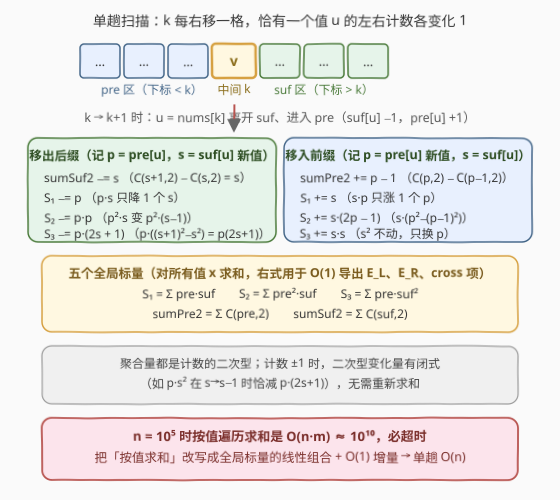
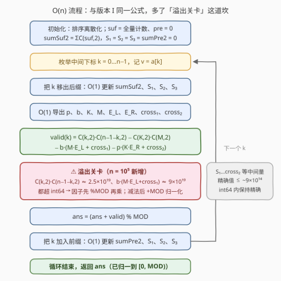

# 唯一中间众数子序列 II

- **题目名称**：唯一中间众数子序列 II
- **链接**：[3416. 唯一中间众数子序列 II](https://leetcode.cn/problems/subsequences-with-a-unique-middle-mode-ii/)
- **难度**：困难
- **标签**：数组、哈希表、数学、组合数学
- **关联**：[3395. 唯一中间众数子序列 I](https://leetcode.cn/problems/subsequences-with-a-unique-middle-mode-i/)（[站内题解](../3301-3400/3395_唯一中间众数子序列I.md)）与本题题面、示例**完全相同**，仅 $n \le 1000$ 放大到 $n \le 10^5$；本文沿用其记号，重点讲 II 新增的两大考验

## 1. 题目概述

> ⚠️ 本题为 LeetCode 付费题，题意描述根据官方示例用例与 hints 重建，可能与官方题面有出入。

给你一个整数数组 `nums`，请你求出 `nums` 中**大小为 5 的子序列**的数目，使得它是**唯一中间众数序列**。答案对 $10^9 + 7$ 取余后返回。

- **众数**：数字序列中出现次数**最多**的元素；
- **唯一众数**：众数只有一个的序列；
- **唯一中间众数序列**：大小为 5 的序列 `seq`，若**中间的数字 `seq[2]` 是唯一众数**，则称其为唯一中间众数序列。

**示例 1**：

```text
输入：nums = [1,1,1,1,1,1]
输出：6
解释：[1,1,1,1,1] 是唯一长度为 5 的子序列，1 是它的唯一中间众数。
      从 6 个位置里选 5 个，共 6 个这样的子序列。
```

**示例 2**：

```text
输入：nums = [1,2,2,3,3,4]
输出：4
解释：[1,2,2,3,4] 和 [1,2,3,3,4] 的中间元素（下标 2 处）都是唯一众数 ✓；
      [1,2,2,3,3] 中 2 和 3 各出现两次，没有唯一众数 ✗。
```

**示例 3**：

```text
输入：nums = [0,1,2,3,4,5,6,7,8]
输出：0
解释：任何 5 个互不相同的元素中，每个值都出现 1 次，不存在唯一众数。
```

**约束条件**：

- $5 \le nums.length \le 10^5$
- $-10^9 \le nums[i] \le 10^9$

> 💡 **读题关键**：① 题面与 [3395（版本 I）](../3301-3400/3395_唯一中间众数子序列I.md)一字不差，唯一的改动是 $n$ 从 $1000 \to 10^5$——这**不是**一道新题，而是把版本 I 里「够用就行」的做法全部判了死刑；② 合法条件的本质是 `seq[2]` 的出现次数**严格大于**其余每个值的出现次数；③ 值域高达 $10^9$，需哈希或离散化；④ $n = 10^5$ 时 $\binom{k}{2}\binom{n-1-k}{2}$ 量级达 $2.5 \times 10^{19}$，**int64 溢出**成为新的工程关卡。

---

## 2. 解题思路

### 2.1 暴力思路与版本 I 的天花板

最直接的做法是枚举 5 个下标再判定众数，$O(n^5)$ 天文数字。版本 I 的思路是**固定中间下标 $k$**，左右两侧各选 2 个元素：

- 对每个 $k$ **遍历所有出现过的值**计算贡献，单步 $O(m)$（$m$ 为不同值个数），总体 $O(n \cdot m)$。$n \le 1000$ 时至多 $10^6$，轻松通过；
- 但本题 $n, m$ 均可达 $10^5$，$O(n \cdot m)$ 最坏 $10^{10}$，**必超时**。

结论：版本 I 中作为「备选」的**聚合量增量维护**（每步 $O(1)$、总体 $O(n)$）在 II 里从「优化项」升级为「必需品」。公式本身与 I 完全一致，下面先快速回顾，再把增量维护与防溢出讲透。

### 2.2 核心观察：按中间值出现次数分类 + 容斥公式

固定中间下标 $k$，记 $v = nums[k]$。设 $v$ 在 5 个数中总出现 $c$ 次，合法要求 $v$ **严格压过**其余每个值：

| $c$ | 其余 4 个位置的构成 | 判定 |
|---|---|---|
| $5$ | 全是 $v$ | ✓ 恒合法 |
| $4$ | 1 个非 $v$，至多 1 次 $< 4$ | ✓ 恒合法 |
| $3$ | 2 个非 $v$，至多 2 次 $< 3$ | ✓ 恒合法 |
| $2$ | 3 个非 $v$，**必须两两互不相同** | 条件合法 |
| $1$ | 4 个非 $v$，每个 $\ge 1$ 次 $\ge 1$ | ✗ 恒非法 |

只有 $c = 2$ 需要细算：恰有一侧多选了 1 个 $v$，另一侧选 2 个非 $v$、选 $v$ 的一侧再补 1 个非 $v$，共 3 个非 $v$ 元素——只要其中**任意两个值相等**，该值就与 $v$ 平票，非法。

记 $p$ / $b$ 为 $v$ 在左 / 右侧出现次数，$K = k - p$、$M = (n-1-k) - b$ 为两侧非 $v$ 元素个数，$\mathrm{pre}_x$ / $\mathrm{suf}_x$ 为值 $x$ 在左 / 右侧出现次数。用**补集 + 容斥**（官方 hint 点名的 Inclusion-Exclusion）：

$$\text{valid}(k) = \underbrace{\binom{k}{2}\binom{n-1-k}{2}}_{\text{全部}} - \underbrace{\binom{K}{2}\binom{M}{2}}_{\text{两侧都没选 } v} - \underbrace{b\,(M \cdot E_L + \mathrm{cross}_1)}_{\text{坏方案 A}} - \underbrace{p\,(K \cdot E_R + \mathrm{cross}_2)}_{\text{坏方案 B}}$$

坏方案 A 是「右侧 1 个 $v$ + 1 个非 $v$、左侧 2 个非 $v$」中的非法组合（B 对称）。以 A 为例，固定右侧非 $v$ 元素的值 $w$ 后，左侧坏对数 = **同值对** + **恰含一个 $w$ 的对**（两值都为 $w$ 的对已含在同值对里，不重复计数）：

$$E_L = \sum_{u \ne v} \binom{\mathrm{pre}_u}{2}, \qquad \mathrm{cross}_1 = \sum_{w \ne v} \mathrm{pre}_w \cdot \mathrm{suf}_w \cdot (K - \mathrm{pre}_w)$$

$$E_R = \sum_{u \ne v} \binom{\mathrm{suf}_u}{2}, \qquad \mathrm{cross}_2 = \sum_{w \ne v} \mathrm{pre}_w \cdot \mathrm{suf}_w \cdot (M - \mathrm{suf}_w)$$

这四个和式按值求和都是 $O(m)$——**正是 II 要消灭的开销**。把定义式展开，它们是五个全局标量的线性组合：

$$\mathrm{cross}_1 = K\,(S_1 - pb) - (S_2 - p^2 b), \qquad \mathrm{cross}_2 = M\,(S_1 - pb) - (S_3 - pb^2)$$

$$S_1 = \sum_x \mathrm{pre}_x \, \mathrm{suf}_x, \quad S_2 = \sum_x \mathrm{pre}_x^2 \, \mathrm{suf}_x, \quad S_3 = \sum_x \mathrm{pre}_x \, \mathrm{suf}_x^2, \quad \Sigma_L = \sum_x \binom{\mathrm{pre}_x}{2}, \quad \Sigma_R = \sum_x \binom{\mathrm{suf}_x}{2}$$

（$E_L = \Sigma_L - \binom{p}{2}$、$E_R = \Sigma_R - \binom{b}{2}$：全局和式里剔除 $v$ 自身的项。）

### 2.3 算法流程：单趟扫描 + 聚合量 O(1) 增量 + 溢出关卡

**增量维护。** $k$ 从左往右扫，每步 $u = nums[k]$ **离开后缀、进入前缀**——每步只有 $u$ 的两个计数各变化 1。五个标量全是计数的二次型，计数 $\pm 1$ 时二次型变化量有闭式（如 $p \cdot s^2$ 在 $s \to s-1$ 时恰减 $p(2s{+}1)$），全部 $O(1)$ 更新：



**溢出关卡（II 新增）。** $n \le 1000$ 时所有中间量 $\le 2.5 \times 10^{11}$，int64 全程精确毫无压力；$n = 10^5$ 时必须给每个量算清上界、划出「精确区」与「取模区」：

| 量 | 上界（$n = 10^5$） | 处理 |
|---|---|---|
| $S_1$、$\Sigma_L$、$\Sigma_R$ | $\le 2.5 \times 10^9$ / $5 \times 10^9$ | 精确 int64 |
| $S_2$、$S_3$、cross 项 | $\le 4 \times 10^{14}$ | 精确 int64 |
| $M \cdot E_L + \mathrm{cross}_1$（括号内先求和） | $\le 9 \times 10^{14}$ | 精确求和后 $\% MOD$ |
| $\binom{k}{2} \binom{n-1-k}{2}$ | $\approx 2.5 \times 10^{19}$ | **两因子先 $\% MOD$ 再乘** |
| $b \cdot (\cdots)$、$p \cdot (\cdots)$ | $\approx 9 \times 10^{19}$ | **括号先 $\% MOD$，再乘 $b$ / $p$（$\le 10^5 \times 10^9 = 10^{14}$）** |

减法在模意义下可能出负，统一 `+MOD` 归一化。Python 大整数天然免疫溢出，全程精确、最后取模即可。



### 2.4 示例演算

以示例 2 `nums = [1,2,2,3,3,4]`（$n = 6$）演算，只有 $k = 2, 3$ 两侧各有 $\ge 2$ 个元素。**$k = 2$（$v = 2$）**：此刻全局标量 $\mathrm{pre} = \{1{:}1, 2{:}1\}$、$\mathrm{suf} = \{3{:}2, 4{:}1\}$，两侧无公共值 $\Rightarrow S_1 = S_2 = S_3 = 0$，$\Sigma_R = \binom{2}{2} = 1$（两个 3），$\Sigma_L = 0$；于是 $p = 1,\ b = 0,\ K = 1,\ M = 3$：

$$E_L = 0,\quad E_R = \Sigma_R - \binom{0}{2} = 1,\quad \mathrm{cross}_1 = K(S_1 - pb) - (S_2 - p^2 b) = 0,\quad \mathrm{cross}_2 = 0$$

$$\text{valid}(2) = \binom{2}{2}\binom{3}{2} - \binom{1}{2}\binom{3}{2} - 0 - 1 \times (1 \times 1 + 0) = 3 - 0 - 1 = 2$$

对应 $[1,2,2,3,4]$ 的两种选法 ✓，$[1,2,2,3,3]$ 因 3 与 2 平票被剔除 ✓。

**$k = 3$（$v = 3$）**：$\mathrm{pre} = \{1{:}1, 2{:}2\}$、$\mathrm{suf} = \{3{:}1, 4{:}1\}$，得 $p = 0,\ b = 1,\ K = 3,\ M = 1$；$E_L = \binom{2}{2} = 1$（两个 2），$E_R = 0$，cross 项为 0：

$$\text{valid}(3) = \binom{3}{2}\binom{2}{2} - 0 - 1 \times (1 \times 1 + 0) - 0 = 3 - 1 = 2$$

对应 $[1,2,3,3,4]$ 的两种选法 ✓，$[2,2,3,3,4]$ 被剔除 ✓。合计 $2 + 2 = \mathbf{4}$ ✓。示例 1 中 $k = 2, 3$ 各贡献 $\binom{2}{2}\binom{3}{2} = 3$ 与 $\binom{3}{2}\binom{2}{2} = 3$，合计 $\mathbf{6}$ ✓；示例 3 全distinct，每个 $k$ 的「全部」恰被「两侧都不选 $v$」抵消，答案 $\mathbf{0}$ ✓。

---

## 3. 参考代码

### C++

```cpp
class Solution {
  public:
    int subsequencesWithMiddleMode(vector<int>& nums) {
        const long long MOD = 1'000'000'007;
        int n = nums.size();

        // 值域压缩到 [0, m)
        vector<int> vals(nums.begin(), nums.end());
        sort(vals.begin(), vals.end());
        vals.erase(unique(vals.begin(), vals.end()), vals.end());
        int m = vals.size();
        vector<int> a(n);
        for (int i = 0; i < n; ++i)
            a[i] = lower_bound(vals.begin(), vals.end(), nums[i]) - vals.begin();

        vector<long long> pre(m, 0), suf(m, 0);
        for (int x : a) ++suf[x];
        auto C2 = [](long long x) { return x * (x - 1) / 2; };

        long long sumPre2 = 0;                 // Σ_L = Σ C(pre,2)，精确值 ≤ 5e9
        long long sumSuf2 = 0;                 // Σ_R = Σ C(suf,2)
        for (int u = 0; u < m; ++u) sumSuf2 += C2(suf[u]);
        long long S1 = 0, S2 = 0, S3 = 0;      // 精确值 ≤ 2.5e9 / 2.5e14 / 2.5e14

        long long ans = 0;
        for (int k = 0; k < n; ++k) {
            int v = a[k];
            long long p = pre[v], s = suf[v];

            // 把 k 移出后缀：O(1) 维护 sumSuf2 / S1 / S2 / S3（全程精确整数）
            sumSuf2 -= C2(s);
            --s;
            sumSuf2 += C2(s);
            S1 -= p;
            S2 -= p * p;
            S3 -= p * (2 * s + 1);             // p·(s_old² − s_new²) = p·(2s+1)
            suf[v] = s;

            long long K = k - p;               // 左侧非 v 个数
            long long M = (n - 1 - k) - s;     // 右侧非 v 个数
            long long EL = sumPre2 - C2(p);    // E_L：剔除 v 自身的项
            long long ER = sumSuf2 - C2(s);    // E_R
            long long c1 = K * (S1 - p * s) - (S2 - p * p * s);   // ≤ ~4e14，int64 安全
            long long c2 = M * (S1 - p * s) - (S3 - p * s * s);

            // ⚠️ n = 1e5 的溢出关卡：大乘积的因子先 %MOD 再相乘
            long long valid = C2(k) % MOD * (C2(n - 1 - k) % MOD) % MOD;
            long long t0 = C2(K) % MOD * (C2(M) % MOD) % MOD;
            long long tA = (M * EL + c1) % MOD;    // 括号先精确求和（≤ 9e14）再取模
            long long tB = (K * ER + c2) % MOD;
            valid = (valid - t0 + MOD) % MOD;
            valid = (valid - s % MOD * tA % MOD + MOD) % MOD;
            valid = (valid - p % MOD * tB % MOD + MOD) % MOD;
            ans = (ans + valid) % MOD;

            // 把 k 加入前缀：O(1) 维护 sumPre2 / S1 / S2 / S3
            sumPre2 -= C2(p);
            ++p;
            sumPre2 += C2(p);
            S1 += s;
            S2 += s * (2 * p - 1);             // s·(p_new² − p_old²) = s·(2p−1)
            S3 += s * s;
            pre[v] = p;
        }
        return (int)ans;
    }
};
```

### Python

```python
class Solution:
    def subsequencesWithMiddleMode(self, nums: List[int]) -> int:
        MOD = 10 ** 9 + 7
        n = len(nums)
        rank = {v: i for i, v in enumerate(sorted(set(nums)))}
        a = [rank[x] for x in nums]
        m = len(rank)

        pre = [0] * m
        suf = [0] * m
        for x in a:
            suf[x] += 1

        def C2(x):
            return x * (x - 1) // 2

        sum_pre2 = 0                            # Σ_L = Σ C(pre,2)
        sum_suf2 = sum(C2(s) for s in suf)      # Σ_R = Σ C(suf,2)
        S1 = S2 = S3 = 0                        # Σ pre·suf, Σ pre²·suf, Σ pre·suf²

        ans = 0
        for k, v in enumerate(a):
            p, s = pre[v], suf[v]
            # 把 k 移出后缀（Python 大整数无溢出，全程精确）
            sum_suf2 += C2(s - 1) - C2(s)
            s -= 1
            suf[v] = s
            S1 -= p
            S2 -= p * p
            S3 -= p * (2 * s + 1)

            K = k - p                           # 左侧非 v 个数
            M = n - 1 - k - s                   # 右侧非 v 个数
            EL = sum_pre2 - C2(p)
            ER = sum_suf2 - C2(s)
            c1 = K * (S1 - p * s) - (S2 - p * p * s)
            c2 = M * (S1 - p * s) - (S3 - p * s * s)

            ans += C2(k) * C2(n - 1 - k) - C2(K) * C2(M) \
                 - s * (M * EL + c1) - p * (K * ER + c2)

            # 把 k 加入前缀
            sum_pre2 += C2(p + 1) - C2(p)
            p += 1
            pre[v] = p
            S1 += s
            S2 += s * (2 * p - 1)
            S3 += s * s

        return ans % MOD
```

> 💡 **实现细节**：① C++ 版里 $S_1, S_2, S_3$、cross 项等**小量保持精确 int64**（上界见 2.3 的表），只有会溢出的三处大乘积先 `%MOD`——既避免溢出又少做取模；② Python 版与版本 I 的代码**逐字相同**（大整数免疫 $2.5 \times 10^{19}$），这正是 II 只考验 C++ 工程功底的体现；③ `E_L = Σ_L − C(p,2)` 这类「全局和式剔除 $v$ 自身」的换算不要漏，否则 $v$ 自身的同值对会被错误扣除。两份代码均以 $O(n^5)$ 暴力对拍验证（3000+ 组随机数据），并在 $n = 10^5$ 下以「全同数组 = $\binom{n}{5} \bmod p$」做了 sanity check。

---

## 4. 复杂度分析

| 维度 | 复杂度 | 说明 |
|------|--------|------|
| 时间复杂度 | $O(n \log n)$ | 排序离散化 $O(n \log n)$（换哈希离散化则期望 $O(n)$）；主循环单趟扫描，每步仅 $O(1)$ 增量更新与组合计算 |
| 空间复杂度 | $O(n)$ | 前缀 / 后缀计数数组与压缩后的数组，长度均为不同值个数 $m \le n$ |
| 暴力对照 | $O(n^5)$ | 枚举全部 5 元组再判众数，仅充当对拍器；版本 I 的 $O(n \cdot m)$ 在 $n, m = 10^5$ 时达 $10^{10}$ 同样不可行 |

---

## 5. 扩展：I/II 对比与「大小为 7」变体

**同一公式，两种考法。** 把 I 和 II 并排放着看，能看穿 LeetCode「数据加强型续作」的出题模式：

| | 版本 I（$n \le 1000$） | 版本 II（$n \le 10^5$） |
|---|---|---|
| $O(n \cdot m)$ 按值遍历 | 可过（$10^6$） | 必挂（$10^{10}$） |
| 聚合量增量维护 $O(n)$ | 锦上添花 | **唯一生路** |
| int64 溢出 | 无（中间量 $\le 2.5 \times 10^{11}$） | 有（$2.5 \times 10^{19}$），需划「精确区 / 取模区」 |
| Python | 与 II 逐字相同 | 与 I 逐字相同 |

「续作放大 $n$」逼出的要么是**更低的复杂度**（本题），要么是**更精细的工程处理**（溢出、取模时机）——刷 I/II 对时值得刻意对比这两个维度。

**变体展望：大小为 7 的子序列。** 若改成统计大小为 7、以 `seq[3]` 为唯一众数的子序列，分类讨论会多出细枝：$v$ 出现 $c \ge 4$ 恒合法、$c = 1$ 时其余 6 个**两两互不相同**也能合法（每值 1 次 $< 2$）……情形更碎，但「枚举中间下标 + 按出现次数分类 + 容斥剔除平票 + 聚合量 O(1) 增量」的骨架原封不动。掌握骨架比背公式重要。

---

## 6. 面试要点

1. **版本 I 和 II 的本质区别是什么？**

   - 题面与公式完全相同，区别只在 $n \le 1000 \to n \le 10^5$：它把 $O(n \cdot m)$ 的按值遍历做法（I 的舒适区）判了死刑，聚合量 O(1) 增量维护从「优化」变成「必需」；同时 $\binom{k}{2}\binom{n-1-k}{2} \approx 2.5 \times 10^{19}$ 超出 int64，取模时机成为新的工程考点。

2. **为什么五个聚合量都能 O(1) 增量更新？**

   - $k$ 右移一步时只有 $u = nums[k]$ 这一个值「离开后缀、进入前缀」。聚合量都是计数的二次型，而二次型在单个计数 $\pm 1$ 时的变化量有闭式（如 $p \cdot s^2$ 在 $s \to s{-}1$ 时恰减 $p(2s{+}1)$，$s^2 \cdot p$ 在 $p \to p{+}1$ 时恰增 $s^2$），无需重新按值求和。

3. **取模时机怎么定？哪些量必须精确、哪些必须先取模？**

   - 先给每个量算上界：$S_1 \le 2.5 \times 10^9$、$S_2 / S_3$ / cross $\le 4 \times 10^{14}$、括号和 $M \cdot E_L + \mathrm{cross}_1 \le 9 \times 10^{14}$——全部 int64 安全，**保持精确**；而 $\binom{k}{2}\binom{n-1-k}{2}$、$b \cdot (\cdots)$、$p \cdot (\cdots)$ 达 $10^{19}$ 量级，**因子先 `%MOD` 再乘**。小量精确、大量取模，既不溢出又少取模。

4. **把所有中间量都取模会破坏公式吗？**

   - 不会。模 $p$ 的剩余类环对加减乘封闭，只要所有量**一致**地在环内运算、减法后 `+MOD` 归一化，结果仍是正确答案 $\bmod\ p$。本文让小量保持精确是为了省取模次数并简化推理，不是正确性需要。

5. **$c = 2$ 的坏方案为什么要拆成 $E_L$ / cross 两块？会不会重复计数？**

   - 坏 = 3 个非 $v$ 元素中存在两值相等。固定选 $v$ 一侧的对侧非 $v$ 元素值为 $w$ 后，坏对 = 同值对（两元素同值，含两值都是 $w$ 的情形）∪ 恰含一个 $w$ 的对——两块互斥拼接，不重不漏；再乘上 $v$ 的选择数 $b$ / $p$。这就是官方 hint 所说的 Inclusion-Exclusion 视角。

> 💡 **一句话总结**：公式照搬版本 I——「全部 − 两侧不选 $v$ − 两类坏方案（同值对 + cross 项）」；II 的增量在于 $n = 10^5$ 逼出**单趟扫描 + 五个聚合量 O(1) 增量维护**，并在 C++ 里为 $10^{19}$ 级大乘积设下「先取模再乘」的溢出关卡。

---

## 7. 同类练习题

- [3395. 唯一中间众数子序列 I](https://leetcode.cn/problems/subsequences-with-a-unique-middle-mode-i/)（[站内题解](../3301-3400/3395_唯一中间众数子序列I.md)）：本题免费版，cross 项与聚合量的完整推导在此
- [3164. 优质数对的总数 II](https://leetcode.cn/problems/find-the-number-of-good-pairs-ii/)（[站内题解](../3101-3200/3164_优质数对的总数II.md)）：同为「I → II 放大数据逼出哈希聚合统计」的套路
- [2929. 给小朋友们分糖果 II](https://leetcode.cn/problems/distribute-candies-among-children-ii/)（[站内题解](../2901-3000/2929_给小朋友们分糖果II.md)）：隔板法 + 容斥的组合计数，体会「不重不漏地划分计数对象」
- [2262. 字符串的总引力](https://leetcode.cn/problems/total-appeal-of-a-string/)（[站内题解](../2201-2300/2262_字符串的总引力.md)）：从右往左增量维护每个字符的贡献，与本题 O(1) 增量更新聚合量同源
- [1201. 丑数 III](https://leetcode.cn/problems/ugly-number-iii/)（[站内题解](../1201-1300/1201_丑数III.md)）：容斥原理的经典应用，巩固 hint 点名的 Inclusion-Exclusion 思想
