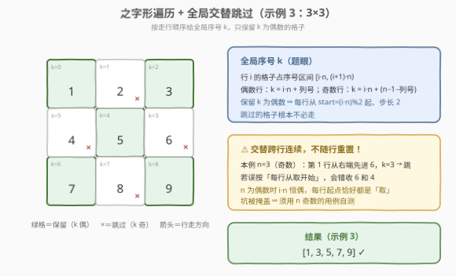
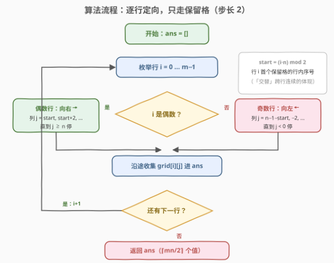

# 跳过交替单元格的之字形遍历

- **题目名称**：跳过交替单元格的之字形遍历
- **链接**：[3417. 跳过交替单元格的之字形遍历](https://leetcode.cn/problems/zigzag-grid-traversal-with-skip/)
- **难度**：简单
- **标签**：数组、矩阵、模拟

## 1. 题目概述

给你一个 $m \times n$ 的二维数组 `grid`，数组由**正整数**组成。你的任务是以**之字形**遍历 `grid`，同时跳过每个**交替**的单元格。

之字形遍历的定义如下：

- 从左上角的单元格 $(0, 0)$ 开始；
- 在当前行中向**右**移动，直到到达该行的末尾；
- 下移到下一行，然后在该行中向**左**移动，直到到达该行的开头；
- 继续在行间交替向右和向左移动，直到所有行都被遍历完。

**注意**：在遍历过程中，必须跳过每个**交替**的单元格——即之字形序列中第 1、3、5、… 个（0 开始编号下的奇数位）格子不收集。

返回一个整数数组 `result`，按**顺序**记录跳过交替单元格后的之字形遍历中访问到的单元格值。

**示例 1**：

```text
输入：grid = [[1,2],[3,4]]
输出：[1,4]
解释：之字形序列为 1,2,4,3；跳过交替的 2 和 3，收集 1,4。
```

**示例 2**：

```text
输入：grid = [[2,1],[2,1],[2,1]]
输出：[2,1,2]
解释：之字形序列为 2,1,1,2,2,1；取第 0、2、4 位得 2,1,2。
```

**示例 3**：

```text
输入：grid = [[1,2,3],[4,5,6],[7,8,9]]
输出：[1,3,5,7,9]
解释：之字形序列为 1,2,3,6,5,4,7,8,9；取偶数位得 1,3,5,7,9。
```

**约束条件**：

- $2 \le n = grid.length \le 50$
- $2 \le m = grid[i].length \le 50$
- $1 \le grid[i][j] \le 2500$

> 💡 **读题关键**：①「交替」是**全程连续**的取、跳、取、跳……不是每行重新开始——这是本题唯一的陷阱；② 之字形是**行间蛇形**（整行换向），与 [498. 对角线遍历](https://leetcode.cn/problems/diagonal-traverse/)的对角线蛇形不是一回事；③ 数据规模只有 $50 \times 50$，怎么写都不会超时，比拼的是**一次写对**。

---

## 2. 解题思路

### 2.1 朴素思路：拍平整个之字形序列，再隔位取样

最直接的写法分两步：先把 $m$ 行按「偶数行正序、奇数行逆序」拼接，得到完整的之字形一维序列 `order`；再取其偶数下标元素 `order[::2]` 即为答案：

```python
order = []
for i, row in enumerate(grid):
    order += row if i % 2 == 0 else row[::-1]
return order[::2]
```

也可以维护一个布尔开关 `take`（初始为真），沿之字形逐格行走、每走一格翻转一次，`take` 为真时收集。两者都是 $O(mn)$ 时间，对本题规模绰绰有余。

小瑕疵：明明**一半格子注定被跳过**，却还要逐格走一遍、还多花一个 $O(mn)$ 的中间数组。能否一步只走「保留格」？

### 2.2 核心观察：全局序号 $k$，保留 $k$ 为偶数者



给之字形序列里的每个格子一个**全局序号** $k$（从 0 开始连续编号）。行 $i$ 的格子恰好占据序号区间 $[i \cdot n,\ (i+1) \cdot n)$，设行内序号为 $j$（沿行走方向数），则：

- 偶数行（向右走）：$j$ 就是列号；
- 奇数行（向左走）：列号 $= n - 1 - j$；
- $k = i \cdot n + j$。

「跳过交替」等价于**保留 $k$ 为偶数**的格子。于是每行根本无需逐格判断，直接从行内序号

$$
start = (i \cdot n) \bmod 2
$$

出发、步长 2 收集即可——跳过的格子一个都不必碰，中间数组也省了。

> ⚠️ **高频坑点**：「交替」跨行连续，**不随行重置**。当 $n$ 为奇数时，奇数行最先走到的格子 $k = i \cdot n$ 为奇数，是「跳」——如示例 3 第 1 行从右端进来的 6 被跳过、只收中间的 5；若误以为每行都从「取」开始，会错收 6 和 4。而当 $n$ 为偶数时 $i \cdot n$ 恒为偶数，每行起点恰好都是「取」，坑被完全掩盖——自测时务必构造 $n$ 为奇数的用例。

### 2.3 算法流程图



1. **枚举每一行** $i = 0 \dots m-1$；
2. 计算 $start = (i \cdot n) \bmod 2$（本行首个保留格的行内序号）；
3. **偶数行向右**：列号从 $start$ 开始步进 $+2$，直到越界；**奇数行向左**：列号从 $n-1-start$ 开始步进 $-2$，直到越界；
4. 沿途收集 `grid[i][j]`，所有行处理完返回 `ans`。

### 2.4 示例演算

以**示例 3**（$n = 3$）走一遍：

| 行 $i$ | 方向 | $start=(i \cdot n)\%2$ | 收集的列（行内序号 $j = start,\ start+2,\ \dots$） | 收集值 |
|---|---|---|---|---|
| 0 | → | $(0 \cdot 3)\%2 = 0$ | $j=0,2$ → 列 0, 2 | 1, 3 |
| 1 | ← | $(1 \cdot 3)\%2 = 1$ | $j=1$ → 列 1 | 5 |
| 2 | → | $(2 \cdot 3)\%2 = 0$ | $j=0,2$ → 列 0, 2 | 7, 9 |

结果 $[1,3,5,7,9]$ ✓。注意第 1 行：从右端先进来的 6 对应 $k=3$ 被跳过，该行从行内序号 $j=1$（即列 1，值 5）才开始收集——这正是「交替跨行连续」的直接体现。

---

## 3. 参考代码

### C++

```cpp
class Solution {
  public:
    vector<int> zigzagTraversal(vector<vector<int>>& grid) {
        int m = grid.size(), n = grid[0].size();
        vector<int> ans;
        ans.reserve((m * n + 1) / 2);          // 保留格恰有 ⌈mn/2⌉ 个
        for (int i = 0; i < m; i++) {
            int start = (i * n) % 2;           // 本行首个保留格的行内序号
            if (i % 2 == 0) {                  // 偶数行：向右
                for (int j = start; j < n; j += 2) ans.push_back(grid[i][j]);
            } else {                           // 奇数行：向左
                for (int j = n - 1 - start; j >= 0; j -= 2) ans.push_back(grid[i][j]);
            }
        }
        return ans;
    }
};
```

### Python

```python
class Solution:
    def zigzagTraversal(self, grid: List[List[int]]) -> List[int]:
        m, n = len(grid), len(grid[0])
        ans = []
        for i in range(m):
            start = (i * n) % 2  # 本行首个保留格的行内序号
            cols = (range(start, n, 2) if i % 2 == 0          # 偶数行：向右
                    else range(n - 1 - start, -1, -2))         # 奇数行：向左
            ans.extend(grid[i][j] for j in cols)
        return ans
```

> 💡 两处细节：① `start` 只取决于 $i \cdot n$ 的奇偶，不必真的算出全局序号；② 奇数行的起始列是 $n-1-start$ 而非 $n-1$——「跳过」可能恰好落在本行第一个走到的格子上。

---

## 4. 复杂度分析

| 维度 | 复杂度 | 说明 |
|------|--------|------|
| **时间复杂度** | $O(\lceil mn/2 \rceil)$ | 每个保留格恰好访问一次；跳过格不进入循环体（整体仍是 $O(mn)$ 量级） |
| **空间复杂度** | $O(1)$ 额外空间 | 仅用常数个下标变量（输出数组不计）；对比「拍平 + 切片」法的 $O(mn)$ 中间数组 |

---

## 5. 扩展：任意格子保留与否的 $O(1)$ 判定

不按行走、随机访问任意格子 $(i, col)$ 时，也能一步判定它是否被保留——先把它映射到全局序号再查奇偶：

$$
k = i \cdot n + \begin{cases} col & i \text{ 为偶数（向右）} \\ n - 1 - col & i \text{ 为奇数（向左）} \end{cases}
$$

保留当且仅当 $k$ 为偶数。这个「**先求遍历序号、再谈收集**」的视角是所有遍历模拟题的通用套路：螺旋、对角线、之字形皆然——把「第 $t$ 步走到哪」写成公式后，取子集（隔位、按值过滤）都是平凡事。

---

## 6. 面试要点

1. **「跳过交替」是全程连续的，还是每行重置？**

   - 全程连续：等价于保留之字形序列全局序号 $k$ 的偶数位；
   - $n$ 为奇数时，行边界两侧取/跳会翻转（示例 3 第 1 行第一个走到的 6 被跳过），这是本题唯一的陷阱；$n$ 为偶数时陷阱被掩盖。

2. **不构造完整序列，如何直接定位每行第一个保留格？**

   - 行 $i$ 的格子占全局序号 $[i \cdot n,\ (i+1) \cdot n)$，首个保留格的行内序号为 $start = (i \cdot n) \bmod 2$；
   - 偶数行该序号即列号，奇数行列号为 $n - 1 - start$，随后步长 2 前进。

3. **$n$ 的奇偶性如何影响保留模式？**

   - $n$ 偶：$i \cdot n$ 恒偶，每行都从「取」开始；
   - $n$ 奇：行起点的奇偶随 $i$ 翻转，奇数行从「跳」开始。

4. **与 [498. 对角线遍历](https://leetcode.cn/problems/diagonal-traverse/)的「之字形」有何不同？**

   - 本题是**行间蛇形**——整行走完才换向，序号映射是初等算术；
   - 498 是**对角线蛇形**——沿反对角线换向，越界反弹的分支讨论复杂得多；
   - 共同方法论：先把「走到第 $t$ 步时在哪个格子」映射成公式，再谈收集。

5. **为什么输出规模恰好是 $\lceil mn/2 \rceil$？**

   - 全局序号 $0 \dots mn-1$ 中偶数有 $\lceil mn/2 \rceil$ 个，每个恰好产出一次；可用它做结果数组长度的预分配（C++ 的 `reserve`）与自检。

> 💡 **一句话总结**：之字形序列按全局序号 $k$ 连续编号，保留 $k$ 偶数位；每行从 $(i \cdot n) \bmod 2$ 起步长 2 直取，跳过格一个不碰。

---

## 7. 同类练习题

- [54. 螺旋矩阵](https://leetcode.cn/problems/spiral-matrix/)（[题解](../0001-0100/54_螺旋矩阵.md)）：矩阵遍历模拟的另一经典，方向向量与换向时机是核心
- [498. 对角线遍历](https://leetcode.cn/problems/diagonal-traverse/)（[题解](../0401-0500/498_对角线遍历.md)）：对角线版之字形，「换向时下标怎么变」与本题行间蛇形对照着看
- [1424. 对角线遍历 II](https://leetcode.cn/problems/diagonal-traverse-ii/)（[题解](../1401-1500/1424_对角线遍历II.md)）：斜向遍历 + 按序收集，练习「按遍历序号归类格子」的思路
- [2326. 螺旋矩阵 IV](https://leetcode.cn/problems/spiral-matrix-iv/)（[题解](../2301-2400/2326_螺旋矩阵IV.md)）：螺旋走位 + 链表喂入，模拟功底的综合训练
- [59. 螺旋矩阵 II](https://leetcode.cn/problems/spiral-matrix-ii/)（[题解](../0001-0100/59_螺旋矩阵II.md)）：按圈填数的逆向版本，体会「遍历序号 ↔ 坐标」的映射技巧
