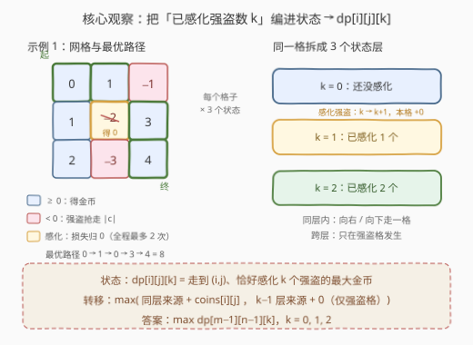
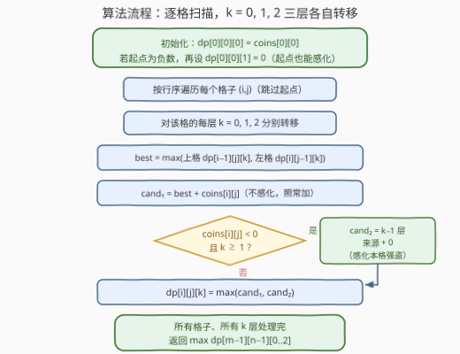

# LeetCode 机器人可以获得的最大金币数 题解

## 1. 题目概述

- **标题 / 题号**：机器人可以获得的最大金币数（#3418，medium）
- **链接**：https://leetcode.cn/problems/maximum-amount-of-money-robot-can-earn/
- **难度**：中等
- **标签**：数组、动态规划、矩阵

**题意**：给定一个 $m \times n$ 的网格 `coins`。机器人从左上角 $(0, 0)$ 出发，目标是到达右下角 $(m-1, n-1)$，每步只能**向右或向下**移动。每个单元格的值 `coins[i][j]`：

- 若 $coins[i][j] \ge 0$：机器人获得该数值的金币；
- 若 $coins[i][j] < 0$：机器人遇到强盗，被抢走 $|coins[i][j]|$ 枚金币。

机器人有一项特殊能力：全程**最多感化 2 个**单元格的强盗，使这些单元格的金币不被抢走。总金币数**可以为负**。返回路径上能获得的最大金币数。

**示例 1**：

```text
输入：coins = [[0,1,-1],[1,-2,3],[2,-3,4]]
输出：8
解释：路径 (0,0)→(0,1)→(1,1)→(1,2)→(2,2)，在 (1,1) 感化强盗：
      0 + 1 + 0 + 3 + 4 = 8。
```

**示例 2**：

```text
输入：coins = [[10,10,10],[10,10,10]]
输出：40
解释：全是正数，无需感化，路径上 4 个格子各得 10。
```

**约束**：

- $m == coins.length$，$n == coins[i].length$
- $1 \le m, n \le 500$
- $-1000 \le coins[i][j] \le 1000$

> 💡 **读题关键**：① 感化是**全程共享的预算**（共 2 次），不是每行/每列各 2 次；② 感化只对**强盗格**（负数格）有意义，把该格贡献从 $-|c|$ 变成 $0$；③ 答案可为负，DP 初值与"不可达"标记必须用 $-\infty$ 而非 $0$。

## 2. 解题思路

### 2.1 朴素思路：普通网格 DP 为什么不够

不带感化能力时，这是教科书题：$dp[i][j] = \max(dp[i-1][j],\ dp[i][j-1]) + coins[i][j]$，一遍扫完取右下角。

感化能力打破了这个结构：**"走哪条路"和"在哪感化"是耦合的**。对一条固定路径，感化该路径上损失最大的至多 2 个强盗显然最优；但最优路径本身取决于感化带来的收益——可能为了"绕路去吃一个被感化的大强盗格"而放弃直路。路径有指数条，枚举不可行，必须让**感化次数进入 DP 状态**，做联合决策。

### 2.2 核心观察：把「已感化次数 k」编进状态 —— 三层 DP



**状态定义**：$dp[i][j][k]$ = 走到 $(i,j)$、**恰好**已感化 $k$ 个强盗时的最大金币数（$k \in \{0,1,2\}$）。

每个格子被拆成 3 个平行状态层，层间转移规则：

- **同层转移（不感化本格）**：从第 $k$ 层的上格/左格来，本格照常加 $coins[i][j]$（可正可负）；
- **跨层转移（感化本格）**：仅当 $coins[i][j] < 0$ 且 $k \ge 1$，从第 $k-1$ 层的上格/左格来，本格贡献为 $0$。

$$dp[i][j][k] = \max\Big(\underbrace{\max(dp[i{-}1][j][k],\ dp[i][j{-}1][k]) + coins[i][j]}_{\text{不感化}},\ \underbrace{\max(dp[i{-}1][j][k{-}1],\ dp[i][j{-}1][k{-}1])}_{\text{感化，仅 } c<0,\ k\ge 1}\Big)$$

**初始化**：$dp[0][0][0] = coins[0][0]$；若起点为负数，还可当场感化：$dp[0][0][1] = 0$。其余状态置 $-\infty$（不可达）。

**答案**：$\max\limits_{k=0,1,2} dp[m-1][n-1][k]$——"恰好用完 k 次"的三层里取最优。

> 💡 为什么对负数格感化"永远不亏"还要拆两层？因为 $0 \ge c$ 只保证**单格**弱优；"恰好 $k$ 次"语义下高层可能不可达（路径上强盗不够多），所以三层都要算、最后取 max。若改用"**至多** $k$ 次"语义则 $dp$ 关于 $k$ 单调，直接取 $dp[m-1][n-1][2]$，见第 5 节。

### 2.3 算法流程图



要点回顾：

1. 起点**自己也可以被感化**（若为强盗格），别漏了 $dp[0][0][1] = 0$；
2. 感化分支只在 $c < 0$ 且 $k \ge 1$ 时启用，从 $k-1$ 层取来源；
3. 不可达用 $-\infty$ 标记：$-\infty + c$ 仍极小，会自动被 $\max$ 淘汰，无需特判（值域 $|c| \le 1000$、路径长 $\le 999$，用 $-10^9$ 作标记在 `int` 下安全）。

### 2.4 示例演算

以**示例 1**（`coins = [[0,1,-1],[1,-2,3],[2,-3,4]]`）逐格演算（"—"表示该状态不可达）。

**第 $k=0$ 层（从未感化）**：

| $i \backslash j$ | 0 | 1 | 2 |
|---|---|---|---|
| 0 | 0 | 1 | 0 |
| 1 | 1 | −1 | 3 |
| 2 | 3 | 0 | 7 |

**第 $k=1$ 层（恰好感化 1 个）**：

| $i \backslash j$ | 0 | 1 | 2 |
|---|---|---|---|
| 0 | — | — | 1 |
| 1 | — | 1 | 4 |
| 2 | — | 3 | 8 |

**第 $k=2$ 层（恰好感化 2 个）**：

| $i \backslash j$ | 0 | 1 | 2 |
|---|---|---|---|
| 0 | — | — | — |
| 1 | — | — | — |
| 2 | — | 1 | 5 |

几个关键格子：

- $(0,2)$（$c=-1$）：$k=1$ 层 = 左格 $(0,1)$ 的 $k=0$ 层（值 1）感化转移 $1 + 0 = 1$；
- $(1,1)$（$c=-2$）：$k=1$ 层 = $\max(\text{同层 } 1 + (-2),\ \text{下层 } 1 + 0) = 1$，即"到这先忍着不如当场感化"；
- $(2,2)$（$c=4$）：$k=1$ 层 = $\max((1,2)\text{ 层}1,\ (2,1)\text{ 层}1) + 4 = \max(4,3)+4 = 8$，正对应官方路径 $(0,0)\to(0,1)\to$ 感化 $(1,1) \to (1,2)\to(2,2)$。

答案 $= \max(7, 8, 5) = 8$ ✓。**示例 2** 全正数，只有 $k=0$ 层可达，$10 \times 4 = 40$ ✓。

## 3. 参考代码

### C++

```cpp
class Solution {
  public:
    int maximumAmount(vector<vector<int>>& coins) {
        int m = coins.size(), n = coins[0].size();
        const int NEG = -1e9;                 // “不可达”标记，远小于任何合法路径值
        vector dp(m, vector(n, array<int, 3>{NEG, NEG, NEG}));
        dp[0][0][0] = coins[0][0];            // 起点不感化
        if (coins[0][0] < 0) dp[0][0][1] = 0; // 起点也可当场感化
        for (int i = 0; i < m; ++i) {
            for (int j = 0; j < n; ++j) {
                if (i == 0 && j == 0) continue;
                int c = coins[i][j];
                for (int k = 0; k < 3; ++k) {
                    int best = NEG;           // 分支一：不感化，同层来源 + c
                    if (i > 0) best = max(best, dp[i - 1][j][k]);
                    if (j > 0) best = max(best, dp[i][j - 1][k]);
                    int cur = best + c;
                    if (c < 0 && k > 0) {     // 分支二：感化，k-1 层来源 + 0
                        int used = NEG;
                        if (i > 0) used = max(used, dp[i - 1][j][k - 1]);
                        if (j > 0) used = max(used, dp[i][j - 1][k - 1]);
                        cur = max(cur, used);
                    }
                    dp[i][j][k] = cur;
                }
            }
        }
        return max({dp[m - 1][n - 1][0], dp[m - 1][n - 1][1], dp[m - 1][n - 1][2]});
    }
};
```

### Python

```python
class Solution:
    def maximumAmount(self, coins: List[List[int]]) -> int:
        m, n = len(coins), len(coins[0])
        NEG = float('-inf')
        dp = [[[NEG] * 3 for _ in range(n)] for _ in range(m)]
        dp[0][0][0] = coins[0][0]              # 起点不感化
        if coins[0][0] < 0:
            dp[0][0][1] = 0                    # 起点也可当场感化
        for i in range(m):
            for j in range(n):
                if i == 0 and j == 0:
                    continue
                c = coins[i][j]
                for k in range(3):
                    best = max(                 # 分支一：不感化，同层来源 + c
                        dp[i - 1][j][k] if i else NEG,
                        dp[i][j - 1][k] if j else NEG,
                    )
                    cur = best + c
                    if c < 0 and k > 0:        # 分支二：感化，k-1 层来源 + 0
                        used = max(
                            dp[i - 1][j][k - 1] if i else NEG,
                            dp[i][j - 1][k - 1] if j else NEG,
                        )
                        cur = max(cur, used)
                    dp[i][j][k] = cur
        return max(dp[m - 1][n - 1])
```

## 4. 复杂度分析

| 维度 | 复杂度 | 说明 |
|------|--------|------|
| 时间 | $O(m \cdot n \cdot 3) = O(m \cdot n)$ | 每格 3 层，每层 $O(1)$ 转移；$500 \times 500 \times 3 \approx 7.5 \times 10^5$ |
| 空间 | $O(m \cdot n \cdot 3)$ | 三维 DP 表；滚动数组可压到 $O(n \cdot 3)$（见第 5 节） |

## 5. 扩展：滚动数组与「至多 k」语义

**滚动数组**：第 $i$ 行只依赖第 $i-1$ 行（上方）与本行左侧，可把行维压掉。注意要先取"上方旧值"再覆盖，$k$ 维整体搬移：

```python
class Solution:
    def maximumAmount(self, coins: List[List[int]]) -> int:
        m, n = len(coins), len(coins[0])
        NEG = float('-inf')
        dp = [[NEG] * 3 for _ in range(n)]     # dp[j][k]：当前行第 j 列
        for i in range(m):
            for j in range(n):
                top = dp[j][:]                  # 上一行的旧值（上方来源）
                if i == 0 and j == 0:
                    dp[j] = [coins[0][0], 0 if coins[0][0] < 0 else NEG, NEG]
                    continue
                c = coins[i][j]
                for k in range(3):
                    cur = max(top[k], dp[j - 1][k] if j else NEG) + c
                    if c < 0 and k > 0:
                        used = max(top[k - 1], dp[j - 1][k - 1] if j else NEG)
                        cur = max(cur, used)
                    dp[j][k] = cur
        return max(dp[n - 1])
```

**「至多 k」语义**：把 $dp[i][j][k]$ 定义为"至多感化 $k$ 个"时的最大金币，则同一格上 $dp[i][j][0] \le dp[i][j][1] \le dp[i][j][2]$ 单调成立，答案直接取 $dp[m-1][n-1][2]$，省去"恰好"语义下高 $k$ 层可能不可达的讨论。两种写法转移结构相同，仅答案收集与初值细节不同。

**预算泛化**：若感化次数上限改为 $K$，只需把 $k$ 维扩成 $K+1$，复杂度 $O(m \cdot n \cdot K)$——这正是"把资源用量编进状态"类 DP 的通用伸缩方式。

## 6. 面试要点

- **Q1：为什么不能先选一条最优路径，再在路径上感化损失最大的强盗？**
  答：路径与感化耦合——被感化的强盗格收益从 $-|c|$ 变 $0$，会改变"哪条路最优"；为吃两个感化后的大强盗格而绕路可能更赚。固定路径上"感化最大损失"确实最优，但路径枚举是指数级，必须把感化次数 $k$ 编入状态联合 DP。
- **Q2：感化永远不亏，为什么还要三层都算、最后取 max？**
  答：单格上 $0 \ge c$ 只是弱优；"恰好 $k$ 次"语义下，路径上强盗不够多时高层不可达（值为 $-\infty$），低层反而可能是唯一可达状态。对三层取 max 才完备（或改用"至多 $k$"语义利用单调性）。
- **Q3：初值为什么用 $-\infty$ 而不是 0？**
  答：总金币可为负：一个全 $-1000$ 的网格最优答案约 $-10^6$。若不可达/初始用 0，相当于凭空回血，错误覆盖负收益路径；$-\infty$ 参与加法仍极小，会被 max 自然淘汰。
- **Q4：起点是强盗格怎么办？**
  答：起点同样可以被感化：$dp[0][0][0] = coins[0][0]$ 与 $dp[0][0][1] = 0$ 同时初始化，这是最容易漏的边界。
- **Q5：空间能压到多少？**
  答：行间依赖只有上一行与本行左侧，滚动数组 $O(n \times 3)$；$k$ 维是常数 3，整体仍是常数因子优化，时间不变。

## 同类练习题

| # | 题目 | 与本题的关联 |
|---|------|-------------|
| 64 | [最小路径和](https://leetcode.cn/problems/minimum-path-sum/) | 无附加状态的网格路径 DP 基础模板 |
| 62 | [不同路径](https://leetcode.cn/problems/unique-paths/) | 网格路径 DP 的计数版起点 |
| 2435 | [矩阵中和能被 K 整除的路径](https://leetcode.cn/problems/paths-in-matrix-whose-sum-is-divisible-by-k/) | 同款"网格 DP + 附加一维状态（路径和 mod K）"套路 |
| 741 | [摘樱桃](https://leetcode.cn/problems/cherry-pickup/) | 网格 DP 状态扩张的经典困难题（来回两趟合并为两指针同行走） |
| 1463 | [摘樱桃 II](https://leetcode.cn/problems/cherry-pickup-ii/) | 双机器人并行移动，多一维状态联合决策的练习 |
