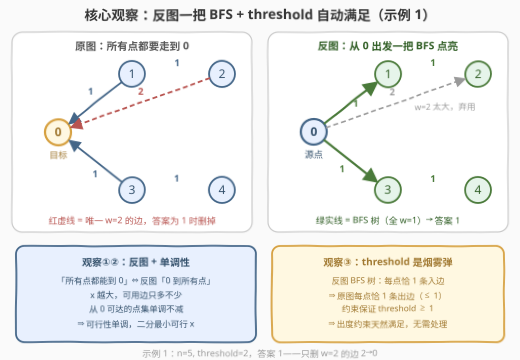
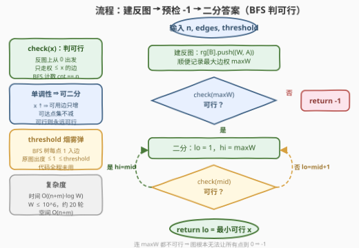

# LeetCode 图的最大边权的最小值 题解

- **关联**：778、1631（同款「最小化路径最大边权」）、1514（Dijkstra 变体）、2203（反图正反双向套路）

## 1. 题目概述

- **标题 / 题号**：图的最大边权的最小值（#3419，medium）
- **链接**：https://leetcode.cn/problems/minimize-the-maximum-edge-weight-of-graph/
- **难度**：中等
- **标签**：图、广度优先搜索、二分查找、最短路

**题意**：给你两个整数 `n` 和 `threshold`，同时给你一个 `n` 个节点的**有向**带权图，节点编号为 `0` 到 `n-1`。图用二维整数数组 `edges` 表示，其中 `edges[i] = [Ai, Bi, Wi]` 表示节点 `Ai` 到节点 `Bi` 之间有一条边权为 `Wi` 的**有向边**。

你需要从这个图中删除一些边（也**可能不删除任何边**），使得这个图满足以下条件：

1. **所有其他节点都可以到达节点 0**；
2. 图中剩余边的**最大**边权值尽可能小；
3. 每个节点都**至多**有 `threshold` 条**出去的**边。

请你返回删除必要的边后，最大边权的**最小值**为多少。如果无法满足所有的条件，返回 `-1`。

**示例 1**：

```text
输入：n = 5, edges = [[1,0,1],[2,0,2],[3,0,1],[4,3,1],[2,1,1]], threshold = 2
输出：1
解释：删除边 2 -> 0。剩余边中的最大值为 1。
```

**示例 2**：

```text
输入：n = 5, edges = [[0,1,1],[0,2,2],[0,3,1],[0,4,1],[1,2,1],[1,4,1]], threshold = 1
输出：-1
解释：无法从节点 2 到节点 0。
```

**示例 3**：

```text
输入：n = 5, edges = [[1,2,1],[1,3,3],[1,4,5],[2,3,2],[3,4,2],[4,0,1]], threshold = 1
输出：2
解释：删除边 1 -> 3 和 1 -> 4。剩余边中的最大值为 2。
```

**约束**：

- $2 \le n \le 10^5$
- $1 \le \text{threshold} \le n - 1$
- $1 \le \text{edges.length} \le \min(10^5,\ \frac{n(n-1)}{2})$
- $0 \le A_i, B_i < n$ 且 $A_i \ne B_i$
- $1 \le W_i \le 10^6$
- 一对节点之间可能有多条边，但它们的权值互不相同。

> 💡 **读题关键**：①「所有其他节点到 0」是**指向 0 的可达性**——方向别看反，这是第一个坑；②「也可能不删任何边」说明我们是在原图里**挑子图**，边只能少不能多；③ `threshold` 限制的是**出边条数**，与边权无关；④ 求「最大边权的最小值」是典型的 **min-max 型问题**——看到它就该条件反射：**二分答案**。

## 2. 解题思路

### 2.1 暴力思路：从小到大枚举边权上界

最朴素的判定对象是「边权上界 $x$」：只允许保留权 $\le x$ 的边时，能否让所有点都到 0。**从小到大**逐个试 $x$（候选值就是出现过的边权），第一个可行的 $x$ 即答案，每个 $x$ 用一次图遍历判定。

- 枚举删除方案本身：$2^m$ 种（$m \le 10^5$），天文数字，不考虑；
- 枚举 $x$：候选权值至多 $10^5$ 个，每次判定 $O(n+m)$，总计 $O(m(n+m)) \approx 2 \times 10^{10}$，超时。

但这个暴力已经蕴含了全部正确性要素——**可行性关于 $x$ 单调**。单调的线性扫描，天然可以二分。

### 2.2 核心观察：反图可达 + 单调性 + threshold 是烟雾弹



**观察一（反图转换）**：「原图上所有点都能到 0」⇔「**把所有边反向后，0 能到所有点**」。条件 1 于是变成最普通的**单源可达性**——从 0 出发一把 BFS/DFS 就能判定。（官方 hint 也直说了：*Invert the edges in the graph.*）

**观察二（单调性）**：固定边权上界 $x$，令 $S(x)$ = 反图上只用权 $\le x$ 的边时从 0 可达的点集。$x$ 变大只会**增加**可用边，$S(x)$ 只增不减，因此「$S(x) = $ 全部点」关于 $x$ 单调——一旦可行，更大的 $x$ 必然可行。**答案 = 最小的可行 $x$**，二分即可。

**观察三（threshold 是烟雾弹）**：约束保证 $\text{threshold} \ge 1$。而从 0 开始在反图上 BFS，每个非 0 节点都恰由**一条**树边（入边）发现——对应回原图，每个节点恰好保留**一条出边**（指向自己在树中的父亲）。出度 $\le 1 \le \text{threshold}$，**条件 3 被 BFS 树自动满足**，全程不用管。

> ⚠️ **别被 threshold 吓去建复杂结构**（按出度限制做流 / 匹配 / 贪心删边都是歧路）。解只要取成「反图的生成树」形态，出度天然是 1；而生成树能达到的可达性不弱于任何子图，所以 threshold 对答案**零影响**——它在本题里纯属题面恐吓。

### 2.3 算法流程图



| 步骤 | 操作 | 说明 |
|------|------|------|
| ① 建反图 | `rg[B].push_back((W, A))` | 邻接表只建一次，check 里按权过滤 |
| ② 预检 | `check(maxW)` 为假 → 返回 `-1` | 全部边都救不回来的连通性，趁早失败 |
| ③ 二分 | `lo=1, hi=maxW`；`check(mid)` 真 → `hi=mid`，假 → `lo=mid+1` | 收敛到最小可行 $x$ |
| ④ 返回 | `lo` | 即答案 |

**check(x)**：反图上从 0 出发 BFS，只走权 $\le x$ 的边，看访问到的点数是否为 $n$。

**边界（天然兼容，无需特判）**：

- 原图上 0 **没有任何入边** ⇔ 反图上 0 没有出边，BFS 卡在起点 → `check(maxW)` 为假 → `-1`（示例 2 正是如此）；
- **多重边**（同起终点不同权）：邻接表天然支持，BFS 扫到哪条可用边都行，不影响判定；
- `n = 2` 只有一条边：答案就是这条边的权（不可达时为 `-1`）。

### 2.4 示例演算

用**示例 3** 走一遍二分（注意 `threshold = 1` 全程没派上用场）。反图边：`0→4(1)`、`4→3(2)`、`4→1(5)`、`3→2(2)`、`3→1(3)`、`2→1(1)`，`maxW = 5`。

| 二分状态 | mid | 从 0 只走权 ≤ mid 的边可达的点 | 判定 | 收敛 |
|----------|-----|-------------------------------|------|------|
| lo=1, hi=5 | 3 | 0→4→3→2→1（权 1,2,2,1）全 5 点 | 可行 | hi=3 |
| lo=1, hi=3 | 2 | 同上（权 1,2,2,1 全 ≤ 2） | 可行 | hi=2 |
| lo=1, hi=2 | 1 | 仅 0→4；4 的另一条出边权 5 被 ban | 不可行 | lo=2 |
| lo=hi=2 | — | — | — | **答案 2** |

对应的保留方案正是官方解释：删 `1→3(w=3)`、`1→4(w=5)`，留 `[1,2,1],[2,3,2],[3,4,2],[4,0,1]`——恰好是反图 BFS 树 $\{0→4, 4→3, 3→2, 2→1\}$ 整体反向，每点出度 $1 \le \text{threshold}$。示例 4 中点 2、3 在反图上无法从 0 到达，`check(maxW)` 直接为假，返回 `-1`。

## 3. 参考代码

### C++

```cpp
class Solution {
  public:
    int minMaxWeight(int n, vector<vector<int>>& edges, int threshold) {
        int maxW = 0;
        vector<vector<pair<int, int>>> rg(n);    // 反图：(边权, 指向)
        for (auto& e : edges) {
            rg[e[1]].push_back({e[2], e[0]});    // 原图 A->B 反向成 B->A
            maxW = max(maxW, e[2]);
        }

        // check(x)：反图上从 0 只走权 <= x 的边，能否访问全部 n 个点
        vector<int> vis(n), q(n);
        auto check = [&](int x) -> bool {
            fill(vis.begin(), vis.end(), 0);
            q[0] = 0;
            vis[0] = 1;
            int head = 0, tail = 1, cnt = 1;
            while (head < tail) {
                int u = q[head++];
                for (auto& [w, v] : rg[u]) {
                    if (w <= x && !vis[v]) {
                        vis[v] = 1;
                        q[tail++] = v;
                        ++cnt;
                    }
                }
            }
            return cnt == n;
        };

        if (!check(maxW)) return -1;             // 全部边都上也不可达
        int lo = 1, hi = maxW;                   // W_i >= 1 保证下界
        while (lo < hi) {
            int mid = lo + (hi - lo) / 2;
            if (check(mid)) hi = mid;
            else lo = mid + 1;
        }
        return lo;                               // 最小可行边权上界
    }
};
```

### Python

```python
class Solution:
    def minMaxWeight(self, n: int, edges: List[List[int]], threshold: int) -> int:
        rg = [[] for _ in range(n)]              # 反图邻接表
        max_w = 0
        for a, b, w in edges:
            rg[b].append((w, a))                 # 原图 a->b 反向成 b->a
            max_w = max(max_w, w)

        def check(x: int) -> bool:               # 从 0 只走权 <= x 的边
            vis = [False] * n
            vis[0] = True
            q = [0]
            for u in q:                          # 边遍历边追加 = 队列式 BFS
                for w, v in rg[u]:
                    if w <= x and not vis[v]:
                        vis[v] = True
                        q.append(v)
            return len(q) == n

        if not check(max_w):
            return -1
        lo, hi = 1, max_w
        while lo < hi:
            mid = (lo + hi) // 2
            if check(mid):
                hi = mid
            else:
                lo = mid + 1
        return lo
```

> 💡 **实现细节**：① `threshold` 在代码里**全程未出现**——不是漏写，是 BFS 树自动满足（见 2.2 观察三）；② 反图邻接表只建一次，`check` 里用 `w <= x` 过滤，避免每轮重建；③ Python 的 `for u in q` 在列表被追加时仍会继续迭代（列表迭代器语义），天然当队列用，免 `deque` 导入；④ 二分下界取 1 是因为 $W_i \ge 1$，上界 `maxW` 已被预检验证过可行，循环结束时 `lo == hi` 即答案。

## 4. 复杂度分析

设 $n$ 为节点数、$m$ 为边数、$W = \max W_i \le 10^6$。

| 维度 | 复杂度 | 说明 |
|------|--------|------|
| **时间** | $O((n+m)\log W)$ | 建反图一轮 $O(n+m)$；二分 $\lceil \log_2 10^6 \rceil = 20$ 轮，每轮 BFS $O(n+m)$ |
| **空间** | $O(n+m)$ | 反图邻接表 + `vis` 与队列 |
| **对比暴力** | 逐个枚举候选权值 $O(m(n+m))$ | 单调性把「逐个试」压成「二分试」，省掉一个 $m$ 因子 |

> 💡 若改成对**去重排序后的权值数组**二分（下标域 $[0, m)$），轮数为 $\log m \approx 17$，常数略优；直接对权值域 $[1, 10^6]$ 二分写起来最简单，20 轮绰绰有余。

## 5. 扩展：一趟「瓶颈最短路」（类 Dijkstra）

二分是通用套路，但本题其实能**一趟**出答案。定义 $d[v]$ = 反图上从 0 到 $v$ 的所有路径中「路径上最大边权」的最小值（**瓶颈最短路** / minimax path），则

$$\text{answer} = \max_v d[v], \qquad \big(\exists\, v:\ d[v] = \infty \Rightarrow -1\big)$$

套 Dijkstra 的骨架，把松弛改成 $d[v] \leftarrow \min\big(d[v],\ \max(d[u], w)\big)$：每轮取出 $d$ 最小的点，其瓶颈值不可能再被更新（贪心正确性与 Dijkstra 同理）。复杂度 $O(m \log n)$，与二分同量级但免掉轮次。

```cpp
int minMaxWeight(int n, vector<vector<int>>& edges, int threshold) {
    vector<vector<pair<int, int>>> rg(n);
    for (auto& e : edges) rg[e[1]].push_back({e[2], e[0]});
    vector<int> d(n, INT_MAX);
    priority_queue<pair<int, int>, vector<pair<int, int>>, greater<>> pq;
    d[0] = 0;
    pq.push({0, 0});
    while (!pq.empty()) {
        auto [du, u] = pq.top();
        pq.pop();
        if (du > d[u]) continue;
        for (auto& [w, v] : rg[u]) {
            int nd = max(du, w);              // 瓶颈松弛：取路径上的最大边权
            if (nd < d[v]) {
                d[v] = nd;
                pq.push({nd, v});
            }
        }
    }
    int ans = *max_element(d.begin(), d.end());
    return ans == INT_MAX ? -1 : ans;
}
```

同一个「**最小化路径上最大边权**」模式在 [778. 水位上升的泳池中游泳](https://leetcode.cn/problems/swim-in-rising-water/) 与 [1631. 最小体力消耗路径](https://leetcode.cn/problems/path-with-minimum-effort/) 中反复出现——那两题是无向图版，可选姿势更多：二分 + BFS、Kruskal 式并查集加边、瓶颈 Dijkstra 三选一。有向图版（本题）因为可达性带方向，并查集不再适用，二分与瓶颈 Dijkstra 是主力。

## 6. 面试要点

1. **为什么要把所有边反向？**

   > 条件 1 是「所有点都能到 0」的**多对一**可达性，正向做要对每个点分别搜索；反向后变成「0 能到所有点」的**一对多**可达性，从 0 出发一次 BFS/DFS 就够。见到「大家都能到 X」的句式，第一反应就是反图。

2. **可行性关于 x 的单调性为什么成立？threshold 会不会破坏它？**

   > 若边集 $E$ 在上界 $x$ 下满足全部条件（含 threshold），那么 $x$ 增大后**原封不动保留 $E$** 依然满足全部条件——threshold 约束的是所留边集本身，与 $x$ 无关。所以可行性只取决于「权 $\le x$ 的边够不够用」，必然单调，二分合法。

3. **threshold 为什么从头到尾没用上？**

   > 约束保证 threshold $\ge 1$；反图 BFS 树中每个非 0 节点恰有一条入边，对应原图每个节点恰有一条出边，出度 $\le 1 \le$ threshold。解取成生成树形态，threshold 永不违规；且生成树的可达性不弱于任何子图，答案不受影响。

4. **什么时候返回 -1？**

   > 反图上从 0 出发的可达集不满，即 `check(maxW)` 为假。典型形态：原图上 0 没有任何入边（示例 2）；或某些点只被大权边连着、与 0 之间没有低权通路（示例 4）。此时连「所有点到 0」都做不到，与 threshold 无关。

5. **check 里为什么用 BFS 而不是最短路算法？**

   > 判定只需要**可达性**，不需要距离——BFS 每轮 $O(n+m)$，比 Dijkstra 的 $O(m\log n)$ 便宜。若把二分整体换成第 5 节的瓶颈 Dijkstra，可一趟求出所有点的瓶颈值；两种写法复杂度同量级，二分更好写也好证。

## 同类练习题

| # | 题目 | 与本题的关联 |
|---|------|-------------|
| 778 | [水位上升的泳池中游泳](https://leetcode.cn/problems/swim-in-rising-water/)（[站内题解](../0701-0800/778_水位上升的泳池中游泳.md)） | 同款「最小化路径最大边权」的无向版——二分 / 并查集 / 瓶颈 Dijkstra 三种姿势任选 |
| 1631 | [最小体力消耗路径](https://leetcode.cn/problems/path-with-minimum-effort/)（[站内题解](../1601-1700/1631_最小体力消耗路径.md)） | 把「最大边权」换成「相邻高度差最大」，二分 + BFS 判连通的同款骨架 |
| 1514 | [概率最大的路径](https://leetcode.cn/problems/path-with-maximum-probability/)（[站内题解](../1501-1600/1514_概率最大的路径.md)） | Dijkstra 变体练习——松弛从 min-max 换成 max-prod（乘法） |
| 743 | [网络延迟时间](https://leetcode.cn/problems/network-delay-time/)（[站内题解](../0701-0800/743_网络延迟时间.md)） | Dijkstra 本尊裸题，练单源最短路基本功，正好对照第 5 节 |
| 2203 | [包含要求路径的最小带权子图](https://leetcode.cn/problems/minimum-weighted-subgraph-with-the-required-paths/) | 反图套路的进阶——正图 + 反图各跑一次 Dijkstra，再组合两段路径 |
