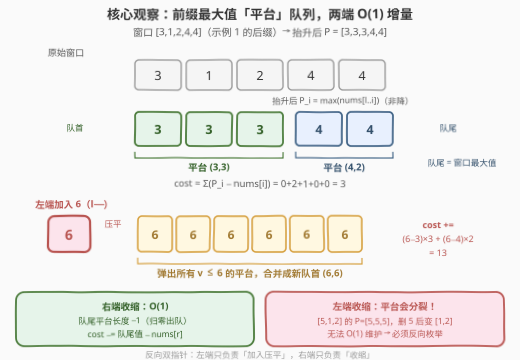
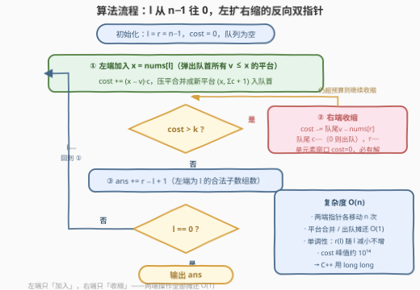

# 统计K次操作以内得到非递减子数组的数目

- **题目名称**：统计K次操作以内得到非递减子数组的数目
- **链接**：[3420. 统计 K 次操作以内得到非递减子数组的数目](https://leetcode.cn/problems/count-non-decreasing-subarrays-after-k-operations/)
- **难度**：困难
- **标签**：单调栈、双指针、滑动窗口、队列、数组
- **关联**：239（单调队列雏形）、862（单调队列 + 双指针）、2762（双单调队列计数）、3422（子数组磨平代价 + 滑动窗口）

## 1. 题目概述

给你一个长度为 $n$ 的数组 `nums` 和一个整数 $k$。

对于 `nums` 中的**每一个子数组**，你可以对它进行**至多 $k$ 次**操作。每次操作中，你可以将子数组中的任意一个元素增加 1。

注意，每个子数组都是独立的——你对一个子数组的修改不会保留到另一个子数组中。

请你返回最多 $k$ 次操作以内，有多少个子数组可以变成**非递减**的（每个元素都大于等于前一个元素，如果前一个元素存在）。

**示例 1**：

```text
输入：nums = [6,3,1,2,4,4], k = 7
输出：17
解释：
nums 的所有 21 个子数组中，只有子数组 [6,3,1]、[6,3,1,2]、[6,3,1,2,4] 和 [6,3,1,2,4,4]
无法在 k = 7 次操作以内变为非递减的。所以非递减子数组的数目为 21 − 4 = 17。
```

**示例 2**：

```text
输入：nums = [6,3,1,3,6], k = 4
输出：12
解释：
除 [6,3,1] 外，所有长度小于等于 3 的子数组都可以在 k 次操作以内变为非递减子数组，
总计 5 + 4 + 2 + 1 = 12 个。
```

**约束条件**：

- $1 \le \text{nums.length} \le 10^5$
- $1 \le \text{nums[i]} \le 10^9$
- $1 \le k \le 10^9$

> 💡 **读题关键**：①「每个子数组独立」说明这是一道**逐子数组判定再计数**的题，不是修改原数组；② 只能 +1、要变非递减——每个元素最终都会被抬到「它左侧（含自己）的最大值」，别无更便宜的选择；③ 代价随子数组变长只增不减——这是**双指针计数**的天然信号。

---

## 2. 解题思路

### 2.1 暴力思路：枚举左端点，向右扩展并累计代价

先解决「单个子数组的最小操作数」：把 $[l..r]$ 抬成非递减，贪心地从左往右，令 $P_i = \max(\text{nums}[l..i])$，最小代价为

$$\text{cost}(l,r) = \sum_{i=l}^{r} \big(P_i - \text{nums}[i]\big)$$

（正确性见 2.2 观察一）。固定 $l$ 向右推 $r$ 时，$P$ 与 $\text{cost}$ 都能 $O(1)$ 增量维护；一旦 $\text{cost} > k$ 即可提前break（后面只会更大）。

但最坏情况（$k$ 极大、数组全合法）每个 $l$ 都要扫到结尾，总复杂度 $O(n^2) \approx 10^{10}$，超时。暴力已经点破了全部要素：**代价公式 + 关于端点的单调性**，缺的只是让所有 $l$ 共享一次线性扫描。

### 2.2 核心观察：前缀最大值「平台」+ 反向双指针



**观察一（最小代价 = 前缀最大值抬升）**：任何合法结果 $F$ 满足非递减且 $F_i \ge \text{nums}[i]$。由归纳法：$F_i \ge F_{i-1} \ge P_{i-1}$ 且 $F_i \ge \text{nums}[i]$，故 $F_i \ge \max(P_{i-1}, \text{nums}[i]) = P_i$。即 $P$ 是**逐点最小**的合法方案，$\text{cost}(l,r) = \sum (P_i - \text{nums}[i])$ 就是最小操作数。

**观察二（双向单调 → 双指针）**：$\text{cost}(l,r)$ 中每项的 $\max$ 区间随 $r$ 扩大而扩大、随 $l$ 右移而缩小，故 **$\text{cost}$ 关于 $r$ 单调不减、关于 $l$ 单调不增**。于是对每个 $l$ 存在唯一的最大右端点 $r(l)$ 使 $\text{cost}(l, r(l)) \le k$，且 $l$ 减小时 $r(l)$ 只减不增——反向双指针成立，答案 $= \sum_l \big(r(l) - l + 1\big)$。

**观察三（平台 RLE，两端增量都摊还 $O(1)$）**：$P$ 序列从左到右非降，可压缩成若干个「值递增的平台」$(v, c)$（值 $v$ 连续出现 $c$ 次），用**双端队列**维护。关键在于枚举方向——**让 $l$ 从 $n-1$ 往 $0$ 走**：

- **左端加入元素 $x = \text{nums}[l]$**：所有 $v \le x$ 的平台（靠左的、值较小的）整体被压平到 $x$，代价增量 $(x - v) \cdot c$ 逐段 $O(1)$ 结算，合并成一个新平台入队首——每个元素一生只被压平一次，**摊还 $O(1)$**；
- **右端收缩 $r{--}$**：最右平台的值恰是窗口最大值 $\max(\text{nums}[l..r]) = P_r$，移出元素后 $\text{cost} \mathrel{-}= P_r - \text{nums}[r]$，最右平台长度 $-1$（归零则出队尾）——严格 $O(1)$。

> ⚠️ **为什么必须反向？** 正向双指针（$l$ 从左往右）需要「左端收缩」，而删掉最左元素会让 $P$ 序列**整体重排**：窗口 $[5,1,2]$ 的 $P = [5,5,5]$ 是一个平台，删去 $5$ 后 $[1,2]$ 的 $P = [1,2]$ **分裂成两个平台**，无法 $O(1)$ 增量维护。反向把「难做的左端」变成「加入端」（压平合并），把「易做的右端」留给收缩——这就是官方标签里线段树/稀疏表解法要用 $O(n \log n)$ 数据结构硬扛、而本解法只用一个双端队列 $O(n)$ 的原因。

### 2.3 算法流程图



| 步骤 | 操作 | 说明 |
|------|------|------|
| ① 左端加入 | $x = \text{nums}[l]$；弹出队首所有 $v \le x$ 的平台，$\text{cost} \mathrel{+}= (x - v) \cdot c$ | 弹出的平台与 $x$ 合并成新队首 $(x, \sum c + 1)$ |
| ② 右端收缩 | while $\text{cost} > k$：$\text{cost} \mathrel{-}= \text{队尾}v - \text{nums}[r]$；队尾 $c{-}{-}$（归零出队），$r{-}{-}$ | 队尾 $v$ = 窗口最大值；单元素窗口 $\text{cost}=0 \le k$ 保证 $r$ 不会越过 $l$ |
| ③ 计数 | $\text{ans} \mathrel{+}= r - l + 1$ | 以 $l$ 为左端、右端 $\le r(l)$ 的合法子数组个数 |
| ④ 循环 | $l{-}{-}$ 直到 $l = 0$ | $r$ 全程单调不增，两端点各移动 $n$ 次 |

### 2.4 示例演算

用**示例 1**（`nums = [6,3,1,2,4,4]`，`k = 7`）走一遍，平台队列按「队首 → 队尾」（值递增）列出：

| $l$ | 左端加入 | 平台队列（队首→队尾） | cost 变化 | 窗口 | 计数 |
|-----|---------|----------------------|-----------|------|------|
| 5 | 加入 4 | $(4,1)$ | 0 | $[5,5]$ | 1 |
| 4 | 加入 4：弹 $(4,1)$ 合并 | $(4,2)$ | $+0$ | $[4,5]$ | 2 |
| 3 | 加入 2：$4 > 2$ 不弹 | $(2,1),(4,2)$ | $+0$ | $[3,5]$ | 3 |
| 2 | 加入 1：不弹 | $(1,1),(2,1),(4,2)$ | $+0$ | $[2,5]$ | 4 |
| 1 | 加入 3：弹 $(1,1),(2,1)$ | $(3,3),(4,2)$ | $+(3{-}1){\times}1+(3{-}2){\times}1=3$ | $[1,5]$ | 5 |
| 0 | 加入 6：弹 $(3,3),(4,2)$ | $(6,6)$ | $+(6{-}3){\times}3+(6{-}4){\times}2=13 \Rightarrow 16$ | 需收缩 | — |

$l=0$ 时 $\text{cost}=16 > 7$，收缩右端：$r{=}5$ 减 $6{-}4=2$ 得 14；$r{=}4$ 再减 $6{-}4=2$ 得 12；$r{=}3$ 减 $6{-}2=4$ 得 8；$r{=}2$ 减 $6{-}1=5$ 得 **3**，队列变为 $(6,2)$，窗口 $[0,1]$，计数 2。

总计 $1+2+3+4+5+2 = 17$，与官方答案一致。

---

## 3. 参考代码

### C++

```cpp
class Solution {
  public:
    long long countNonDecreasingSubarrays(vector<int>& nums, int k) {
        int n = nums.size();
        long long ans = 0, cost = 0;
        deque<pair<long long, int>> dq;   // 平台 (值, 长度)：队首=左端，值从左到右递增
        int r = n - 1;
        for (int l = n - 1; l >= 0; --l) {
            long long x = nums[l], cnt = 1;              // ① 左端加入 nums[l]
            while (!dq.empty() && dq.front().first <= x) {
                auto [v, c] = dq.front();
                dq.pop_front();
                cost += (x - v) * c;                     // 平台整体压平到 x
                cnt += c;
            }
            dq.emplace_front(x, cnt);                    // 合并后的新平台入队首
            while (cost > k) {                           // ② 右端收缩直到预算内
                auto [v, c] = dq.back();
                cost -= v - nums[r];                     // 队尾 v 即窗口最大值
                if (--c == 0) dq.pop_back();
                else dq.back().second = c;
                --r;
            }
            ans += r - l + 1;                            // ③ 左端为 l 的合法子数组数
        }
        return ans;
    }
};
```

### Python

```python
class Solution:
    def countNonDecreasingSubarrays(self, nums: List[int], k: int) -> int:
        n = len(nums)
        ans = cost = 0
        dq = deque()                     # 平台 (值, 长度)：队首=左端，值从左到右递增
        r = n - 1
        for l in range(n - 1, -1, -1):
            x, cnt = nums[l], 1          # ① 左端加入 nums[l]
            while dq and dq[0][0] <= x:
                v, c = dq.popleft()
                cost += (x - v) * c      # 平台整体压平到 x
                cnt += c
            dq.appendleft((x, cnt))      # 合并后的新平台入队首
            while cost > k:              # ② 右端收缩直到预算内
                v, c = dq.pop()
                cost -= v - nums[r]      # 队尾 v 即窗口最大值
                if c > 1:
                    dq.append((v, c - 1))
                r -= 1
            ans += r - l + 1             # ③ 左端为 l 的合法子数组数
        return ans
```

> 💡 **实现细节**：① 弹出条件用 $v \le x$（等值平台也并入），保证队列内值**严格递增**，语义最干净；② $\text{cost}$ 上界约 $n \cdot \max(\text{nums}) = 10^5 \times 10^9 = 10^{14}$，C++ 必须 `long long`，Python 天然大数；③ 收缩循环最坏收缩到 $r = l$，此时窗口只剩单元素、$\text{cost} = 0 \le k$（$k \ge 1$），循环必然终止，不会越界；④ 队列长度 $\le$ 窗口长度，最坏 $O(n)$ 空间。

---

## 4. 复杂度分析

设 $n$ 为数组长度。

| 维度 | 复杂度 | 说明 |
|------|--------|------|
| **时间** | $O(n)$ | 每个元素只经历一次「左端入队」和一次「被压平 / 右端出队」，两端指针各移动 $n$ 次，全部操作摊还 $O(1)$ |
| **空间** | $O(n)$ | 平台双端队列最坏存下整个窗口（如严格递增数组每个元素自成一个平台） |
| **对比暴力** | 逐左端点扫描 $O(n^2)$ | 双指针让所有左端点共享一次线性扫描，省掉一个 $n$ 因子 |
| **对比数据结构解法** | 稀疏表 / 线段树 $O(n \log n)$ | 官方标签的解法用数据结构硬扛「正向左端收缩」，本解法反向枚举直接避开 |

---

## 5. 扩展：数据结构解法与 $k=0$ 特例

**为什么官方标签里有线段树、稀疏表？** 如果坚持**正向**枚举（$l$ 从左往右），左端收缩会让 $P$ 序列分裂（见 2.2 的警告框），只能上数据结构：例如从左往右枚举右端点 $r$，用线段树维护每个左端点 $l$ 的 $\text{cost}(l, r)$，配合单调栈做区间更新；或按官方提示的方向，用稀疏表预处理「每块抬成非递减后的 (末元素, 操作数)」这类可合并的块信息，再对每个 $l$ 二分最大 $r$——都能做到 $O(n \log n)$，但代码量和思维量都明显更大。反向双指针把「难端」转化为「加入端」，是本题最轻的解法。

**$k = 0$ 特例**：统计**天然非递减**的子数组。此时无需任何队列——找出所有极大的非递减段（相邻满足 $\text{nums}[i-1] \le \text{nums}[i]$ 的连续段），长度为 $L$ 的段贡献 $L(L+1)/2$ 个子数组，等差数列求和即可，$O(n)$ 时间 $O(1)$ 空间。可以看作本题去掉预算维度的热身版。

---

## 6. 面试要点

1. **为什么最小操作数是 $\sum (P_i - \text{nums}[i])$，而不是别的抬法（比如抬高右边的元素）？**

   > 任何合法方案 $F$ 非递减且 $F_i \ge \text{nums}[i]$，归纳可证 $F_i \ge \max(\text{nums}[l..i]) = P_i$。所以前缀最大值方案**逐点最小**，总代价也最小。「抬高右边的元素」本质上就是 $P$ 方案本身——右侧元素正是被抬到左侧最大值的那些。

2. **双指针的单调性依据是什么？反向枚举好在哪里？**

   > $\text{cost}(l, r)$ 关于 $r$ 单调不减、关于 $l$ 单调不增（每项 $\max$ 的区间随端点嵌套伸缩），故 $r(l)$ 单调，双指针成立。反向（$l$ 从右往左）时，左端是「加入端」——新元素压平左侧平台，摊还 $O(1)$；右端是「收缩端」——去掉最右平台的末尾元素，严格 $O(1)$。正向时左端收缩会让平台分裂（$[5,1,2]$ 删 $5$ 后 $P$ 从 $[5,5,5]$ 变 $[1,2]$），必须上 $O(n\log n)$ 数据结构。

3. **平台的摊还分析为什么是 $O(n)$？**

   > 每个元素在 $l$ 扫过它时入队一次（可能作为新平台，可能并入）；它要么随平台被左端来的更大元素「压平合并」（该平台永久消失），要么在右端收缩时出队。入队、合并、出队各至多一次，总操作数是 $O(n)$ 级别。

4. **收缩循环会不会把 $r$ 挪到 $l$ 左边？**

   > 不会。窗口收缩到只剩单元素 $[l..l]$ 时 $\text{cost} = P_l - \text{nums}[l] = 0 \le k$（$k \ge 1$），循环条件必然失效终止。代码里无需额外判界，但写正向版本时这类边界最容易漏。

5. **有哪些数值与工程细节容易翻车？**

   > ① $\text{cost}$ 峰值约 $10^{14}$，C++ 用 `int` 直接溢出，必须 `long long`；② 弹出条件 $v \le x$ 与 $v < x$ 结果都对，但取 $\le$ 能保证队列值严格递增、语义最简；③ Python 的 `deque.popleft/pop` 都是 $O(1)$，不要用 `list.pop(0)`（$O(n)$）。

---

## 7. 同类练习题

- [239. 滑动窗口最大值](https://leetcode.cn/problems/sliding-window-maximum/)（[站内题解](../0201-0300/239_滑动窗口最大值.md)）：单调双端队列维护窗口最值的入门题，本题的「平台队列」正是它的变体——存的不只是最值，而是最值的**分段结构**
- [862. 和至少为 K 的最短子数组](https://leetcode.cn/problems/shortest-subarray-with-sum-at-least-k/)（[站内题解](../0801-0900/862_和至少为K的最短子数组.md)）：单调队列 + 双指针的经典组合，同样是「队列里维护摘要信息，两端摊还删除」
- [2444. 统计定界子数组](https://leetcode.cn/problems/count-subarrays-with-fixed-bounds/)（[站内题解](../2401-2500/2444_统计定界子数组的数目.md)）：双指针计数满足约束的子数组数目，与本题共享「对每个左端点求最大合法右端点」的计数框架
- [2762. 不间断子数组](https://leetcode.cn/problems/continuous-subarrays/)（[站内题解](../2701-2800/2762_不间段子数组.md)）：双单调队列维护窗口 $\max - \min$ 的双指针计数，可对照理解「队列维护什么摘要最省事」
- [3422. 将子数组元素变为相等所需的最小操作数](https://leetcode.cn/problems/minimum-operations-to-make-subarray-elements-equal/)（[站内题解](./3422_将子数组元素变为相等所需的最小操作数.md)）：同为「子数组磨平代价 + 滑动窗口增量维护」，把「抬成非递减」换成「磨成全相等」
