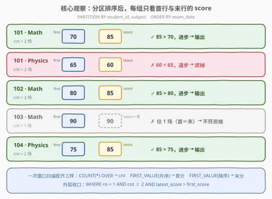
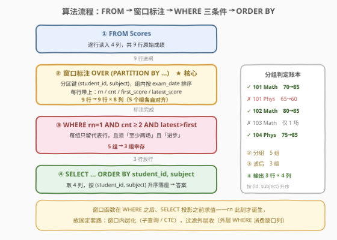

# LeetCode 查找进步的学生 题解

## 1. 题目概述

- **标题 / 题号**：查找进步的学生（#3421，medium）
- **链接**：https://leetcode.cn/problems/find-students-who-improved/
- **难度**：中等
- **标签**：数据库、SQL、窗口函数、`PARTITION BY`、`FIRST_VALUE`、`GROUP BY`、自连接、pandas `groupby`

**表结构**：`Scores`

```sql
CREATE TABLE Scores (
    student_id INT,
    subject    VARCHAR(20),
    score      INT,
    exam_date  VARCHAR(10),   -- 'YYYY-MM-DD' 格式
    PRIMARY KEY (student_id, subject, exam_date)
);
```

`(student_id, subject, exam_date)` 是主键。每行记录一名学生在**特定日期**、**特定科目**的一次成绩，`score` 取值范围 $[0, 100]$。

**目标**：查找**进步的学生**。一个 `(student_id, subject)` 组合同时满足以下两个条件才算进步：

1. 该学生在**同一科目**至少参加过**两个不同日期**的考试（组内至少两行）；
2. 该科目**最近一次**考试的分数**高于**该科目**第一次**考试的分数。

返回 `student_id, subject, first_score, latest_score` 四列，按 `student_id, subject` **升序**排序。

**示例 1**：

```text
输入：Scores 表
+------------+----------+-------+------------+
| student_id | subject  | score | exam_date  |
+------------+----------+-------+------------+
| 101        | Math     | 70    | 2023-01-15 |
| 101        | Math     | 85    | 2023-02-15 |
| 101        | Physics  | 65    | 2023-01-15 |
| 101        | Physics  | 60    | 2023-02-15 |
| 102        | Math     | 80    | 2023-01-15 |
| 102        | Math     | 85    | 2023-02-15 |
| 103        | Math     | 90    | 2023-01-15 |
| 104        | Physics  | 75    | 2023-01-15 |
| 104        | Physics  | 85    | 2023-02-15 |
+------------+----------+-------+------------+

输出：
+------------+----------+-------------+--------------+
| student_id | subject  | first_score | latest_score |
+------------+----------+-------------+--------------+
| 101        | Math     | 70          | 85           |
| 102        | Math     | 80          | 85           |
| 104        | Physics  | 75          | 85           |
+------------+----------+-------------+--------------+
```

**解释**：

- **101 / Math**：$70 \to 85$，进步 → 输出；
- **101 / Physics**：$65 \to 60$，退步 → 不输出；
- **102 / Math**：$80 \to 85$，进步 → 输出；
- **103 / Math**：只有一次考试（组内仅一行），不符合资格 → 不输出；
- **104 / Physics**：$75 \to 85$，进步 → 输出。

> 💡 **审题关键**：这道题是典型的「**分组内首尾比较**」模式——把行按 `(student_id, subject)` 分组、组内按 `exam_date` 排序，然后只关心**第一行的 score** 与**最后一行的 score** 的大小关系，中间的任何考试（如果有多场）一概不看。两个细节值得注意：① `exam_date` 虽是 `VARCHAR`，但 `'YYYY-MM-DD'` 格式保证**字典序即时间序**，可直接比较排序；② 「至少两个不同日期」由主键 `(student_id, subject, exam_date)` 天然保证——组内两行必是两个不同日期。

## 2. 解题思路

### 2.1 暴力思路：应用层分组排序逐组判

最直觉的暴力做法是把整张表拉回程序，按 `(student_id, subject)` 分组，每组内按日期排序，取首尾分数比较：

```text
for (sid, subj), rows in group_by(Scores, student_id, subject):
    rows.sort(by=exam_date)
    if len(rows) >= 2 and rows[-1].score > rows[0].score:
        emit(sid, subj, rows[0].score, rows[-1].score)
result.sort(by=(student_id, subject))
```

逻辑当然正确，但把「分组 + 组内排序 + 取首尾」这三件事全部搬出了数据库：全表数据要跨进程传输，而真正的判定只需要每组**两行**的信息（首行与末行），中间行全部白拉。SQL 侧也有一种「暴力」写法——相关子查询逐组取 `MIN(exam_date)` / `MAX(exam_date)` 再回表取分数，每组两次子查询扫描，写法冗长且优化器难优化。

> ⚠️ 暴力的启示：本题的难点不在「怎么比较」（一次 `>` 而已），而在「**怎么一次扫描就把每组的行数、首行分数、末行分数三样东西都拿到手**」。窗口函数恰好为「组内定位」而生。

### 2.2 核心观察：一次窗口扫描同时拿到 cnt / first / latest



关键观察有三条：

| 观察 | 内容 | 带来的做法 |
|------|------|-----------|
| **分组键即分区键** | 「同一科目」= 按 `(student_id, subject)` 分组；主键保证组内 `exam_date` 互不相同，组内按 `exam_date` 排序后**第一行即首次考试、最后一行即最近考试** | `PARTITION BY student_id, subject ORDER BY exam_date` |
| **首尾取值各有专用窗口** | `FIRST_VALUE(score)` 按日期升序取首行分数；再开一个**倒序**窗口 `ORDER BY exam_date DESC`，`FIRST_VALUE` 就变成「取末行」——避免 `LAST_VALUE` 的默认 frame 陷阱 | 两个方向的 `FIRST_VALUE` |
| **行数与定位一次配齐** | `COUNT(*) OVER (PARTITION BY ...)` 广播组内行数（判「至少两场」）；`ROW_NUMBER() = 1` 把每组压缩成一行（判「组代表」） | 外层 `WHERE rn = 1 AND cnt >= 2 AND latest > first` 一次收口 |

三条观察合起来，整道题坍缩成「**一层窗口扫描 + 一层过滤 + 一层排序**」：

```sql
SELECT student_id, subject, first_score, latest_score
FROM (
    -- 一次窗口扫描：每行带上所属组的 cnt / rn / first / latest
    SELECT student_id, subject,
           ROW_NUMBER()  OVER (PARTITION BY student_id, subject ORDER BY exam_date)      AS rn,
           COUNT(*)      OVER (PARTITION BY student_id, subject)                         AS cnt,
           FIRST_VALUE(score) OVER (PARTITION BY student_id, subject ORDER BY exam_date)      AS first_score,
           FIRST_VALUE(score) OVER (PARTITION BY student_id, subject ORDER BY exam_date DESC) AS latest_score
    FROM Scores
) t
WHERE rn = 1 AND cnt >= 2 AND latest_score > first_score
ORDER BY student_id, subject;
```

> 💡 **为什么用倒序 `FIRST_VALUE` 而不用 `LAST_VALUE`？** `LAST_VALUE` 的默认 frame 是 `RANGE BETWEEN UNBOUNDED PRECEDING AND CURRENT ROW`——「当前行为止」的最后一行往往就是当前行自己，不滑到组尾。要么写 `LAST_VALUE(score) OVER (PARTITION BY ... ORDER BY exam_date ROWS BETWEEN UNBOUNDED PRECEDING AND UNBOUNDED FOLLOWING)` 显式放开 frame，要么干脆倒序再 `FIRST_VALUE`。后者不用记 frame 语法，更稳。
>
> 另一个细节：`cnt >= 2` 其实是**冗余但值得写**的条件——组内只有一行时首尾是同一行，`latest > first` 必为假。显式写出 `cnt >= 2` 是把题目的第一个条件原样落进代码，可读性优先。

### 2.3 算法流程图



| 步骤 | SQL 片段 | 作用 | 示例数据流 |
|------|----------|------|-----------|
| ① 行源 | `FROM Scores` | 读入 9 行 4 列 | 9 行原始成绩 |
| ② 窗口标注 | `OVER (PARTITION BY student_id, subject ...)` | 每行广播 `rn` / `cnt` / `first_score` / `latest_score` 四个组级信息 | 9 行 → 9 行 × 8 列（5 个组各自对齐） |
| ③ 组代表过滤 | `WHERE rn = 1 AND cnt >= 2 AND latest_score > first_score` | 每组只留代表行，且须「≥ 2 场」且「进步」 | 9 行 → 3 行（101-Math / 102-Math / 104-Physics） |
| ④ 投影排序 | `SELECT ... ORDER BY student_id, subject` | 取 4 列，按 `(student_id, subject)` 升序 | 3 行 × 4 列，即答案 |

> 💡 窗口函数的执行位置在 `WHERE` **之后**、`SELECT` 投影之前——所以不能直接在同一个 SELECT 里 `WHERE rn = 1`（此刻 `rn` 还不存在），必须先在子查询/CTE 里完成窗口标注，外层再过滤。这是窗口函数题的固定套路：「**窗口内层化，过滤外层收**」。

### 2.4 示例演算

对示例的 5 个 `(student_id, subject)` 分组逐步走一遍窗口扫描（组内按 `exam_date` 升序）：

| 分组 (student_id, subject) | 组内分数序列（按日期） | cnt | first_score | latest_score | 判定 |
|---------------------------|----------------------|-----|-------------|--------------|------|
| **101 / Math** | 70 → 85 | 2 | 70 | 85 | $85 > 70$ ✓ **留** |
| 101 / Physics | 65 → 60 | 2 | 65 | 60 | $60 > 65$ ✗ 滤 |
| **102 / Math** | 80 → 85 | 2 | 80 | 85 | $85 > 80$ ✓ **留** |
| 103 / Math | 90 | 1 | 90 | 90 | cnt = 1 ✗ 滤 |
| **104 / Physics** | 75 → 85 | 2 | 75 | 85 | $85 > 75$ ✓ **留** |

两步收尾：

- **第 ③ 步**（WHERE）：5 个组过三重闸门（代表行、≥ 2 场、进步），3 个组幸存；
- **第 ④ 步**（ORDER BY）：按 `(student_id, subject)` 升序落座 → `(101, Math) → (102, Math) → (104, Physics)`，即示例输出。

> 💡 **交换验证**：若忘了 `cnt >= 2`，103/Math 组的 `latest_score` 与 `first_score` 同为 90，`90 > 90` 为假，照样被滤——单场组**碰巧**不漏；但若题目改成「最近的分数不低于第一次」（`>=`），单场组就会全部漏网。条件写全是对语义的忠实，不只是防御。

## 3. 参考代码

### SQL（解法 A：窗口函数，推荐）

```sql
# Write your MySQL query statement below
SELECT student_id, subject, first_score, latest_score
FROM (
    SELECT student_id, subject,
           ROW_NUMBER()  OVER (PARTITION BY student_id, subject ORDER BY exam_date)      AS rn,
           COUNT(*)      OVER (PARTITION BY student_id, subject)                         AS cnt,
           FIRST_VALUE(score) OVER (PARTITION BY student_id, subject ORDER BY exam_date)      AS first_score,
           FIRST_VALUE(score) OVER (PARTITION BY student_id, subject ORDER BY exam_date DESC) AS latest_score
    FROM Scores
) t
WHERE rn = 1 AND cnt >= 2 AND latest_score > first_score
ORDER BY student_id, subject;
```

> 💡 **写法要点**：
> - **两个方向的 `FIRST_VALUE`** 取首尾分数，绕开 `LAST_VALUE` 默认 frame 陷阱；
> - `COUNT(*) OVER (PARTITION BY ...)` 把「组内行数」广播到每行，外层判「至少两场」；
> - `ROW_NUMBER() = 1` 是「每组取一行」最通用的写法，将来要 top-2、top-k 都是同一骨架改数字。

### SQL（解法 B：GROUP BY + 自连接，MySQL 5.x 无窗口函数也能写）

```sql
# Write your MySQL query statement below
SELECT g.student_id, g.subject, f.score AS first_score, l.score AS latest_score
FROM (
    SELECT student_id, subject,
           COUNT(*)      AS cnt,
           MIN(exam_date) AS first_date,
           MAX(exam_date) AS last_date
    FROM Scores
    GROUP BY student_id, subject
) g
JOIN Scores f
  ON f.student_id = g.student_id AND f.subject = g.subject AND f.exam_date = g.first_date
JOIN Scores l
  ON l.student_id = g.student_id AND l.subject = g.subject AND l.exam_date = g.last_date
WHERE g.cnt >= 2 AND l.score > f.score
ORDER BY g.student_id, g.subject;
```

> 💡 **解法 B 的取舍**：
> - 思路是「**先聚合定位首尾日期，再回表取分数**」：`MIN/MAX(exam_date)` 找到每组首末日期，靠主键 `(student_id, subject, exam_date)` 唯一定位回**恰好一行**，两次 `JOIN` 把首尾分数接回来；
> - 主键在此发挥了关键作用——`(student_id, subject, exam_date)` 唯一意味着「某组的首日期」至多对应一行，回表不会膨胀；
> - 相比解法 A 扫描两遍（聚合一遍 + 回表一遍），窗口函数一遍扫完；但解法 B 兼容不支持窗口函数的老版本（MySQL 5.7 及更早），是面试里「不用窗口函数怎么做」的标准答案。

### Python（pandas）

```python
import pandas as pd


def find_students_who_improved(scores: pd.DataFrame) -> pd.DataFrame:
    scores = scores.sort_values(["student_id", "subject", "exam_date"])
    g = scores.groupby(["student_id", "subject"], sort=False)
    res = g.agg(
        first_score=("score", "first"),
        latest_score=("score", "last"),
        cnt=("score", "size"),
    ).reset_index()
    res = res[(res["cnt"] >= 2) & (res["latest_score"] > res["first_score"])]
    return res.sort_values(["student_id", "subject"])[
        ["student_id", "subject", "first_score", "latest_score"]
    ].reset_index(drop=True)
```

> 💡 **pandas 对照**（函数签名 `find_students_who_improved(scores)` 取自官方代码骨架）：
> - 先 `sort_values` 把「组内按日期排序」物化出来，`groupby` 后 `"first"` / `"last"` 聚合即首尾分数——顺序在先，取值在后，等价于 SQL 的 `ORDER BY` + `FIRST_VALUE`；
> - `("score", "size")` 对应 `COUNT(*) OVER (PARTITION BY ...)`；布尔索引对应 `WHERE` 三条件；
> - 注意 `groupby(..., sort=False)`：分组键的排序交给最后一步 `sort_values` 统一做，避免重复排序。

## 4. 复杂度分析

设 $n$ 为 `Scores` 行数，$m$ 为分组数（不同的 `(student_id, subject)` 组合数，$m \le n$），$k$ 为幸存输出组数。

| 维度 | 复杂度 | 说明 |
|------|--------|------|
| **时间（窗口扫描）** | $O(n \log n)$ | 窗口函数需按 `(分区键, exam_date)` 排序；排序是主导项，若分区上有合适索引可降为 $O(n)$ |
| **时间（过滤排序）** | $O(m + k \log k)$ | 每组 O(1) 判定；仅对 $k$ 个幸存组按两键排序 |
| **空间** | $O(n)$ | 窗口标注的中间结果集（解法 A）；解法 B 的中间表为 $O(m)$，回表两次走主键查找 $O(m \log n)$ |
| **扫描次数** | 解法 A：1 遍；解法 B：3 遍 | 窗口函数一遍扫完；解法 B 聚合一遍 + 首末两次回表 |

> ⚠️ SQL 复杂度取决于执行计划：解法 A 中排序是主要开销（各组内平均 $n/m$ 行）；解法 B 的两次 `JOIN` 回表都命中主键前缀，每组一次点查。面试中说明「一次排序 + 一遍窗口扫描 + 常数级组判定」即可。

## 5. 扩展：组内首尾取值的三板斧

「按分组取首行/末行的某列」是 SQL 高频母题，除本题用到的两种写法外还有第三种，一表配齐：

| 写法 | 首行取值 | 末行取值 | 适用场景 |
|------|---------|---------|---------|
| **窗口函数**（本题解法 A） | `FIRST_VALUE(x) OVER (PARTITION BY g ORDER BY d)` | `FIRST_VALUE(x) OVER (PARTITION BY g ORDER BY d DESC)` | MySQL 8+ / PostgreSQL / 现代方言；一遍扫描，可同时广播 `COUNT`/`ROW_NUMBER` 等多个组级信息 |
| **聚合定位 + 回表**（本题解法 B） | `MIN(d)` 回表 | `MAX(d)` 回表 | 无窗口函数的老版本；分组键 + 日期构成唯一键时最自然 |
| **`GROUP_CONCAT` 截断** | `SUBSTRING_INDEX(GROUP_CONCAT(x ORDER BY d), ',', 1)` | `SUBSTRING_INDEX(GROUP_CONCAT(x ORDER BY d), ',', -1)` | MySQL 专属偏方，一行拿到首尾两值；注意 `group_concat_max_len` 默认 1024 截断风险 |

三个延伸考点：

- **`LAST_VALUE` 的 frame 陷阱**：默认 frame 止于「当前行」，取组尾必须显式 `ROWS BETWEEN UNBOUNDED PRECEDING AND UNBOUNDED FOLLOWING`；「倒序 + `FIRST_VALUE`」是不背语法的稳妥替代（2.2 已述）。
- **日期是字符串**：本题 `exam_date` 为 `'YYYY-MM-DD'` 格式字符串，字典序即时间序，`MIN/MAX`/`ORDER BY` 可直接用；若是 `'MM-DD-YYYY'` 之类乱序格式，必须先 `STR_TO_DATE(exam_date, '%Y-%m-%d')` 归一化，否则首尾定位全错——面试常设的暗坑。
- **「最新一条记录」泛式**：把 `ORDER BY exam_date` 换成 `ORDER BY updated_at DESC, id DESC` 并取 `rn = 1`，就是「每组最新状态」的通用模板（附 `id` 作并列决胜键，保证确定性）。

## 6. 面试要点

1. **为什么 `LAST_VALUE(score) OVER (PARTITION BY ... ORDER BY exam_date)` 取不到组尾？**

   > 窗口函数带 `ORDER BY` 时的默认 frame 是 `RANGE BETWEEN UNBOUNDED PRECEDING AND CURRENT ROW`，`LAST_VALUE` 看的是 frame 内的最后一行——即**当前行自己**（对升序而言）。取组尾要么显式改 frame 为 `ROWS BETWEEN UNBOUNDED PRECEDING AND UNBOUNDED FOLLOWING`，要么倒序排序后用 `FIRST_VALUE`。`FIRST_VALUE` 在两种 frame 下都取到组首，所以「倒序 + `FIRST_VALUE`」最省心。

2. **不用窗口函数，怎么取每组首末两行的分数？**

   > 「聚合定位 + 回表」：先 `GROUP BY (student_id, subject)` 算出 `MIN(exam_date)` / `MAX(exam_date)` / `COUNT(*)`，再把聚合结果与原表按 `(student_id, subject, exam_date)` 连接两次，分别取回首行与末行的 `score`。主键保证每个首/末日期唯一对应一行，连接不膨胀。这是 MySQL 5.x 时代的标准写法。

3. **`cnt >= 2` 是否多余？删掉结果会变吗？**

   > 本题不会变：组内仅一行时首尾是同一行，`latest_score > first_score` 对自身必为假。但它是题目条件的**忠实编码**——若判定改成 `>=`（不退步即算进步），删掉 `cnt >= 2` 就会让单场组全部漏网。显式写出还让读代码的人一眼看到两个题目条件，属于「冗余但正确且可读」的防御性写法。

4. **`exam_date` 是 VARCHAR，直接 `MIN`/`ORDER BY` 安全吗？**

   > 本题安全：`'YYYY-MM-DD'` 是 ISO 8601 格式，**高位在前、定长零填充**，字典序与时间序完全一致。但这是格式红利不是类型保证——若日期存成 `'M/D/YYYY'` 或 `'%d-%m-%Y'`，字符串比较立刻错序，需要先 `STR_TO_DATE` 转换。生产环境中日期列应优先用 `DATE` 类型。

5. **窗口函数题为什么总要套一层子查询？`WHERE rn = 1` 写在最里层为什么不行？**

   > SQL 逻辑执行顺序是 `FROM → WHERE → GROUP BY → HAVING → SELECT(窗口在此) → ORDER BY`，`WHERE` 先于窗口函数求值——此刻 `rn` 还没诞生。所以固定套路是「窗口内层化，过滤外层收」：内层 SELECT/CTE 完成窗口标注，外层 WHERE 消费窗口列。同理，想对窗口结果做 `GROUP BY`，也要先物化再聚合。

> 💡 **一句话总结**：3421 = 「分组首尾比较」母题的窗口函数版——`PARTITION BY (student_id, subject)` 分组、`ORDER BY exam_date` 定序、双向 `FIRST_VALUE` 取首尾分数、`COUNT(*) OVER` 判场次、`ROW_NUMBER() = 1` 收成每组一行，最后一遍 `WHERE` 过滤 + `ORDER BY` 落座。记住「窗口内层化、过滤外层收」与 `LAST_VALUE` 的 frame 陷阱，一族「每组最新/最早记录」题全部通杀。

## 同类练习题

| # | 题目 | 与本题的关联 |
|---|------|-------------|
| 511 | [游戏玩法分析 I](https://leetcode.cn/problems/game-play-analysis-i/)（[站内题解](../0501-0600/511_游戏玩法分析I.md)） | `GROUP BY` + `MIN` 取每个玩家的首次登录日期——「分组取最早」最小母题 |
| 512 | [游戏玩法分析 II 🔒](https://leetcode.cn/problems/game-play-analysis-ii/)（[站内题解](../0501-0600/512_游戏玩法分析II.md)） | 取首次登录日期**那一行的设备名**——正是本题「首日期对应行的其他列」的考点原型 |
| 550 | [游戏玩法分析 IV](https://leetcode.cn/problems/game-play-analysis-iv/)（[站内题解](../0501-0600/550_游戏玩法分析IV.md)） | 以首日登录为锚点对后续行做条件统计——「首行定位 + 组内过滤」的组合应用 |
| 1549 | [每件商品的最新订单 🔒](https://leetcode.cn/problems/the-most-recent-orders-for-each-product/)（[站内题解](../1501-1600/1549_每件商品的最新订单.md)） | 取每组**最新**一行的完整记录——与本题「末行取值」互为镜像 |
| 1077 | [项目员工 III 🔒](https://leetcode.cn/problems/project-employees-iii/) | 每组取满足条件的 top-1 行——`ROW_NUMBER() = 1` 模板的进阶（带并列处理） |
