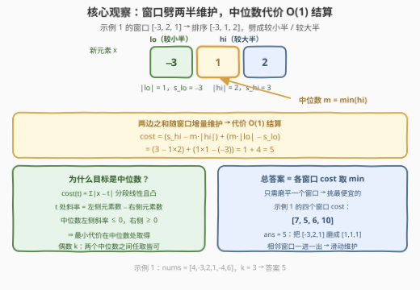
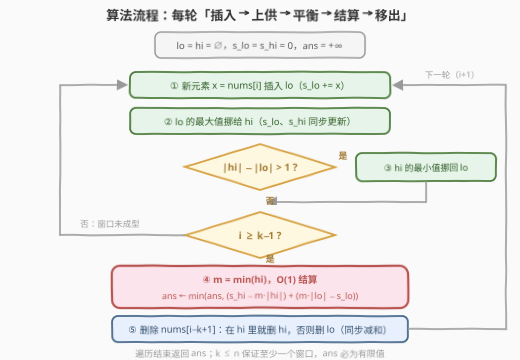

# LeetCode 将子数组元素变为相等所需的最小操作数 题解

- **关联**：462（单窗口中位数代价）、480（双集合滑动中位数骨架）、295（动态中位数入门）

## 1. 题目概述

- **标题 / 题号**：将子数组元素变为相等所需的最小操作数（#3422，medium）
- **链接**：https://leetcode.cn/problems/minimum-operations-to-make-subarray-elements-equal/
- **难度**：中等
- **标签**：数组、哈希表、数学、滑动窗口、堆（优先队列）

> ⚠️ 本题为 LeetCode 付费题（锁题），题意描述根据官方示例用例与外部资料重建，可能与官方题面有出入。（题面已与社区镜像 doocs/leetcode 的官方中文翻译交叉核对，示例输入输出与 GraphQL 接口返回一致，出入风险较低。）

**题意**：给定一个整数数组 `nums` 和一个整数 `k`。你可以进行任意次以下操作：

- 给 `nums` 的任何元素增加或减少 1。

返回确保**至少**有一个大小为 `k` 的 `nums` 中的**子数组**（连续）的所有元素都相等所需的最小操作数。

**示例 1**：

```text
输入：nums = [4,-3,2,1,-4,6], k = 3
输出：5
解释：
- 使用 4 次操作给 nums[1] 增加 4，数组变为 [4, 1, 2, 1, -4, 6]；
- 使用 1 次操作给 nums[2] 减少 1，数组变为 [4, 1, 1, 1, -4, 6]；
- 此时子数组 [1, 1, 1]（大小 k = 3）所有元素相等，答案为 5。
```

**示例 2**：

```text
输入：nums = [-2,-2,3,1,4], k = 2
输出：0
解释：子数组 [-2, -2] 已经全部相等，无需任何操作。
```

**约束**：

- $2 \le \text{nums.length} \le 10^5$
- $-10^6 \le \text{nums[i]} \le 10^6$
- $2 \le k \le \text{nums.length}$

> 💡 **读题关键**：①「**至少有一个**大小为 k 的子数组全等」——只需挑**一个**窗口把它磨平，其余元素碰都不用碰，所以答案是**所有窗口代价的最小值**，不是把每个窗口都变相等；② 单看一个窗口，「±1 操作凑齐到同一值」就是 [462. 最小操作次数使数组元素相等 II](../0401-0500/462_最小操作次数使数组元素相等II.md) 的裸题，最优目标值是**中位数**；③ 相邻窗口只差「一进一出」——滑动窗口 + 动态中位数，正是 [480. 滑动窗口中位数](../0401-0500/480_滑动窗口中位数.md) 的骨架。本题 = 462 套进 480。

## 2. 解题思路

### 2.1 暴力思路：逐窗口排序取中位数

对每个长度为 $k$ 的窗口：排序 → 取中位数 $m$ → 代价 $\sum |x - m|$ → 全部取 min。共 $n-k+1$ 个窗口，每个窗口 $O(k \log k)$，总计 $O(n \cdot k \log k)$。

代入上界 $n = 10^5$、$k = 5 \times 10^4$：约 $8.5 \times 10^{10}$ 次操作，远超时限。即便用「有序数组 + 二分插入」把每窗优化到 $O(k)$，$5 \times 10^9$ 仍然超时。

但暴力已经点破了全部正确性要素：**单窗口最优 = 中位数代价，总答案 = 逐窗口取 min**。剩下的只是把「每个窗口从零开始算」改成「相邻窗口增量维护」。

### 2.2 核心观察：中位数代价 + 双有序集合滑动维护



**观察一（单窗口最优目标是中位数）**：固定窗口，代价函数 $\text{cost}(t) = \sum_{x} |x - t|$ 是关于 $t$ 的分段线性**凸函数**：$t$ 处的斜率为「小于 $t$ 的元素个数 − 大于 $t$ 的元素个数」。中位数左侧斜率为负、右侧为正，最小值恰在中位数处取得。$k$ 为偶数时，**两个中位数之间的任何整数**（含端点）都取得相同的最小代价。

**观察二（总答案 = 窗口代价取 min）**：操作只要求「至少一个窗口」全等，各窗口互不相关——逐窗口算代价，取全局最小即可。

**观察三（一进一出 → 双有序集合）**：窗口右移一格，元素集合只发生「删一个旧、加一个新的」。用两个多重有序集合维护当前窗口：

- $lo$ 存**较小的一半**，$hi$ 存**较大的一半**，满足 $\lvert lo \rvert = \lfloor k/2 \rfloor$、$\lvert hi \rvert = \lceil k/2 \rceil$、$\max(lo) \le \min(hi)$，则**中位数就是 $hi$ 的最小值**；
- 再各维护元素和 $s_{lo}$、$s_{hi}$，窗口代价便可 $O(1)$ 结算：

$$\text{cost} = \underbrace{\big(s_{hi} - m \cdot |hi|\big)}_{hi\text{ 侧的贡献}} + \underbrace{\big(m \cdot |lo| - s_{lo}\big)}_{lo\text{ 侧的贡献}}, \qquad m = \min(hi)$$

三个数据（中位数、两半的和）全部增量维护，单步只做 $O(\log k)$ 的集合操作——这就是官方 hint 所说的「2 个 multiset 动态维护中位数、动态维护两边之和」。

### 2.3 算法流程图



| 步骤 | 操作 | 说明 |
|------|------|------|
| ① 插入 | 新元素先放进 $lo$ | 统一入口，先不判断大小 |
| ② 上供 | 把 $lo$ 的最大值挪给 $hi$ | 保证划分满足 $\max(lo) \le \min(hi)$ |
| ③ 平衡 | 若 $\lvert hi \rvert - \lvert lo \rvert > 1$，把 $hi$ 最小值挪回 $lo$ | 恢复 $\lvert hi \rvert - \lvert lo \rvert \in \{0, 1\}$ |
| ④ 结算 | 若 $i \ge k-1$：$m = \min(hi)$，用公式更新 $ans$ | 结算永远发生在平衡之后，划分始终有效 |
| ⑤ 移出 | 从 $hi$ / $lo$ 中删去滑出窗口的 `nums[i-k+1]` | 值在哪个集合就删哪个（见下） |

**删除分支的两点说明**（最容易写错的地方）：

- **重复值跨集合**：同一个值可能同时出现在 $lo$ 和 $hi$（例如窗口 $[5,5,5]$ 划分成 $lo=\{5\}$、$hi=\{5,5\}$）。删「哪个集合里的这份」都不破坏 $\max(lo) \le \min(hi)$——从任一侧拿走一个 $5$，剩余划分依然有序。因此「值在 $hi$ 里就删 $hi$ 的，否则删 $lo$ 的」这一贪心分支是安全的。
- **删除后的临时失衡**：删完可能出现 $\lvert hi \rvert - \lvert lo \rvert = -1$ 或 $2$，但**不需要立刻修复**——下一轮的「①插入 + ②上供 + ③平衡」会自动把它纠正回 $\{0, 1\}$，而 ④ 的结算总是发生在平衡之后，所以每次用到公式时划分都是合法的。

### 2.4 示例演算

用**示例 1**（`nums = [4,-3,2,1,-4,6]`，`k = 3`）走一遍。每个窗口排序后按「前 1 个进 $lo$、后 2 个进 $hi$」划分，$m = \min(hi)$：

| 窗口 | 排序后 | $lo$ / $hi$ | 中位数 $m$ | 代价 $(s_{hi} - 2m) + (m - s_{lo})$ |
|------|--------|-------------|-----------|--------------------------------------|
| `[4,-3,2]` | `[-3, 2, 4]` | `{-3}` / `{2, 4}` | 2 | $(6-4) + (2+3) = 7$ |
| `[-3,2,1]` | `[-3, 1, 2]` | `{-3}` / `{1, 2}` | 1 | $(3-2) + (1+3) = \mathbf{5}$ |
| `[2,1,-4]` | `[-4, 1, 2]` | `{-4}` / `{1, 2}` | 1 | $(3-2) + (1+4) = 6$ |
| `[1,-4,6]` | `[-4, 1, 6]` | `{-4}` / `{1, 6}` | 1 | $(7-2) + (1+4) = 10$ |

最小值为 $5$，与官方解释一致：把窗口 `[-3,2,1]` 磨成 `[1,1,1]`（`-3` 加 4、`2` 减 1）。示例 2 中窗口 `[-2,-2]` 代价为 $0$，答案直接为 $0$。

## 3. 参考代码

### C++

```cpp
class Solution {
  public:
    long long minOperations(vector<int>& nums, int k) {
        multiset<int> lo, hi;               // lo: 较小半部分；hi: 较大半部分，*hi.begin() 即中位数
        long long slo = 0, shi = 0;         // 两集合各自的元素和
        long long ans = LLONG_MAX;
        for (int i = 0; i < (int)nums.size(); ++i) {
            lo.insert(nums[i]);             // ① 新元素先进 lo
            slo += nums[i];
            auto it = prev(lo.end());       // ② 把 lo 的最大值挪给 hi
            int v = *it;
            lo.erase(it); slo -= v;
            hi.insert(v);  shi += v;
            if (hi.size() > lo.size() + 1) {  // ③ 平衡：|hi| - |lo| ∈ {0, 1}
                v = *hi.begin();
                hi.erase(hi.begin()); shi -= v;
                lo.insert(v);             slo += v;
            }
            if (i >= k - 1) {              // ④ 窗口成型，O(1) 结算
                long long m = *hi.begin();
                ans = min(ans, (shi - m * (long long)hi.size())
                              + (m * (long long)lo.size() - slo));
                int out = nums[i - k + 1];  // ⑤ 移出滑出窗口的元素
                auto hit = hi.find(out);
                if (hit != hi.end()) { hi.erase(hit); shi -= out; }
                else { lo.erase(lo.find(out)); slo -= out; }
            }
        }
        return ans;
    }
};
```

### Python

```python
from sortedcontainers import SortedList

class Solution:
    def minOperations(self, nums: List[int], k: int) -> int:
        lo, hi = SortedList(), SortedList()   # lo: 较小半部分；hi[0] 即中位数
        slo = shi = 0                         # 两集合各自的元素和
        ans = float("inf")
        for i, x in enumerate(nums):
            lo.add(x); slo += x               # ① 新元素先进 lo
            v = lo.pop()                      # ② 把 lo 的最大值挪给 hi
            slo -= v; shi += v
            hi.add(v)
            if len(hi) > len(lo) + 1:         # ③ 平衡：|hi| - |lo| ∈ {0, 1}
                v = hi.pop(0)
                shi -= v; slo += v
                lo.add(v)
            if i >= k - 1:                    # ④ 窗口成型，O(1) 结算
                m = hi[0]
                ans = min(ans, (shi - m * len(hi)) + (m * len(lo) - slo))
                out = nums[i - k + 1]         # ⑤ 移出滑出窗口的元素
                if out in hi:
                    hi.remove(out); shi -= out
                else:
                    lo.remove(out); slo -= out
        return ans
```

> 💡 **实现细节**：① 删除 `multiset` 中**单个**元素必须用 `erase(iterator)`（先 `find`）——`erase(value)` 会把等于该值的元素**全部**删掉；② $k \le n$ 保证至少存在一个窗口，`ans` 必然被更新过，无需特判无穷大；③ 中位数取的是**上中位数**（$hi$ 的最小值），$k$ 为偶数时与下中位数之间任何值等价（见面试要点 2）；④ 单窗口代价最大约 $k \times 2 \times 10^6 = 2 \times 10^{11}$，必须用 `long long` / Python 天然大数。

## 4. 复杂度分析

设 $n$ 为数组长度、$k$ 为窗口长度。

| 维度 | 复杂度 | 说明 |
|------|--------|------|
| **时间** | $O(n \log k)$ | 每个元素触发 $O(1)$ 次集合插入/删除，单次 $O(\log k)$；结算 $O(1)$ |
| **空间** | $O(k)$ | 两个集合合计最多存 $k+1$ 个元素（移出前瞬时峰值） |
| **对比暴力** | 逐窗口排序 $O(n k \log k)$ | 增量维护把「每窗重算」压成「每步一进一出」，省掉一个 $k$ 因子 |

## 5. 扩展：对顶堆 + 懒删除的等价实现

官方标签里的「堆（优先队列）/ 哈希表」指向另一套等价实现：$lo$ 用**大根堆**、$hi$ 用**小根堆**，删除走**懒删除**——哈希表 `delayed` 记录「待删除的值 → 个数」，元素弹出时若在表中则跳过并继续弹。这是 Python/Java 没有 `multiset` 时的标准姿势（也是 [480 题](../0401-0500/480_滑动窗口中位数.md) 官方题解的写法）：

- 优点：不需要第三方有序集合库；
- 代价：删除变成均摊 $O(\log k)$，代码分支更多（堆顶清理、双堆大小按**有效元素数**计算）；
- 两个集合的和 $s_{lo}$、$s_{hi}$ 维护方式不变：**真正入堆时加、真正弹出时减**（懒删除跳过的元素不碰和）。

C++ 有 `multiset`（可 $O(\log k)$ 精确删除单元素）时，双 `multiset` 写法最短、最难写错；判断「用堆还是用平衡树」就看**是否需要任意位置删除**——本题需要。

## 6. 面试要点

1. **为什么最优目标是中位数而不是平均值？**

   > $\text{cost}(t) = \sum |x - t|$ 是分段线性凸函数，$t$ 处斜率 =「左侧元素数 − 右侧元素数」；中位数左侧斜率非正、右侧非负，故最小。平均值最小化的是**平方和** $\sum (x-t)^2$（对应「乘 2 的进阶操作」类题目），两问别混。也可以用交换论证：若目标两侧元素个数不等，向多的那一侧移动 1，代价严格下降。

2. **$k$ 为偶数时中位数怎么取？实现里取了哪个？**

   > 偶数长度时两个中位数之间**任何**整数（含端点）的代价相同——把 $t$ 在 $[\text{下中位}, \text{上中位}]$ 内移动 1，一侧多付 1、另一侧少付 1，恰好抵消。实现里取 $hi$ 的最小值（上中位数），公式自动成立，无需特殊处理。

3. **删除分支为什么「值在 $hi$ 就删 $hi$，否则删 $lo$」是对的？删完集合失衡怎么办？**

   > 重复值可能同时存在于两侧，从哪侧删都保持 $\max(lo) \le \min(hi)$（删元素不会破坏有序划分）。删除后 $\lvert hi \rvert - \lvert lo \rvert$ 可能暂时变成 $-1$ 或 $2$，但下一轮「插入 → 上供 → 平衡」三步会把它纠正回 $\{0,1\}$；而代价结算只发生在平衡之后，用到的划分永远合法。

4. **代价公式是怎么拆出来的？**

   > 按 $m$ 拆绝对值：$hi$ 侧元素全 $\ge m$，贡献 $\sum_{hi}(x - m) = s_{hi} - m \lvert hi \rvert$；$lo$ 侧全 $\le m$，贡献 $\sum_{lo}(m - x) = m \lvert lo \rvert - s_{lo}$。两式相加即可 $O(1)$ 结算——这正是「维护两个集合各自之和」的意义。

5. **为什么不能每个窗口重新排序？差距有多大？**

   > 逐窗排序 $O(n k \log k)$，上界约 $8.5 \times 10^{10}$；双集合增量维护 $O(n \log k)$，约 $1.7 \times 10^6$ 次集合操作。核心差别：相邻窗口只差一进一出，中位数与两侧和都可以**增量**维护，无需每窗从零计算。

## 同类练习题

| # | 题目 | 与本题的关联 |
|---|------|-------------|
| 462 | [最小操作次数使数组元素相等 II](https://leetcode.cn/problems/minimum-moves-to-equal-array-elements-ii/)（[站内题解](../0401-0500/462_最小操作次数使数组元素相等II.md)） | 本题去掉滑动窗口的单窗口版——「±1 凑齐」的最优目标为什么是中位数 |
| 480 | [滑动窗口中位数](https://leetcode.cn/problems/sliding-window-median/)（[站内题解](../0401-0500/480_滑动窗口中位数.md)） | 本题双有序集合的骨架出处，把「输出中位数」换成「输出中位数代价」 |
| 295 | [数据流的中位数](https://leetcode.cn/problems/find-median-from-data-stream/)（[站内题解](../0201-0300/295_数据流的中位数.md)） | 只增不删的动态中位数，对顶堆/双集合入门，理解「上供与平衡」的雏形 |
| 2033 | [使网格单值的最少操作次数](https://leetcode.cn/problems/minimum-operations-to-make-a-uni-value-grid/)（[站内题解](../2001-2100/2033_使网格单值的最少操作次数.md)） | 二维展平后的中位数代价，多一步整除性过滤的变体 |
| 2602 | [使数组元素全部相等的最少操作数](https://leetcode.cn/problems/minimum-operations-to-make-all-array-elements-equal/) | 中位数代价 + 排序前缀和 + 离线查询，把「单点中位数」推广到「多查询」的组合 |
