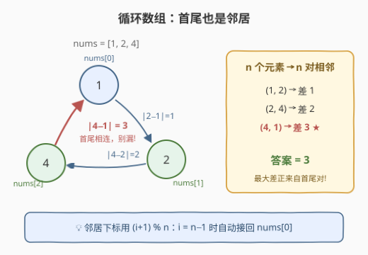
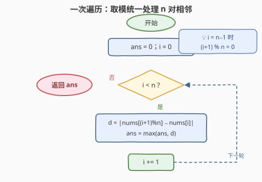

# LeetCode 循环数组中相邻元素的最大差值 题解

## 1. 题目概述

- **标题 / 题号**：循环数组中相邻元素的最大差值（#3423，easy）
- **链接**：https://leetcode.cn/problems/maximum-difference-between-adjacent-elements-in-a-circular-array/
- **难度**：简单
- **标签**：数组

**题意**：给你一个**循环**数组 `nums`，请你找出相邻元素之间的**最大**绝对差值。

注意：一个循环数组中，第一个元素和最后一个元素是相邻的。

**示例 1**：

```text
输入：nums = [1,2,4]
输出：3
解释：由于 nums 是循环的，nums[0] 和 nums[2] 是相邻的，
     它们之间的绝对差值是最大值 |4 - 1| = 3。
```

**示例 2**：

```text
输入：nums = [-5,-10,-5]
输出：5
解释：相邻元素 nums[0] 和 nums[1] 之间的绝对差值为最大值 |-5 - (-10)| = 5。
```

**约束**：

- $2 \le nums.length \le 100$
- $-100 \le nums[i] \le 100$

> 💡 **读题关键**：①「循环」意味着首元素 `nums[0]` 和尾元素 `nums[n-1]` 也相邻；② 线性数组只有 $n-1$ 对相邻元素，环上**恰有 $n$ 对**——多出来的正是首尾这一对；③ 数据范围极小（$n \le 100$），一次遍历必然通过。

## 2. 解题思路

### 2.1 朴素思路：线性扫 + 单独补首尾

最直觉的写法分两段：先按普通数组扫 $i = 0 \dots n-2$ 处理常规相邻对，再单独补一次首尾对 $|nums[n-1] - nums[0]|$：

```python
ans = 0
for i in range(n - 1):
    ans = max(ans, abs(nums[i + 1] - nums[i]))
ans = max(ans, abs(nums[n - 1] - nums[0]))   # 别忘了首尾
```

这个写法完全正确，复杂度也是 $O(n)$。但它把「首尾相邻」当成**特例**单独处理——环形结构里所有点地位相同，本不该有特例。特判一多，边界就容易写漏或写重（比如顺手把首尾对算两遍，虽然取 `max` 不影响答案，但逻辑上不干净）。

### 2.2 核心观察：环上恰有 n 对相邻，取模统一处理



把数组首尾接成环后，每个元素 $nums[i]$ 都有**恰好一个右邻居** $nums[(i+1) \bmod n]$：

- 对 $i \in [0, n-2]$，邻居就是 $nums[i+1]$，与线性数组一致；
- 对 $i = n-1$，$(i+1) \bmod n = 0$，邻居接回**首元素**——这正是「循环」的含义。

于是 $n$ 个下标 $i = 0, 1, \dots, n-1$ 恰好枚举出环上**全部 $n$ 对相邻元素**，不重不漏：

$$ans = \max_{0 \le i < n} \ \big| nums[(i+1) \bmod n] - nums[i] \big|$$

一个 `for` 循环 + 一次取模，首尾情形被自然并入一般情况，**无需任何特判**。

> ⚠️ **常见误区**：答案**不等于** $\max(nums) - \min(nums)$！最大值与最小值只有恰好相邻时，它们的差才是一对相邻元素的差。反例：`nums = [5,1,5,9]`，四对相邻差全是 $4$，答案为 $4$；而 $\max - \min = 8$，因为 $9$ 和 $1$ 并不相邻。

### 2.3 算法流程图



1. 初始化 `ans = 0`，`i = 0`；
2. 循环 $i = 0 \dots n-1$：
   - 计算邻居下标 $j = (i + 1) \bmod n$；
   - 用 $|nums[j] - nums[i]|$ 更新 `ans`；
   - `i += 1`；
3. 循环结束，返回 `ans`。

### 2.4 示例演算

以**示例 1**（`nums = [1,2,4]`，$n = 3$）走一遍：

| $i$ | $j = (i+1) \bmod n$ | 相邻对 | $\|nums[j] - nums[i]\|$ | ans |
|---|---|---|---|---|
| 0 | 1 | (1, 2) | 1 | 1 |
| 1 | 2 | (2, 4) | 2 | 2 |
| 2 | 0 | (4, 1) ← 首尾 | 3 | **3** |

答案 $3$ ✓。**示例 2**（`[-5,-10,-5]`）同法：三对差为 $5, 5, 0$，答案 $5$ ✓。

## 3. 参考代码

### C++

```cpp
class Solution {
  public:
    int maxAdjacentDistance(vector<int>& nums) {
        int n = nums.size();
        int ans = 0;
        for (int i = 0; i < n; ++i) {
            int j = (i + 1) % n;   // i = n-1 时 j = 0，接回首元素
            ans = max(ans, abs(nums[j] - nums[i]));
        }
        return ans;
    }
};
```

### Python

```python
class Solution:
    def maxAdjacentDistance(self, nums: List[int]) -> int:
        n = len(nums)
        ans = 0
        for i in range(n):
            j = (i + 1) % n        # i = n-1 时 j = 0，接回首元素
            ans = max(ans, abs(nums[j] - nums[i]))
        return ans
```

## 4. 复杂度分析

| 维度 | 复杂度 | 说明 |
|------|--------|------|
| 时间 | $O(n)$ | 每个下标访问一次，取模与比较均为 $O(1)$，共 $n$ 对相邻元素 |
| 空间 | $O(1)$ | 仅 `ans`、`i`、`j` 三个变量 |

## 5. 扩展：几种等价写法

**写法一（先首尾后线性）**：即 2.1 的朴素版，把首尾对先算上，其余线性扫：

```python
class Solution:
    def maxAdjacentDistance(self, nums: List[int]) -> int:
        ans = abs(nums[-1] - nums[0])          # 首尾这一对先算上
        for a, b in zip(nums, nums[1:]):
            ans = max(ans, abs(b - a))
        return ans
```

**写法二（Python 切片拼接一行版）**：把数组「接回自己」拼成 $2n$ 长再看相邻对，`zip` 自动截断到 $n$ 对：

```python
class Solution:
    def maxAdjacentDistance(self, nums: List[int]) -> int:
        return max(abs(b - a) for a, b in zip(nums, nums[1:] + nums[:1]))
```

> 💡 这个「拼接翻倍」技巧在环形题里非常常用（如 503. 下一个更大元素 II），本质与 $(i+1) \bmod n$ 等价，写哪个看口味。

**变体**：若改问**最小**相邻差值，把 `max` 换成 `min` 即可；若改问所有相邻差值之和，环上 $\sum |nums[(i+1)\%n] - nums[i]|$ 同样一次遍历可得。

## 6. 面试要点

- **Q1：循环数组有多少对相邻元素？线性数组呢？**
  答：循环数组恰有 $n$ 对——每个元素一个右邻居，包括尾元素的右邻居是首元素；线性数组只有 $n-1$ 对。环上多出的正是首尾这一对。
- **Q2：为什么 $(i+1) \bmod n$ 能统一处理首尾？**
  答：当 $i = n-1$ 时 $(i+1) \bmod n = 0$，邻居自动接回首元素；其余 $i$ 的取模结果就是 $i+1$ 本身，与线性情况一致。取模把特例并入一般情形，代码无需任何 `if`。
- **Q3：答案是 $\max(nums) - \min(nums)$ 吗？**
  答：不是。最大值和最小值不一定相邻。反例 `[5,1,5,9]`：四对相邻差全为 4，答案是 4，而 $\max-\min = 8$。只有二者恰好相邻时其差才是候选之一。
- **Q4：取模循环会不会重复计算或漏掉某对？**
  答：不会。$i$ 取遍 $0 \dots n-1$，每对 $(nums[i], nums[(i+1)\%n])$ 恰好被枚举一次；$n = 2$ 时两对 $(0,1)$、$(1,0)$ 差值相同，`max` 不受影响。
- **Q5：这题有什么更优解法吗？**
  答：没有也不需要。$O(n)$ 时间已是下界——任何正确算法至少要看一遍每个元素；本题考点不在复杂度优化，而在「环」的正确建模。

## 同类练习题

| # | 题目 | 与本题的关联 |
|---|------|-------------|
| 503 | [下一个更大元素 II](https://leetcode.cn/problems/next-greater-element-ii/) | 环形数组 + 单调栈，经典的「取模 / 拼接翻倍」两种环处理方式对比 |
| 213 | [打家劫舍 II](https://leetcode.cn/problems/house-robber-ii/) | 环形数组 DP，首尾相接的另一种拆法（拆成两个线性子问题） |
| 3105 | [最长的严格递增或严格递减子数组](https://leetcode.cn/problems/longest-strictly-increasing-or-strictly-decreasing-subarray/) | 同样是相邻元素两两比较的一次遍历 |
| 978 | [最长湍流子数组](https://leetcode.cn/problems/longest-turbulent-subarray/) | 围绕相邻差值符号做文章的一次遍历滑动 DP |
