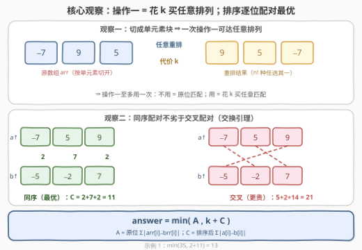
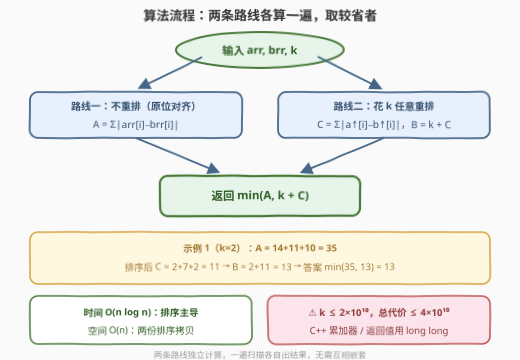

# 将数组变相同的最小代价

- **题目名称**：将数组变相同的最小代价
- **链接**：[3424. 将数组变相同的最小代价](https://leetcode.cn/problems/minimum-cost-to-make-arrays-identical/)
- **难度**：中等
- **标签**：贪心、数组、排序
- **关联**：462、870、1818、2448（绝对值代价 / 匹配贪心一族）

## 1. 题目概述

给你两个长度都为 $n$ 的整数数组 `arr` 和 `brr` 以及一个整数 $k$。你可以对 `arr` 执行以下操作**任意次**：

1. 将 `arr` 分割成若干个**连续的**子数组，并将这些子数组按任意顺序重新排列。这个操作的代价为 $k$；
2. 选择 `arr` 中的任意一个元素，将它增加或者减少一个正整数 $x$。这个操作的代价为 $x$。

请你返回将 `arr` 变为 `brr` 的**最小**总代价。（子数组是一个数组中一段连续非空的元素序列。）

**示例 1**：

```text
输入：arr = [-7,9,5], brr = [7,-2,-5], k = 2
输出：13
解释：将 arr 分割成 [-7] 和 [9,5]，重排成 [9,5,-7]，代价 2；
     再依次改动三个元素（代价 2+7+2），总代价 2+2+7+2 = 13。
```

**示例 2**：

```text
输入：arr = [2,1], brr = [2,1], k = 0
输出：0
解释：数组已经相等，无需任何操作。
```

**约束条件**：

- $1 \le n = \text{arr.length} = \text{brr.length} \le 10^5$
- $0 \le k \le 2 \times 10^{10}$
- $-10^5 \le \text{arr}[i], \text{brr}[i] \le 10^5$

> 💡 **读题关键**：① 操作一看起来只能"整块搬家"，别被"连续子数组"唬住——切成单元素块后它就是**任意重排**；② $k$ 高达 $2\times 10^{10}$，早就超出 `int` 的范围，C++ 党从函数签名开始就得 `long long`；③ 两种操作可任意次混用，但最优方案里操作一**至多出现一次**（见 2.2）。

---

## 2. 解题思路

### 2.1 暴力思路：枚举排列

不用操作一，代价唯一确定：$A=\sum_i \lvert \text{arr}[i]-\text{brr}[i]\rvert$。

用操作一，本质是替 `arr` 的元素挑一个"谁去对齐谁"的方案——即选一个排列 $\pi$，代价为 $k+\sum_i \lvert \text{arr}[i]-\text{brr}[\pi(i)]\rvert$。暴力枚举全部 $n!$ 种排列，$n \le 10^5$ 时是天文数字，不可行；但它已经点破题眼：**本题 = 在"原位"与"任意匹配"两种代价模型里各求一次最小值，再取较小者**。

### 2.2 核心观察：操作一 = 花 k 买任意匹配，最优匹配 = 排序逐位配对



**观察一（操作一的"全能性"）**：把 `arr` 切成 $n$ 个长度为 1 的子数组再任意排列，一步就能得到**任意目标排列**。因此：

- 操作一至多用一次——第二次买不到任何新排列；
- "切成几大段再搬"的中间方案毫无额外价值，它们能达到的排列一次全能达到；
- 于是总代价只有两种形态：**原位匹配** $A=\sum_i\lvert \text{arr}[i]-\text{brr}[i]\rvert$，或**任意匹配** $k+C$，其中 $C$ 是两组数两两配对时最小的 $\sum\lvert$差$\rvert$。

**观察二（交换引理）**：同序配对不劣于交叉配对——对 $a\le b,\ c\le d$ 恒有

$$|a-c|+|b-d| \;\le\; |a-d|+|b-c|$$

（严格证明见第 5 节）。于是任何存在"交叉"的匹配，交换两条配边后代价不增；反复消去交叉，最优匹配必是**同序**的——两个数组分别排序后逐位相减即可：

$$C=\sum_i \big|\,\text{sort(arr)}[i]-\text{sort(brr)}[i]\,\big|$$

**结论**：

$$\text{answer}=\min\big(A,\ k+C\big)$$

> ⚠️ **别把操作一想复杂**：本题最大的思维陷阱是去研究"切成几段、各段怎么排"——比如想着只重排一小段省代价。操作一的代价是**固定的 $k$**，与切法无关；而任何切法能达成的排列，单元素切法一步全包。所以"怎么切"是伪问题，只有"用不用"是真问题。

### 2.3 算法流程图



| 步骤 | 操作 | 说明 |
|------|------|------|
| ① 算 A | $\sum_i \lvert \text{arr}[i]-\text{brr}[i]\rvert$ | 路线一：不用操作一的原位代价 |
| ② 排序 | 拷贝 `arr`、`brr` 各自 `sort` | 路线二：拷贝排序，别污染入参 |
| ③ 算 C | 排序后逐位差的绝对值之和 | 任意排列下的最优匹配代价 |
| ④ 汇总 | 返回 $\min(A,\ k+C)$ | 两条路线取较省者 |

**边界（天然兼容，无需特判）**：

- $k=0$：$k+C\le A$ 恒成立（原位匹配只是排列之一，而 $C$ 是全体排列的最优），`min` 自动选到 $C$；
- 两数组已相等：$A=0$，答案为 $0$；
- **溢出**：$n\cdot 2\times 10^5 \le 2\times 10^{10}$，再加 $k\le 2\times 10^{10}$，总代价上界约 $4\times 10^{10}$——**远超 `int32`**，累加器与返回值必须 64 位。

### 2.4 示例演算

用**示例 1** 走一遍：`arr = [-7,9,5]`，`brr = [7,-2,-5]`，$k=2$。

| 路线 | 计算 | 代价 |
|------|------|------|
| 原位 A | $\lvert-7-7\rvert+\lvert 9+2\rvert+\lvert 5+5\rvert = 14+11+10$ | $35$ |
| 重排 k+C | 排序得 $[-7,5,9]$ 与 $[-5,-2,7]$，$C=\lvert-7+5\rvert+\lvert 5+2\rvert+\lvert 9-7\rvert=2+7+2$ | $2+11=13$ |

$\min(35,\,13)=13$ ✓——正是官方解释的方案：先花 $2$ 重排成 $[9,5,-7]$，再花 $2+7+2$ 逐个改值。

---

## 3. 参考代码

### C++

```cpp
class Solution {
  public:
    long long minCost(vector<int>& arr, vector<int>& brr, long long k) {
        long long keep = 0;                      // 路线一：原位匹配
        for (int i = 0; i < (int)arr.size(); ++i)
            keep += abs(arr[i] - brr[i]);

        vector<int> a(arr), b(brr);              // 路线二：拷贝排序，不动入参
        sort(a.begin(), a.end());
        sort(b.begin(), b.end());

        long long perm = k;
        for (int i = 0; i < (int)a.size(); ++i)
            perm += abs(a[i] - b[i]);

        return min(keep, perm);
    }
};
```

### Python

```python
class Solution:
    def minCost(self, arr: List[int], brr: List[int], k: int) -> int:
        keep = sum(abs(x - y) for x, y in zip(arr, brr))
        perm = k + sum(abs(x - y) for x, y in zip(sorted(arr), sorted(brr)))
        return min(keep, perm)
```

> 💡 **实现细节**：① `abs(arr[i] - brr[i])` 本身不溢出 `int`（差 $\le 2\times10^5$），危险的是**累加**——累加器必须 `long long`；② 官方给定的 $k$ 形参类型就是 `long long`，别顺手改窄；③ Python 无溢出问题，两行收工。

---

## 4. 复杂度分析

设 $n$ 为数组长度。

| 维度 | 复杂度 | 说明 |
|------|--------|------|
| **时间** | $O(n \log n)$ | 两次排序主导；两趟求和都是 $O(n)$ |
| **空间** | $O(n)$ | 排序用的两份拷贝 |
| **对比暴力** | 枚举排列 $O(n!\cdot n)$ | 交换引理把"挑最优排列"直接坍缩成"排序"，免费拿到最优匹配 |

---

## 5. 扩展：交换引理的严格证明

2.2 的引理（$a\le b,\ c\le d \Rightarrow |a-c|+|b-d|\le|a-d|+|b-c|$）可用**单变量函数单调性**一行击穿：固定 $c\le d$，令

$$f(t)=|t-c|-|t-d|=\begin{cases}c-d & t\le c\\ 2t-c-d & c\le t\le d\\ d-c & t\ge d\end{cases}$$

三段斜率依次为 $0,2,0$，故 $f$ 单调不减；$a\le b \Rightarrow f(a)\le f(b)$，移项即得引理。于是任何匹配中若存在"小配大、大配小"的交叉，交换配边代价不增；有限步后所有交叉消失，剩下的就是同序匹配——**一维最优匹配 = 排序逐位配对**。

> ⚠️ 这份"免费午餐"只在一维成立：若把数组换成平面上的点、代价换成欧氏距离，最小权完美匹配就得请出 **KM 算法 / 最小费用最大流**（$O(n^3)$ 起步）。一维情形是排序不等式给的特权，面试里值得主动点破这层边界。

另一个方向的变体：若操作一改成"只能整体**循环移位**"（不是任意重排），最优解就得枚举 $n$ 个移位量——退化为滑动窗口型问题，排序引理不再适用。

---

## 6. 面试要点

1. **为什么操作一等价于"花 k 任意重排"？**

   > 分割成 $n$ 个长度 1 的子数组再任意排列，一步可达任意目标排列。"连续子数组"的限制形同虚设——块可以切到最细。

2. **操作一为什么至多用一次？和操作二交替使用有没有额外收益？**

   > 一次操作一后任何排列都可达，再来一次买不到新东西；操作二只改数值、不改变"谁能配谁"，与重排正交。总代价 $=t\cdot k+\sum_j x_j$，$t\ge 1$ 时显然 $t=1$ 最优（$k\ge 0$），$t=0$ 就是原位匹配——故 $\min(A,\ k+C)$ 覆盖全部情况。

3. **排序后逐位配对为什么最优？**

   > 交换引理：$a\le b,\ c\le d$ 时 $|a-c|+|b-d|\le|a-d|+|b-c|$，交叉配对换成同序不增代价；反复消交叉收敛到同序匹配，即排序后逐位相减。

4. **这题最阴险的坑是什么？**

   > 溢出。$k\le 2\times10^{10}$ 单独就超 `int32`；总代价上界约 $n\cdot\max\lvert$差$\rvert + k \approx 4\times10^{10}$。C++ 里 $k$ 形参、累加器、返回值都得 `long long`。

5. **k = 0 时还需要比较两条路线吗？**

   > 逻辑上 `min` 天然正确，不必特判；但可以指出 $k=0$ 时 $k+C\le A$ 恒成立——原位匹配只是某个特定排列，而 $C$ 是全体排列的最优，此时直接返回 $C$ 也对。

---

## 7. 同类练习题

- [462. 最少移动次数使数组元素相等 II](https://leetcode.cn/problems/minimum-moves-to-equal-array-elements-ii/)：绝对值代价贪心的鼻祖——排序取中位数
- [1818. 绝对差值和](https://leetcode.cn/problems/minimum-absolute-sum-difference/)：同款 $\sum\lvert a_i-b_i\rvert$ 代价，但只许改一个元素，排序 + 二分找最优替换
- [2448. 使数组相等的最小开销](https://leetcode.cn/problems/minimum-cost-to-make-array-equal/)：带权绝对值代价，枚举中位数目标 + 前缀和加速
- [2602. 使数组元素全部等于 k 的最少操作数](https://leetcode.cn/problems/minimum-operations-to-make-all-array-elements-equal/)：绝对值代价成批询问，排序 + 前缀和把每次询问压到 $O(\log n)$
- [870. 优势洗牌](https://leetcode.cn/problems/advantage-shuffle/)：两数组贪心匹配的"田忌赛马"版，交换论证的近亲
