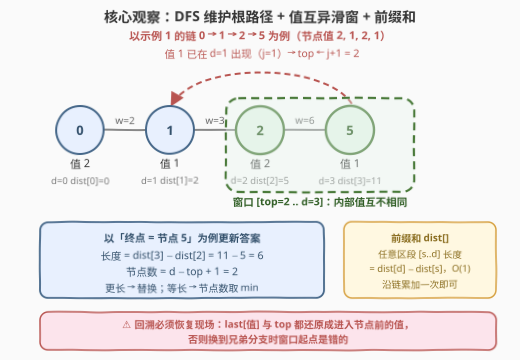
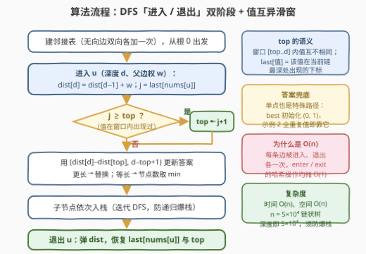

# LeetCode 最长特殊路径 题解

## 1. 题目概述

- **标题 / 题号**：最长特殊路径（#3425，hard）
- **链接**：https://leetcode.cn/problems/longest-special-path/
- **难度**：困难
- **标签**：树、深度优先搜索、数组、哈希表、前缀和

**题意**：给你一棵**根节点为节点 0** 的无向树，树中有 $n$ 个节点，编号 $0$ 到 $n-1$，通过长度为 $n-1$ 的二维数组 `edges` 表示，其中 `edges[i] = [ui, vi, lengthi]` 表示节点 $u_i$ 和 $v_i$ 之间有一条**长度**为 $length_i$ 的边。同时给你整数数组 `nums`，其中 `nums[i]` 表示节点 $i$ 的值。

**特殊路径**指的是树中一条**从祖先节点往下到后代节点**、且**经过节点的值互不相同**的路径。注意，一条路径可以开始和结束于**同一节点**。

返回长度为 2 的数组 `result`：

- `result[0]`：最长特殊路径的**长度**（路径上边权之和）；
- `result[1]`：所有**最长**特殊路径中的**最少**节点数目。

**示例 1**：

```text
输入：edges = [[0,1,2],[1,2,3],[1,3,5],[1,4,4],[2,5,6]], nums = [2,1,2,1,3,1]
输出：[6,2]
解释：最长特殊路径为 2 -> 5 和 0 -> 1 -> 4，长度都为 6；其中节点数最少的路径含 2 个节点。
```

**示例 2**：

```text
输入：edges = [[1,0,8]], nums = [2,2]
输出：[0,1]
解释：两节点值相同，最长特殊路径为单点路径，长度 0、节点数 1。
```

**约束**：

- $2 \le n \le 5 \times 10^4$
- $edges.length = n - 1$
- $0 \le u_i, v_i < n$
- $1 \le length_i \le 10^3$
- $0 \le nums[i] \le 5 \times 10^4$

> 💡 **读题关键**：① 路径方向固定为「祖先 → 后代」，即树上的一条**竖直向下的链**，不是任意两点间路径——这是能DFS 根路径一把梭的前提；② 「值互不相同」约束的是**节点值**，与边权无关；③ 答案是**双关键字**：长度优先、等长时节点数取最小，比较逻辑别写反；④ 单点路径合法，所以答案至少是 `(0, 1)`，示例 2 靠它兜底。

## 2. 解题思路

### 2.1 暴力思路：枚举所有祖先—后代对

树上的竖直路径共有 $O(n^2)$ 条（每个「祖先—后代」对一条）。对每条路径检查节点值是否互异需要 $O(n)$，总复杂度 $O(n^3)$；即便用排序/哈希把单条路径的检查优化到 $O(n)$ 均摊外的技巧，$O(n^2)$ 条路径本身在 $n = 5 \times 10^4$ 时就是 $2.5 \times 10^9$ 量级，必然超时。

但暴力揭示了问题的结构：**所有候选路径都挂在「根到某个节点的链」上**——这提示我们沿着 DFS 的根路径做增量维护，而不是孤立地枚举每条路径。

### 2.2 核心观察：DFS 根路径 + 前缀和 + 值互异滑窗



**观察一（路径都长在根链上）**：从根 0 出发 DFS，任意时刻栈中维护的正是「根 → 当前节点」这条链。以当前节点 $u$ 为**终点**的特殊路径，一定是这条链上的一段**连续区段** $[s, d]$（$d$ 为 $u$ 的深度）。于是问题变成：**对每个终点 $u$，求合法区段中 $s$ 最小的那个**。

**观察二（前缀和 O(1) 算区段长度）**：沿链维护边权前缀和 $dist[d]$（根到深度 $d$ 节点的距离），则区段 $[s, d]$ 的长度 $= dist[d] - dist[s]$，节点数 $= d - s + 1$，均 O(1)。

**观察三（值互异约束 = 滑窗，top 单调）**：维护窗口起点 `top`，保持**窗口 $[top, d]$ 内节点值互不相同**（不变量）。进入深度为 $d$ 的节点 $u$ 时，设 $j$ 为值 $nums[u]$ 在**当前链上最近一次出现的下标**（用哈希表 `last` 记录，无则为 $-1$）：

- 若 $j \ge top$：重复值在窗口**内**，必须砍掉——$top \leftarrow j + 1$；
- 若 $j < top$：重复值已被窗口甩在身后，窗口不动。

两种情况统一为 $top \leftarrow \max(top,\ j+1)$。**在同一根链上 `top` 单调不减**（这正是「无重复字符的最长子串」的双指针在树上的翻版）；但**回溯换分支时必须恢复现场**——`top` 与 `last[nums[u]]` 都要还原成进入 $u$ 之前的值，否则兄弟分支的窗口起点是错的。

在每个节点处用 $(dist[d] - dist[top],\ d - top + 1)$ 更新双关键字答案即可。单点路径（$top = d$，长度 0、节点数 1）天然被覆盖，无需特判。

### 2.3 算法流程图



| 步骤 | 操作 | 说明 |
|------|------|------|
| ① 建图 | 无向边双向加入邻接表 | DFS 用，记录父亲防回头 |
| ② 进入 $u$ | $dist[d] = dist[d-1] + w$；$j = last[nums[u]]$ | $w$ 为父边权，根节点 $dist[0]=0$ |
| ③ 推窗口 | $top \leftarrow \max(top,\ j+1)$ | 保持窗口内值互异的不变量 |
| ④ 更新答案 | $(dist[d]-dist[top],\ d-top+1)$ | 更长直接替换；等长节点数取 min |
| ⑤ 递归子节点 | 依次入栈 / 递归 | $n$ 达 $5\times10^4$，链状树深度同量级，Python 建议迭代 |
| ⑥ 退出 $u$ | 弹出 $dist$；恢复 $last[nums[u]]$ 与 $top$ | **回溯恢复现场**，换分支前必须做 |

**边界（天然兼容，无需特判）**：

- 全部节点值两两不同：窗口永远不收缩，答案即树的高度链——最长的那条「根到叶」路径；
- 相邻父子同值（如示例 2）：$j = d-1 \Rightarrow top = d$，退化为单点路径，长度 0、节点数 1；
- `top` 恒满足 $top \le d$（因 $j \le d-1$），区段永远非空，下标不会越界。

### 2.4 示例演算

用**示例 1** 走一遍（DFS 序：0 → 1 → 2 → 5，回溯，3，回溯，4）。表中 $j$ 为进入该节点时其值在链上最近出现的下标：

| 步骤 | 进入节点（值） | 深度 $d$ | $j$ | 新 $top$ | 候选 $(dist[d]-dist[top],\ 节点数)$ | 答案 |
|------|---------------|----------|-----|----------|-----------------------------------|------|
| ① | 0（值 2） | 0 | $-1$ | 0 | $(0,\ 1)$ | $(0, 1)$ |
| ② | 1（值 1） | 1 | $-1$ | 0 | $(2,\ 2)$ | $(2, 2)$ |
| ③ | 2（值 2） | 2 | 0 | 1 | $(5-2,\ 2) = (3,\ 2)$ | $(3, 2)$ |
| ④ | 5（值 1） | 3 | 1 | 2 | $(11-5,\ 2) = (6,\ 2)$ | $(6, 2)$ |
| ⑤ | 3（值 1）† | 2 | 1 | 2 | $(7-2,\ 2) = (5,\ 2)$ | $(6, 2)$ |
| ⑥ | 4（值 3）‡ | 2 | $-1$ | 0 | $(6,\ 3)$ | $(6, 2)$，等长节点数取 min |

> † 回溯出 5、2 后 $last[1]=1$、$last[2]=0$、$top=0$ 均已恢复，故进入 3 时 $j=1$。
> ‡ 节点 4 的值 3 从未出现，窗口不收缩，但 $top$ 已被兄弟分支恢复为 0，于是拿到整条链 $0 \to 1 \to 4$，长度 $6$、节点数 $3$——与 $2 \to 5$ 等长但节点更多，`result[1]` 保持 2。

最终返回 `[6, 2]`，与官方一致。

## 3. 参考代码

### C++

```cpp
class Solution {
  public:
    vector<int> longestSpecialPath(vector<vector<int>>& edges, vector<int>& nums) {
        int n = nums.size();
        vector<vector<pair<int, int>>> adj(n);
        for (auto& e : edges) {
            adj[e[0]].push_back({e[1], e[2]});
            adj[e[1]].push_back({e[0], e[2]});
        }
        int maxV = *max_element(nums.begin(), nums.end());
        vector<int> lastPos(maxV + 1, -1);   // 值 -> 当前链上最近出现下标
        vector<long long> dist;              // 边权前缀和
        long long bestLen = 0;
        int bestNodes = 1, top = 0;
        // 帧结构：{节点, 父亲, 邻接表迭代下标, 进入前 top, 进入前 last}
        vector<array<int, 5>> st;

        auto enter = [&](int u, int parent, int w) {
            int d = dist.size();
            dist.push_back(d == 0 ? 0LL : dist[d - 1] + w);
            int v = nums[u];
            int j = lastPos[v];
            int nt = max(top, j + 1);        // 窗口右移，保持值互异
            long long len = dist[d] - dist[nt];
            int cnt = d - nt + 1;
            if (len > bestLen || (len == bestLen && cnt < bestNodes)) {
                bestLen = len;
                bestNodes = cnt;
            }
            st.push_back({u, parent, 0, top, j});
            top = nt;
            lastPos[v] = d;
        };
        auto exitFrame = [&]() {             // 回溯：恢复现场
            auto f = st.back();
            st.pop_back();
            dist.pop_back();
            lastPos[nums[f[0]]] = f[4];
            top = f[3];
        };

        enter(0, -1, 0);
        while (!st.empty()) {
            auto& f = st.back();
            int nv = -1, nw = 0;
            while (f[2] < (int)adj[f[0]].size()) {
                auto [v, w] = adj[f[0]][f[2]++];
                if (v == f[1]) continue;     // 跳过父亲
                nv = v;
                nw = w;
                break;
            }
            if (nv >= 0) enter(nv, f[0], nw);
            else exitFrame();
        }
        return {(int)bestLen, bestNodes};
    }
};
```

### Python

```python
class Solution:
    def longestSpecialPath(self, edges: List[List[int]], nums: List[int]) -> List[int]:
        n = len(nums)
        adj = [[] for _ in range(n)]
        for u, v, w in edges:
            adj[u].append((v, w))
            adj[v].append((u, w))

        last_pos = {}                        # 值 -> 当前链上最近出现下标
        dist = []                            # 边权前缀和
        top = 0
        best_len, best_nodes = 0, 1
        stack = []                           # [节点, 父亲, 迭代下标, 进入前 top, 进入前 last]

        def enter(u: int, parent: int, w: int) -> None:
            nonlocal top, best_len, best_nodes
            d = len(dist)
            dist.append(dist[-1] + w if d else 0)
            v = nums[u]
            j = last_pos.get(v, -1)
            nt = top if j < top else j + 1   # max(top, j+1)
            length = dist[d] - dist[nt]
            cnt = d - nt + 1
            if length > best_len or (length == best_len and cnt < best_nodes):
                best_len, best_nodes = length, cnt
            stack.append([u, parent, 0, top, j])
            top = nt
            last_pos[v] = d

        def exit_frame() -> None:            # 回溯：恢复现场
            nonlocal top
            u, parent, _, saved_top, saved_last = stack.pop()
            dist.pop()
            if saved_last == -1:
                last_pos.pop(nums[u], None)
            else:
                last_pos[nums[u]] = saved_last
            top = saved_top

        enter(0, -1, 0)
        while stack:
            f = stack[-1]
            adj_u = adj[f[0]]
            nxt, nw = -1, 0
            while f[2] < len(adj_u):
                v, w = adj_u[f[2]]
                f[2] += 1
                if v != f[1]:
                    nxt, nw = v, w
                    break
            if nxt >= 0:
                enter(nxt, f[0], nw)
            else:
                exit_frame()
        return [best_len, best_nodes]
```

> 💡 **实现细节**：① $n \le 5\times10^4$ 且树可能退化成链，递归深度同量级——C++ 勉强能扛但帧偏大，Python 默认递归上限 1000 直接爆栈，故两份代码都用**显式栈迭代 DFS**，把「进入」与「退出」做成一对互逆操作；② `last` 在 C++ 里用值域数组（$nums[i] \le 5\times10^4$）比 `unordered_map` 快一截，Python 用字典即可；③ 答案比较是**双关键字**：先比长度、等长取节点数小，写成一行 `len > best || (len == best && cnt < bestNodes)`；④ 恢复 `last` 时注意「进入前不存在」要**删除键**而非置 $-1$ 占位（Python 版），否则同值多次进出会污染 `get` 的判断。

## 4. 复杂度分析

设 $n$ 为节点数、$V = \max nums[i] \le 5 \times 10^4$。

| 维度 | 复杂度 | 说明 |
|------|--------|------|
| **时间** | $O(n)$ | 每条树边被进入、退出各一次；每次进入/退出仅 O(1) 的前缀和与哈希操作 |
| **空间** | $O(n + V)$ | 邻接表 $O(n)$、前缀和与显式栈 $O(n)$、C++ 版值域数组 $O(V)$（Python 字典按不同值个数计） |
| **对比暴力** | 枚举祖先—后代对 $O(n^2)$ 起 | 滑窗把「每个终点的最优起点」摊还成总量线性 |

> 💡 答案长度上界：链长 $\le (n-1) \times 10^3 = 5 \times 10^7$，C++ 用 `long long` 存前缀和是求稳（`int` 其实也放得下）；比较与返回时转回 `int` 即可。

## 5. 面试要点

1. **为什么路径一定是「根到当前节点链上的连续区段」？**

   > 特殊路径要求从祖先**往下**到后代，树上两点间路径唯一；终点为 $u$ 的所有向下路径都包含于根到 $u$ 的链中，且路径本身是链上含 $u$ 的连续一段。所以 DFS 维护当前根链，对每个终点截最优后缀即可，不需要考虑拐弯（对比 124 题那种可以拐弯的路径）。

2. **`top` 为什么用 $\max(top,\ j+1)$ 而不是直接 $j+1$？**

   > 若值上次出现在窗口**之外**（$j < top$），它早已被排除，若直接令 $top = j+1$ 反而会把窗口**倒退**、放进其它重复值，破坏不变量。窗口在同一条链上只能单调右移，取 max 才能保证 $[top, d]$ 内值互异始终成立。

3. **回溯时哪些状态必须恢复？漏掉会怎样？**

   > 三个：`last[nums[u]]`（换兄弟分支后旧出现位置重新生效）、`top`（兄弟分支的窗口起点独立计算）、`dist` 弹出（长度归位）。漏恢复 `top` 是最隐蔽的 bug——当前分支算对了，回溯后兄弟分支的窗口起点被污染，会得出偏小或偏大的答案。

4. **为什么答案初始化为 $(0, 1)$ 而不用哨兵值？**

   > 单点路径合法（题目明说可开始结束于同一节点），任何节点处 $top = d$ 的区段就是它；DFS 进入根节点时会自然产生 $(0, 1)$ 候选。用 $-1$ 之类哨兵反而要特判空答案，且示例 2 这种全同值的树直接依赖该兜底。

5. **这题和「无重复字符的最长子串」是什么关系？为什么不能直接套？**

   > 同为「值互异滑窗 + 双指针单调」，但那是数组（线性、双指针只前进），这是**树**——DFS 有回溯，`top` 会随分支切换回退，所以「双指针」必须改成「进入/退出成对操作 + 现场恢复」，且每个节点只对**以自己为终点**的区段更新答案，全局窗口没有意义。

## 同类练习题

| # | 题目 | 与本题的关联 |
|---|------|-------------|
| 3 | [无重复字符的最长子串](https://leetcode.cn/problems/longest-substring-without-repeating-characters/)（[站内题解](../0001-0100/3_无重复字符的最长子串.md)） | 本题的一维原型——同款「值互异滑窗」，对照理解树上版为何要多出「回溯恢复现场」 |
| 437 | [路径总和 III](https://leetcode.cn/problems/path-sum-iii/)（[站内题解](../0401-0500/437_路径总和III.md)） | 同为「DFS 根路径 + 哈希表增量维护」，进子树前打标记、回溯时撤销的套路完全一致 |
| 687 | [最长同值路径](https://leetcode.cn/problems/longest-univalue-path/)（[站内题解](../0601-0700/687_最长同值路径.md)） | 树上 DFS 维护「以每个节点为端点的最长路径」并全局更新答案的基础练习 |
| 1372 | [二叉树中的最长交错路径](https://leetcode.cn/problems/longest-zigzag-path-in-a-binary-tree/)（[站内题解](../1301-1400/1372_二叉树中的最长交错路径.md)） | DFS 沿根路径携带状态（方向与长度）自顶向下传递，训练「路径状态随进出更新」的手感 |
