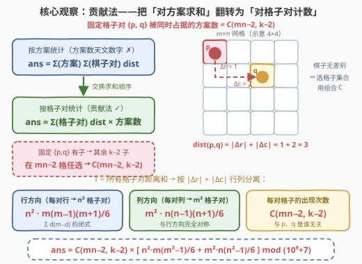
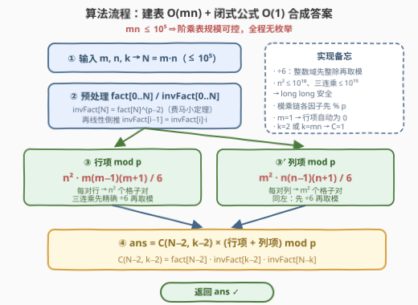

# LeetCode 所有安放棋子方案的曼哈顿距离 题解

## 1. 题目概述

- **标题 / 题号**：所有安放棋子方案的曼哈顿距离（#3426，hard）
- **链接**：https://leetcode.cn/problems/manhattan-distances-of-all-arrangements-of-pieces/
- **难度**：困难
- **标签**：数学、组合数学、贡献法

**题意**：给你三个整数 `m`、`n` 和 `k`。在一个大小为 `m × n` 的矩形格子中放置 `k` 个**没有差别**的棋子，**合法方案**要求：

- 所有 `k` 个棋子都放进格子；
- **一个格子至多放一个棋子**。

请你返回**所有合法方案**中、**每对棋子之间的曼哈顿距离之和**。由于答案可能很大，请对 $10^9 + 7$ 取余后返回。两格 $(x_i, y_i)$ 与 $(x_j, y_j)$ 的曼哈顿距离定义为 $|x_i - x_j| + |y_i - y_j|$。

**示例 1**：

```text
输入：m = 2, n = 2, k = 2
输出：8
解释：6 种方案中，前 4 种两棋子相邻（距离 1），后 2 种落在对角（距离 2），
总和 = 1×4 + 2×2 = 8。
```

**示例 2**：

```text
输入：m = 1, n = 4, k = 3
输出：20
解释：4 种方案的两两距离和分别为 4、6、6、4，总和 = 20。
```

**约束**：

- $1 \le m, n \le 10^5$
- $2 \le m \cdot n \le 10^5$
- $2 \le k \le m \cdot n$

> 💡 **读题关键**：① 方案数高达 $\binom{mn}{k}$（$mn = 10^5$、$k$ 居中时约 $10^{30098}$ 量级），**枚举方案完全不可行**；②「所有方案的每对棋子距离和」是**双层求和**——外层扫方案、内层扫棋子对，这种结构天然适合**贡献法交换求和顺序**；③ 曼哈顿距离 $|\Delta x| + |\Delta y|$ **按维度可加**，行、列两个方向可彻底分离；④ 答案取模质数 $10^9+7$，组合数需**费马小定理**求逆元。

## 2. 解题思路

### 2.1 暴力思路：枚举方案不可行

朴素做法是枚举全部 $\binom{mn}{k}$ 个方案，每个方案再枚举 $\binom{k}{2}$ 对棋子累加距离。即使 $k = 2$ 也有约 $5 \times 10^9$ 个方案；$k$ 居中时方案数约 $10^{30098}$，天文数字。结论：**必须放弃「逐方案」视角，改为对「格子对」做贡献计数**。小规模暴力程序仍有价值——充当对拍器验证闭式公式（本文公式已与暴力在 $m, n \le 4$ 的全部参数下对拍通过）。

### 2.2 核心观察：贡献法——「对方案求和」翻转为「对格子对计数」

**第一步：交换求和顺序。** 所求总距离是双层和，交换两层求和的次序：

$$\text{ans} \;=\; \sum_{\text{方案 } S}\; \sum_{\{a,b\} \subseteq S} \text{dist}(a, b) \;=\; \sum_{\text{格子对 } \{p,q\}} \text{dist}(p, q) \cdot \#\{\text{包含 } p, q \text{ 的方案}\}$$

**第二步：数出「固定格子对」的方案数。** 固定格子 $p$、$q$ 被占据后，剩余 $k - 2$ 个棋子从其余 $mn - 2$ 个格子中**任选**——棋子没有差别，选的是「格子集合」而非排列，方案数恰为 $\binom{mn-2}{k-2}$，**与 $p$、$q$ 是谁无关**。于是：

$$\text{ans} \;=\; \binom{mn-2}{k-2} \cdot T, \qquad T \;=\; \sum_{\text{格子对}} \text{dist}(p, q)$$

**第三步：行列分离求 $T$。** 由 $|\Delta x| + |\Delta y|$ 的可加性，$T$ 拆成行、列两个独立部分。行方向上，一对相距 $d$ 的行（共 $m - d$ 对）对应 $n \times n$ 个格子对（两行中各任取一列），每对贡献 $d$；列方向完全对称：

$$T_{\text{行}} = n^2 \sum_{d=1}^{m-1} d\,(m-d) = n^2 \cdot \frac{m(m-1)(m+1)}{6}, \qquad T_{\text{列}} = m^2 \cdot \frac{n(n-1)(n+1)}{6}$$

其中 $\sum_{d=1}^{M-1} d(M-d) = M \cdot \frac{(M-1)M}{2} - \frac{(M-1)M(2M-1)}{6} = \frac{M(M-1)(M+1)}{6}$。三步合并得最终闭式：

$$\boxed{\;\text{ans} \;=\; \binom{mn-2}{k-2} \cdot \left[\; n^2 \cdot \frac{m(m^2-1)}{6} \;+\; m^2 \cdot \frac{n(n^2-1)}{6} \;\right] \;\;\bmod\; (10^9+7)\;}$$



> ⚠️ **边界无需特判**：$m = 1$（或 $n = 1$）时行（列）项自动为 $0$；$k = 2$ 时 $\binom{mn-2}{0} = 1$，答案即所有格子对距离和 $T$ 本身；$k = mn$ 时 $\binom{mn-2}{mn-2} = 1$，对应「全部占满」的唯一方案。**同行格子对的行贡献为 $0$ 但不会丢项**——它们的距离由列部分完整计入。

### 2.3 算法流程：建表 $O(mn)$ + 闭式合成 $O(1)$

约束 $mn \le 10^5$ 保证了阶乘表规模可控，公式中唯一的「硬骨头」是模意义下的 $\binom{mn-2}{k-2}$：

1. **建阶乘表**：$\text{fact}[i] = \text{fact}[i-1] \cdot i \bmod p$，$O(mn)$；
2. **建逆元阶乘表**：费马小定理 $\text{invFact}[mn] = \text{fact}[mn]^{\,p-2} \bmod p$（一次快速幂），再由 $\text{invFact}[i-1] = \text{invFact}[i] \cdot i$ 线性倒推整表，$O(mn + \log p)$；
3. **闭式合成**：行项、列项按公式计算——**除以 $6$ 必须在整数域精确做**（$m(m-1)(m+1)$ 是三个连续整数之积，必被 $6$ 整除；$m \le 10^5$ 时三连乘 $\le \sim 10^{15}$，`long long` 安全），整除后再取模；最后乘上 $\binom{mn-2}{k-2} = \text{fact}[mn\!-\!2] \cdot \text{invFact}[k\!-\!2] \cdot \text{invFact}[mn\!-\!k]$。



> 💡 **为什么不能先取模再除以 6**：取模会破坏整除性，$x \bmod p$ 未必仍是 $6$ 的倍数。两条正路：① 整数域先精确整除再取模（C++/Python 均可，注意中间量不超过 `long long`）；② 用费马小定理求 $6^{-1} \equiv 6^{\,p-2} \pmod p$ 化除为乘。本文代码采用 ①。

### 2.4 示例演算

**示例 1**（$m = n = 2,\ k = 2$）：$\binom{2}{0} = 1$；行项 $= 4 \cdot \frac{2 \cdot 1 \cdot 3}{6} = 4$，列项对称 $= 4$；ans $= 1 \times (4 + 4) = 8$ ✓。逐方案核对：$2 \times 2$ 格中选 $2$ 格共 $6$ 种——$4$ 种相邻（距离 $1$）+ $2$ 种对角（距离 $2$），$4 \times 1 + 2 \times 2 = 8$ ✓。

**示例 2**（$m = 1,\ n = 4,\ k = 3$）：$\binom{2}{1} = 2$；行项 $= 0$，列项 $= 1 \cdot \frac{4 \cdot 3 \cdot 5}{6} = 10$；ans $= 2 \times 10 = 20$ ✓。逐方案核对（列号 $1 \sim 4$ 中选 $3$ 个）：

| 方案（列号） | 两两距离 | 距离和 |
|---|---|---|
| $\{1,2,3\}$ | $1+1+2$ | $4$ |
| $\{1,2,4\}$ | $1+2+3$ | $6$ |
| $\{1,3,4\}$ | $2+3+1$ | $6$ |
| $\{2,3,4\}$ | $1+1+2$ | $4$ |

$4 + 6 + 6 + 4 = 20$ ✓。

## 3. 参考代码

### C++

```cpp
class Solution {
  public:
    int distanceSum(int m, int n, int k) {
        constexpr long long MOD = 1'000'000'007LL;
        long long N = 1LL * m * n;

        // ① 阶乘表 fact[0..N]
        vector<long long> fact(N + 1), invFact(N + 1);
        fact[0] = 1;
        for (long long i = 1; i <= N; ++i) fact[i] = fact[i - 1] * i % MOD;

        // ② 逆元阶乘表：费马小定理求 fact[N] 的逆元后线性倒推
        long long base = fact[N], e = MOD - 2, inv = 1;
        while (e) {
            if (e & 1) inv = inv * base % MOD;
            base = base * base % MOD;
            e >>= 1;
        }
        invFact[N] = inv;
        for (long long i = N; i >= 1; --i) invFact[i - 1] = invFact[i] * i % MOD;

        // ③ 行、列方向的所有格子对距离和（三个连续整数之积必被 6 整除，先精确整除再取模）
        long long rowTerm = 1LL * n * n % MOD * ((1LL * (m - 1) * m * (m + 1) / 6) % MOD) % MOD;
        long long colTerm = 1LL * m * m % MOD * ((1LL * (n - 1) * n * (n + 1) / 6) % MOD) % MOD;

        // ④ ans = C(N-2, k-2) * (行项 + 列项) mod p
        long long c = fact[N - 2] * invFact[k - 2] % MOD * invFact[N - k] % MOD;
        return c * ((rowTerm + colTerm) % MOD) % MOD;
    }
};
```

### Python

```python
class Solution:
    def distanceSum(self, m: int, n: int, k: int) -> int:
        MOD = 10**9 + 7
        N = m * n

        fact = [1] * (N + 1)                      # ① 阶乘表
        for i in range(1, N + 1):
            fact[i] = fact[i - 1] * i % MOD

        inv_fact = [1] * (N + 1)                  # ② 逆元阶乘表（费马小定理 + 倒推）
        inv_fact[N] = pow(fact[N], MOD - 2, MOD)
        for i in range(N, 0, -1):
            inv_fact[i - 1] = inv_fact[i] * i % MOD

        # ③ 行、列方向距离和（大整数精确整除，天然无溢出）
        row = n * n * ((m - 1) * m * (m + 1) // 6)
        col = m * m * ((n - 1) * n * (n + 1) // 6)

        # ④ ans = C(N-2, k-2) * (行 + 列)
        c = fact[N - 2] * inv_fact[k - 2] % MOD * inv_fact[N - k] % MOD
        return c * ((row + col) % MOD) % MOD
```

> 💡 **实现细节**：① 阶乘表建到 $N = mn$ 而非 $\max(m, n)$——组合数的上标是 $mn - 2$；② C++ 中 $1LL \cdot (m-1) \cdot m \cdot (m+1)$ 约 $10^{15}$、$n^2$ 约 $10^{10}$，单独看都安全，但**模乘链上相乘的两个因子必须各自先 `% MOD`**（各 $< 10^9 + 7$，乘积 $< 10^{18}$，恰在 `long long` 上限 $9.2 \times 10^{18}$ 之内）；③ Python 大整数无溢出，`// 6` 即精确整除；④ 由约束 $2 \le k \le mn$，$k - 2 \ge 0$、$N - k \ge 0$，所有下标合法。

## 4. 复杂度分析

| 维度 | 复杂度 | 说明 |
|------|--------|------|
| 时间复杂度 | $O(mn + \log p)$ | 阶乘表与逆元表各 $O(mn)$（$mn \le 10^5$）；一次快速幂 $O(\log p)$，$p = 10^9+7$；行/列项与组合数均 $O(1)$ 闭式合成 |
| 空间复杂度 | $O(mn)$ | 两张长度 $mn + 1$ 的表 |
| 暴力对照 | $O(\binom{mn}{k} \cdot k^2)$ | 枚举全部方案并逐对累加距离，$mn = 10^5$ 时完全不可行 |

## 5. 扩展：有标号棋子变体与「一维 pairwise 距离和」通法

**棋子有区别的变体。** 若 $k$ 个棋子两两不同（有标号），方案数变为排列数 $A(mn, k)$。注意每个无标号方案恰对应 $k!$ 个有标号方案，且任意方案内两两距离之和不变，故答案只需**乘上 $k!$**。也可从贡献法直接验证：固定格子对 $\{p, q\}$ 被占据时，占据它们的有序棋子对有 $k(k-1)$ 种选法、其余 $k-2$ 个棋子在 $mn-2$ 格中排列 $\frac{(mn-2)!}{(mn-k)!}$ 种，合并恰为 $\binom{mn-2}{k-2} \cdot k!$。

**一维 pairwise 距离和的通用求法。** 本题 $T_{\text{行}}$ 的本质是「值 $r$ 重复 $n$ 次的等差序列之 pairwise 距离和」，闭式 $\sum_d d(M-d)$ 是它的离散化捷径。更一般的设定（坐标任意、可能带权）可用**排序 + 前缀和**：$\sum_{i<j} (x_j - x_i) = \sum_j \big(j \cdot x_j - \text{prefix}_j\big)$，$O(n \log n)$。当题目出现「按行分组」「按值分组」时（如 [2615. 等值距离和](https://leetcode.cn/problems/sum-of-distances/)），这套技巧与本题的行列分离一脉相承。

## 6. 面试要点

1. **为什么固定格子对后，方案数是 $\binom{mn-2}{k-2}$？**

   - 剩余 $k-2$ 个棋子放进其余 $mn-2$ 个格子、每格至多一个；棋子**无差别**，选的是「格子集合」，故用组合数而非排列数。若棋子有标号，则需乘上排列因子（见第 5 节）。

2. **行列分离为什么合法？会不会漏掉同行的格子对？**

   - $|\Delta x| + |\Delta y|$ 对两个维度可加，且行部分只依赖两格所在行、列部分只依赖所在列，可各自独立求和后相加。同行格子对的行贡献为 $0$ 而非「丢失」——其距离全部由列部分计入。

3. **除以 $6$ 的时机有什么讲究？**

   - $m(m-1)(m+1)$ 是三个连续整数之积，必被 $6$ 整除，可在整数域先精确整除再取模；**不能先取模再除**——模运算的结果未必还是 $6$ 的倍数。另一条等价正路是费马小定理求 $6^{-1} \bmod p$ 化除为乘。

4. **C++ 实现有哪些溢出点？**

   - $n^2 \le 10^{10}$、三连乘 $\le \sim 10^{15}$，单独看都在 `long long` 内；真正的危险在**模乘链**——相乘的两个因子必须各先 `% MOD`，否则两个 $\sim 10^{15}$ 的数相乘即溢出。Python 无此顾虑。

5. **$k = 2$ 和 $k = mn$ 时公式还成立吗？**

   - 成立且无需特判：$k = 2$ 时 $\binom{mn-2}{0} = 1$，答案退化为所有格子对距离和 $T$；$k = mn$ 时 $\binom{mn-2}{mn-2} = 1$，对应「全部占满」的唯一方案。

## 同类练习题

| # | 题目 | 与本题的关联 |
|---|------|-------------|
| 1863 | [所有子集的异或总和](https://leetcode.cn/problems/sum-of-all-subset-xor-totals/)（[站内题解](../1801-1900/1863_所有子集的异或总和.md)） | 贡献法同构——每个元素出现在 $2^{n-1}$ 个子集中，本题则是「每对格子出现在 $\binom{mn-2}{k-2}$ 个方案中」 |
| 1685 | [有序数组中差绝对值之和](https://leetcode.cn/problems/sum-of-absolute-differences-in-a-sorted-array/)（[站内题解](../1601-1700/1685_有序数组中差绝对值之和.md)） | 一维 $\sum \|x_i - x_j\|$ 的前缀和解法，正是本题「行/列分离」后的基本构件 |
| 2615 | [等值距离和](https://leetcode.cn/problems/sum-of-distances/)（[站内题解](../2601-2700/2615_等值距离和.md)） | 按值分组求 pairwise 距离和，练「分组 + 前缀和」的通用套路 |
| 2400 | [恰好移动 k 步到达某一位置的方法数](https://leetcode.cn/problems/number-of-ways-to-reach-a-position-after-exactly-k-steps/)（[站内题解](../2301-2400/2400_恰好移动k步到达某一位置的方法数目.md)） | 组合数取模 + 费马小定理逆元的标准写法，与本题计算 $\binom{mn-2}{k-2}$ 一致 |
| 2842 | [统计一个字符串的 k 子序列美丽值最大的数目](https://leetcode.cn/problems/count-k-subsequences-of-a-string-with-maximum-beauty/)（[站内题解](../2801-2900/2842_统计一个字符串的k子序列美丽值最大的数目.md)） | 乘法原理 + 阶乘逆元表的组合计数，巩固建表模板 |
