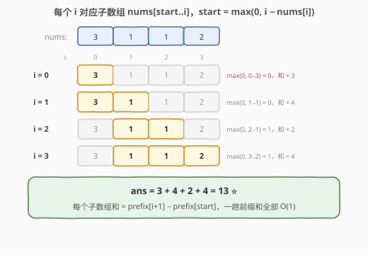
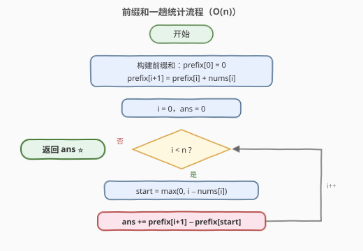

# LeetCode 变长子数组求和 题解

## 1. 题目概述

- **标题 / 题号**：变长子数组求和（#3427，easy）
- **链接**：https://leetcode.cn/problems/sum-of-variable-length-subarrays/
- **难度**：简单
- **标签**：数组、前缀和

**题意**：给你一个长度为 `n` 的整数数组 `nums`。对于**每个**下标 `i`（`0 <= i < n`），定义对应的子数组 `nums[start ... i]`，其中 `start = max(0, i - nums[i])`。

返回为数组中每个下标定义的子数组中所有元素的总和。

**子数组**是数组中的一个连续、非空的元素序列。

**示例 1**：

```text
输入：nums = [2,3,1]
输出：11
解释：
  i=0：start = max(0, 0-2) = 0，子数组 [2]，和为 2
  i=1：start = max(0, 1-3) = 0，子数组 [2,3]，和为 5
  i=2：start = max(0, 2-1) = 1，子数组 [3,1]，和为 4
  总和 = 2 + 5 + 4 = 11
```

**示例 2**：

```text
输入：nums = [3,1,1,2]
输出：13
解释：
  i=0：start = max(0, 0-3) = 0，子数组 [3]，和为 3
  i=1：start = max(0, 1-1) = 0，子数组 [3,1]，和为 4
  i=2：start = max(0, 2-1) = 1，子数组 [1,1]，和为 2
  i=3：start = max(0, 3-2) = 1，子数组 [1,1,2]，和为 4
  总和 = 3 + 4 + 2 + 4 = 13
```

**约束**：

- `1 <= n == nums.length <= 100`
- `1 <= nums[i] <= 1000`

## 2. 解题思路

### 2.1 暴力思路

对每个下标 `i`，直接把子数组 `nums[start .. i]` 的元素逐个相加：

```text
ans = 0
for i in 0 .. n-1:
    start = max(0, i - nums[i])
    for j in start .. i:
        ans += nums[j]
```

时间复杂度 `O(n^2)`。本题 `n <= 100`，最多约 `10^4` 次加法，可以直接通过。但每个区间的和都被从头累加了一遍——区间之间存在大量重复计算，若 `n` 放大到 `10^5` 就会超时。

### 2.2 核心观察：前缀和 O(1) 求任意区间和



本题本质是 **`n` 次区间和查询**：第 `i` 次查询区间 `[start_i, i]`，其中 `start_i = max(0, i - nums[i])`。

定义**前缀和**数组 `prefix`，其中 `prefix[k]` 表示 `nums` 前 `k` 个元素之和，并令 `prefix[0] = 0` 作哨兵。那么任意区间 `[l, r]` 的和都可以 `O(1)` 求出：

$$\text{sum}(l, r) = prefix[r+1] - prefix[l]$$

对应到本题，答案就是：

$$ans = \sum_{i=0}^{n-1} \left( prefix[i+1] - prefix[\max(0,\, i - nums[i])] \right)$$

> 💡 一旦前缀和数组预处理好，每个下标只需一次减法。注意 `i - nums[i]` 可能为负（当 `nums[i] > i` 时），必须用 `max(0, ·)` 把左边界钳制在 `0`，否则数组下标越界。

**时间复杂度**：`O(n)`，**空间复杂度**：`O(n)`。

### 2.3 算法流程图



整个算法分两趟：第一趟构建前缀和数组，第二趟对每个下标做一次减法累加。

## 3. 参考代码

### C++

```cpp
class Solution {
  public:
    int subarraySum(vector<int>& nums) {
        int n = nums.size();
        vector<int> prefix(n + 1, 0);
        for (int i = 0; i < n; i++) {
            prefix[i + 1] = prefix[i] + nums[i];
        }

        int ans = 0;
        for (int i = 0; i < n; i++) {
            int start = max(0, i - nums[i]);
            ans += prefix[i + 1] - prefix[start];
        }
        return ans;
    }
};
```

### Python

```python
class Solution:
    def subarraySum(self, nums: List[int]) -> int:
        n = len(nums)
        prefix = [0] * (n + 1)
        for i, x in enumerate(nums):
            prefix[i + 1] = prefix[i] + x

        return sum(prefix[i + 1] - prefix[max(0, i - nums[i])] for i in range(n))
```

## 4. 复杂度分析

| 维度 | 复杂度 | 说明 |
|------|--------|------|
| 时间复杂度 | O(n) | 一趟建前缀和 + 一趟统计，每个下标仅一次减法 |
| 空间复杂度 | O(n) | 前缀和数组 `prefix` 长度为 `n + 1` |

## 5. 扩展：前缀和的通用模板

本题是前缀和最直接的应用——**静态数组、多次区间和查询**。通用的模板是：

```text
prefix[0] = 0
prefix[i] = nums[0] + nums[1] + ... + nums[i-1]
区间 [l, r] 的和 = prefix[r+1] - prefix[l]
```

`prefix[0] = 0` 这个哨兵的作用是统一公式：当 `l = 0` 时 `sum = prefix[r+1] - prefix[0] = prefix[r+1]`，无需任何特判。

若数组元素可能很大或查询次数很多（如 `10^5` 个区间查询），前缀和把每次查询从 `O(n)` 降到 `O(1)`，是「以空间换时间」的典型手段；如果还伴随单点修改，则要升级为树状数组或线段树。

## 6. 面试要点

1. **为什么左边界要取 `max(0, i - nums[i])`？**
   - 当 `nums[i] > i` 时 `i - nums[i]` 为负，数组下标不能为负，必须钳制到 `0`；这也保证了子数组至少包含 `nums[i]` 自身。

2. **前缀和数组为什么开 `n + 1` 长度且 `prefix[0] = 0`？**
   - 哨兵设计，使任意区间 `[l, r]` 的和统一为 `prefix[r+1] - prefix[l]`，`l = 0` 时不用特判。

3. **答案会溢出 `int` 吗？**
   - 不会。`n <= 100`、`nums[i] <= 1000`，单个子数组和不超过 `10^5`，总和不超过 `10^7`，远小于 `2^31 - 1`。

4. **暴力 `O(n^2)` 能过吗？为什么还要写前缀和？**
   - 本题数据规模下能过；但前缀和版本是 `O(n)`，代码同样简单，且是处理「多次区间和查询」的通用套路，数据放大后依然稳健。

5. **前缀和适用于什么场景、什么时候失效？**
   - 适用于静态数组的多次区间和查询；若数组元素会被单点修改，前缀和维护代价 `O(n)`，应改用树状数组/线段树。

## 同类练习题

| # | 题目 | 与本题的关联 |
|---|------|-------------|
| 303 | [区域和检索 - 数组不可变](https://leetcode.cn/problems/range-sum-query-immutable/) | 前缀和模板题，多次查询任意区间和 |
| 724 | [寻找数组的中心下标](https://leetcode.cn/problems/find-pivot-index/)（[题解](../0701-0800/724_寻找数组的中心下标.md)） | 用前缀和比较左侧和与右侧和 |
| 560 | [和为 K 的子数组](https://leetcode.cn/problems/subarray-sum-equals-k/)（[题解](../0501-0600/560_和为K的子数组.md)） | 前缀和 + 哈希表统计区间和出现次数 |
| 974 | [和可被 K 整除的子数组](https://leetcode.cn/problems/subarray-sums-divisible-by-k/)（[题解](../0901-1000/974_和可被K整除的子数组.md)） | 前缀和 + 同余性质，560 的变体 |
