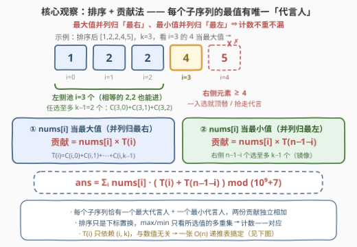
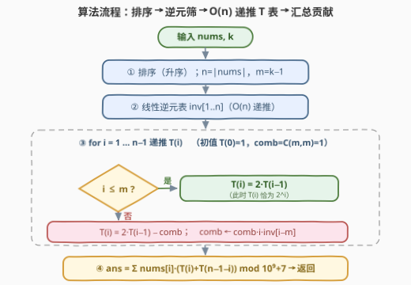

# 最多K个元素的子序列的最值之和

- **题目名称**：最多K个元素的子序列的最值之和
- **链接**：[3428. 最多 K 个元素的子序列的最值之和](https://leetcode.cn/problems/maximum-and-minimum-sums-of-at-most-size-k-subsequences/)
- **难度**：中等
- **标签**：数组、排序、组合数学、贡献法、模逆元

## 1. 题目概述

给你一个整数数组 `nums` 和一个正整数 `k`，返回所有**长度至多为 `k`** 的**子序列**中 **最大值** 与 **最小值** 之和的总和。

**非空子序列**是指从另一个数组中删除一些或不删除任何元素（且不改变剩余元素的顺序）得到的数组。

由于答案可能非常大，请返回对 $10^9 + 7$ **取余**后的结果。

**示例 1**：

```text
输入：nums = [1,2,3], k = 2
输出：24
解释：所有长度至多为 2 的子序列为 [1]、[2]、[3]、[1,2]、[1,3]、[2,3]，
各自的 (min + max) 依次为 2、4、6、3、4、5，总和为 24。
```

**示例 2**：

```text
输入：nums = [5,0,6], k = 1
输出：22
解释：长度恰为 1 的子序列最小值与最大值均为元素本身，总和 = (5+5) + (0+0) + (6+6) = 22。
```

**示例 3**：

```text
输入：nums = [1,1,1], k = 2
输出：12
解释：子序列 [1] 出现 3 次、[1,1] 出现 3 次，每个的 min+max 均为 2，总和 12。
```

**约束条件**：

- $1 \le \text{nums.length} \le 10^5$
- $0 \le \text{nums}[i] \le 10^9$
- $1 \le k \le \min(100, \text{nums.length})$

> 💡 **读题关键**：① 「长度**至多** $k$」而非恰好 $k$——长度 $1..k$ 都要算，且长度 1 的子序列 $\max=\min=$ 元素自身，贡献是**两倍**元素值；② 子序列按**下标集合**计（$[1,1]$ 里两个不同的 1 算不同子序列），$n=10^5$ 时总数是天文数字，**逐个枚举不可行**；③ $\max/\min$ 只依赖所选元素的**多重集**、与顺序无关 → **可以先排序**；④ $k \le 100$ 很小，但「前缀组合数之和」有 $O(n)$ 递推；⑤ 取模 $10^9+7$ 是质数，除法用**模逆元**。

---

## 2. 解题思路

### 2.1 暴力思路：枚举子序列不可行

最朴素的做法是枚举所有大小不超过 $k$ 的下标集合，逐个累加 $\max+\min$。子序列总数为 $\sum_{j=1}^{k}\binom{n}{j}$，$n=10^5,\ k=100$ 时仅 $\binom{10^5}{100}$ 一项就约 $10^{342}$ 量级。结论：**必须放弃「逐个子序列」视角，改为对每个元素统计它作为最值的出现次数**（贡献法）。小规模（$n \le 12$）的暴力程序仍有价值——充当对拍器验证公式（本文公式已与暴力在 500 组随机数据下对拍通过）。

### 2.2 核心观察：排序 + 贡献法 + 「代言人」约定

**第一步：贡献法转换。** 把「对每个子序列求 $\max+\min$ 再求和」交换求和次序：

$$\text{ans} \;=\; \sum_{S}(\max S + \min S) \;=\; \sum_{i=0}^{n-1} \text{nums}[i]\cdot\big(c_i^{\max} + c_i^{\min}\big)$$

其中 $c_i^{\max}$（$c_i^{\min}$）是「$\text{nums}[i]$ 作为所在子序列最大值（最小值）」的子序列个数。只要把这两个计数做对，问题就解决了。

**第二步：排序，并用「代言人」约定处理并列。** 先排序（$max/\min$ 只看多重集，排序只是下标置换，计数一一对应）。剩下唯一的坑是**重复元素**：$[2,2]$ 的最大值是哪个 2？约定——

- **最大值并列时，归排序后「最右」那个**（最大值代言人）；
- **最小值并列时，归「最左」那个**（最小值代言人）。

于是每个子序列的 $\max$ 恰有一个代言人、$\min$ 也恰有一个代言人，计数**不重不漏**。在此约定下：

- $\text{nums}[i]$ 当最大值 $\iff$ 子序列包含 $i$，且**其余元素全部来自左侧下标 $< i$**（右侧元素 $\ge \text{nums}[i]$：若更大则抢走最大值，若相等则按「最右」约定顶替 $i$）；
- $\text{nums}[i]$ 当最小值 $\iff$ 包含 $i$，且其余元素全部来自**右侧**下标 $> i$（完全镜像）。

**第三步：数出来。** 子序列总长至多 $k$、已含 $i$ 本身，故其余元素至多再选 $k-1$ 个：

$$c_i^{\max} = \sum_{j=0}^{\min(i,\,k-1)}\binom{i}{j} \;=\; T(i), \qquad c_i^{\min} = \sum_{j=0}^{\min(n-1-i,\,k-1)}\binom{n-1-i}{j} \;=\; T(n-1-i)$$



三步合并：

$$\boxed{\;\text{ans} \;=\; \sum_{i=0}^{n-1} \text{nums}[i]\cdot\big(T(i) + T(n-1-i)\big) \;\;\bmod\; (10^9+7), \qquad T(i)=\sum_{j=0}^{\min(i,\,k-1)}\binom{i}{j}\;}$$

> ⚠️ **两个易错点**：① 长度 1 的子序列自动被覆盖——$A$ 取空集时它同时计入 $c_i^{\max}$ 与 $c_i^{\min}$，贡献恰为 $2\cdot\text{nums}[i]$；② $T(i)$ 与数组**具体数值无关**，只依赖 $(i, k)$——所以最小值那份不需要另写一套逻辑，直接复用同一张 $T$ 表做镜像下标 $n-1-i$ 即可。

### 2.3 算法流程：$T(i)$ 的 $O(n)$ 递推

$m = k-1$。$T(i)$ 是「$i$ 个元素的池子里任选至多 $m$ 个」的方案数。把第 $i$ 个元素是否入池拆开：

- **不选它**：剩 $i-1$ 个池子里选至多 $m$ 个，$T(i-1)$ 种；
- **选它**：其余至多 $m-1$ 个，$T(i-1) - \binom{i-1}{m}$ 种（从「至多 $m$」里扣掉「恰好 $m$」的）。

$$T(i) \;=\; 2\,T(i-1) - \binom{i-1}{m}\cdot[\,i > m\,], \qquad T(0)=1$$

$i \le m$ 时修正项为零，$T(i)$ 就是熟悉的 $2^i$。剩下的硬骨头是 $\binom{i-1}{m}$——**增量维护**：$C(i,m) = C(i-1,m)\cdot \dfrac{i}{i-m}$，除法用模逆元（$p$ 为质数，线性逆元筛 $inv[i] = -\lfloor p/i\rfloor\cdot inv[p \bmod i] \bmod p$，$O(n)$ 建整表）。



> 💡 **备选实现**：① 建阶乘表 + 逆元阶乘表后 $\binom{i-1}{m}$ 可 $O(1)$ 查表，整体同样 $O(n)$；② 直接对每个 $i$ 累加 $\sum_{j\le k-1}\binom{i}{j}$ 是 $O(nk) \le 10^7$ 次乘法取模——C++ 能过，Python 偏慢，递推版更稳。

### 2.4 示例演算

以示例 1（`nums=[1,2,3], k=2`）走完整流程：排序后 $[1,2,3]$，$m = k-1 = 1$。

递推 $T$：$T(0)=1$；$i=1 \le m$：$T(1)=2$；$i=2 > m$：$T(2) = 2\cdot 2 - \binom{1}{1} = 3$。（直接验证：$T(2)=\binom{2}{0}+\binom{2}{1}=1+2=3$ ✓）

| $i$ | $\text{nums}[i]$ | 最大值次数 $T(i)$ | 最小值次数 $T(n-1-i)$ | 贡献 $\text{nums}[i]\times(\cdot)$ |
|---|---|---|---|---|
| 0 | 1 | $T(0)=1$ | $T(2)=3$ | $1\times(1+3)=4$ |
| 1 | 2 | $T(1)=2$ | $T(1)=2$ | $2\times(2+2)=8$ |
| 2 | 3 | $T(2)=3$ | $T(0)=1$ | $3\times(3+1)=12$ |

总和 $4+8+12=24$ ✓。再回验：示例 2（$k=1,\ m=0$）此时 $T \equiv 1$，答案 $= 2(5+0+6)=22$ ✓；示例 3（$[1,1,1],\ k=2$）$T=[1,2,3]$，每个 1 的贡献均为 $1\times 4$，合计 $12$ ✓——重复元素被「代言人」约定正确分摊。

---

## 3. 参考代码

### C++

```cpp
class Solution {
  public:
    int minMaxSums(vector<int>& nums, int k) {
        constexpr long long MOD = 1'000'000'007LL;
        const int n = nums.size();
        sort(nums.begin(), nums.end());
        const int m = k - 1;

        // ① 线性逆元表 inv[1..n]：由 p = i*(p/i) + p%i 移项即得
        vector<long long> inv(n + 1);
        inv[1] = 1;
        for (int i = 2; i <= n; ++i)
            inv[i] = (MOD - MOD / i) * inv[MOD % i] % MOD;

        // ② O(n) 递推 T(i) = Σ_{j=0}^{min(i,m)} C(i,j)
        vector<long long> T(n);
        T[0] = 1;
        long long comb = 1;                      // 增量维护 C(i-1, m)，初值 C(m,m)=1
        for (int i = 1; i < n; ++i) {
            T[i] = 2 * T[i - 1] % MOD;
            if (i > m) {                        // i ≤ m 时 T(i)=2^i，无需修正
                T[i] = (T[i] - comb + MOD) % MOD;
                comb = comb * i % MOD * inv[i - m] % MOD;   // C(i-1,m) → C(i,m)
            }
        }

        // ③ 汇总：nums[i] 以 T(i) 次当最大值、T(n-1-i) 次当最小值
        long long ans = 0;
        for (int i = 0; i < n; ++i)
            ans = (ans + (long long)nums[i] % MOD * ((T[i] + T[n - 1 - i]) % MOD)) % MOD;
        return (int)ans;
    }
};
```

### Python

```python
class Solution:
    def minMaxSums(self, nums: List[int], k: int) -> int:
        MOD = 10**9 + 7
        nums.sort()
        n, m = len(nums), k - 1

        inv = [0] * (n + 1)                     # ① 线性逆元表 inv[1..n]
        inv[1] = 1
        for i in range(2, n + 1):
            inv[i] = (MOD - MOD // i) * inv[MOD % i] % MOD

        T = [0] * n                             # ② T(i) = Σ_{j=0}^{min(i,m)} C(i,j)
        T[0] = 1
        comb = 1                                # 增量维护 C(i-1, m)，初值 C(m,m)=1
        for i in range(1, n):
            T[i] = 2 * T[i - 1] % MOD
            if i > m:                           # i ≤ m 时 T(i)=2^i，无需修正
                T[i] = (T[i] - comb) % MOD
                comb = comb * i % MOD * inv[i - m] % MOD

        # ③ 汇总：nums[i] 以 T(i) 次当最大值、T(n-1-i) 次当最小值
        return sum(v * (T[i] + T[n - 1 - i]) for i, v in enumerate(nums)) % MOD
```

> 💡 **实现细节**：① `comb` 初值取 $C(m,m)=1$，恰在 $i=m+1$ 首次启用，边界零特判；② C++ 中 `T[i]-comb` 可能变负，先 `+MOD` 再取模；Python 的 `%` 恒非负无此顾虑；③ `n=1` 时逆元表长度为 2、循环体不执行，`ans = 2·nums[0]` 自动正确；④ `nums[i] ≤ 10^9 < MOD`，先取模再相乘防溢出。

---

## 4. 复杂度分析

| 维度 | 复杂度 | 说明 |
|------|--------|------|
| 时间复杂度 | $O(n \log n)$ | 排序主导；逆元筛、$T$ 递推、汇总均为 $O(n)$ |
| 空间复杂度 | $O(n)$ | `inv` 表与 `T` 表两张线性表 |
| 暴力对照 | $O\big(\sum_{j \le k}\binom{n}{j}\big)$ | $n=10^5,\ k=100$ 时约 $10^{342}$ 量级，仅作小规模对拍 |

---

## 5. 扩展：$k=n$ 特例、阶乘表版本与 DP 视角

**$k = n$ 的特例。** 长度限制失效，$i \le m = n-1$ 恒成立，$T(i) = 2^i$，答案化成一行闭式 $\sum_i \text{nums}[i]\,(2^i + 2^{\,n-1-i})$。这正是 [891. 子序列宽度之和](https://leetcode.cn/problems/sum-of-subsequence-widths/)（求 $\sum(\max-\min)$，无长度限制）的姊妹题——891 用 $\max-\min$ 相消后只剩 $\text{nums}[i]\,(2^i - 2^{\,n-1-i})$，两题共享同一套「排序贡献」骨架。

**阶乘表版本。** 建好 $\text{fact}$ / $\text{invFact}$ 两张表后，$\binom{i-1}{m} = \text{fact}[i-1]\cdot\text{invFact}[m]\cdot\text{invFact}[i-1-m]$ 可 $O(1)$ 查表，整体仍是 $O(n)$；若题目变形为还要求「恰好 $j$ 个」的别的统计量，两张表可直接复用，比增量维护更通用。

**DP 视角。** $T$ 的递推本身就是一维计数 DP：$f[i]$ =「前 $i$ 个元素中选至多 $m$ 个」的方案数，转移 $f[i] = f[i-1] + (f[i-1] - \binom{i-1}{m})$ 正是「第 $i$ 个不选 / 选」的分类。与 [3405](../3401-3500/3405_统计恰好有K个相等相邻元素的数组数目.md) 的 $f[i][j]$ 相比，这里是压掉 $j$ 维后的「至多」版——「恰好」与「至多」的互转在这类组合计数题中反复出现。

---

## 6. 面试要点

1. **为什么可以先排序？排序不会破坏「子序列」吗？**

   - 子序列由**下标集合**唯一决定。排序是下标的一个置换，把原数组的每个下标集合双射地映到排序数组的下标集合；而 $\max/\min$ 只依赖所选元素的**多重集**，与顺序无关。因此在排序数组上按集合计数，与原数组上的子序列一一对应。

2. **重复元素时怎么保证每个子序列只被计一次？**

   - 「代言人」约定：最大值并列时归排序后**最右**、最小值并列归**最左**。任一子序列中值为最大值的元素可能有多个，但「最右那个」唯一，最小值同理。两类约定独立、互不干扰，贡献不重不漏。

3. **递推 $T(i) = 2T(i-1) - \binom{i-1}{m}$ 为什么成立？**

   - 池子观点：$T(i)$ 是「$i$ 个元素的池子选至多 $m$ 个」的方案数。新元素不选有 $T(i-1)$ 种；选它则其余至多 $m-1$ 个，为 $T(i-1)-\binom{i-1}{m}$ 种。相加即得。$i \le m$ 时修正项为零，退化为 $T(i)=2^i$。

4. **为什么不直接对每个 $i$ 用阶乘表求 $\sum_{j\le k-1}\binom{i}{j}$？**

   - 那是 $O(nk)$，$n=10^5,\ k=100$ 时约 $10^7$ 次乘法取模：C++ 可过，Python 有超时风险。递推版把每步压到 $O(1)$，整体 $O(n)$，且只需一张线性逆元表。

5. **模逆元的线性递推依据是什么？**

   - $p=10^9+7$ 为质数。由 $p = i\cdot\lfloor p/i\rfloor + (p \bmod i)$ 得 $i\cdot\lfloor p/i\rfloor \equiv -(p\bmod i) \pmod p$，两边乘 $inv[i]\cdot inv[p\bmod i]$ 移项即 $inv[i] = -\lfloor p/i\rfloor\cdot inv[p\bmod i] \bmod p$，其中 $p \bmod i < i$ 保证递推无环。

---

## 7. 同类练习题

- [891. 子序列宽度之和](https://leetcode.cn/problems/sum-of-subsequence-widths/)（[站内题解](../0801-0900/891_子序列宽度之和.md)）：同为「排序 + 贡献法」数子序列最值，是无长度限制的 $\max-\min$ 版，$k=n$ 特例的直接亲属
- [907. 子数组的最小值之和](https://leetcode.cn/problems/sum-of-subarray-minimums/)（[站内题解](../0901-1000/907_子数组的最小值之和.md)）：贡献法数最小值出现次数的**子数组**版，用单调栈求两侧控制范围
- [2104. 子数组范围和](https://leetcode.cn/problems/sum-of-subarray-ranges/)（[站内题解](../2101-2200/2104_子数组范围和.md)）：$\sum(\max-\min)$ 的子数组版，与本题对比「子序列 + 长度上限」的计数差异
- [2763. 所有子数组中不平衡数字之和](https://leetcode.cn/problems/sum-of-imbalance-numbers-of-all-subarrays/)（[站内题解](../2701-2800/2763_所有子数组中不平衡数字之和.md)）：贡献法在子数组统计上的又一实践，练「按最值归位拆贡献」的通用手感
