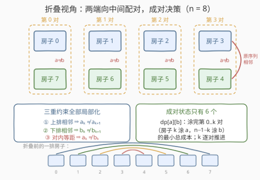
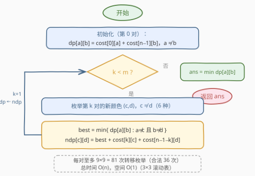

# 粉刷房子 IV

- **题目名称**：粉刷房子 IV
- **链接**：[3429. 粉刷房子 IV](https://leetcode.cn/problems/paint-house-iv/)
- **难度**：中等
- **标签**：数组、动态规划

## 1. 题目概述

给你一个**偶数**整数 $n$，表示沿直线排列的房屋数量，以及一个大小为 $n \times 3$ 的二维数组 $\text{cost}$，其中 $\text{cost}[i][j]$ 表示将第 $i$ 个房屋涂成颜色 $j+1$ 的成本。

如果房屋满足以下条件，则认为它们看起来**漂亮**：

- 不存在两个涂成相同颜色的**相邻**房屋；
- **距离行两端等距**的房屋不能涂成相同的颜色。例如 $n = 6$ 时，位置 $(0,5)$、$(1,4)$、$(2,3)$ 的房屋被认为是等距的。

返回使房屋看起来**漂亮**的**最低**涂色成本。

**示例 1**：

```text
输入：n = 4, cost = [[3,5,7],[6,2,9],[4,8,1],[7,3,5]]
输出：9
解释：最佳涂色为 [1, 2, 3, 2]，对应成本 [3, 2, 1, 3]。
相邻房屋颜色互不相同；等距对 (0,3) 涂 (1,2)、(1,2) 涂 (2,3)，均不同色。
最低成本 3 + 2 + 1 + 3 = 9。
```

**示例 2**：

```text
输入：n = 6, cost = [[2,4,6],[5,3,8],[7,1,9],[4,6,2],[3,5,7],[8,2,4]]
输出：18
解释：最佳涂色为 [1, 3, 2, 3, 1, 2]，对应成本 [2, 8, 1, 2, 3, 2]，总成本 18。
```

**约束条件**：

- $2 \le n \le 10^5$，且 $n$ 为偶数
- $\text{cost.length} = n$，$\text{cost}[i].\text{length} = 3$
- $0 \le \text{cost}[i][j] \le 10^5$

> 💡 **读题关键**：①「等距」约束是本题与普通粉刷房子的分水岭——它把位置 $i$ 与 $n-1-i$ **绑定**成一对，单看左半边无法独立决策；② $n$ 为**偶数**，房屋恰好两两配对、没有落单的中间房子；③ 总成本上限约 $\frac{n}{2} \times 2 \times 10^5 = 10^{10}$，**必须用 64 位整数**。

---

## 2. 解题思路

### 2.1 暴力思路：枚举涂色方案

每个房子 3 种颜色，共 $3^n$ 种方案，$n = 10^5$ 时是天文数字。退一步，只做「相邻不同色」的常规线性 DP（状态 = 当前房子颜色）也不够——**等距约束跨越整个序列**：推到位置 $i$ 时，位置 $n-1-i$ 的颜色尚未确定，约束无法当场检查。小规模暴力（$n \le 8$）仍值得写一份当对拍器（本文解法已与暴力在数百组随机数据下对拍通过）。

### 2.2 核心观察：两端折叠，成对决策

**把 $n$ 个房子从中间「折叠」。** 令 $m = n/2$，位置 $k$（前半）与位置 $n-1-k$（后半）是一对。将后半**镜像翻转**后排到前半下方，得到 $m$ 列「对」：

- 上排：房子 $0, 1, \dots, m-1$，记第 $k$ 对上排颜色为 $a_k$；
- 下排：房子 $n-1, n-2, \dots, m$，记第 $k$ 对下排颜色为 $b_k$。

折叠后**全部约束都局部化**为「列内」或「相邻列之间」：

| 原序列约束 | 折叠后的形态 |
|------------|--------------|
| 房子 $k$ 与 $k+1$ 相邻不同色 | $a_k \ne a_{k+1}$（上排相邻） |
| 房子 $n-1-k$ 与 $n-2-k$ 相邻不同色 | $b_k \ne b_{k+1}$（下排相邻） |
| 等距对 $k$ 与 $n-1-k$ 不同色 | $a_k \ne b_k$（列内） |

唯一的「漏网之鱼」是**中间一对**：房子 $m-1$ 与 $m$ 在原序列中相邻——但它们恰好也是等距对，$a_{m-1} \ne b_{m-1}$ 已覆盖。三张约束表**闭合**，没有任何约束跨越两列以上。

于是定义成对状态：

$$\text{dp}_k[a][b] \;=\; \text{涂完第 } 0 \dots k \text{ 对、且第 } k \text{ 对颜色为 } (a,b) \text{ 的最小总成本}$$

由于 $a \ne b$，**每对只有 $3 \times 2 = 6$ 个合法状态**。转移时枚举新对颜色 $(c,d)$（$c \ne d$）：

$$\text{dp}_{k+1}[c][d] \;=\; \min_{\substack{a \ne c \\ b \ne d}} \; \text{dp}_k[a][b] \;+\; \text{cost}[k][c] \;+\; \text{cost}[n-1-k][d]$$

转移条件与约束**一一对应**：$a \ne c$ 是上排相邻、$b \ne d$ 是下排相邻、$c \ne d$ 是列内等距（顺带覆盖中间一对的相邻性）。



### 2.3 算法流程：3×3 滚动表

状态只有 $3 \times 3$，用 $\text{dp}$ / $\text{ndp}$ 两张表滚动即可：



> 💡 **复杂度账本**：每对转移是 9 个目标 × 9 个前驱 = 81 次枚举（合法的只有 $6 \times 6 = 36$ 次），共 $m = n/2$ 对，总量约 $40n$——$n = 10^5$ 时约四百万次比较加法，轻松通过。若想再抠常数，可用 265 题「除上一色外的最小值」技巧把内层 min 摊到 $O(1)$，但完全没必要。

### 2.4 示例演算

以示例 1（$n=4$，两对：第 0 对 = 房子 0/3，第 1 对 = 房子 1/2）走完整流程。

**初始化（第 0 对）**：$\text{cost}[0]=[3,5,7]$，$\text{cost}[3]=[7,3,5]$，$\text{dp}[a][b] = \text{cost}[0][a] + \text{cost}[3][b]$（$a \ne b$）：

| $(a,b)$ | $(0,1)$ | $(0,2)$ | $(1,0)$ | $(1,2)$ | $(2,0)$ | $(2,1)$ |
|---|---|---|---|---|---|---|
| dp | **6** | 8 | 12 | 10 | 14 | 10 |

**转移到第 1 对**：$\text{cost}[1]=[6,2,9]$，$\text{cost}[2]=[4,8,1]$，逐目标做排除式取 min：

| $(c,d)$ | $\min\{\text{dp}[a][b] : a \ne c,\, b \ne d\}$ | 加 $\text{cost}[1][c] + \text{cost}[2][d]$ | ndp |
|---|---|---|---|
| $(0,1)$ | $\min\{12, 10, 14\} = 10$ | $6 + 8$ | 24 |
| $(0,2)$ | $\min\{12, 14, 10\} = 10$ | $6 + 1$ | 17 |
| $(1,0)$ | $\min\{8, 10\} = 8$ | $2 + 4$ | 14 |
| $(1,2)$ | $\min\{6, 14, 10\} = \mathbf{6}$ | $2 + 1$ | **9** |
| $(2,0)$ | $\min\{6, 10\} = 6$ | $9 + 4$ | 19 |
| $(2,1)$ | $\min\{8, 12, 10\} = 8$ | $9 + 8$ | 25 |

最终答案 $\min = 9$。回溯最优路径：第 0 对 $(a,b) = (0,1)$ → 第 1 对 $(c,d) = (1,2)$，即涂色 $[1,2,3,2]$（下标 0/1/2 对应颜色 1/2/3），成本 $3+2+1+3 = 9$，与官方解释一致 ✓。示例 2 同法可得 18 ✓。

---

## 3. 参考代码

### C++

```cpp
class Solution {
  public:
    long long minCost(int n, vector<vector<int>>& cost) {
        const long long INF = 4e18;
        const int m = n / 2;
        long long dp[3][3], ndp[3][3];

        // ① 第 0 对：房子 0 涂 a，房子 n-1 涂 b（a != b，等距约束）
        for (int a = 0; a < 3; ++a)
            for (int b = 0; b < 3; ++b)
                dp[a][b] = (a == b) ? INF : (long long)cost[0][a] + cost[n - 1][b];

        // ② 逐对推进：新对 (c,d)，前驱 (a,b) 须 a!=c（上排相邻）、b!=d（下排相邻）
        for (int k = 1; k < m; ++k) {
            int r = n - 1 - k;                                   // 新对的右端房子
            for (int c = 0; c < 3; ++c)
                for (int d = 0; d < 3; ++d) {
                    if (c == d) { ndp[c][d] = INF; continue; }   // 列内（含中间一对）约束
                    long long best = INF;
                    for (int a = 0; a < 3; ++a) {
                        if (a == c) continue;
                        for (int b = 0; b < 3; ++b)
                            if (b != d) best = min(best, dp[a][b]);
                    }
                    ndp[c][d] = best + cost[k][c] + cost[r][d];
                }
            memcpy(dp, ndp, sizeof(dp));                         // 滚动
        }

        long long ans = INF;
        for (int a = 0; a < 3; ++a)
            for (int b = 0; b < 3; ++b)
                ans = min(ans, dp[a][b]);
        return ans;
    }
};
```

### Python

```python
class Solution:
    def minCost(self, n: int, cost: List[List[int]]) -> int:
        m = n // 2
        states = [(a, b) for a in range(3) for b in range(3) if a != b]   # 6 个合法状态

        # ① 第 0 对：房子 0 涂 a，房子 n-1 涂 b
        dp = [[float('inf')] * 3 for _ in range(3)]
        for a, b in states:
            dp[a][b] = cost[0][a] + cost[n - 1][b]

        # ② 逐对推进：新对 (c,d)，前驱 (a,b) 须 a!=c 且 b!=d
        for k in range(1, m):
            r = n - 1 - k
            ndp = [[float('inf')] * 3 for _ in range(3)]
            for c, d in states:
                best = min(dp[a][b] for a, b in states if a != c and b != d)
                ndp[c][d] = best + cost[k][c] + cost[r][d]
            dp = ndp

        return min(dp[a][b] for a, b in states)
```

> 💡 **实现细节**：① 非法状态（$a = b$）初始化为 INF，取 min 时自然淘汰，无需特判；② 任何合法目标 $(c,d)$ 的前驱至少剩 $2 \times 2 = 4$ 个（$a$ 两选、$b$ 两选），`best` 不会取到 INF；③ 中间一对（$k = m-1$）无需特殊处理——$c \ne d$ 已覆盖其相邻性；④ C++ 中 `cost[0][a] + cost[n-1][b]` 先转 `long long` 再累加，防 int 溢出；⑤ Python 版实测 $n = 10^5$ 约 0.3 秒，无需常数优化。

---

## 4. 复杂度分析

| 维度 | 复杂度 | 说明 |
|------|--------|------|
| 时间复杂度 | $O(81n) = O(n)$ | 每对至多 $9 \times 9 = 81$ 次转移枚举（合法 36 次），共 $n/2$ 对 |
| 空间复杂度 | $O(1)$ | 两张 $3 \times 3$ 滚动表，与 $n$ 无关 |
| 暴力对照 | $O(3^n)$ | $n = 10^5$ 时约 $10^{47712}$ 量级，仅作 $n \le 8$ 的对拍 |

---

## 5. 扩展：奇数 n、常数优化与系列对比

**若 $n$ 为奇数。** 房子 $(n-1)/2$ 落在正中间，没有等距伙伴，只受相邻约束牵制。最省事的做法是把它并入**最后一对**一起转移：状态从 $(a,b)$ 升为 $(a, t, b)$（$t$ 为中间房子颜色），要求 $a \ne t$、$t \ne b$、$a \ne b$，状态数变为 $3 \times 6 = 18$，骨架完全不变。

**常数优化。** 内层 $\min\{\text{dp}[a][b] : a \ne c,\ b \ne d\}$ 可以「预计算全局最小/次小（携带位置）」后按 $(c,d)$ 排除行、列 $O(1)$ 取值。本题 81 的常数本就极小，这类技巧留给颜色数 $k$ 变大的场景——届时状态数 $k(k-1)$、朴素转移 $O(k^4)$，优化后可到 $O(k^2)$，思路正是 [265. 粉刷房子 II](https://leetcode.cn/problems/paint-house-ii/)「除上一色外最小值」的二维推广。

**系列对比。** 粉刷房子系列的演进线：[256](https://leetcode.cn/problems/paint-house/)（3 色，状态 = 上一房颜色）→ [265](https://leetcode.cn/problems/paint-house-ii/)（$k$ 色 + 行最小值优化）→ [1473](https://leetcode.cn/problems/paint-house-iii/)（状态升维：颜色 × 街区数）→ 本题（**约束升维**：颜色状态本身变成二维对 $(a,b)$）。前几问的变化都在「状态加维」，本题的变化在「**约束结构**逼着状态变形」——遇到全局性约束时，先找它能折叠成什么局部结构。

---

## 6. 面试要点

1. **为什么不能像普通粉刷房子那样从左往右线性 DP？**

   - 常规线性 DP 的合法性可以**局部**判断（只看相邻两房）；等距约束却把位置 $i$ 与 $n-1-i$ 绑定，推到位置 $i$ 时右半边颜色还没定，约束无法当场检查。要让转移闭合，状态必须同时携带两端信息——「两端向中间配对」正是携带方式的自然选择。

2. **为什么每对恰好 6 个状态而不是 9 个？**

   - 等距约束直接禁止 $(a,a)$：对内两房同色非法。$3 \times 3 = 9$ 个组合中合法的只有 $3 \times 2 = 6$ 个。

3. **中间一对房子（$m-1$ 与 $m$）在原序列中相邻，代码里在哪里处理？**

   - 不需要单独处理：它们既是等距对又相邻，转移条件 $c \ne d$ 一并覆盖两类约束。这是 $n$ 为偶数时的「巧合红利」；$n$ 为奇数时中间房子没有伙伴，才需要显式处理（见第 5 节）。

4. **为什么答案要用 64 位整数？**

   - 成本上限 $\frac{n}{2} \times 2 \times 10^5 = 10^{10}$（$n = 10^5$ 时），超出 32 位 int 上限（约 $2.1 \times 10^9$）。C++ 中加法前就要转换，不能等最后再转。

5. **如果颜色数从 3 扩大到 $k$，复杂度怎么变？**

   - 状态数 $k(k-1)$，每对朴素转移 $O(k^4)$，总 $O(nk^4)$；用「排除行/列的最小值」技巧（维护全局最小、次小及其位置）可降到 $O(nk^2)$，即 265 题优化思路的二维推广。

---

## 7. 同类练习题

- [256. 粉刷房子](https://leetcode.cn/problems/paint-house/)（[站内题解](../0201-0300/256_粉刷房子.md)）：系列起点，3 色一维 DP，状态 = 上一房颜色
- [265. 粉刷房子 II](https://leetcode.cn/problems/paint-house-ii/)（[站内题解](../0201-0300/265_粉刷房子II.md)）：$k$ 色版 +「除上一色外最小值」优化，与本题的排除式 min 一脉相承
- [1473. 粉刷房子 III](https://leetcode.cn/problems/paint-house-iii/)（[站内题解](../1401-1500/1473_粉刷房子III.md)）：状态升维（颜色 × 街区数）的系列进阶，对比本题「约束升维」的不同演化方向
- [790. 多米诺和托米诺平铺](https://leetcode.cn/problems/domino-and-tromino-tiling/)（[站内题解](../0701-0800/790_多米诺和托米诺平铺.md)）：同为「固定小状态集 + 滚动转移」的线性 DP，练状态设计压常数的手感
