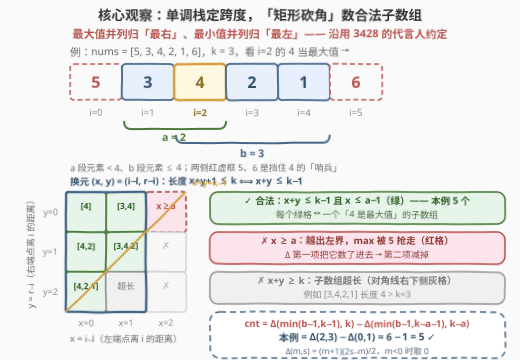
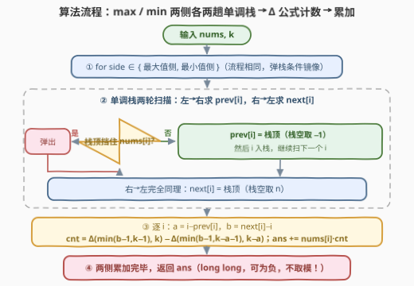

# LeetCode 最多K个元素的子数组的最值之和 题解

## 1. 题目概述

- **标题 / 题号**：最多K个元素的子数组的最值之和（#3430，hard）
- **链接**：https://leetcode.cn/problems/maximum-and-minimum-sums-of-at-most-size-k-subarrays/
- **难度**：困难
- **标签**：单调栈、数组、数学、贡献法

**题意**：给你一个整数数组 `nums` 和一个**正**整数 `k`，返回所有**最多含有 `k` 个元素**的子数组的**最大**元素与**最小**元素之和。

**子数组**是数组中一个连续、非空的元素序列。

**示例 1**：

```text
输入：nums = [1,2,3], k = 2
输出：20
解释：最多 2 个元素的子数组共 5 个：[1]、[2]、[3]、[1,2]、[2,3]，
各自的 (min + max) 为 2、4、6、3、5，总和 20。
```

**示例 2**：

```text
输入：nums = [1,-3,1], k = 2
输出：-6
解释：5 个子数组的 (min + max) 依次为 2、-6、2、-2、-2，总和 -6。
```

**约束**：

- $1 \le \text{nums.length} \le 8\times10^4$
- $1 \le k \le \text{nums.length}$
- $-10^6 \le \text{nums}[i] \le 10^6$

> 💡 **读题关键**：① 「**最多** $k$ 个」＝长度 $1..k$ 全都要算，长度 1 的子数组 $\max=\min=$ 元素自身，贡献是**两倍**元素值；② 子数组**连续**——这是与姊妹题 [3428. 最多K个元素的子序列的最值之和](https://leetcode.cn/problems/maximum-and-minimum-sums-of-at-most-size-k-subsequences/)（[站内题解](../3401-3500/3428_最多K个元素的子序列的最值之和.md)）的本质区别：不能排序，要用**单调栈**刻画「谁是区间最值」；③ 长度 $\le k$ 的子数组至多 $\frac{n(n+1)}{2}\approx3.2\times10^9$ 个，答案**不取模**且**可为负**（示例 2），量级约 $10^{16}$，C++ 需 `long long`；④ $\sum(\max+\min)$ 拆成 $\sum\max+\sum\min$ 两个**镜像**子问题，一份代码跑两遍。

## 2. 解题思路

### 2.1 暴力思路：枚举子数组不可行

枚举左端点 $l$，右端点 $r$ 从 $l$ 向右推进到 $\min(l+k-1,\ n-1)$，边推进边维护 running $\max/\min$，每个子数组 $O(1)$ 结算，总计 $O(nk)$。$n=k=8\times10^4$ 时约 $3.2\times10^9$ 次操作，C++ 也要跑好几秒、Python 直接爆炸——**不可行**。但这个暴力是完美的**对拍器**（本文公式已与暴力在数千组随机数据下对拍通过，覆盖大量重复元素、负数与全等数组）。

### 2.2 核心观察：贡献法 + 单调栈跨度 +「矩形砍角」计数

**第一步：贡献法转换**（与 3428 同款起手式）——交换求和次序：

$$\text{ans} \;=\; \sum_{\text{子数组}[l,r]}(\max+\min) \;=\; \sum_{i=0}^{n-1}\text{nums}[i]\cdot\big(c_i^{\max}+c_i^{\min}\big)$$

其中 $c_i^{\max}$（$c_i^{\min}$）是「$\text{nums}[i]$ 是所在子数组最大值（最小值）」的子数组**个数**。唯一的问题：把这两个计数做对。

**第二步：子数组的「代言人」约定。** 重复元素仍是唯一的坑：$[2,2]$ 的最大值记给哪个 2？沿用 3428 的约定——

- **最大值并列归「最右」**：$\text{nums}[i]$ 计分为最大值 $\iff$ 子数组落在开区间 $\big(\textit{prev\_ge}[i],\ \textit{next\_gt}[i]\big)$ 内。$\textit{prev\_ge}[i]$ = 左侧最近的 $j$ 满足 $\text{nums}[j]\ge\text{nums}[i]$，$\textit{next\_gt}[i]$ = 右侧最近的 $j$ 满足 $\text{nums}[j]>\text{nums}[i]$；
- **最小值并列归「最左」**：子数组落在 $\big(\textit{prev\_lt}[i],\ \textit{next\_le}[i]\big)$ 内（左侧严格更小、右侧 $\le$ 才挡住）。

一侧**严格**、一侧**非严格**，任一子数组的 max、min 各恰有一个代言人，计数**不重不漏**；四个边界数组都用单调栈 $O(n)$ 求出。记

$$a=i-\textit{prev}[i]\ (\text{左延展上限})，\qquad b=\textit{next}[i]-i\ (\text{右延展上限})$$

即合法左端点 $l\in[i-a+1,\ i]$、右端点 $r\in[i,\ i+b-1]$。

**第三步：把「长度 $\le k$」数出来——矩形砍角。** 换元 $x=i-l\in[0,a-1]$、$y=r-i\in[0,b-1]$，则长度 $=x+y+1\le k\iff x+y\le k-1$：

$$\text{cnt}(a,b,k)=\#\{(x,y):\ 0\le x\le a-1,\ 0\le y\le b-1,\ x+y\le k-1\}$$

几何图像：$a\times b$ 的格子矩形被反对角线 $x+y=k-1$ **砍去一角**。先数「只受对角线和右界约束」的三角形，再减去「越出左界」的部分——两块都是**等差数列求和**。记截断三角形和

$$\Delta(m,s)=\sum_{y=0}^{m}(s-y)=\frac{(m+1)(2s-m)}{2}\quad(m\ge0),\qquad \Delta(m,s)=0\ \ (m<0)$$

$$\boxed{\ \text{cnt}(a,b,k)=\Delta\big(\min(b-1,\ k-1),\ k\big)-\Delta\big(\min(b-1,\ k-a-1),\ k-a\big)\ }$$

- **第一项**：不管左界，$y\le\min(b-1,k-1)$ 的每一行恰有 $k-y$ 个合法 $x$；
- **第二项**：其中 $x\ge a$ 的越界部分，换元 $x'=x-a$ 后是同款三角形，参数变为 $\big(\min(b-1,k-a-1),\ k-a\big)$。

等价的直观式（适合对拍）：$\displaystyle\text{cnt}=\sum_{y=0}^{\min(b-1,k-1)}\min(a,\ k-y)$。



> ⚠️ **三个易错点**：① 长度 1 的子数组（$x=y=0$ 恒合法）在 max 侧与 min 侧**各计一次**，自动实现「贡献 $2\cdot\text{nums}[i]$」；② 本题**不取模**且答案可为负（示例 2），C++ 全程 `long long`；③ 两个 $\min$ 都从 $b-1$ 出发、被减项还嵌着 $a$，手推容易错位——强烈建议用直观式对拍。

**特例自检**（写代码前后都值得过一遍）：

- $a+b-1\le k$：整块矩形都合法，$\text{cnt}=a\cdot b$；
- $k\ge n$：长度限制彻底失效，恒有 $a+b-1\le n\le k$，$\text{cnt}=a\cdot b$——正是 [907. 子数组的最小值之和](https://leetcode.cn/problems/sum-of-subarray-minimums/)（[站内题解](../0901-1000/907_子数组的最小值之和.md)）的双向计数，本题是它的「带长度上限」推广。

### 2.3 算法流程：两遍 × 两趟单调栈

max 侧与 min 侧跑完全相同的流程，只有**弹栈条件**镜像错开：

| 扫描方向 | 求什么 | 最大值侧（弹谁） | 最小值侧（弹谁） |
|---|---|---|---|
| 左 → 右 | $\textit{prev}[i]$（栈空取 $-1$） | 弹 $\text{nums}[\text{top}]<\text{nums}[i]$（留 $\ge$） | 弹 $\text{nums}[\text{top}]>\text{nums}[i]$（留 $<$） |
| 右 → 左 | $\textit{next}[i]$（栈空取 $n$） | 弹 $\text{nums}[\text{top}]\le\text{nums}[i]$（留 $>$） | 弹 $\text{nums}[\text{top}]\ge\text{nums}[i]$（留 $\le$） |



> 💡 「留下谁」就是「谁当哨兵」：max 侧左留 $\ge$、右留 $>$；min 侧恰好镜像。弹栈条件写反一格，只有重复元素的数据会 WA——对拍时专门造全等数组（如 $[1,1,1]$）最容易暴露。

### 2.4 示例演算

以示例 1（`nums=[1,2,3], k=2`）过一遍（$\Delta(m,s)=\frac{(m+1)(2s-m)}{2}$）：

**最大值侧**：

- $i=0$（1）：$\textit{prev\_ge}=-1\to a=1$；$\textit{next\_gt}=1\to b=1$。$\text{cnt}=\Delta(0,2)-\Delta(0,1)=2-1=1$（$[1]$）；
- $i=1$（2）：$a=2$（左边 1 不挡）；$b=1$（右边 3 挡）。$\text{cnt}=\Delta(0,2)-\Delta(-1,\cdot)=2-0=2$（$[2],[1,2]$）；
- $i=2$（3）：$a=3$；$b=1$。$\text{cnt}=2$（$[3],[2,3]$）；
- $\sum\max=1\times1+2\times2+3\times2=11$ ✓（五个子数组的 max 之和 $1+2+3+2+3=11$）。

**最小值侧**：

- $i=0$（1）：$a=1$；$\textit{next\_le}=3\to b=3$。$\text{cnt}=\Delta(1,2)-\Delta(0,1)=3-1=2$（$[1],[1,2]$）；
- $i=1$（2）：$a=1$（左边 1 挡）；$b=2$。$\text{cnt}=\Delta(1,2)-\Delta(0,1)=2$（$[2],[2,3]$）；
- $i=2$（3）：$a=1$；$b=1$。$\text{cnt}=\Delta(0,2)-\Delta(0,1)=1$（$[3]$）；
- $\sum\min=1\times2+2\times2+3\times1=9$ ✓（$1+2+3+1+2=9$）。

| $i$ | $\text{nums}[i]$ | max 侧 $(a,b)\to\text{cnt}$ | min 侧 $(a,b)\to\text{cnt}$ | 贡献 |
|---|---|---|---|---|
| 0 | 1 | $(1,1)\to1$ | $(1,3)\to2$ | $1\times3=3$ |
| 1 | 2 | $(2,1)\to2$ | $(1,2)\to2$ | $2\times4=8$ |
| 2 | 3 | $(3,1)\to2$ | $(1,1)\to1$ | $3\times3=9$ |

合计 $11+9=20$ ✓。再回验示例 2（$[1,-3,1],\ k=2$）：最小值侧 $i=1$（$-3$）两侧无更小元素，$a=b=2$，$\text{cnt}=\Delta(1,2)-\Delta(-1,\cdot)=3$（$[-3],[1,-3],[-3,1]$），贡献 $-9$ 主导了负答案；max 侧两个并列的 $1$ 按「归最右」分摊——$i=0$ 计 $[1],[1,-3]$、$i=2$ 计 $[1],[-3,1]$，各 $\text{cnt}=2$。总计 $1+(-7)=-6$ ✓。

## 3. 参考代码

### C++

```cpp
class Solution {
  private:
    // ③ 截断三角形和：Δ(m,s) = Σ_{y=0}^{m}(s−y)，m<0 时取 0
    static long long tri(long long m, long long s) {
        return m < 0 ? 0 : (m + 1) * (2 * s - m) / 2;
    }
    // ③ 左延展 a、右延展 b 时「长度 ≤ k」的合法 (l,r) 对数
    static long long cntPairs(long long a, long long b, long long k) {
        return tri(min(b - 1, k - 1), k) - tri(min(b - 1, k - a - 1), k - a);
    }

  public:
    long long minMaxSubarraySum(vector<int>& nums, int k) {
        const int n = nums.size();
        long long ans = 0;
        for (int side = 0; side < 2; ++side) {  // ① 0=最大值侧，1=最小值侧
            vector<int> st, prev(n, -1), nxt(n, n);
            for (int i = 0; i < n; ++i) {  // ② 左→右：留下「最近挡路者」作 prev
                while (!st.empty() && (side == 0 ? nums[st.back()] <  nums[i]   // 留 ≥
                                              : nums[st.back()] >  nums[i])) { // 留 <
                    st.pop_back();
                }
                if (!st.empty()) prev[i] = st.back();
                st.push_back(i);
            }
            st.clear();
            for (int i = n - 1; i >= 0; --i) {  // ②' 右→左：同法求 next（哨兵 n）
                while (!st.empty() && (side == 0 ? nums[st.back()] <= nums[i]   // 留 >
                                              : nums[st.back()] >= nums[i])) { // 留 ≤
                    st.pop_back();
                }
                if (!st.empty()) nxt[i] = st.back();
                st.push_back(i);
            }
            for (int i = 0; i < n; ++i)  // ④ 逐点计数累加
                ans += (long long)nums[i] * cntPairs(i - prev[i], nxt[i] - i, k);
        }
        return ans;
    }
};
```

### Python

```python
class Solution:
    def minMaxSubarraySum(self, nums: List[int], k: int) -> int:
        n = len(nums)

        def tri(m, s):  # ③ 截断三角形和 Δ(m,s) = Σ_{y=0}^{m}(s−y)，m<0 时取 0
            return (m + 1) * (2 * s - m) // 2 if m >= 0 else 0

        def cnt(a, b):  # ③ 左延展 a、右延展 b 时「长度 ≤ k」的 (l,r) 对数
            return tri(min(b - 1, k - 1), k) - tri(min(b - 1, k - a - 1), k - a)

        ans = 0
        for side in range(2):  # ① 0=最大值侧，1=最小值侧
            prev, nxt = [-1] * n, [n] * n
            st = []
            for i in range(n):  # ② 左→右：留下「最近挡路者」作 prev
                while st and (nums[st[-1]] < nums[i] if side == 0
                              else nums[st[-1]] > nums[i]):
                    st.pop()
                if st:
                    prev[i] = st[-1]
                st.append(i)
            st = []
            for i in range(n - 1, -1, -1):  # ②' 右→左：同法求 next（哨兵 n）
                while st and (nums[st[-1]] <= nums[i] if side == 0
                              else nums[st[-1]] >= nums[i]):
                    st.pop()
                if st:
                    nxt[i] = st[-1]
                st.append(i)
            for i in range(n):  # ④ 逐点计数累加
                ans += nums[i] * cnt(i - prev[i], nxt[i] - i)
        return ans
```

> 💡 **实现细节**：① $(m+1)$ 与 $(2s-m)$ 必有一个偶数，整除精确无舍入；② 计数中间量 $\le\frac{(8\times10^4)(1.6\times10^5)}{2}\approx6.4\times10^9$，最终 $|\text{ans}|\le2\times10^6\times3.2\times10^9\approx6.4\times10^{15}$，`long long` 稳；③ 每个下标在每趟单调栈中进栈、出栈各一次，总时间 $O(n)$；④ `side` 的两个三目条件就是 2.3 表格的直译，两侧共用一套骨架，改一个方向不用重写。

## 4. 复杂度分析

| 维度 | 复杂度 | 说明 |
|------|--------|------|
| 时间复杂度 | $O(n)$ | 4 趟单调栈（max/min × 左/右）+ 1 趟计数，均摊每元素 $O(1)$ |
| 空间复杂度 | $O(n)$ | 栈与 prev/next 两张表（两侧顺序复用） |
| 暴力对照 | $O(nk)$ | 枚举左端点向右延伸、维护 running max/min；$n=k=8\times10^4$ 时约 $3.2\times10^9$ 次操作，仅作对拍 |

## 5. 扩展：退化形态、「恰好 k」变体与姊妹题对比

**$k=n$ 退化。** 长度限制失效，$\text{cnt}=a\cdot b$，本题退化为「子数组最值之和」家族的原型题：[907. 子数组的最小值之和](https://leetcode.cn/problems/sum-of-subarray-minimums/)只做 min 侧，[2104. 子数组范围和](https://leetcode.cn/problems/sum-of-subarray-ranges/)（[站内题解](../2101-2200/2104_子数组范围和.md)）算 $\sum(\max-\min)$——共享同一套双向边界 + 贡献法骨架。

**「恰好 $k$」变体。** 至多转恰好的一步容斥：$\text{exactly}(k)=\text{atMost}(k)-\text{atMost}(k-1)$，同一份代码跑两遍 $k$ 相减即可（与 [1248. 统计「优美子数组」](https://leetcode.cn/problems/count-number-of-nice-subarrays/)的「至多相减」套路同源）。

**与 3428（子序列版）全面对比**：

| | 3428（子序列） | 3430（子数组） |
|---|---|---|
| 结构 | 下标集合，可离散选取 | 连续区间 |
| 预处理 | **排序**（值的多重集决定最值） | **单调栈**（位置决定最值） |
| 计数核心 | 组合数前缀和 $T(i)=\sum_{j\le k-1}\binom{i}{j}$ | 格点矩形砍角 $\Delta$ 公式 |
| 代言人约定 | max 归最右 / min 归最左（排序后） | max 归最右 / min 归最左（按位置） |
| 答案规模 | 方案数天文数字 → 取模 $10^9+7$ | 子数组 $O(n^2)$ 个 → 真实值，可为负 |

**进阶**：[2281. 巫师的总力量和](https://leetcode.cn/problems/sum-of-total-strength-of-wizards/)（[站内题解](../2201-2300/2281_巫师的总力量和.md)）在同一套「单调栈定最小值控制范围」的骨架上再叠加「区间和 × 最小值」——前缀和的前缀和，是贡献法的下一级台阶。

## 6. 面试要点

1. **并列最值为什么必须「一侧严格、一侧非严格」？**

   - 保证代言人唯一：若两侧都用非严格，$[2,2]$ 的 max $=2$ 会被两个 2 各计一次（**重复**）；都严格则一次都不计（**漏**）。一侧严格、一侧非严格后，任一子数组的最值代言人唯一，计数不重不漏。

2. **「长度 $\le k$」怎么融进贡献法？**

   - 换元 $(x,y)=(i-l,\ r-i)$，合法条件变成 $x\le a-1,\ y\le b-1,\ x+y\le k-1$——格子矩形被反对角线砍角。先数右界内的三角形 $\Delta(\min(b-1,k-1),\,k)$，再减去越出左界的 $\Delta(\min(b-1,k-a-1),\,k-a)$，两步都是等差数列求和，$O(1)$ 完成。

3. **为什么本题不取模？C++ 类型怎么选？**

   - 长度 $\le k$ 的子数组至多 $\frac{n(n+1)}{2}\approx3.2\times10^9$ 个，$|\max+\min|\le2\times10^6$，故 $|\text{ans}|\le6.4\times10^{15}<2^{63}-1$，`long long` 放心。对比 3428：子序列个数是 $\binom{n}{\le k}$ 量级的天文数字，必须取模；且本题答案可为负（示例 2），取模反而错。

4. **两趟单调栈分别求什么？弹栈条件怎么记？**

   - 左→右求 $\textit{prev}$（左侧最近挡路者），右→左求 $\textit{next}$。记「留下谁」：max 侧左留 $\ge$、右留 $>$；min 侧恰好镜像。弹栈条件差一格（严格 vs 非严格），写反后只有重复元素的数据会 WA——对拍要专门造全等数组。

5. **改成「长度恰好 $k$」怎么做？**

   - 容斥：$\text{exactly}(k)=\text{atMost}(k)-\text{atMost}(k-1)$，同一份代码对 $k$ 和 $k-1$ 各跑一遍相减即可，无需改动计数内核。

## 同类练习题

| # | 题目 | 与本题的关联 |
|---|------|-------------|
| 907 | [子数组的最小值之和](https://leetcode.cn/problems/sum-of-subarray-minimums/)（[站内题解](../0901-1000/907_子数组的最小值之和.md)） | 无长度上限的 $\sum\min$，$\text{cnt}=a\cdot b$，即本题 $k=n$ 的退化形态 |
| 2104 | [子数组范围和](https://leetcode.cn/problems/sum-of-subarray-ranges/)（[站内题解](../2101-2200/2104_子数组范围和.md)） | $\sum(\max-\min)$，双向边界 + 贡献法同款骨架 |
| 3428 | [最多K个元素的子序列的最值之和](https://leetcode.cn/problems/maximum-and-minimum-sums-of-at-most-size-k-subsequences/)（[站内题解](../3401-3500/3428_最多K个元素的子序列的最值之和.md)） | 姊妹题，子序列版改用排序 + 组合计数，对比记忆最佳 |
| 2281 | [巫师的总力量和](https://leetcode.cn/problems/sum-of-total-strength-of-wizards/)（[站内题解](../2201-2300/2281_巫师的总力量和.md)） | 单调栈控制范围 + 前缀和的前缀和，贡献法进阶 |
| 1856 | [子数组最小乘积的最大值](https://leetcode.cn/problems/maximum-subarray-min-product/)（[站内题解](../1801-1900/1856_子数组最小乘积的最大值.md)） | 单调栈找「nums[i] 为最小值」的最大可行子数组，同一套两侧边界 |
