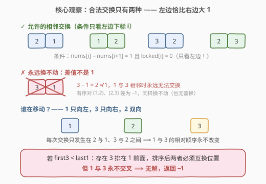
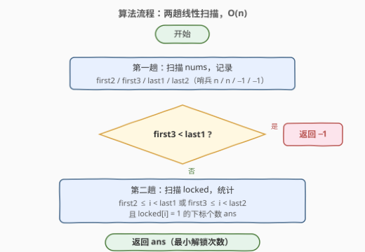
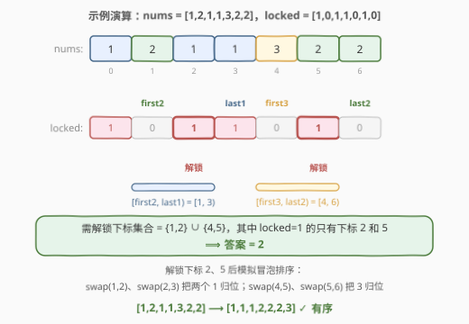

# 对数字排序的最小解锁下标

- **题目名称**：对数字排序的最小解锁下标
- **链接**：[3431. 对数字排序的最小解锁下标](https://leetcode.cn/problems/minimum-unlocked-indices-to-sort-nums/)
- **难度**：中等
- **标签**：数组、脑筋急转弯

## 1. 题目概述

> ⚠️ 本题为 LeetCode 付费题，题意描述整理自公开镜像与官方示例用例，可能与官方题面有细微出入。

给定一个仅包含 **1、2、3** 的整数数组 `nums`，以及一个等长的**二进制**数组 `locked`：

- 当 `nums[i] - nums[i+1] == 1` **且** `locked[i] == 0` 时，允许**交换下标 `i` 和 `i+1` 处的元素**（注意条件只看**左边**下标 `i` 是否解锁）；
- 如果可以通过若干次上述相邻交换把 `nums` 变成**非递减**（升序），称 `nums` 是**可排序的**。

每次「解锁」操作可以把一个 `locked[i]` 置为 `0`。返回使 `nums` 变为可排序所需的**最小解锁次数**；若不可能，返回 `-1`。

**示例 1**：

```text
输入：nums = [1,2,1,2,3,2], locked = [1,0,1,1,0,1]
输出：0
解释：直接交换下标 (1,2) 和 (4,5) 即可完成排序，无需解锁任何下标。
```

**示例 2**：

```text
输入：nums = [1,2,1,1,3,2,2], locked = [1,0,1,1,0,1,0]
输出：2
解释：解锁下标 2 和 5 后，依次交换 (1,2)、(2,3)、(4,5)、(5,6) 即可排序。
```

**示例 3**：

```text
输入：nums = [1,2,1,2,3,2,1], locked = [0,0,0,0,0,0,0]
输出：-1
解释：即使全部下标都已解锁，nums 依然无法排序。
```

**约束条件**：

- `1 <= nums.length <= 10^5`
- `1 <= nums[i] <= 3`
- `locked.length == nums.length`
- `0 <= locked[i] <= 1`

---

## 2. 解题思路

### 2.1 暴力思路

最朴素的做法是**枚举解锁集合**：设 `locked` 中值为 1 的下标有 `k` 个，枚举它们的全部 `2^k` 个子集，对每个子集模拟排序过程——反复扫描，找到满足 `nums[i] - nums[i+1] == 1` 且未锁定的 `i` 就交换，直到数组有序或再也无交换可做。

该做法是指数级的，`n` 上限 `10^5` 时完全不可行。事实上，「可排序性」可以被 **4 个出现位置** 完整刻画，根本无需模拟。

### 2.2 核心观察：只有两种交换，1 与 3 永不交叉



把「解锁下标 `i`」理解为「打开 `i` 与 `i+1` 之间的交换通道」。整个问题只由以下三条观察决定：

**观察一：合法交换只有两种。** 条件 `nums[i] - nums[i+1] == 1` 意味着只有 `(2,1) → (1,2)` 和 `(3,2) → (2,3)` 两种相邻交换——即每次恰好消掉一个「左比右大 1」的相邻逆序对。`1` 只会**向左移**（被左边的 2 换过去），`3` 只会**向右移**（被右边的 2 换过去），`2` 双向移动。

**观察二：1 与 3 的相对顺序永不改变。** 任意两个元素要改变相对顺序，在相邻交换体系里必须**直接被互换一次**；而 `1` 与 `3` 相邻时差值为 2，永远不满足交换条件。于是：

- 若 `first3 < last1`（存在某个 3 排在某个 1 前面），排序后这个 1 必须越过这个 3——不可能，直接返回 `-1`；
- 反之（所有 1 都在所有 3 前面），只要该解锁的都解锁了，一定可以排好（见观察三的充分性）。

**观察三：必须解锁的下标恰为两个左闭右开区间。** 记 `first2 / first3` 为 2、3 首次出现的下标，`last1 / last2` 为 1、2 最后出现的下标，则：

$$\text{需解锁的下标集合} = [\,first2,\ last1\,) \ \cup\ [\,first3,\ last2\,)$$

- **必要性（区间内必须解锁）**：若 `first2 <= i < last1`，则下标 `i` 左边有个 2（位置 `first2`），右边有个 1（位置 `last1`）。排序后前 `i+1` 个位置应放 `min(i+1, c1)` 个 1（`c1` 为 1 的总数），而当前 `[0..i]` 中 1 的个数 `<= i`（下标 `first2` 被 2 占据）且 `<= c1 - 1`（`last1` 处还有个 1）——比目标至少少一个。因此必有至少一个 1 从右边**穿过 `i` 与 `i+1` 的边界**向左移，这一步正是一次发生在下标 `i` 处的 `(2,1)` 交换，要求 `locked[i] = 0`。`[first3, last2)` 的论证完全对称（把数组左右翻转、值 1↔3 互换后，两种交换规则不变，该区间恰变为前者），必有 3 向右穿出边界。
- **充分性（区间外无需解锁）**：任何 `(2,1)` 交换发生时 `nums[i]=2` 说明 `first2 <= i`，`nums[i+1]=1` 说明 `last1 >= i+1 > i`，即交换只可能落在 `[first2, last1)` 内；同理 `(3,2)` 交换只落在 `[first3, last2)` 内。因此只要这两个区间内的下标全部解锁，就可以不断消去相邻逆序对（每次交换逆序数减一；又因 1 永远在 3 前面，相邻逆序只可能是 `(2,1)` 或 `(3,2)`），冒泡到有序为止。

> 💡 注意区间是**左闭右开**：下标 `last1` 本身不用解锁——它左侧已含全部 1，而 1 只向左移，不会再有 1 从它右边穿入；同理 `[0..last2]` 已装下全部 1 和 2，没有 3 需要跨过下标 `last2` 向右穿出。示例 1 中 `first2=1, last1=2, first3=4, last2=5`，需解锁集合为 `{1, 4}`，恰好都未锁定，所以答案是 0。

**结论**：若 `first3 < last1` 返回 `-1`；否则答案为 `[first2, last1) ∪ [first3, last2)` 内 `locked[i] = 1` 的下标个数。

### 2.3 算法流程图



两趟线性扫描：第一趟在 `nums` 中记录 `first2 / first3 / last1 / last2` 四个量（不存在时分别取 `n / n / -1 / -1` 作哨兵）；判定 `-1` 后，第二趟在 `locked` 中统计落在两个区间内的锁定下标数。

### 2.4 示例演算



以示例 2 为例：`nums = [1,2,1,1,3,2,2]`，扫描得 `first2=1, last1=3, first3=4, last2=6`。`first3=4 > last1=3`，可行。需解锁下标集合为 `[1,3) ∪ [4,6) = {1,2,4,5}`，其中 `locked=1` 的只有下标 2 和 5，故答案为 2。解锁后依次交换 `(1,2)、(2,3)` 把两个 1 归位、交换 `(4,5)、(5,6)` 把 3 归位，数组变为 `[1,1,1,2,2,2,3]`。

---

## 3. 参考代码

### C++

```cpp
class Solution {
  public:
    int minUnlockedIndices(vector<int>& nums, vector<int>& locked) {
        int n = nums.size();
        int first2 = n, first3 = n;
        int last1 = -1, last2 = -1;

        for (int i = 0; i < n; i++) {
            if (nums[i] == 1) {
                last1 = i;
            } else if (nums[i] == 2) {
                first2 = min(first2, i);
                last2 = i;
            } else {
                first3 = min(first3, i);
            }
        }

        if (first3 < last1) {
            return -1;
        }

        int ans = 0;
        for (int i = 0; i < n; i++) {
            if (locked[i] == 1 && (first2 <= i && i < last1 || first3 <= i && i < last2)) {
                ans++;
            }
        }
        return ans;
    }
};
```

### Python

```python
class Solution:
    def minUnlockedIndices(self, nums: List[int], locked: List[int]) -> int:
        n = len(nums)
        first2 = first3 = n
        last1 = last2 = -1
        for i, x in enumerate(nums):
            if x == 1:
                last1 = i
            elif x == 2:
                first2 = min(first2, i)
                last2 = i
            else:
                first3 = min(first3, i)

        if first3 < last1:
            return -1

        return sum(
            st and (first2 <= i < last1 or first3 <= i < last2)
            for i, st in enumerate(locked)
        )
```

---

## 4. 复杂度分析

| 维度 | 复杂度 | 说明 |
|------|--------|------|
| 时间复杂度 | O(n) | 两趟线性扫描：一趟记录四个出现位置，一趟统计区间内锁定下标 |
| 空间复杂度 | O(1) | 仅使用常数个变量，与输入规模无关 |

---

## 5. 扩展：为什么不存在「换一种顺序绕开锁」的取巧？

一个自然的疑问：交换的先后顺序会不会影响哪些位点被用到？答案是**不会**。对任意边界（下标 `i` 与 `i+1` 之间的缝隙）：

- 必须从右向左穿过它的 1 的个数 = 排序后 `[0..i]` 中 1 的个数 − 初始 `[0..i]` 中 1 的个数（1 只向左移，每个 1 至多穿过每条缝隙一次）；
- 必须从左向右穿过它的 3 的个数 = 初始 `[0..i]` 中 3 的个数 − 排序后 `[0..i]` 中 3 的个数。

这两个量**只由初始数组与最终有序数组决定，与交换顺序无关**——这正是「相邻交换排序中每个位点的交换次数是定值」的经典不变量。因此需要解锁的下标集合是唯一的，提前解锁与边换边解锁效果相同，本题才能放心地用纯计数求解。

若把值域推广到 `1..k`（交换条件仍为左比右恰大 1），结论同样成立：对每对相邻值 `(v+1, v)` 累加区间 `[first(v+1), last(v))` 内的锁定下标数；对任意值差 `>= 2` 的对 `(u, w)`，只要存在 `w` 排在 `u` 前面即返回 `-1`。

---

## 6. 面试要点

1. **为什么 `first3 < last1` 直接返回 `-1`？**
   - 相邻交换中两个元素要改变相对顺序，必须直接被互换一次；而 1 与 3 相邻时差值为 2，永远不满足 `nums[i] - nums[i+1] == 1`。故 1 与 3 的相对顺序是不变量，存在 3 在 1 前面时排序无解。

2. **交换条件为什么只看 `locked[i]`，不用管 `locked[i+1]`？**
   - 题目规定条件为 `nums[i] - nums[i+1] == 1 且 locked[i] == 0`，解锁的是「发起交换的左侧下标」。这也是两个区间取「左闭右开」的根源之一。

3. **区间为什么是 `[first2, last1)` 而不是闭区间 `[first2, last1]`？**
   - 下标 `last1` 左侧已含全部 1，1 又只向左移，不会再有 1 穿过 `last1` 右侧的边界；同理 `[0..last2]` 已装下全部 1 和 2，没有 3 需要跨过下标 `last2` 向右穿出。右端点必须开区间，否则会多算（如示例 1 中 `last1=2` 若计入则答案错误地变成 1）。

4. **会不会存在某种聪明的交换顺序，绕开某个锁定的下标？**
   - 不会。穿过任一边界的 1（向左）与 3（向右）的个数由初始/最终数组唯一确定，与交换顺序无关——需要解锁的下标集合是唯一的，不存在取巧。

5. **本题为什么完全不用模拟排序？**
   - 因为可排序性被 `first2 / first3 / last1 / last2` 四个量完整刻画：先判 `first3 < last1` 的无解情形，再数两个区间内的锁定下标即可，两趟 `O(n)` 扫描出答案。

---

## 7. 同类练习题

- [665. 非递减数列](https://leetcode.cn/problems/non-decreasing-array/)（[题解](../0601-0700/665_非递减数组.md)）：判断至多改一个元素能否使数组有序，同为「受限操作下的有序性判定」
- [769. 最多能完成排序的块](https://leetcode.cn/problems/max-chunks-to-make-sorted/)：用前缀最值判断哪些前缀已经就位，与「用区间端点刻画有序性」的思想相通
- [969. 煎饼排序](https://leetcode.cn/problems/pancake-sorting/)（[题解](../0901-1000/969_煎饼排序.md)）：受限操作（前缀翻转）下完成排序的构造题
- [1460. 通过翻转子数组使两个数组相等](https://leetcode.cn/problems/make-two-arrays-equal-by-reversing-subarrays/)（[题解](../1401-1500/1460_通过翻转子数组使两个数组相等.md)）：受限操作下的可达性判定，本题 `-1` 判定的近亲
- [1585. 检查字符串是否可以通过排序子字符串得到另一个字符串](https://leetcode.cn/problems/check-if-string-is-transformable-with-substring-sort-operations/)（[题解](../1501-1600/1585_检查字符串是否可以通过排序子字符串得到另一个字符串.md)）：受限交换可达性的困难版，同样依赖「相对顺序不变量」
