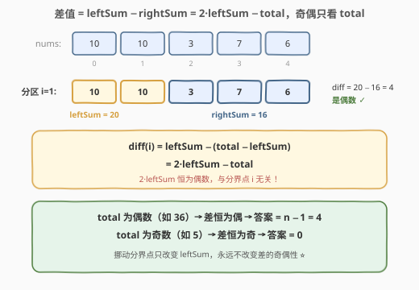
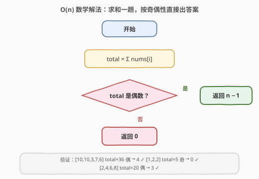

# 统计元素和差值为偶数的分区方案

- **题目名称**：统计元素和差值为偶数的分区方案
- **链接**：[3432. 统计元素和差值为偶数的分区方案](https://leetcode.cn/problems/count-partitions-with-even-sum-difference/)
- **难度**：简单
- **标签**：数组、数学、前缀和

## 1. 题目概述

给你一个长度为 `n` 的整数数组 `nums`。

**分区**是指将数组按照下标 `i`（`0 <= i < n - 1`）划分成两个**非空**子数组，其中：

- 左子数组包含区间 `[0, i]` 内的所有下标；
- 右子数组包含区间 `[i + 1, n - 1]` 内的所有下标。

对左子数组和右子数组先求元素**和**再做**差**，统计并返回差值为**偶数**的分区方案数。

**示例 1**：

```text
输入：nums = [10,10,3,7,6]
输出：4
解释：
  [10] | [10,3,7,6]     差值 = 10 − 26 = −16，偶数
  [10,10] | [3,7,6]     差值 = 20 − 16 = 4，偶数
  [10,10,3] | [7,6]     差值 = 23 − 13 = 10，偶数
  [10,10,3,7] | [6]     差值 = 30 − 6 = 24，偶数
```

**示例 2**：

```text
输入：nums = [1,2,2]
输出：0
解释：不存在元素和的差值为偶数的分区方案。
```

**示例 3**：

```text
输入：nums = [2,4,6,8]
输出：3
解释：所有分区方案都满足元素和的差值为偶数。
```

**约束条件**：

- `2 <= n == nums.length <= 100`
- `1 <= nums[i] <= 100`

---

## 2. 解题思路

### 2.1 暴力思路

枚举每个分界下标 `i`（共 `n − 1` 个），每次从头累加左右两段的和再作差判奇偶：

```text
ans = 0
for i in 0 .. n-2:
    leftSum  = nums[0] + ... + nums[i]
    rightSum = nums[i+1] + ... + nums[n-1]
    if (leftSum - rightSum) % 2 == 0:
        ans += 1
```

时间复杂度 `O(n^2)`。本题 `n <= 100` 完全能过，但每个分界点的左和、右和都被反复累加——左和随 `i` 增大只增不减，存在大量重复计算。用**前缀和**可以一趟维护 `leftSum`（`rightSum = total - leftSum`），降到 `O(n)`。

### 2.2 核心观察：差值奇偶性只由总和决定



设 `total` 为整个数组的元素和，`leftSum` 为分界点左侧的元素和。则任意分区 `i` 的差值可以改写为：

$$\text{diff}(i) = \text{leftSum} - \text{rightSum} = \text{leftSum} - (\text{total} - \text{leftSum}) = 2 \cdot \text{leftSum} - \text{total}$$

关键在于 $2 \cdot \text{leftSum}$ **恒为偶数**，与分界点 `i` 无关。于是：

- `total` 为**偶数**时：偶数 − 偶数 = 偶数，**所有** `n − 1` 个分区都合法；
- `total` 为**奇数**时：偶数 − 奇数 = 奇数，**没有任何**分区合法。

$$ans = \begin{cases} n - 1, & \text{total 为偶数} \\ 0, & \text{total 为奇数} \end{cases}$$

> 💡 换个直观视角：左右两和相加恒等于 `total`，「差为偶数」等价于「两和同奇偶」，而两和同奇偶等价于它们的和 `total` 为偶数。分界点怎么挪都不改变这个性质——这就是「只看总和」的直觉解释。

验证示例：`[10,10,3,7,6]` 的 `total = 36` 为偶数，答案 `n − 1 = 4` ✓；`[1,2,2]` 的 `total = 5` 为奇数，答案 `0` ✓；`[2,4,6,8]` 的 `total = 20` 为偶数，答案 `3` ✓。

### 2.3 算法流程图



整个算法只剩两步：一趟求 `total`，再按其奇偶性直接输出 `n − 1` 或 `0`。

---

## 3. 参考代码

### C++

```cpp
class Solution {
  public:
    int countPartitions(vector<int>& nums) {
        int total = accumulate(nums.begin(), nums.end(), 0);
        return total % 2 == 0 ? (int)nums.size() - 1 : 0;
    }
};
```

### Python

```python
class Solution:
    def countPartitions(self, nums: List[int]) -> int:
        return len(nums) - 1 if sum(nums) % 2 == 0 else 0
```

---

## 4. 复杂度分析

| 维度 | 复杂度 | 说明 |
|------|--------|------|
| 时间复杂度 | O(n) | 一趟累加求 `total`，奇偶判断与返回 O(1) |
| 空间复杂度 | O(1) | 只用常数个变量，无需前缀和数组 |

---

## 5. 扩展：奇偶性的等价判据与推广

**等价判据**：`total` 的奇偶性等于数组中**奇数元素的个数** mod 2。因此只数一遍奇数个数即可，与求和殊途同归：

```text
odd = count(x % 2 == 1 for x in nums)
ans = (odd % 2 == 0) ? n - 1 : 0
```

这也说明约束 `nums[i] >= 1` 并不本质——即使元素含 `0` 或负数，奇偶性判据依然成立（负数的奇偶性与符号无关）。

**推广到模 K**：把「差为偶数」改成「差能被 `K` 整除」，条件变为 $2 \cdot \text{leftSum} \equiv \text{total} \pmod{K}$。当 $\gcd(2, K) = 1$ 时（`K` 为奇数），每个分界点是否合法取决于 $\text{leftSum} \bmod K$，需要前缀和逐点判断；当 `K` 为偶数时左右两半可以分情况讨论。这类「前缀和 + 同余」的套路在 [974. 和可被 K 整除的子数组](https://leetcode.cn/problems/subarray-sums-divisible-by-k/) 中有完整体现。

---

## 6. 面试要点

1. **为什么差值的奇偶性与分界点 `i` 无关？**
   - 差值 $= 2 \cdot \text{leftSum} - \text{total}$，其中 $2 \cdot \text{leftSum}$ 恒为偶数，故奇偶性完全由 `total` 决定，挪动分界点不改变结论。

2. **答案为什么是 `n − 1` 或 `0`，没有中间值？**
   - 合法的分界点 `i` 取 `0` 到 `n − 2` 共 `n − 1` 个；由上一问，它们要么全部合法、要么全部不合法，不存在部分合法的情况。

3. **暴力、前缀和、数学三种解法的关系？**
   - 暴力 `O(n^2)`；前缀和维护 `leftSum` 降到 `O(n)` 空间 `O(1)`；再利用奇偶性发现每个分界点的判定结果相同，`O(n)` 的循环也省了，只剩求和一趟。三解法是逐步「发现冗余」的过程。

4. **求和会溢出吗？**
   - 不会。`n <= 100`、`nums[i] <= 100`，`total <= 10^4`，远小于 `2^31 − 1`。

5. **如果元素可能为负数或零，结论还成立吗？**
   - 成立。奇偶性只与数值 mod 2 有关，与符号无关；`2 · leftSum` 恒为偶数的推导不依赖元素取值范围。

---

## 7. 同类练习题

- [3427. 变长子数组求和](https://leetcode.cn/problems/sum-of-variable-length-subarrays/)（[题解](../3401-3500/3427_变长子数组求和.md)）：前缀和 O(1) 求任意区间和的基础模板
- [724. 寻找数组的中心下标](https://leetcode.cn/problems/find-pivot-index/)（[题解](../0701-0800/724_寻找数组的中心下标.md)）：同样是「左和与右和的关系」，用 `total − left` 表示右侧和
- [974. 和可被 K 整除的子数组](https://leetcode.cn/problems/subarray-sums-divisible-by-k/)（[题解](../0901-1000/974_和可被K整除的子数组.md)）：本题「模 2 推广到模 K」后的前缀和同余套路
- [1523. 在区间范围内统计奇数数目](https://leetcode.cn/problems/count-odd-numbers-in-an-interval-range/)（[题解](../1501-1600/1523_在区间范围内统计奇数数目.md)）：奇偶性的 O(1) 数学判定练习
