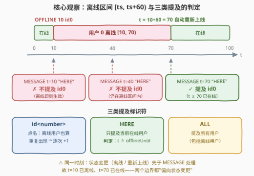
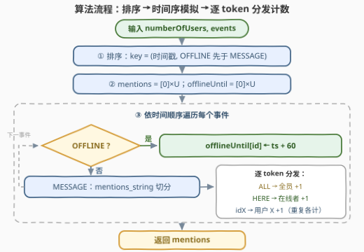

# 统计用户被提及情况

- **题目名称**：统计用户被提及情况
- **链接**：[3433. 统计用户被提及情况](https://leetcode.cn/problems/count-mentions-per-user/)
- **难度**：中等
- **标签**：数组、排序、模拟、字符串处理

## 1. 题目概述

给你一个整数 `numberOfUsers` 表示用户总数（编号 $0 \sim \text{numberOfUsers}-1$），另有一个大小为 $n \times 3$ 的数组 `events`。每个事件属于下述两种类型之一：

1. **消息事件**：`["MESSAGE", timestamp, mentions_string]`——在 `timestamp` 时，一组用户被消息提及。`mentions_string` 中的标识符为：
   - `id<number>`：提及编号为 `<number>` 的用户，**离线用户也能被提及**；多个 id 用单个空格分隔，**id 可能重复**；
   - `ALL`：提及**所有**用户；
   - `HERE`：提及所有**在线**用户。
2. **离线事件**：`["OFFLINE", timestamp, id]`——用户 `id` 在 `timestamp` 时离线 **60 个单位时间**，在 `timestamp + 60` 时自动再次上线。

返回数组 `mentions`，其中 `mentions[i]` 为用户 `i` 在所有 `MESSAGE` 事件中被提及的次数。初始所有用户在线；**同一时刻的状态变更（离线/重新上线）先于消息事件处理**；同一消息中同一用户被提及多次需**分别计数**。

**示例 1**：

```text
输入：numberOfUsers = 2, events = [["MESSAGE","10","id1 id0"],["OFFLINE","11","0"],["MESSAGE","71","HERE"]]
输出：[2,2]
解释：t=10 时 id1、id0 各被提及一次；t=11 时 id0 离线（70 时刻恢复在线）；
      t=71 时 id0 已重新上线，HERE 提及两人 → [2,2]。
```

**示例 2**：

```text
输入：numberOfUsers = 2, events = [["MESSAGE","10","id1 id0"],["OFFLINE","11","0"],["MESSAGE","12","ALL"]]
输出：[2,2]
解释：t=12 时 ALL 提及所有用户（含离线的 id0）→ [2,2]。
```

**示例 3**：

```text
输入：numberOfUsers = 2, events = [["OFFLINE","10","0"],["MESSAGE","12","HERE"]]
输出：[0,1]
解释：id0 离线区间为 [10,70)，t=12 的 HERE 不提及离线用户 → [0,1]。
```

**约束条件**：

- $1 \le \text{numberOfUsers} \le 100$
- $1 \le \text{events.length} \le 100$，$\text{events}[i]$ 长度为 3
- $1 \le \text{int}(\text{events}[i][1]) \le 10^5$
- 单条 `MESSAGE` 中以 `id<number>` 形式提及的用户数介于 $1$ 和 $100$ 之间，$0 \le \text{number} \le \text{numberOfUsers}-1$
- `OFFLINE` 引用的用户在事件发生时保证**在线**

> 💡 **读题关键**：① 事件**不保证按时间顺序**给出，必须先按时间戳排序；② 同一时间戳时**状态变更（OFFLINE / 重新上线）先于 MESSAGE**——排序要双关键字；③ 离线区间是**左闭右开** $[ts,\ ts+60)$：$t=ts$ 时已离线、$t=ts+60$ 时已在线（两个边界都"先变状态再发消息"）；④ `id` 点名**无视在线状态**且**重复分别计数**；`HERE` 只数在线者；`ALL` 数全员。

---

## 2. 解题思路

### 2.1 朴素做法的两个坑

数据规模极小（用户数、事件数均 $\le 100$），任何合理模拟都能跑完，这题的难度全在**语义细节**而非复杂度。两种朴素做法各有陷阱：

- **按输入顺序直接处理**：题面未保证事件有序。若 `OFFLINE` 出现在更晚时间戳的 `MESSAGE` 之后（输入顺序却在前），状态与消息的先后就颠倒了——示例 1 把 `OFFLINE "11"` 挪到数组首位，不排序就会漏掉 `id0` 的离线，`HERE` 判定出错。
- **逐分钟推进时间轴**：时间戳上限 $10^5$，逐分钟维护在线集合也能过（$10^5 \times 100$ 次状态检查），但完全没必要——离线时长固定 60，"何时恢复在线"在收到 `OFFLINE` 事件的那一刻就确定了，可以**惰性记录**。

### 2.2 核心观察：排序 + 惰性离线区间

三条规则定乾坤：

**规则一：排序键为 (时间戳, OFFLINE 优先)。** 同一时刻先处理状态变更、再处理消息，正对应题面"状态变更在相同时间的消息事件之前处理"。

**规则二：用 `offlineUntil[i]` 惰性表示在线状态。** 维护数组 `offlineUntil`（用户 $i$ 恢复在线的时刻，初始为 $0$ 表示从未离线）：

$$\text{OFFLINE}\ ts\ id \;\Longrightarrow\; \text{offlineUntil}[id] \leftarrow ts + 60$$

于是在时刻 $t$：用户 $i$ 在线 $\iff t \ge \text{offlineUntil}[i]$。离线区间恰为左闭右开的 $[ts,\ ts+60)$——两个端点都因"状态变更先行"而偏向状态：$t=ts$ 已离线，$t=ts+60$ 已上线（示例 1 中 $t=71$ 的 `HERE` 提及 `id0` 正是右边界的直接验证）。题目保证 `OFFLINE` 只作用于在线用户，故直接赋值即可、无需取 $\max$。

**规则三：`mentions_string` 按空格切分、逐 token 分发。** 对每个 token：`idX` → `mentions[X]++`（无视在线状态）；`HERE` → 所有满足 $t \ge \text{offlineUntil}[u]$ 的用户 `+1`；`ALL` → 全员 `+1`。逐 token 处理天然支持**重复 id 分别计数**，也把三种形态统一进一个循环。



### 2.3 算法流程



### 2.4 示例演算

以示例 1（`numberOfUsers = 2`）走完整流程。排序后顺序不变（时间戳 $10 < 11 < 71$）：

| 事件 | 时刻 | 处理 | mentions | offlineUntil |
|---|---|---|---|---|
| `MESSAGE "id1 id0"` | 10 | id0 +1，id1 +1 | [1, 1] | [0, 0] |
| `OFFLINE id0` | 11 | offlineUntil[0] ← 71 | [1, 1] | [71, 0] |
| `MESSAGE "HERE"` | 71 | $71 \ge 71$ → id0 +1；$71 \ge 0$ → id1 +1 | **[2, 2]** | [71, 0] |

示例 3 是左边界的反例：`OFFLINE 10` 后 `offlineUntil[0]=70`，$t=12$ 的 `HERE` 判 $12 \ge 70$ 不成立 → `id0` 不被提及，答案 $[0,1]$ ✓。再补一个排序正确性的探针：`[["MESSAGE","5","HERE"],["OFFLINE","5","1"],["MESSAGE","5","HERE"]]`（3 个用户），两个 `MESSAGE` 与 `OFFLINE` 同刻——排序后 `OFFLINE` 先行，两次 `HERE` 都不含用户 1，答案为 $[2,0,0]$。

---

## 3. 参考代码

### C++

```cpp
class Solution {
  public:
    vector<int> countMentions(int numberOfUsers, vector<vector<string>>& events) {
        int n = events.size();
        vector<int> idx(n);
        iota(idx.begin(), idx.end(), 0);
        // ① 双关键字排序：时间戳升序；同刻 OFFLINE（状态变更）先于 MESSAGE
        sort(idx.begin(), idx.end(), [&](int a, int b) {
            int ta = stoi(events[a][1]), tb = stoi(events[b][1]);
            if (ta != tb) return ta < tb;
            return (events[a][0] == "OFFLINE") > (events[b][0] == "OFFLINE");
        });

        vector<int> mentions(numberOfUsers, 0);
        vector<int> offlineUntil(numberOfUsers, 0);   // ② 恢复在线的时刻；0 = 从未离线
        for (int i : idx) {
            auto& e = events[i];
            int t = stoi(e[1]);
            if (e[0] == "OFFLINE") {
                offlineUntil[stoi(e[2])] = t + 60;    // 注意：OFFLINE 的 id 不带 "id" 前缀
            } else {
                const string& s = e[2];               // ③ 逐 token 分发，重复 id 各计一次
                size_t j = 0;
                while (j < s.size()) {
                    size_t k = s.find(' ', j);
                    if (k == string::npos) k = s.size();
                    string tok = s.substr(j, k - j);
                    j = k + 1;
                    if (tok == "ALL") {
                        for (int u = 0; u < numberOfUsers; ++u) mentions[u]++;
                    } else if (tok == "HERE") {
                        for (int u = 0; u < numberOfUsers; ++u)
                            if (t >= offlineUntil[u]) mentions[u]++;   // 左闭右开区间判定
                    } else {
                        mentions[stoi(tok.substr(2))]++;               // "idX" 去前缀
                    }
                }
            }
        }
        return mentions;
    }
};
```

### Python

```python
class Solution:
    def countMentions(self, numberOfUsers: int, events: List[List[str]]) -> List[int]:
        # ① 双关键字排序：时间戳升序；同刻 OFFLINE（状态变更）先于 MESSAGE
        evs = sorted(events, key=lambda e: (int(e[1]), e[0] != "OFFLINE"))
        mentions = [0] * numberOfUsers
        offline_until = [0] * numberOfUsers          # ② 恢复在线的时刻；0 = 从未离线
        for typ, ts, s in evs:
            t = int(ts)
            if typ == "OFFLINE":
                offline_until[int(s)] = t + 60       # OFFLINE 的 id 是纯数字，无 "id" 前缀
            else:
                for tok in s.split():                # ③ 逐 token 分发，重复 id 各计一次
                    if tok == "ALL":
                        for u in range(numberOfUsers):
                            mentions[u] += 1
                    elif tok == "HERE":
                        for u in range(numberOfUsers):
                            if t >= offline_until[u]:
                                mentions[u] += 1     # 左闭右开区间判定
                    else:
                        mentions[int(tok[2:])] += 1  # "idX" 去前缀
        return mentions
```

> 💡 **实现细节**：① `OFFLINE` 事件的 id 字段是纯数字字符串（如 `"0"`），只有 `MESSAGE` 里的提及才带 `id` 前缀——两处解析方式不同，混用会直接抛异常（也算一种"提醒"）；② Python 排序键 `e[0] != "OFFLINE"` 使 `OFFLINE` 映射为 `False(0)`、`MESSAGE` 映射为 `True(1)`，一行实现双关键字；③ C++ 手工切分时注意末尾 token 的边界（`find` 返回 `npos` 时取 `s.size()`）。

---

## 4. 复杂度分析

| 维度 | 复杂度 | 说明 |
|------|--------|------|
| 时间复杂度 | $O\big(E\log E + E \cdot (U + L)\big)$ | 排序 $O(E\log E)$；每个 `MESSAGE` 至多遍历 $U$ 个用户与 $L$ 个 token |
| 空间复杂度 | $O(U)$ | `mentions` 与 `offlineUntil` 两张线性表（不计排序开销） |
| 逐分钟模拟对照 | $O(T \cdot U)$ | $T$ 为时间戳上限（$10^5$），量级大但约束下也能过，仅作反面参照 |

其中 $E$ = 事件数、$U$ = 用户数、$L$ = 单条消息 token 数，约束下均 $\le 100$。

---

## 5. 扩展：两条变体追问

**若 `OFFLINE` 可作用于已离线用户。** 本题保证不会发生，故 `offlineUntil[id] = ts + 60` 直接赋值即可；一旦去掉该保证（真实系统的断线重连就是如此），新离线可能与未到期的旧离线重叠，需改为 $\text{offlineUntil}[id] \leftarrow \max(\text{offlineUntil}[id],\ ts+60)$，否则会"提前放行"。

**若事件以流式到达、无法预先排序。** 排序不可用时改用**小根堆**：事件按时间戳入堆，同刻 `OFFLINE` 优先弹出；逻辑与离线版完全一致，只是把"先排后扫"换成"边到边处理"。时间戳上限巨大（如 $10^{18}$）时这套惰性判定依然 $O(1)$——这正是它优于逐分钟模拟的地方。

---

## 6. 面试要点

1. **为什么必须排序？同一时间戳的次序怎么定？**

   - 题面不保证事件按时间给出，且明确规定状态变更在相同时间的消息之前处理，故排序键为（时间戳，`OFFLINE` 优先）双关键字。漏掉第二关键字，"`OFFLINE` 与 `MESSAGE` 同刻"的用例（如 2.4 的探针）就会把刚离线的用户误判为在线。

2. **时刻 $t$ 的在线判定为什么是 $t \ge \text{offlineUntil}[i]$ 而非严格大于？**

   - 离线区间左闭右开 $[ts, ts+60)$：$t=ts$ 时状态变更已生效（离线），$t=ts+60$ 时"自动再次上线"同样先于同刻消息（在线）。两个边界都偏向状态变更，故判定含等号。示例 1 的 $t=71$ 与示例 3 的 $t=12$ 分别检验右、左边界。

3. **同一消息里 `id0` 出现两次怎么算？三种标识符会混在一起吗？**

   - 每次提及分别计数，`mentions[0]` 加 2。按空格切分后逐 token 分发天然实现"出现几次加几次"；该写法对"纯 id 列表 / `ALL` / `HERE`"三种形态统一处理，即便出现混合串也不漏。

4. **为什么不需要为"重新上线"单独建事件或计时器？**

   - 上线时刻 = 最近一次离线时刻 + 60，收到 `OFFLINE` 时即可确定，用 `offlineUntil` 惰性记录、判定时 O(1) 比较。把"持续 60 单位"建模为"恢复时刻"，避免了逐分钟模拟 $O(T \cdot U)$ 的开销。

5. **`id` 点名可以提及离线用户，`HERE` 不行——这与约束有何联动？**

   - `id`/`ALL` 与在线状态无关，`HERE` 才依赖判定逻辑。题目保证 `OFFLINE` 只作用于在线用户，故 `offlineUntil` 不会被未到期的离线覆盖、直接赋值安全；若去掉该保证需取 $\max$（见第 5 节扩展）。

---

## 7. 同类练习题

- [1094. 拼车](https://leetcode.cn/problems/car-pooling/)（[站内题解](../1001-1100/1094_拼车.md)）：同样把"区间占用"放到时间轴上按序模拟，练事件排序与边界判定的手感
- [1701. 平均等待时间](https://leetcode.cn/problems/average-waiting-time/)（[站内题解](../1701-1800/1701_平均等待时间.md)）：按事件时间顺序模拟顾客到达与服务完成，状态随时间推进的入门题
- [1419. 数青蛙](https://leetcode.cn/problems/minimum-number-of-frogs-croaking/)（[站内题解](../1401-1500/1419_数青蛙.md)）：状态计数模拟，考"状态变更与字符流次序"的细节处理
- [1109. 航班预订统计](https://leetcode.cn/problems/corporate-flight-bookings/)：区间加法用差分数组 O(1) 完成，与本题"离线区间影响在线判定"互为镜像
