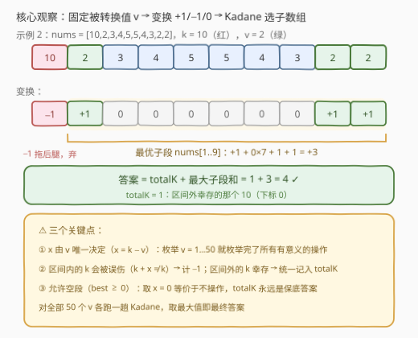
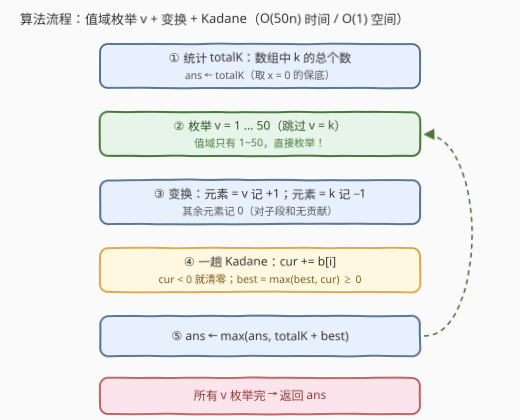

# 子数组操作后的最大频率

- **题目名称**：子数组操作后的最大频率
- **链接**：[3434. 子数组操作后的最大频率](https://leetcode.cn/problems/maximum-frequency-after-subarray-operation/)
- **难度**：中等
- **标签**：贪心、数组、枚举、动态规划、前缀和

## 1. 题目概述

给你一个长度为 $n$ 的数组 `nums` 和一个整数 $k$。你可以对 `nums` 执行以下操作**一次**：

- 选择一个子数组 `nums[i..j]`（$0 \le i \le j \le n-1$）；
- 选择一个整数 $x$，把 `nums[i..j]` 中**所有**元素都增加 $x$。

请你返回操作之后数组中 $k$ 出现的**最大频率**（子数组是数组中连续非空的一段）。

**示例 1**：

```text
输入：nums = [1,2,3,4,5,6], k = 1
输出：2
解释：把 nums[2..5] 整体加 -5，数组变为 [1, 2, -2, -1, 0, 1]，1 出现 2 次。
```

**示例 2**：

```text
输入：nums = [10,2,3,4,5,5,4,3,2,2], k = 10
输出：4
解释：把 nums[1..9] 整体加 8，数组变为 [10,10,11,12,13,13,12,11,10,10]，10 出现 4 次。
```

**约束条件**：

- $1 \le n \le 10^5$
- $1 \le nums[i] \le 50$
- $1 \le k \le 50$

> 💡 **读题关键**：① $x$ 是**任意整数**——可正、可负、可以是 $0$（取 $x=0$ 作用在任何子数组上都等价于不操作，所以「执行一次」不是负担）；② 子数组可以只覆盖一部分元素，**区间外的元素原样保留**；③ 值域 $1 \le nums[i],\, k \le 50$ 是本题最大的提示——**枚举值域**就是钥匙。

---

## 2. 解题思路

### 2.1 暴力思路

三重枚举：子数组 $O(n^2)$ 个 × 操作方式。$x$ 看似有无穷种取值，但操作后能**变成** $k$ 的，只有原值恰好等于 $k - x$ 的元素——**$x$ 的取值由「想让谁变成 $k$」唯一决定**，有用的 $x$ 至多 50 种。于是暴力 = 枚举 $v$（50 种）× 枚举子数组 $O(n^2)$，总计 $O(50n^2) \approx 5 \times 10^{11}$，$n = 10^5$ 下不可行。

瓶颈在于：对每个 $v$，都要把 $O(n^2)$ 个子数组**逐一评分**。突破口是把「一个子数组的得分」改写成**只依赖区间端点的量**——那样就能用 Kadane 一趟扫完。

### 2.2 核心观察：固定被转换值 $v$，变换 +1/−1/0 后跑 Kadane



**观察一：$x$ 由「被转换值 $v$」唯一决定，枚举 $v$ 即枚举所有有意义的操作。**

操作后某个元素等于 $k$，只有两条来路：

- 它在子数组**内**，且 $nums_i + x = k$——即原值 $v = k - x$，被 $x$ **转换**成了 $k$；
- 它在子数组**外**，且 $nums_i = k$——**幸存**下来的 $k$。

所以一次操作完全由二元组 $(v,\,[l,r])$ 刻画：$v \in \{1,\dots,50\}$ 决定 $x = k - v$，$[l,r]$ 决定转换范围。$v = k$（即 $x = 0$）对应「什么都不变」的空操作。

**观察二：区间内的 $k$ 会被「误伤」——这是最容易漏的一项。**

$v \ne k$ 时 $x = k - v \ne 0$，子数组内**原有**的 $k$ 变成 $k + x \ne k$，反而被打掉了！于是固定 $v$、选子数组 $[l, r]$ 的净收益是：

$$
\text{收益}(v,[l,r]) \;=\; \underbrace{\#\{i \in [l,r] : nums_i = v\}}_{\text{区间内转换成 } k} \;+\; \underbrace{\text{totalK} - \#\{i \in [l,r] : nums_i = k\}}_{\text{区间外幸存的 } k} \;=\; \text{totalK} + \sum_{i=l}^{r} b_i
$$

其中 totalK 是全数组中 $k$ 的总个数，变换数组 $b_i = +1$（$nums_i = v$）、$-1$（$nums_i = k$）、$0$（其他）。

**观察三：最大化 $\sum_{i=l}^{r} b_i$ 就是最大子数组和——Kadane 一趟解决。**

对每个 $v \ne k$，把数组变换成 $b$，跑一趟**允许空段**的 Kadane（$best \ge 0$），答案即：

$$
\text{ans} \;=\; \max\Big(\text{totalK},\; \max_{v \ne k} \big(\text{totalK} + \text{kadane}(b^{(v)})\big)\Big)
$$

允许空段是安全的：题目要求子数组非空，但取 $x = 0$ 作用在任意子数组上都等价于不操作，totalK 永远可达——空段收益 $0$ 恰好对应这个保底，不会引入达不到的答案。

### 2.3 算法流程图



1. **统计 totalK**（数组中 $k$ 的总个数），`ans ← totalK`（$x = 0$ 保底）；
2. **枚举 $v = 1 \dots 50$**（跳过 $v = k$）；
3. **一趟 Kadane**：$b_i = +1/-1/0$，`cur` 为负就清零，`best` 记录历史最大（$\ge 0$）；
4. **更新** `ans ← max(ans, totalK + best)`；
5. 所有 $v$ 处理完，返回 `ans`。

### 2.4 示例演算

以**示例 2**（$nums = [10,2,3,4,5,5,4,3,2,2]$，$k = 10$）演算 $v = 2$ 这一支：

| 下标 | 0 | 1 | 2 | 3 | 4 | 5 | 6 | 7 | 8 | 9 |
|---|---|---|---|---|---|---|---|---|---|---|
| $nums_i$ | 10 | 2 | 3 | 4 | 5 | 5 | 4 | 3 | 2 | 2 |
| $b_i$ | −1 | +1 | 0 | 0 | 0 | 0 | 0 | 0 | +1 | +1 |
| Kadane `cur` | 0 | 1 | 1 | 1 | 1 | 1 | 1 | 1 | 2 | 3 |

`best = 3`（最优子段 $[1..9]$），答案 $= 1 + 3 = 4$ ✓——区间外的 $10$（下标 0）幸存，区间内三个 $2$ 被加 $8$ 转换成 $10$。

对照**示例 1**（$k=1$）：$v = 6$ 时 $b = [0,0,0,0,0,+1]$，`best = 1`，答案 $1 + 1 = 2$ ✓。

---

## 3. 参考代码

### C++

```cpp
class Solution {
public:
    int maxFrequency(vector<int>& nums, int k) {
        int totalK = count(nums.begin(), nums.end(), k);
        int ans = totalK;                    // 取 x = 0：什么都不变，totalK 保底
        for (int v = 1; v <= 50; v++) {      // 值域只有 1~50，直接枚举
            if (v == k) continue;            // v = k 即 x = 0，保底已覆盖
            int cur = 0, best = 0;           // 允许空段，best >= 0
            for (int x : nums) {
                if (x == v)      cur += 1;   // 区间内的 v：转换成 k，+1
                else if (x == k) cur -= 1;   // 区间内的 k：被误伤打死，-1
                if (cur < 0) cur = 0;        // 前缀为负就整体抛弃（Kadane）
                best = max(best, cur);
            }
            ans = max(ans, totalK + best);
        }
        return ans;
    }
};
```

### Python

```python
class Solution:
    def maxFrequency(self, nums: List[int], k: int) -> int:
        total_k = nums.count(k)
        ans = total_k                    # 取 x = 0：什么都不变，total_k 保底
        for v in set(nums):              # 只枚举实际出现过的值，值域再小也不吃亏
            if v == k:                   # v = k 即 x = 0，保底已覆盖
                continue
            cur = best = 0               # 允许空段，best >= 0
            for x in nums:
                if x == v:
                    cur += 1             # 区间内的 v：转换成 k，+1
                elif x == k:
                    cur -= 1             # 区间内的 k：被误伤打死，-1
                if cur < 0:
                    cur = 0              # 前缀为负就整体抛弃（Kadane）
                best = max(best, cur)
            ans = max(ans, total_k + best)
        return ans
```

> 💡 两处细节：① `cur < 0 就清零` 一个动作同时实现「前缀为负即抛弃」与「空段保底 0」；② C++ 按 $1 \sim 50$ 全枚举（$5\times10^6$ 次操作毫无压力），Python 用 `set(nums)` 去重——值大量重复时能少跑很多趟，纯 Python 循环下是有效的常数优化。

---

## 4. 复杂度分析

| 维度 | 复杂度 | 说明 |
|------|--------|------|
| **时间复杂度** | $O(V \cdot n)$，$V \le 50$ | 每个 $v$ 一趟 Kadane $O(n)$，至多 50 个 $v$；$n = 10^5$ 时约 $5 \times 10^6$ 次基本操作 |
| **空间复杂度** | $O(1)$ | 仅需 totalK / cur / best 等常数个计数器（Python 的 `set` 占 $O(V)$） |

---

## 5. 扩展：值域变大怎么办？

本题的优雅完全建立在 $V \le 50$ 上。若值域无界（如 $-10^9 \le nums_i \le 10^9$）：枚举对象退化为「数组中**实际出现过的值**」，至多 $n$ 个，最坏 $O(n^2)$。一个缓解思路是利用稀疏性——$b$ 数组只在值为 $v$ 或 $k$ 的位置非零，压缩成稀疏序列再做 Kadane，总工作量为 $\sum_{v \ne k} (\text{cnt}_v + \text{cnt}_k) = n + 49 \cdot \text{cnt}_k$：当 $k$ 出现次数不多时接近线性，但 $k$ 占据半数组时仍会退化。「**看到小值域就枚举值**」是比任何数据结构都应先形成的条件反射。

---

## 6. 面试要点

1. **为什么枚举 $v$ 而不是枚举 $x$？**

   - 一一对应：$v = k - x$。$v$ 才是「谁被转换成 $k$」的语义载体，且值域 $1 \sim 50$ 给出天然枚举上界；$x$ 表面上有无穷种，有用的只有 50 种。

2. **区间内的 $k$ 为什么计 $-1$？**

   - $v \ne k$ 时 $x \ne 0$，区间内原有的 $k$ 变成 $k + x \ne k$，被「误伤」打死，必须从收益中扣除；区间外的 $k$ 幸存，统一由 totalK 结算。漏掉这一项会把同一批 $k$ 重复计数。

3. **Kadane 允许空段（best ≥ 0）为什么是对的？**

   - 子数组必须非空，但 $x = 0$ 作用在任意子数组上都等价于不操作——totalK 永远可达；空段收益 $0$ 恰好对应这个保底，不会虚高。

4. **复杂度多少，依据是什么？**

   - $O(50n)$ 时间、$O(1)$ 空间；$n = 10^5$ 时约 $5 \times 10^6$ 次操作，C++/Python 都轻松通过。复杂度的合法性完全来自值域约束 $nums_i, k \le 50$。

5. **本题与 2272（最大波动的子字符串）什么关系？**

   - 同款「枚举值 + $+1/-1/0$ 变换 + Kadane」骨架；2272 枚举的是**字符对** $(a,b)$ 且要求子串中 $b$ 至少出现一次（Kadane 需要改造），可以看作本题的双字符加强版。

> 💡 **一句话总结**：操作 $= (v, [l,r])$ 二元组——$v$ 定 $x$、区间定范围；固定 $v$ 后「区间内 $v$ 计 $+1$、区间内 $k$ 计 $-1$、区间外 $k$ 记入 totalK」，最大化区间和交给 Kadane，值域 50 白送枚举上界。

---

## 7. 同类练习题

- [53. 最大子数组和](https://leetcode.cn/problems/maximum-subarray/)（[题解](../0001-0100/53_最大子数组和.md)）：Kadane 原型，本题对每个 $v$ 跑的就是这趟扫描
- [2272. 最大波动的子字符串](https://leetcode.cn/problems/substring-with-largest-variance/)（[题解](../2201-2300/2272_最大波动的子字符串.md)）：枚举字符对 + 同款 $+1/-1$ 变换 + Kadane（附「至少含一个 $b$」约束），本题的双字符加强版
- [918. 环形子数组的最大和](https://leetcode.cn/problems/maximum-sum-circular-subarray/)（[题解](../0901-1000/918_最大环形子数组和.md)）：Kadane 环形变体，再体会一次「前缀为负即抛弃」
- [3410. 删除所有值为某个元素后的最大子数组和](https://leetcode.cn/problems/maximize-subarray-sum-after-removing-all-occurrences-of-one-element/)（[题解](../3401-3500/3410_删除所有值为某个元素后的最大子数组和.md)）：同为「枚举值 × 最大子段」结构，值域无界时改用线段树置 0/恢复批量处理，与本题的小值域枚举互为对照
- [1838. 最高频元素的频数](https://leetcode.cn/problems/frequency-of-the-most-frequent-element/)（[题解](../1801-1900/1838_最高频元素的频数.md)）：同为「最大频率」题面，套路却是排序 + 滑动窗口，可对比记忆「频率题的两副面孔」
