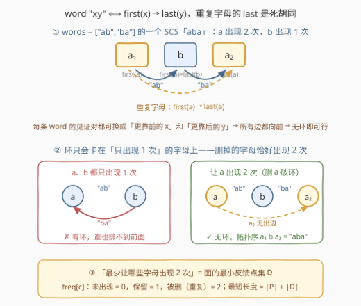
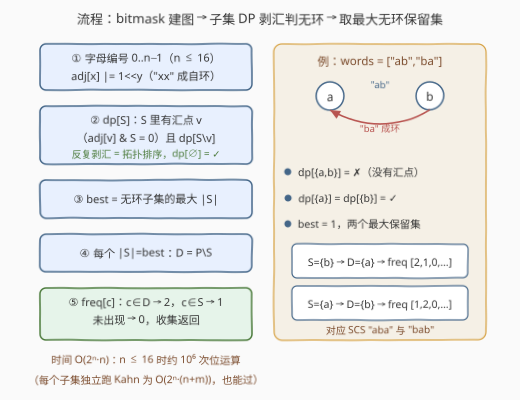

# 最短公共超序列的字母出现频率

- **题目名称**：最短公共超序列的字母出现频率
- **链接**：[3435. 最短公共超序列的字母出现频率](https://leetcode.cn/problems/frequencies-of-shortest-supersequences/)
- **难度**：困难
- **标签**：位运算、图、拓扑排序、数组、字符串、枚举
- **关联**：1092（SCS 经典 DP）、207/802（拓扑判环）、1494（n≤16 位运算子集枚举）

## 1. 题目概述

给你一个字符串数组 `words`，其中每个字符串长度均为 2，且互不相同。**最短公共超序列**（SCS）指的是这样一个字符串：`words` 中所有字符串都是它的**子序列**，且它的长度**最短**。

请你找出 `words` 所有的最短公共超序列，但**排列等价的只算一个**（"aac" 与 "aca" 互为排列，只保留一个）。返回二维数组 `freqs`，其中 `freqs[i]` 是长度为 26 的数组，表示第 $i$ 个 SCS 中每个小写字母的出现频率。

**示例 1**：

```text
输入：words = ["ab","ba"]
输出：[[1,2,0,...,0],[2,1,0,...,0]]
解释：两个 SCS 分别是 "aba" 和 "bab"，输出两者的字母频率。
```

**示例 2**：

```text
输入：words = ["aa","ac"]
输出：[[2,0,1,0,...,0]]
解释："aac" 和 "aca" 都是 SCS，但互为排列，只保留 "aac" 的频率。
```

**示例 3**：

```text
输入：words = ["aa","bb","cc"]
输出：[[2,2,2,0,...,0]]
解释："aabbcc" 及其全部排列都是 SCS。
```

**约束条件**：

- $1 \le \text{words.length} \le 256$
- $\text{words[i].length} = 2$
- `words` 中所有字符串由**不超过 16 个互不相同**的小写字母组成
- `words` 中的字符串互不相同

> 💡 **读题关键**：① 每个单词长度恰为 2——这是全题复杂度的命门（约束只涉及**一对**字母）；② 字母种数 $\le 16$——明示 $2^{16}$ 级别的** bitmask 枚举**；③ 要的是**频率**而不是串本身——因为不同 SCS 可能指数多个，但「每个字母出现几次」的组合有限；④ 排列等价去重意味着答案由「每个字母的出现次数」唯一刻画，天然对应本题的输出格式。

---

## 2. 解题思路

### 2.1 暴力思路：先问「最短能有多短」

直接枚举字符串本身不可行（无限长）。先做定性分析：设 $P$ 为出现过的字母集合，则：

- 任何超序列中，$P$ 里每个字母**至少出现 1 次**（它出现在某个单词里，必须被见证）；
- 单词 `"xx"` 需要两个 $x$ 的出现，逼着 $x$ 至少出现 2 次；
- 单词 `"xy"` 与 `"yx"` 同时存在时，需要 $x$ 在某处先于 $y$、$y$ 又在某处先于 $x$——单个出现无法两边都满足，**至少一个字母要出现 2 次**。

于是自然的暴力是：枚举「哪些字母出现 2 次」这个集合 $D \subseteq P$，共 $2^{|P|} \le 2^{16} = 65536$ 种，对每种方案判定可行性并记录最小总长 $|P| + |D|$。判定如果朴素做（构造排列/拓扑排序 $O(n+m)$），总量约 $65536 \times 272 \approx 1.8 \times 10^7$，已经可行。**真正的难点不在枚举，而在两件事：**

1. 凭什么说每个字母**至多出现 2 次**（上限从哪来）？
2. 给定每个字母的出现次数后，**可行性如何等价转化**成一个好判定的条件？

下面两个观察把这两件事一次性解决。

### 2.2 核心观察：first/last 模型 + 最小反馈点集



**观察一（每个字母至多出现 2 次）**：对任意超序列 $S$，只保留每个字母的**第一次出现** `first` 与**最后一次出现** `last`，得到的子序列 $S'$ 仍是超序列。因为单词 `"xy"` 的每个「见证对」（某次 $x$ 在某次 $y$ 之前）都可以换成 `(first(x), last(y))`——前者只会更靠前，后者只会更靠后，先后关系不会被破坏。于是最短超序列里每个字母出现次数 $\le 2$（这正是官方 hint 1）。**SCS 的形态被压缩成：每个字母出现 1 或 2 次。**

**观察二（约束 ⟺ first(x) 在 last(y) 之前）**：单词 `"xy"` 是 $S$ 的子序列 $\iff$ 存在某次 $x$ 的出现在某次 $y$ 的出现之前 $\iff \mathrm{first}(x) < \mathrm{last}(y)$（有见证对则首尾更极端；反之首尾这对就是见证对）。于是把**每次出现看作一个节点**：

- 对每个单词 `"xy"` 连边 $\mathrm{first}(x) \to \mathrm{last}(y)$（`"xx"` 就是 $\mathrm{first}(x) \to \mathrm{last}(x)$，自环）；
- 对每个出现 2 次的字母 $c$ 补一条边 $\mathrm{first}(c) \to \mathrm{last}(c)$；

则「该次数方案可行」$\iff$ **这张约束图无环**（无环 ⟺ 存在拓扑序，按拓扑序把出现排成一行即为合法超序列；反之合法串里所有边都向前，必无环）。这就是官方 hint 3 所说的拓扑排序判定。

**观察三（环 ⟺ 全由「只出现 1 次」的字母组成的环）**：注意所有边的**起点都是 first**，而** last 节点没有任何出边**——它是死胡同。所以任何有向环都进不了 last 节点：把每个单词 `"xy"` 看作字母间的有向边 $x \to y$（`"xx"` 为自环），约束图有环 $\iff$ 存在一个**全部由未重复字母组成**的有向环。

**结论（惊天逆转）**：设 $D$ 为出现 2 次的字母集合，则

$$\text{方案可行} \iff G[P \setminus D] \text{ 无环}， \qquad \text{SCS 长度} = |P| + |D|$$

最小化长度即最小化 $|D|$——**「该让哪些字母出现 2 次」恰好是图 $G$ 的最小反馈点集（Feedback Vertex Set）**！本题从字符串问题彻底变成图论问题：把每个单词连成有向边，求出**所有**最小反馈点集，对每个 $D$ 输出 $\mathrm{freq}[c] = 1 + [c \in D]$（$c$ 未出现则为 0）。不同最小反馈点集给出的频率向量必然不同，无需再去重。

### 2.3 算法流程图



| 步骤 | 操作 | 说明 |
|------|------|------|
| ① 建图 | 字母编号 $0..n-1$，`adj[x] \|= 1<<y` | $n \le 16$，邻接表压成 int；`"xx"` 自然形成自环 |
| ② 子集 DP | $dp[S]$ = 保留集 $S$ 的导出子图是否无环 | 转移：$S$ 中存在汇点 $v$（`adj[v] & S == 0`）且 $dp[S \setminus v]$，即「剥掉一个无出边的点」 |
| ③ 找最优 | $best = \max\{|S| : dp[S]\}$ | 最大无环导出子图的规模 |
| ④ 枚举答案 | 所有 $|S| = best$ 的 $S$，取 $D = P \setminus S$ | 每个最大无环子集对应一个最小反馈点集 |
| ⑤ 输出 | $c \in D \to 2$，$c \in S \to 1$，未出现 $\to 0$ | 不同 $S$ 给出不同频率向量 |

**为什么「剥汇点」等价于判无环**：DAG 必有汇点，剥掉汇点仍是 DAG；反之给无环图追加一个无出边的点也无环。所以 $G[S]$ 无环 $\iff$ 存在汇点 $v \in S$ 使 $G[S \setminus v]$ 无环——这既是判定也是记忆化搜索的转移，把「每个子集独立跑一遍拓扑排序」优化成 $O(2^n \cdot n)$。

> ⚠️ **不要把边建反**：约束是 $\mathrm{first}(x) \to \mathrm{last}(y)$，若粗心建成「$x$ 的任意出现指向 $y$ 的任意出现」再判环，会在「$x$ 出现 2 次、$y$ 出现 2 次」时漏判/误判——首尾化是关键一步，它把存在量词（∃ 某对出现）变成确定的一条边。

### 2.4 示例演算

用**示例 1** `words = ["ab","ba"]` 走全流程（$P = \{a, b\}$，边 $a \to b$、$b \to a$）：

| 子集 $S$ | 汇点判定 | $dp[S]$ |
|----------|----------|---------|
| $\varnothing$ | — | ✓（边界） |
| $\{a\}$ | $a$ 无 $S$ 内出边，是汇点 | $dp[\varnothing]$ = ✓ |
| $\{b\}$ | 同上 | ✓ |
| $\{a,b\}$ | $a$ 的出边 $b \in S$，$b$ 的出边 $a \in S$，无汇点 | ✗（环） |

$best = 1$，两个最大无环集 $S = \{a\}$ 与 $S = \{b\}$，对应 $D = \{b\}$（"aba"）与 $D = \{a\}$（"bab"），输出 $[2,1,0,\dots]$ 与 $[1,2,0,\dots]$，与官方一致。

再看**示例 2** `words = ["aa","ac"]`：$a$ 带**自环**，任何包含 $a$ 的 $S$ 中 $a$ 永远不是汇点（`adj[a] & S` 含自身），故 $dp[S] = \text{✗}$。$best = 1$ 只有 $S = \{c\}$，$D = \{a\}$，输出 $[2,0,1,0,\dots]$——自环「必须删」被剥汇规则自动涵盖，**无需特判**。

---

## 3. 参考代码

### C++

```cpp
class Solution {
public:
    vector<vector<int>> supersequences(vector<string>& words) {
        int present = 0;
        for (auto& w : words) {
            present |= 1 << (w[0] - 'a');
            present |= 1 << (w[1] - 'a');
        }
        int id[26], n = 0;                       // 字母 -> 0..n-1
        for (int c = 0; c < 26; c++)
            if (present >> c & 1) id[c] = n++;
        int adj[16] = {0};                       // bitmask 邻接表，"xx" 自然成自环
        for (auto& w : words)
            adj[id[w[0] - 'a']] |= 1 << id[w[1] - 'a'];

        int total = 1 << n;
        vector<char> dp(total, 0);               // dp[S]：保留集 S 的导出子图无环？
        dp[0] = 1;
        for (int S = 1; S < total; S++) {
            for (int m = S; m; m &= m - 1) {     // 枚举 S 里的字母 v
                int v = __builtin_ctz(m);
                if ((adj[v] & S) == 0 && dp[S ^ (1 << v)]) {  // v 是汇点，剥掉
                    dp[S] = 1;
                    break;
                }
            }
        }
        int best = 0;
        for (int S = 0; S < total; S++)
            if (dp[S]) best = max(best, __builtin_popcount(S));

        vector<vector<int>> res;
        for (int S = 0; S < total; S++) {
            if (dp[S] && __builtin_popcount(S) == best) {
                vector<int> freq(26, 0);
                for (int c = 0; c < 26; c++)
                    if (present >> c & 1) freq[c] = (S >> id[c] & 1) ? 1 : 2;
                res.push_back(freq);
            }
        }
        return res;
    }
};
```

### Python

```python
class Solution:
    def supersequences(self, words: List[str]) -> List[List[int]]:
        present = sorted(set("".join(words)))
        n = len(present)
        idx = {c: i for i, c in enumerate(present)}
        adj = [0] * n                            # "xx" 自然成为自环
        for w in words:
            adj[idx[w[0]]] |= 1 << idx[w[1]]

        total = 1 << n
        dp = [False] * total                     # dp[S]：保留集 S 的导出子图无环？
        dp[0] = True
        for S in range(1, total):
            m = S
            while m:                             # 枚举 S 中的字母 v
                b = m & -m
                v = b.bit_length() - 1
                m ^= b
                if not (adj[v] & S) and dp[S ^ b]:   # v 是汇点，剥掉
                    dp[S] = True
                    break

        best = max(bin(S).count("1") for S in range(total) if dp[S])
        res = []
        for S in range(total):
            if dp[S] and bin(S).count("1") == best:
                freq = [0] * 26
                for i, c in enumerate(present):
                    freq[ord(c) - 97] = 1 if (S >> i & 1) else 2
                res.append(freq)
        return res
```

> 💡 **实现细节**：① 字母先 `sorted` 再编号，保证输出频率向量的字母位与 `ord(c)-97` 对齐，且枚举顺序确定；② `m &= m - 1`（C++）/ `b = m & -m`（Python）都是「逐位枚举集合元素」的标准位技巧；③ 自环不需要任何特判——`adj[v] & S` 必含 $v$ 自身，含自环的 $S$ 永远剥不动，自动判为有环；④ 最终答案数 = 最大无环子集个数，上界受 $2^{16}$ 控制，但实际远小（每个频率向量互不相同）。

---

## 4. 复杂度分析

设 $n$ 为出现过的字母种数（$n \le 16$），$m$ 为单词数（$m \le 256$）。

| 维度 | 复杂度 | 说明 |
|------|--------|------|
| **时间** | $O(2^n \cdot n + m)$ | 建图 $O(m)$；子集 DP 每个子集枚举至多 $n$ 个元素做一次位与 |
| **空间** | $O(2^n)$ | `dp` 数组为主；邻接表仅 $O(n)$ |
| **对比暴力** | 每个子集独立拓扑排序 $O(2^n (n + m))$ | 约 $1.8 \times 10^7$，同样可过；剥汇 DP 把一次完整 Kahn 摊成单点转移，省掉 $m$ 因子 |

> 💡 $n = 16$ 时 $2^n \cdot n \approx 10^6$，即使加上 Python 的常数也在毫秒级——「字母种数 $\le 16$」这个约束就是出题人递来的 bitmask 入场券。

---

## 5. 扩展：从「频率」到「构造」

题目只要频率，但如果面试官追问「**把 SCS 本身构造出来**」，只需对选定的 $D$ 建 2.2 节的 first/last 约束图（节点至多 $2n \le 32$ 个），跑一遍 Kahn 拓扑排序，按拓扑序输出各节点对应的字母即可。例如 `words = ["ab","ba"]`、$D = \{a\}$：节点 $a_1, b, a_2$，边 $a_1 \to b$（"ab"）、$b \to a_2$（"ba"）、$a_1 \to a_2$（重复），拓扑序唯一为 `a b a`。

```cpp
// 对给定 D 构造一个 SCS（示意）：节点 2c = first(c)，2c+1 = last(c)（仅 c∈D）
vector<int> indeg(2 * n, 0);
vector<vector<int>> g(2 * n);
auto last = [&](int c) { return D >> c & 1 ? 2 * c + 1 : 2 * c; };
for (auto& w : words) g[2 * id[w[0]-'a']].push_back(last(id[w[1]-'a']));
for (int c = 0; c < n; c++)
    if (D >> c & 1) g[2 * c].push_back(2 * c + 1);
// Kahn 之后按出队顺序拼接字母，即得一个最短公共超序列
```

注意**全部** SCS 可能指数多个（`"aa","bb","cc"` 的答案已是 $3! = 6$ 个排列），这正是题目只要求频率的原因——排列等价类由频率向量唯一代表。

---

## 6. 面试要点

1. **为什么每个字母在 SCS 中至多出现 2 次？**

   > 只保留每个字母的 first 与 last 出现，任何单词的见证对 $(x_i, y_j)$ 都可替换成 $(\mathrm{first}(x), \mathrm{last}(y))$，先后关系只会被拉开不会被破坏，故剪枝后的子序列仍是超序列。最短超序列因此不可能让任何字母出现 3 次及以上。

2. **为什么单词 "xy" 的约束能等价成一条边 first(x) → last(y)？**

   > 「存在某次 $x$ 在某次 $y$ 之前」⟺「第一次 $x$ 在最后一次 $y$ 之前」：有见证对时首尾更极端必然满足；反之首尾本身就是见证对。存在量词被首尾化成确定边，才有了后面的判环模型。

3. **为什么环不可能经过出现 2 次的字母？这对解题意味着什么？**

   > 所有约束边的起点都是 first 节点，last 节点没有出边、是死胡同，有向环进不去也出不来。于是「约束图有环」⟺「只含单次字母的环」，进而「选哪些字母出现 2 次」= 删哪些点能破掉所有环 = **最小反馈点集**，字符串问题转化为纯图论问题。

4. **自环（单词 "xx"）和重边需要特判吗？**

   > 都不需要。`"xx"` 建出 $x \to x$ 自环，含 $x$ 的任何保留集 $S$ 中 $x$ 永远不满足 `adj[v] & S == 0`，剥不掉，自动判为有环——自环字母被迫进入 $D$。重复单词题面已排除；即使有重边，位运算邻接表按位或天然去重。

5. **为什么用「枚举保留集 S」而不是「枚举删除集 D」做 DP？**

   > 判定条件「$G[S]$ 无环」关于 $S$ 有完美的子结构：剥掉一个汇点后剩余部分仍需无环，天然适合 $dp[S] = dp[S \setminus v]$ 的记忆化；而「删掉 $D$ 后无环」对 $D$ 没有这种单调分解（多删一个点可能把已无环的图再删出环外的结构，无法从 $D$ 的子集转移）。方向选对，复杂度直接从 $O(2^n(n+m))$ 降到 $O(2^n \cdot n)$。

---

## 7. 同类练习题

- [1092. 最短公共超序列](https://leetcode.cn/problems/shortest-common-supersequence/)：两个串的 SCS 经典区间 DP；本题可视为其「多串 + 只问频率」的图论化身
- [207. 课程表](https://leetcode.cn/problems/course-schedule/)：拓扑排序判有环的基本功，对应 2.2 的约束图判定
- [802. 找到最终的安全状态](https://leetcode.cn/problems/find-eventual-safe-states/)：同款「反复剥出度为 0 的点」的判环姿势，与本文剥汇 DP 一脉相承
- [1494. 并行课程 II](https://leetcode.cn/problems/parallel-courses-ii/)：$n \le 15$ 时位运算子集枚举/子集 DP 的代表作，练 bitmask 手感
- [2050. 并行课程 III](https://leetcode.cn/problems/parallel-courses-iii/)：拓扑排序上叠加 DP 求最优值的进阶练习
