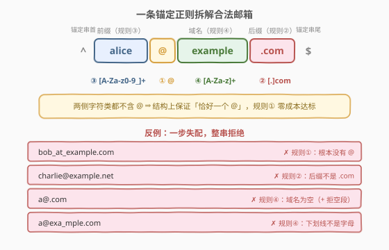
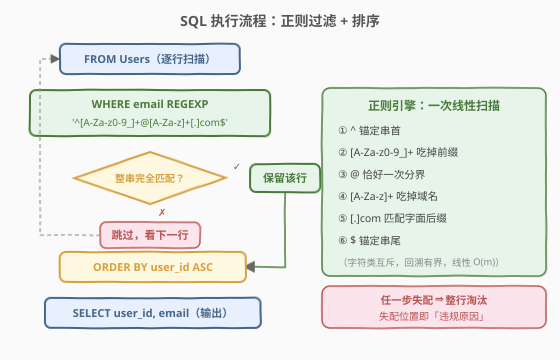

# 查找合法邮箱

- **题目名称**：查找合法邮箱
- **链接**：[3436. 查找合法邮箱](https://leetcode.cn/problems/find-valid-emails/)
- **难度**：简单
- **标签**：SQL、正则表达式、WHERE 过滤

## 1. 题目概述

给定 `Users` 表（`user_id` 主键 + `email`），找出所有**合法邮箱**。一个合法邮箱需同时满足四条规则：

1. **只包含一个** `@` 符号；
2. 以 `.com` **结尾**；
3. `@` **前面**的部分只包含**字母数字**字符和**下划线**；
4. `@` **后面**、`.com` **前面**的部分（域名）只包含**字母**。

返回 `user_id`、`email` 两列，按 `user_id` **升序**排序。

**表结构**：

```text
Table: Users
+-------------+---------+
| Column Name | Type    |
+-------------+---------+
| user_id     | int     |  ← 主键
| email       | varchar |
+-------------+---------+
```

**示例 1**：

```text
输入：
Users 表:
+---------+---------------------+
| user_id | email               |
+---------+---------------------+
| 1       | alice@example.com   |
| 2       | bob_at_example.com  |
| 3       | charlie@example.net |
| 4       | david@domain.com    |
| 5       | eve@invalid         |
+---------+---------------------+

输出：
+---------+-------------------+
| user_id | email             |
+---------+-------------------+
| 1       | alice@example.com |
| 4       | david@domain.com  |
+---------+-------------------+
```

**解释**：

| user_id | email | 合法? | 原因 |
|---------|-------|-------|------|
| 1 | `alice@example.com` | ✓ | 一个 `@`，前缀纯字母，域名纯字母，以 `.com` 结尾 |
| 2 | `bob_at_example.com` | ✗ | 根本没有 `@`（下划线不能替代） |
| 3 | `charlie@example.net` | ✗ | 以 `.net` 结尾，不是 `.com` |
| 4 | `david@domain.com` | ✓ | 四条规则全部满足 |
| 5 | `eve@invalid` | ✗ | 没有 `.com` 后缀 |

> 💡 本题是 SQL **「正则表达式行级过滤」入门题**——四条自然语言规则可由**一条锚定正则**完整表达。核心考点有二：① 把规则逐条翻译成正则片段；② 理解「**结构即约束**」——`@` 两侧的字符类都不含 `@`，「恰好一个 `@`」无需单独判断，由模式结构天然保证。与 1517（查找拥有有效邮箱的用户）同模板但规则细节不同，见第 5 节对比。

---

## 2. 解题思路

### 2.1 暴力思路：字符串函数逐条拼装

不写正则，用 `LENGTH` / `REPLACE` / `LIKE` 等字符串函数逐条拼条件：

```sql
-- 规则① 恰好一个 @：删掉所有 @ 后长度应恰好减少 1
LENGTH(email) - LENGTH(REPLACE(email, '@', '')) = 1
-- 规则② 以 .com 结尾
email LIKE '%.com'
-- 规则③ 前缀只含字母数字/下划线：???
-- 规则④ 域名只含字母：???
```

规则 ①② 尚可凑合，规则 ③④ 直接**撞墙**：

- `LIKE` 只有两个通配符 `%`（任意串）和 `_`（任意单字符），**没有字符类**，表达不了「只含某集合内的字符」；
- 更纠缠的是，合法字符里的**下划线恰好是 `LIKE` 的通配符**，想匹配字面 `_` 还得写 `\_` 转义；
- 即便用 `SUBSTRING_INDEX` 拆出前缀/域名，「不含非法字符」也要**枚举所有非法字符逐个排除**，无穷无尽且极易漏边界——比如 `a@b.com.com`：规则①✓（一个 `@`）、规则②✓（以 `.com` 结尾），真正能拦住它的是规则④（`@` 与 `.com` 之间的 `b.com` 含点号，不是纯字母），而这恰是 `LIKE` 写不出的那条。

> ⚠️ 暴力思路的根本问题：**字符集校验是 `LIKE` 的能力盲区**。「字符串是否匹配某个模式」正是正则表达式的招牌场景——一条 `REGEXP` 即可替代全部拼装条件。

### 2.2 核心观察：一条锚定正则 = 四条规则



**将四条规则逐条翻译为正则片段**：

| 自然语言规则 | 正则片段 | 说明 |
|-------------|---------|------|
| 从字符串开头开始 | `^` | 锚定开头，杜绝子串匹配 |
| 规则③：前缀只含字母数字/下划线 | `[A-Za-z0-9_]+` | `+` 保证前缀**非空** |
| 规则①：恰好一个 `@` | `@` | 字面量；两侧字符类均不含 `@`，**结构上保证唯一** |
| 规则④：域名只含字母 | `[A-Za-z]+` | `+` 保证域名**非空** |
| 规则②：以 `.com` 结尾 | `[.]com$` | `[.]` 是转义的字面点号；`$` 锚定结尾 |

拼接成完整模式：

```
^[A-Za-z0-9_]+@[A-Za-z]+[.]com$
```

> 💡 **三个关键不变量**把问题彻底简化：
> 1. **结构即约束**：`@` 两侧的字符类都不含 `@`，加上 `^...$` 全串锚定 ⇒ 整个字符串**有且仅有一个** `@`——规则①零成本达标，暴力法里的 `LENGTH` 差值判断完全不需要。
> 2. **`+` 保证非空**：`[A-Za-z0-9_]+` 拒绝空前缀（`@example.com` ✗），`[A-Za-z]+` 拒绝空域名（`a@.com` ✗）——「@ 前面/后面的**部分**」隐含该部分存在且非空。
> 3. **字符类互斥 ⇒ 回溯有界**：前缀类不含 `@`、域名类不含 `.`，贪婪匹配到边界自然停下，回溯步数有界，整体线性 $O(m)$，无指数级 ReDoS 风险。

> ⚠️ **`[.]com$` 不能写成 `.com$`**：正则里 `.` 匹配**任意单个字符**。不转义的话，`a@bXcom`（根本不含点号）会被 `[A-Za-z]+.com$` 误放行——`X` 被 `.` 吃掉。字符类内的 `.` 天然是字面量，`[.]` 是最省事的转义写法（比 `\\.` 干净，MySQL 字符串里 `\` 要双重转义）。

> ⚠️ **`^` 和 `$` 不可省略**：省略 `^`，`x..alice@example.com` 中的子串 `alice@example.com` 会匹配通过；省略 `$`，`alice@example.com.evil` 会通过。两个锚定符确保**整条 email 从头到尾完全匹配**——`REGEXP` 默认是「包含即匹配」，锚定符把它升级为「全等匹配」。

> ⚠️ **别图省事写 `\w`**：MySQL 8 的正则引擎（ICU）是 Unicode 感知的，`\w` 匹配**任意语言的字母/数字/下划线**，`小明@example.com` 的前缀会被放行（Python `re` 对 `str` 默认同样 Unicode 化）。题面「字母数字」指 ASCII 英文字母与数字，显式写 `[A-Za-z0-9_]` 才严谨。

### 2.3 算法流程图



**逻辑执行步骤**：

| 步骤 | 操作 | 说明 |
|------|------|------|
| ① | `FROM Users` | 逐行扫描表 |
| ② | `WHERE email REGEXP '^[A-Za-z0-9_]+@[A-Za-z]+[.]com$'` | 对每行 `email` 做整串正则匹配 |
| ③ | 正则引擎线性扫描 | `^` 锚首 → 吃前缀 → `@` 分界 → 吃域名 → `[.]com` 后缀 → `$` 锚尾，**任一步失配即淘汰整行** |
| ④ | 匹配成功 → 保留；失败 → 跳过 | `WHERE` 行级过滤 |
| ⑤ | `ORDER BY user_id ASC` | 结果按 `user_id` 升序 |
| ⑥ | `SELECT user_id, email` | 输出两列 |

> 💡 **SQL 子句逻辑执行顺序**：`FROM` → `WHERE` → `SELECT` → `ORDER BY` → `LIMIT`。本题是最简形态 `FROM + WHERE + SELECT + ORDER BY`，无 `GROUP BY`/`HAVING`/`JOIN`。`ORDER BY` 逻辑上在 `SELECT` 之后执行，故排序键可直接引用输出列。

### 2.4 示例演算

对示例 1 的 5 行逐个套用正则：

| # | email | 匹配过程 | 结果 |
|---|-------|---------|------|
| 1 | `alice@example.com` | `alice`∈`[A-Za-z0-9_]+` ✓ → `@` ✓ → `example`∈`[A-Za-z]+` ✓ → `[.]com` ✓ → `$` ✓ | ✓ 合法 |
| 2 | `bob_at_example.com` | `[A-Za-z0-9_]+` 贪婪吃掉整个 `bob_at_example`（`_` 也在类内）→ 期待 `@` 却遇 `.` → 逐位回溯仍找不到 `@` | ✗ 无 `@` |
| 3 | `charlie@example.net` | 前缀 ✓ → `@` ✓ → `example` ✓ → `[.]` ✓ → 期待 `com` 却遇 `net` | ✗ 后缀非 `.com` |
| 4 | `david@domain.com` | `david` ✓ → `@` ✓ → `domain` ✓ → `[.]com` ✓ → `$` ✓ | ✓ 合法 |
| 5 | `eve@invalid` | `eve` ✓ → `@` ✓ → `invalid` ✓ → 期待 `[.]com` 但串已耗尽，回溯亦无解 | ✗ 无 `.com` |

> 💡 注意第 2 行：`bob_at_example.com` 虽以 `.com` 结尾且「长得像邮箱」，但串里根本没有 `@`——前缀类连 `_` 一起吃光后，在 `.` 处等不来 `@`。`^...$` 锚定下**任何一个位置失配，整条即失败**，不存在「跳过坏字符继续匹配」。

---

## 3. 参考代码

### SQL（解法 A：MySQL `REGEXP`，推荐）

```sql
SELECT user_id, email
FROM Users
WHERE email REGEXP '^[A-Za-z0-9_]+@[A-Za-z]+[.]com$'
ORDER BY user_id;
```

> 💡 **写法要点**：
> - **`REGEXP`**：MySQL 正则匹配运算符；模式自带 `^...$`，等价于「整串完全匹配」语义。
> - **`[.]` 转义**：字符类内的 `.` 是字面点号，避开 MySQL 字符串中 `\\` 双重转义的坑（写 `'\\.'` 也对，但易错）。
> - **`ORDER BY user_id`**：默认升序，与题目要求一致，显式写 `ASC` 更清晰。
> - 整条模式里**没有一个 `\`**，从源头规避转义地狱。

### SQL（解法 B：PostgreSQL `~` 运算符）

```sql
SELECT user_id, email
FROM Users
WHERE email ~ '^[A-Za-z0-9_]+@[A-Za-z]+[.]com$'
ORDER BY user_id;
```

> 💡 **PostgreSQL 写法**：`~` 是大小写敏感的正则匹配运算符（`~*` 才不敏感）。本题字符类 `[A-Za-z]` 显式列出大小写两个范围，`~` 与 `~*` 结果一致，无坑。

### Python（pandas）

```python
import pandas as pd

def find_valid_emails(users: pd.DataFrame) -> pd.DataFrame:
    mask = users['email'].str.fullmatch(r'[A-Za-z0-9_]+@[A-Za-z]+[.]com')
    return users.loc[mask, ['user_id', 'email']].sort_values('user_id')
```

> 💡 **pandas 写法要点**：
> - **`str.fullmatch`**：要求**整个字符串**与模式匹配，自带 `^...$` 全串语义（pandas ≥ 1.1）。若用 `str.contains`，它是「搜索子串」，必须手动补 `^...$` 锚点，否则 `xx.alice@example.comyy` 会被误放行。
> - **`r'...'` 原始字符串**：`\` 在 Python 字符串里是转义符，`r` 前缀让模式原样传给 `re` 模块。本模式用 `[.]` 不含 `\`，但养成习惯以防模式扩展。
> - **`sort_values('user_id')`**：对应 `ORDER BY user_id`，默认升序。

---

## 4. 复杂度分析

| 维度 | 复杂度 | 说明 |
|------|--------|------|
| 时间复杂度 | $O(n \cdot m)$ | $n$ = 行数，$m$ = `email` 平均长度，每行一次正则匹配。模式中字符类与后继字面量互斥（前缀类不含 `@`、域名类不含 `.`），回溯步数有界，单条匹配整体线性 |
| 空间复杂度 | $O(k)$ | $k$ = 合法邮箱数（结果集大小）；正则引擎状态 $O(1)$ |

> ⚠️ **索引提示**：`WHERE email REGEXP '...'` 无法走 B+ 树索引（非前缀匹配）。海量数据高频查询时，可预处理 `is_valid` 布尔列，或配合函数索引/生成列优化。本题数据量小，无需优化。

---

## 5. 扩展：与 1517 对比 & 大小写敏感性

### 5.1 和 1517「查找拥有有效邮箱的用户」的规则差异

| 维度 | 1517 | 3436（本题） |
|------|------|--------------|
| 前缀字符集 | 必须字母开头，允许 `.` `-` `_` 数字 | 数字/下划线**可开头**，**不允许** `.` `-` |
| 域名 | 固定 `@leetcode.com`，全小写 | 任意**纯字母**域名 + `.com` 后缀 |
| 正则 | `^[a-zA-Z][a-zA-Z0-9_.-]*@leetcode[.]com$` | `^[A-Za-z0-9_]+@[A-Za-z]+[.]com$` |
| 量词 | 首字母 + `*`（后续可为 0 个） | 两段均为 `+`（前缀、域名都非空） |
| 大小写 | 域名须小写，严格版需 `BINARY` | 未限定大小写，`[A-Za-z]` 天然覆盖 |

> 💡 同是「邮箱校验」，**字符集与量词的细节差异决定了正则的每一处不同**。面试中应先和面试官对齐规则边界（前缀可否为空？可否数字开头？域名可否含 `-`？），再落笔写模式，而不是背模板生搬。

### 5.2 MySQL `REGEXP` 的大小写敏感性

MySQL `REGEXP` 的匹配行为跟随列的**排序规则（collation）**：`_ci` 后缀（如 `utf8mb4_0900_ai_ci`，LeetCode 默认）大小写**不敏感**；`_bin`/`_cs` 才敏感。对本题的影响：

- 规则未限定大小写：`ALICE@EXAMPLE.COM` 中无论大小写的字母都落在 `[A-Za-z]` 内，`_ci` 与否结果一致，**无需 `BINARY`**（这点比 1517 省心——它要求域名全小写）；
- 唯一边界是后缀：`_ci` 下 `a@b.COM` 也会被当作 `.com` 匹配。题面「以 .com 结尾」通常按小写字面理解，测试集未覆盖此边界；若要严格只认小写 `.com`，可加 `REGEXP BINARY`——`BINARY` 只让字面量 `com` 变严格，`[A-Za-z]` 显式列出两个范围仍双双匹配，前缀/域名的大小写不受影响。

---

## 6. 面试要点

1. **为什么这条正则不用单独判断「恰好一个 `@`」？**

   > 「结构即约束」：`@` 左侧 `[A-Za-z0-9_]+` 与右侧 `[A-Za-z]+[.]com` 都不含 `@`，配合 `^...$` 全串锚定，字符串中**至多出现一个** `@`；而模式又**要求**一个字面 `@`——两者合起来恰是「有且仅有一个」。暴力法需要 `LENGTH(email) - LENGTH(REPLACE(email,'@','')) = 1`，正则法零成本。

2. **`+` 换成 `*` 会怎样？**

   > `[A-Za-z0-9_]*` 放行空前缀：`@example.com` 通过；`[A-Za-z]*` 放行空域名：`a@.com` 通过。「@ 前面/后面的**部分**」隐含该部分存在且非空（邮箱语义亦然），故两处都用 `+`。

3. **`[.]com` 写成 `.com` 有什么后果？**

   > 正则 `.` 匹配任意单个字符，`[A-Za-z]+.com$` 会误放行 `a@bXcom`——`X` 被 `.` 吃掉，而该串根本不以 `.com` 结尾。字符类内的 `.` 是字面量，`[.]` 最干净；MySQL 字符串里写 `\\.` 也对，但要吃透双重转义。

4. **`^` 和 `$` 能省吗？**

   > 不能。省 `^`：`x..alice@example.com` 的子串匹配通过；省 `$`：`alice@example.com.evil` 尾部多余字符通过。`REGEXP` 默认「包含即匹配」，所有**整串校验**题第一步就是补 `^...$` 锚点。

5. **本题正则与 1517 的差异点在哪？**

   > 三处：① 前缀字符集收窄（无 `.` `-`）且放开首字符限制（数字/下划线可开头，1517 必须字母开头）；② 域名从固定串 `@leetcode.com` 泛化为「纯字母 + `[.]com$`」；③ 量词从「首字母 + `*`」变为两段 `+`。差异全部源于题面措辞——**把规则逐字翻译成片段，再拼接**。

> 💡 **一句话总结**：3436 是「正则行级过滤」入门题——模板「`WHERE email REGEXP '^[A-Za-z0-9_]+@[A-Za-z]+[.]com$' ORDER BY user_id`」。三大考点：① 结构即约束（恰好一个 `@` 免判断）；② `+` 非空 + `[.]` 转义；③ `^...$` 全串锚定。与 1517 对照写一遍，「自然语言规则 → 正则模式」的翻译能力立刻闭环。

---

## 7. 同类练习题

- [1517. 查找拥有有效邮箱的用户](https://leetcode.cn/problems/find-users-with-valid-e-mails/)：同模板姊妹题，前缀须字母开头且允许 `.` `-`，域名固定 `@leetcode.com`，对照本题体会规则差异如何映射到正则差异
- [1683. 无效的推文](https://leetcode.cn/problems/invalid-tweets/)：`LENGTH` + `REGEXP` 组合过滤（长度上限 + 字符集校验），巩固正则在 WHERE 中的用法
- [1527. 患者没用药](https://leetcode.cn/problems/patients-with-a-condition/)：`LIKE 'DIAB1%'` 前缀通配匹配，体会 LIKE 与 REGEXP 的能力边界
- [1667. 修复表中的名字](https://leetcode.cn/problems/fix-names-in-tables/)：`CONCAT`/`UPPER`/`LOWER`/`SUBSTRING` 字符串函数组合，与正则过滤互补的变换流派
- [595. 大的国家](https://leetcode.cn/problems/big-countries/)：最简 `WHERE` 多条件过滤入门，行级过滤骨架题
