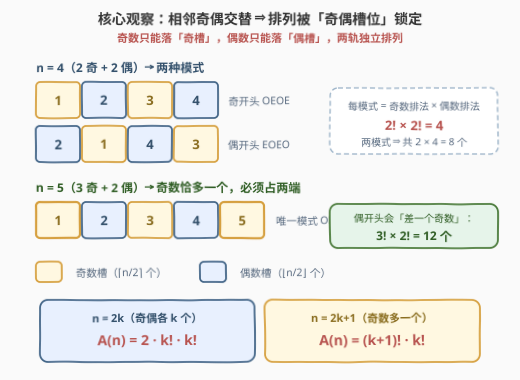
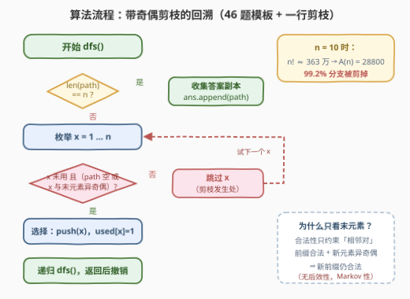

# LeetCode 全排列 III 题解

## 1. 题目概述

- **标题 / 题号**：全排列 III（#3437，medium）
- **链接**：https://leetcode.cn/problems/permutations-iii/
- **难度**：中等
- **标签**：数组、回溯

> ⚠️ 本题为 LeetCode 付费题，题意描述根据官方示例用例与 hints 重建，可能与官方题面有出入。

**题意**：给你一个整数 `n`。请返回 `[1, 2, ..., n]` 的**所有排列**，要求排列中**每两个相邻元素恰好一个为奇数、一个为偶数**（即元素的奇偶性沿排列交替出现）。答案可以按任意顺序返回。

**示例 1**：

```text
输入：n = 2
输出：[[1,2],[2,1]]
解释：两个排列中相邻元素均一奇一偶。
```

**示例 2**：

```text
输入：n = 3
输出：[[1,2,3],[3,2,1]]
解释：2 是唯一的偶数，必须夹在两个奇数中间。
```

**示例 3**：

```text
输入：n = 4
输出：[[1,2,3,4],[1,4,3,2],[3,2,1,4],[3,4,1,2],
      [2,1,4,3],[2,3,4,1],[4,1,2,3],[4,3,2,1]]
解释：共 2 × 2! × 2! = 8 个合法排列。
```

**约束条件**（按输出规模推断）：

- $1 \le n \le 10$（需显式枚举全部合法排列，$n$ 的上限受输出规模限制）

> 💡 **读题关键**：①「相邻奇偶交替」是一个**局部约束**——只涉及相邻两个元素，天然适合在构造排列时**即时剪枝**，不必先生成再过滤；② $1 \sim n$ 中奇数恰有 $\lceil n/2 \rceil$ 个、偶数有 $\lfloor n/2 \rfloor$ 个，这个数量结构直接决定了合法排列的**槽位形态与个数闭式**（见 2.2）；③ 本题是 [46. 全排列](https://leetcode.cn/problems/permutations/) 的条件版，回溯模板只需**多加一行剪枝**。

## 2. 解题思路

### 2.1 暴力思路：枚举全部 $n!$ 个排列再过滤

最朴素的做法：用 `next_permutation`（C++）或 `itertools.permutations`（Python）枚举 $[1..n]$ 的全部 $n!$ 个排列，逐个检查相邻元素奇偶性是否交替，保留合法者。

以 $n = 10$ 为例：$10! = 3628800$ 个排列中合法的只有 $28800$ 个——**约 99.2% 的枚举被整体丢弃**。更糟的是浪费是「前缀级」的：一个前缀一旦出现相邻同奇偶，它的**所有延伸必然非法**，暴力却会把它延伸到底。结论：把奇偶检查从「事后过滤」提前到「构造时剪枝」。

### 2.2 核心观察：奇偶交替 ⇒ 排列被「奇偶槽位」锁定

**观察一：槽位结构。** 若排列相邻元素奇偶交替，则元素奇偶性由第一个元素的奇偶**完全确定**：奇开头的排列形如 奇-偶-奇-偶-…（奇数占据奇数下标槽位），偶开头则反之。换言之，**奇数只能落「奇槽」、偶数只能落「偶槽」**，两类槽位互相独立。

**观察二：数量决定形态。** 设 $1 \sim n$ 中奇数 $O = \lceil n/2 \rceil$ 个、偶数 $E = \lfloor n/2 \rfloor$ 个：

- **$n = 2k$（$O = E = k$）**：奇槽、偶槽各 $k$ 个，两种模式（奇开头 / 偶开头）都可行。每种模式内奇数任意全排列、偶数任意全排列，两轨独立相乘，答案数
  $$A(n) = 2 \cdot k! \cdot k!$$
- **$n = 2k+1$（$O = k+1,\ E = k$）**：奇数恰多一个，排列必须**以奇数开头且以奇数结尾**（形如 奇-偶-奇-…-奇），唯一模式，答案数
  $$A(n) = (k+1)! \cdot k!$$

验证：$n=3 \Rightarrow 2! \cdot 1! = 2$ ✓；$n=4 \Rightarrow 2 \cdot 2! \cdot 2! = 8$ ✓；$n=5 \Rightarrow 3! \cdot 2! = 12$ ✓（均已与暴力程序对拍）。



> ⚠️ **对 $1 \sim n$ 这组数，合法排列永不为空**（$|O - E| \le 1$ 恒成立）。但若题目改成**任意**输入集合，$|O - E| > 1$ 时无解，可一行预判直接返回空表——这是槽位观察带来的免费剪枝。

### 2.3 算法流程：带奇偶剪枝的回溯

在 46 题「全排列」的标准回溯模板上**只加一条剪枝**：只有当候选 $x$ 未被使用、且（`path` 为空、或 $x$ 与 `path` 末元素**奇偶不同**）时才允许选择。

1. 维护 `path`（当前前缀）与 `used[1..n]`；
2. 若 $\mathrm{len}(\text{path}) = n$：收集 `path` 的副本，返回；
3. 否则依次枚举 $x = 1 \dots n$：跳过已使用的 $x$；跳过与末元素**同奇偶**的 $x$（剪枝发生处）；
4. 做选择（`push(x)`、`used[x]=1`）→ 递归 → 撤销选择。



**剪枝强度分析**：加剪枝后，回溯树的**每个节点都是合法前缀**、每片叶子都是合法答案——没有任何非法分支能存活到叶层。搜索空间从 $n!$ 精确压缩到「答案数 × 深度」量级；又因奇偶约束是**无后效性**的（前缀合法性只取决于末元素），树呈「底部宽、上部窄」的几何衰减形态，总节点数为 $O(A(n))$。

### 2.4 示例演算：$n = 4$

$n=4$ 时奇数 $\{1,3\}$、偶数 $\{2,4\}$，两种槽位模式各产出 $2! \times 2! = 4$ 个：

| # | 排列 | 槽位模式 | 说明 |
|---|------|---------|------|
| 1 | `1 2 3 4` | 奇偶奇偶 | 奇轨升序 × 偶轨升序 |
| 2 | `1 4 3 2` | 奇偶奇偶 | 奇轨升序 × 偶轨降序 |
| 3 | `3 2 1 4` | 奇偶奇偶 | 奇轨降序 × 偶轨升序 |
| 4 | `3 4 1 2` | 奇偶奇偶 | 奇轨降序 × 偶轨降序 |
| 5 | `2 1 4 3` | 偶奇偶奇 | 偶轨升序 × 奇轨升序 |
| 6 | `2 3 4 1` | 偶奇偶奇 | 偶轨升序 × 奇轨降序 |
| 7 | `4 1 2 3` | 偶奇偶奇 | 偶轨降序 × 奇轨升序 |
| 8 | `4 3 2 1` | 偶奇偶奇 | 偶轨降序 × 奇轨降序 |

共 $8 = 2 \cdot 2! \cdot 2! = A(4)$ 个 ✓。另可手工核对：$n=3$ 时奇数 $\{1,3\}$ 必须占两端、偶数 $\{2\}$ 居中，故仅 `[1,2,3]` 与 `[3,2,1]` 两个。

## 3. 参考代码

> 付费题无官方函数签名，以下按 46 题惯例命名（已在本地对拍通过 $n = 1 \sim 8$ 的全部输出）。

### C++

```cpp
class Solution {
  public:
    vector<vector<int>> permuteAlternatingParity(int n) {
        vector<vector<int>> ans;
        vector<int> path;
        vector<char> used(n + 1, 0);
        dfs(n, path, used, ans);
        return ans;
    }

  private:
    void dfs(int n, vector<int>& path, vector<char>& used, vector<vector<int>>& ans) {
        if ((int)path.size() == n) {
            ans.push_back(path);
            return;
        }
        for (int x = 1; x <= n; ++x) {
            if (used[x]) continue;
            if (!path.empty() && (x & 1) == (path.back() & 1)) continue;  // 奇偶剪枝
            path.push_back(x);
            used[x] = 1;
            dfs(n, path, used, ans);
            path.pop_back();
            used[x] = 0;
        }
    }
};
```

### Python

```python
class Solution:
    def permuteAlternatingParity(self, n: int) -> List[List[int]]:
        ans: List[List[int]] = []
        path: List[int] = []
        used = [False] * (n + 1)

        def dfs() -> None:
            if len(path) == n:
                ans.append(path.copy())
                return
            for x in range(1, n + 1):
                if used[x]:
                    continue
                if path and (x & 1) == (path[-1] & 1):  # 奇偶剪枝
                    continue
                used[x] = True
                path.append(x)
                dfs()
                path.pop()
                used[x] = False

        dfs()
        return ans
```

> 💡 **实现细节**：① 奇偶判断用位运算 `x & 1`，`(x & 1) == (path.back() & 1)` 表示同奇偶、须跳过；② `path` 为空（放第一个数）时不检查奇偶；③ 由于每层按 $x$ 从小到大枚举，输出**天然是字典序**的；④ 收集答案必须存**副本**（C++ 中 `push_back(path)` 已是拷贝，Python 中需 `path.copy()`）。

## 4. 复杂度分析

| 维度 | 复杂度 | 说明 |
|------|--------|------|
| 时间复杂度 | $O(A(n) \cdot n)$ | $A(n)$ 为答案个数：$n=2k$ 时 $2(k!)^2$，$n=2k+1$ 时 $(k+1)!\,k!$；剪枝后回溯树每个节点都是合法前缀且呈几何衰减，总节点数 $O(A(n))$，每节点枚举 $O(n)$ 个候选并 $O(1)$ 判定，另需 $O(A(n) \cdot n)$ 复制输出 |
| 空间复杂度 | $O(n)$ | 递归栈深度 + `used` 数组（不含输出；输出本身占 $O(A(n) \cdot n)$） |
| 暴力对照 | $O(n! \cdot n)$ | 先枚举全部 $n!$ 个排列再过滤，$n=10$ 时约 363 万个排列中 $99.2\%$ 是废品 |

以 $n = 10$ 为例：$A(10) = 2 \cdot 5! \cdot 5! = 28800$，回溯法仅做约 $2.9 \times 10^5$ 量级的节点访问，而暴力要做 $3.6 \times 10^6 \times 10$ 的检查。

## 5. 扩展：按槽位「双轨交错」构造与第 $k$ 个合法排列

**双轨交错构造。** 由 2.2 的槽位观察，合法排列等价于「奇数的一个排列」与「偶数的一个排列」按固定槽位交错插入。可以分别枚举两轨的全排列再交错合成——叶子数与回溯法相同（都是 $A(n)$），但每层的分支因子从「所有可用数」降为「当前轨的可用数」，且**两轨可用双重循环独立嵌套**，实现上省去了奇偶判断。代价是：交错合成后的输出**不再是字典序**，若题目要求字典序则仍应使用 2.3 的回溯法。

**第 $k$ 个合法排列。** 若改问「字典序第 $k$ 小的合法排列」（类似 [60. 第 k 个排列](https://leetcode.cn/problems/permutation-sequence/)），不必枚举全部答案：逐位确定时，以某个奇数（或偶数）开头的前缀个数可由槽位计数公式直接算出——固定开头后，剩余 $n-1$ 个数落在 $n-1$ 个槽位上，方案数为两轨阶乘的乘积。于是每步用 $O(1)$ 的计数比较跳过整段前缀，总复杂度 $O(n^2)$。

## 6. 面试要点

1. **为什么剪枝只需要检查「与末元素奇偶不同」，不必记录更多信息？**

   - 合法性约束只涉及**相邻对**，具有无后效性（Markov 性）：前缀合法 ⇔ 每对相邻元素异奇偶。新前缀「合法」当且仅当「旧前缀合法 且 新元素与末元素异奇偶」。因此只看末元素的奇偶就足够。

2. **合法排列的个数有闭式吗？**

   - 有。$n = 2k$ 时为 $2 \cdot k! \cdot k!$（奇开头、偶开头两种槽位模式）；$n = 2k+1$ 时奇数恰多一个，必须奇数开头结尾，个数为 $(k+1)! \cdot k!$。这一计数同时是复杂度分析的基石。

3. **如果输入不是 $1 \sim n$ 而是任意整数数组，什么时候答案为空？**

   - 当奇数个数与偶数个数之差超过 $1$ 时，任何排列都无法交替（鸽笼原理：至多相差 $1$ 才能交错摆放）。此时可一行预判返回空表；对 $1 \sim n$ 则永远不会发生。

4. **与 46 题全排列的代码差异在哪里？复杂度差多少？**

   - 代码上只多一行剪枝 `if path and (x & 1) == (path[-1] & 1): continue`。复杂度从 $O(n \cdot n!)$ 降到 $O(A(n) \cdot n)$——本质是把「生成后过滤」变成「生成中剪枝」，非法前缀的整棵子树被剪掉。

5. **输出需要字典序时，两种构造法该选哪个？**

   - 选回溯法：每层按 $x$ 从小到大枚举，输出天然字典序。双轨交错法（奇、偶两轨独立枚举再合成）虽然叶子数相同，但合成后的顺序不是字典序，需要额外排序或复杂的交错规则。

## 同类练习题

| # | 题目 | 与本题的关联 |
|---|------|-------------|
| 46 | [全排列](https://leetcode.cn/problems/permutations/)（[站内题解](../0001-0100/46_全排列.md)） | 本题母题——无剪枝版回溯模板，本题只需在其上加一行奇偶剪枝 |
| 47 | [全排列 II](https://leetcode.cn/problems/permutations-ii/)（[站内题解](../0001-0100/47_全排列II.md)） | 重复元素下的「同层去重」剪枝，与本题的「奇偶剪枝」并列练回溯剪枝三件套 |
| 526 | [优美的排列](https://leetcode.cn/problems/beautiful-arrangement/)（[站内题解](../0501-0600/526_优美的排列.md)） | 同样是「逐位放置 + 位置/值约束剪枝」的回溯，约束条件换成整除关系 |
| 60 | [第 k 个排列](https://leetcode.cn/problems/permutation-sequence/)（[站内题解](../0001-0100/60_第k个排列.md)） | 用阶乘计数逐位跳过整段前缀——本题第 5 节「第 k 个合法排列」变体的原型 |
| 784 | [字母大小写全排列](https://leetcode.cn/problems/letter-case-permutation/)（[站内题解](../0701-0800/784_字母大小写全排列.md)） | 另一类「带约束的子集式枚举」回溯，对比「选或不选」与「逐位放数」两种搜索形态 |
