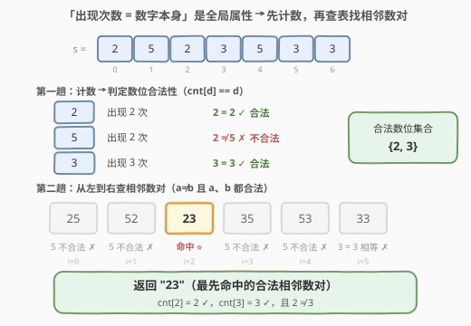
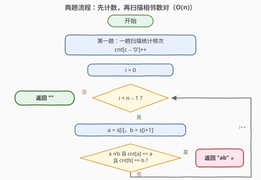

# 找到字符串中合法的相邻数字

- **题目名称**：找到字符串中合法的相邻数字
- **链接**：[3438. 找到字符串中合法的相邻数字](https://leetcode.cn/problems/find-valid-pair-of-adjacent-digits-in-string/)
- **难度**：简单
- **标签**：哈希表、字符串、计数

## 1. 题目概述

给你一个只包含数字的字符串 `s`。如果 `s` 中两个**相邻**的数字满足以下条件，我们称它们是**合法的**：

1. 前面的数字**不等于**第二个数字；
2. 两个数字在 `s` 中出现的次数**恰好**分别等于这个数字本身。

请你从左到右遍历字符串 `s`，并返回最先找到的**合法**相邻数字。如果这样的相邻数字不存在，请你返回一个空字符串。

**示例 1**：

```text
输入：s = "2523533"
输出："23"
解释：数字 '2' 出现 2 次，数字 '3' 出现 3 次。"23" 中每个数字
      在 s 中出现的次数都恰好分别等于数字本身，所以输出 "23"。
```

**示例 2**：

```text
输入：s = "221"
输出："21"
解释：数字 '2' 出现 2 次，数字 '1' 出现 1 次，所以输出 "21"。
```

**示例 3**：

```text
输入：s = "22"
输出：""
解释：没有合法的相邻数字。
```

**约束条件**：

- `2 <= s.length <= 100`
- `s` 只包含 `'1'` 到 `'9'` 的数字。

---

## 2. 解题思路

### 2.1 暴力思路：对每个相邻数对现场数频次

从左到右枚举每个相邻数对 `(s[i], s[i+1])`，对每个数对**重新遍历一遍 `s`** 统计两个数字各自的出现次数，再判断「次数 = 数字本身」与「两数字不等」是否同时成立：

```text
for i in 0 .. n-2:
    a, b = s[i], s[i+1]
    若 a != b 且 count(a) == a 且 count(b) == b:
        return s[i .. i+1]
return ""
```

每次 `count` 都要扫全串，时间复杂度 $O(n^2)$。本题 $n \le 100$，最多约 $10^4$ 次比较，能过，但「同一数字的频次被反复重算」是明显的浪费——**频次是全局属性，根本不随数对位置 `i` 变化**。

### 2.2 核心观察：先全局计数，再一趟扫描



两个条件的性质完全不同，应当**拆开处理**：

| 条件 | 性质 | 处理方式 |
|------|------|----------|
| 出现次数 = 数字本身 | **全局属性**，只与数字种类有关，与位置无关 | 预处理一趟计数表，每个数位只判一次 |
| 两数字不相等 | **局部属性**，只与数对本身有关 | 扫描时 $O(1)$ 比较 |

由于 `s` 只含 `'1'`~`'9'`，计数表就是一个长度 10 的数组。记 $cnt[d]$ 为数字 $d$ 的出现次数，则数位 $d$「自身合法」当且仅当：

$$cnt[d] = d$$

> 💡 于是相邻数对 $(a, b)$ 合法 $\iff a \ne b$ 且 $cnt[a] = a$ 且 $cnt[b] = b$。三个判断全是 $O(1)$ 查表——**把全局信息前移到预处理阶段**，主扫描只剩纯查表，这是「计数 + 扫描」两段式套路的标准形态。

**时间复杂度**：$O(n)$（一趟计数 + 一趟扫描）；**空间复杂度**：$O(1)$（计数表只有 9 个数字，与 $n$ 无关）。

### 2.3 算法流程图



整个算法分两趟：第一趟统计每个数字的频次，第二趟从左到右检查相邻数对，命中即返回。

### 2.4 示例演算

以 `s = "2523533"` 为例。第一趟计数得 $cnt[2]=2$、$cnt[5]=2$、$cnt[3]=3$，于是各数位合法性为：

| 数位 d | 出现次数 cnt[d] | 合法？（cnt[d] == d） |
|--------|----------------|----------------------|
| 2 | 2 | ✓ |
| 5 | 2 | ✗（出现 2 次，但需要 5 次） |
| 3 | 3 | ✓ |

第二趟从左到右扫描相邻数对：

| i | 数对 (a, b) | a≠b? | a 合法? | b 合法? | 结果 |
|---|------------|------|---------|---------|------|
| 0 | (2, 5) | ✓ | ✓ | ✗ | 跳过 |
| 1 | (5, 2) | ✓ | ✗ | ✓ | 跳过 |
| 2 | (2, 3) | ✓ | ✓ | ✓ | 命中，返回 "23" ⭐ |

> 💡 示例 3 `s = "22"` 中，虽然 $cnt[2]=2$ 使数位 2 自身合法，但数对 (2,2) 两数字相等，违反条件①，故返回空串——**两个条件缺一不可**。

---

## 3. 参考代码

### C++

```cpp
class Solution {
  public:
    string findValidPair(string s) {
        int cnt[10] = {0};
        for (char c : s) {
            cnt[c - '0']++;
        }

        for (int i = 0; i + 1 < (int)s.size(); i++) {
            int a = s[i] - '0', b = s[i + 1] - '0';
            if (a != b && cnt[a] == a && cnt[b] == b) {
                return s.substr(i, 2);
            }
        }
        return "";
    }
};
```

### Python

```python
class Solution:
    def findValidPair(self, s: str) -> str:
        cnt = Counter(s)
        for a, b in zip(s, s[1:]):
            if a != b and cnt[a] == int(a) and cnt[b] == int(b):
                return a + b
        return ""
```

> 💡 Python 的 `Counter(s)` 直接按**字符**计数，比较时用 `int(a)` 把字符转回数字；也可以用 `[0] * 10` 数组加 `ord(c) - ord('0')` 下标计数，与 C++ 版一致。

---

## 4. 复杂度分析

| 维度 | 复杂度 | 说明 |
|------|--------|------|
| 时间复杂度 | $O(n)$ | 一趟计数 $O(n)$ + 一趟扫描 $O(n)$，每个数对 $O(1)$ 查表判断 |
| 空间复杂度 | $O(1)$ | 计数表仅 9 个数字（`'1'`~`'9'`），与 $n$ 无关；Python `Counter` 至多 9 个键，同样是常数 |

---

## 5. 扩展：为什么限定 '1'~'9'？若含 '0' 会怎样

题面限定 `s` 只含 `'1'`~`'9'` 并非随意——数字 `0` 在本定义下**永远非法**：若 `'0'` 出现在串中，则 $cnt[0] \ge 1 \ne 0$；若不出现，串里也取不到这个数位。所以即使字符集放开包含 `'0'`，算法**无需任何修改**，含 `0` 的数对会被 $cnt[0] \ne 0$ 自然过滤。若字符集进一步放开到字母，计数表换成哈希表即可，骨架不变。

另一个方向的变体：若要求返回**所有**合法相邻数对，把「命中即 return」改为收集进结果列表；若要求**最右**的合法数对，从右往左扫描即可——两段式结构（预处理计数 + 定向扫描）完全复用。

---

## 6. 面试要点

1. **为什么先计数再扫描，而不是对每个数对现场数频次？**

   > 「出现次数等于数字本身」是**全局属性**，与数对位置无关。预处理一趟计数后，每个数位的合法性只判一次，主循环纯 $O(1)$ 查表；现场重数则是 $O(n^2)$，同一数字的频次被重复计算 $n$ 遍。

2. **计数表为什么是 $O(1)$ 空间而不是 $O(n)$？**

   > 字符集固定为 `'1'`~`'9'` 共 9 种，长度 10 的数组即可；哈希表也至多 9 个键。空间与串长 $n$ 无关。

3. **条件「两数字不相等」能不能也并进计数预处理？**

   > 不能。它是**局部属性**，取决于相邻位置的实际字符，只能在扫描时逐对判断。把全局条件（频次）与局部条件（相邻、不等）拆开处理正是本题的考点。

4. **示例 3 `s = "22"` 为什么返回空串？**

   > $cnt[2] = 2$，数位 2 自身合法，但数对 (2,2) 两字符相等，违反「前面的数字不等于第二个数字」。三个条件（a≠b、a 合法、b 合法）必须同时成立。

5. **如果要把「最先找到」改成「字典序最小」的合法数对，怎么改？**

   > 不能只扫一遍了：需先收集所有合法数对再取最小（或按 $(a,b)$ 组合枚举验证相邻性）。「最先找到」的线性语义正是本题能一趟扫描、命中即返回的原因。

---

## 7. 同类练习题

- [2283. 判断一个数的数字计数是否等于数位的值](https://leetcode.cn/problems/check-if-number-has-equal-digit-count-and-digit-value/)：本题条件②的单点版本——「每个数位 d 的出现次数恰好等于 d」，同一计数判定去掉相邻性
- [387. 字符串中的第一个唯一字符](https://leetcode.cn/problems/first-unique-character-in-a-string/)：同「先计数、再一趟找第一个满足条件位置」的两段式骨架
- [242. 有效的字母异位词](https://leetcode.cn/problems/valid-anagram/)：计数表比较的入门模板题
- [205. 同构字符串](https://leetcode.cn/problems/isomorphic-strings/)：双位置哈希/计数思想，体会「频次之外还要看位置对应」的约束差异
