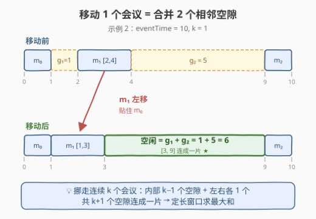
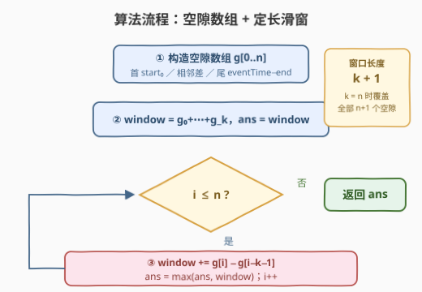

# LeetCode 重新安排会议得到最多空余时间 I 题解

## 1. 题目概述

- **标题 / 题号**：重新安排会议得到最多空余时间 I（#3439，medium）
- **链接**：https://leetcode.cn/problems/reschedule-meetings-for-maximum-free-time-i/
- **难度**：中等
- **标签**：贪心、数组、滑动窗口

**题意**：一个活动从 $t = 0$ 持续到 $t = eventTime$。活动中有 $n$ 个**互不重叠**的会议，第 $i$ 个会议占用区间 $[startTime_i, endTime_i]$。

你可以重新安排**至多 $k$ 个**会议：将会议**平移**（保持时长不变），目标是最大化移动后**相邻两个会议之间的最长连续空余时间**。要求：

- 移动前后会议的**相对顺序不变**；
- 会议之间保持互不重叠，且**不能移出活动边界** $[0, eventTime]$。

返回能得到的最大空余时间。

**示例 1**：

```text
输入：eventTime = 5, k = 1, startTime = [1,3], endTime = [2,5]
输出：2
解释：把 [1, 2] 的会议平移到 [2, 3]，得到空余时间 [0, 2]。
```

**示例 2**：

```text
输入：eventTime = 10, k = 1, startTime = [0,2,9], endTime = [1,4,10]
输出：6
解释：把 [2, 4] 的会议平移到 [1, 3]，得到空余时间 [3, 9]。
```

**示例 3**：

```text
输入：eventTime = 5, k = 2, startTime = [0,1,2,3,4], endTime = [1,2,3,4,5]
输出：0
解释：活动时间被会议完全占满，没有任何空隙可释放。
```

**约束**：

- $1 \le eventTime \le 10^9$
- $n == startTime.length == endTime.length$
- $2 \le n \le 10^5$
- $1 \le k \le n$
- $0 \le startTime_i < endTime_i \le eventTime$
- $endTime_i \le startTime_{i+1}$（原始会议互不重叠）

> 💡 **读题关键**：① 平移不改时长，会议总占时不变，变的只是「摆放位置」；② 「相对顺序不变」意味着会议只能整体前后挪，不能交叉换位；③ 空闲段只能从会议之间的**空隙**里腾出来——本题的全部技巧就在于换一个视角看这些空隙。

## 2. 解题思路

### 2.1 朴素思路：枚举移动哪一段，重新摆好后量空隙

最直接的想法：既然要释放一大段连续空闲，就把挡在中间的会议挪走。由于**顺序不变**，被挪走的会议腾出的空隙必然与两侧的原始空隙相连，所以值得挪的一定是**一段连续的会议**。

于是朴素做法是：枚举连续 $k$ 个会议的起点 $i$（共 $O(n)$ 种），把这 $k$ 个会议全部平移贴到左侧边界（紧贴第 $i-1$ 个会议的结束时刻），然后计算释放出的空隙长度

$$g_i + g_{i+1} + \dots + g_{i+k}$$

其中 $g_j$ 是第 $j$ 个空隙（见 2.2 的定义）。每种方案求和需要 $O(k)$，总复杂度 $O(nk)$。当 $n = k = 10^5$ 时约 $10^{10}$ 次运算，必然超时。

### 2.2 核心观察：移动 k 个连续会议 = 合并 k+1 个相邻空隙



**观察 1：空隙数组**。$n$ 个会议把 $[0, eventTime]$ 切成 $n + 1$ 段空隙：

$$
g_0 = start_0,\quad g_i = start_i - end_{i-1}\ (1 \le i \le n-1),\quad g_n = eventTime - end_{n-1}
$$

时间线形如 `| g₀ | m₀ | g₁ | m₁ | ⋯ | m_{n-1} | gₙ |`。**空隙的总和恒等于 $eventTime$ 减去会议总时长**——移动会议不改变这个总量，只是重新「洗牌」空隙的分布。

**观察 2：一段连续会议整体左移，释放左右及内部全部空隙**。选中连续 $k$ 个会议 $m_i, \dots, m_{i+k-1}$，把它们全部平移贴到左边界（紧贴 $end_{i-1}$，若 $i = 0$ 则贴 $t = 0$）。会议内部原本夹着的 $k - 1$ 个空隙、左侧的 $g_i$ 与右侧的 $g_{i+k}$ 连成一片，长度**恰好**是

$$g_i + g_{i+1} + \dots + g_{i+k} \quad (\text{共 } k+1 \text{ 个空隙})$$

以示例 2（$k = 1$）为例：把会议 $[2,4]$ 左移到 $[1,3]$，左侧空隙 $g_1 = 1$ 与右侧空隙 $g_2 = 5$ 合并成 $[3,9]$，长度 $6$。

**观察 3：最优解一定用满 $k$ 个、且选连续的一段**。若只挪 $j < k$ 个会议，至多释放 $j + 1$ 个连续空隙；挪满 $k$ 个（$k \le n$ 恒成立）可覆盖**任意**长度为 $k+1$ 的空隙窗口，且多挪不会更差（窗口和不减）。而跳着选会议只会让可合并的空隙段断开，不会更长。

> **结论**：问题等价于——在长度为 $n + 1$ 的空隙数组 $g$ 上，求**长度为 $k + 1$ 的定长滑动窗口的最大和**：

$$ans = \max_{0 \le i \le n-k} \ \sum_{j=i}^{i+k} g_j$$

> ⚠️ **边界提醒**：$k$ 可以取到 $n$，此时窗口大小 $k + 1 = n + 1$ 恰好覆盖整个空隙数组，答案为 $eventTime - \sum(end_i - start_i)$（全部空隙之和），即示例 3 的情形（全满时为 $0$）。

### 2.3 算法流程图



1. 构造空隙数组 $g[0..n]$：首部 $start_0$、中间 $start_i - end_{i-1}$、尾部 $eventTime - end_{n-1}$；
2. 初始化窗口：$window = g_0 + \dots + g_k$，$ans = window$；
3. 右端点 $i$ 从 $k + 1$ 滑到 $n$：$window \mathrel{+}= g_i - g_{i-k-1}$，并更新 $ans = \max(ans, window)$；
4. 返回 $ans$。

### 2.4 示例演算

以**示例 2**（`eventTime = 10, k = 1`，会议 `[0,1]`、`[2,4]`、`[9,10]`）走一遍。空隙数组 $g = [0, 1, 5, 0]$，窗口大小 $k + 1 = 2$：

| 窗口 | 空隙 | 和 | 对应操作 | ans |
|---|---|---|---|---|
| $[g_0, g_1]$ | $0 + 1$ | 1 | 把 $m_0$ 右移 / $m_1$ 左移到贴 $t=0$ | 1 |
| $[g_1, g_2]$ | $1 + 5$ | **6** ★ | 把 $m_1$ 左移到 $[1,3]$，空隙 $[3,9]$ | **6** |
| $[g_2, g_3]$ | $5 + 0$ | 5 | 把 $m_1$ 右移到贴 $m_2$ | 6 |

答案 $6$ ✓。**示例 1**（$g = [1, 1, 0]$，窗口 $2$）：$\max(1+1, 1+0) = 2$ ✓。**示例 3**（$g$ 全 $0$）：答案 $0$ ✓。

## 3. 参考代码

### C++

```cpp
class Solution {
  public:
    int maxFreeTime(int eventTime, int k, vector<int>& startTime, vector<int>& endTime) {
        int n = startTime.size();
        vector<long long> gaps(n + 1);
        gaps[0] = startTime[0];
        for (int i = 1; i < n; ++i) {
            gaps[i] = startTime[i] - endTime[i - 1];
        }
        gaps[n] = eventTime - endTime[n - 1];

        long long window = 0, ans = 0;
        for (int i = 0; i <= n; ++i) {
            window += gaps[i];
            if (i >= k + 1) window -= gaps[i - k - 1];   // 维持窗口长度 k+1
            if (i >= k) ans = max(ans, window);          // 窗口 [i-k, i] 已满
        }
        return ans;
    }
};
```

### Python

```python
class Solution:
    def maxFreeTime(self, eventTime: int, k: int, startTime: List[int], endTime: List[int]) -> int:
        n = len(startTime)
        gaps = [startTime[0]]
        gaps += [startTime[i] - endTime[i - 1] for i in range(1, n)]
        gaps.append(eventTime - endTime[-1])

        window = sum(gaps[:k + 1])     # k <= n，窗口最多覆盖全部 n+1 个空隙
        ans = window
        for i in range(k + 1, n + 1):
            window += gaps[i] - gaps[i - k - 1]
            ans = max(ans, window)
        return ans
```

## 4. 复杂度分析

| 维度 | 复杂度 | 说明 |
|------|--------|------|
| 时间 | $O(n)$ | 构造空隙数组一次线性扫描；滑动窗口每个元素进出各一次 |
| 空间 | $O(n)$ | 空隙数组 $g$ 长 $n + 1$；若用「前缀和滚动计算 + 保存最近 $k+1$ 个空隙」可压到 $O(\min(k, n))$，一般无必要 |

## 5. 扩展：进阶版 3440 与变体

**进阶版 [3440. 重新安排会议得到最多空余时间 II](https://leetcode.cn/problems/reschedule-meetings-for-maximum-free-time-ii/)**：只能移动**一个**会议，但允许**改变会议顺序**——即会议可以被平移到活动中的**任意位置**（不止原来相邻的空隙）。此时除了「移到旁边合并两个相邻空隙」（本题的窗口思想仍是候选之一），还要考虑「把会议扔到远处某个能容纳它的空隙里」，需要预处理每个空隙左侧/右侧的最大空隙来 $O(1)$ 判断可行性，整体仍是 $O(n)$，但分类讨论明显更多。

**变体：不定长窗口**。若题目改为「最多移动 $k$ 个会议，求**总**空余时间最大的一段」之类，窗口仍然是定长 $k+1$；但若改成「空隙之和不超过某阈值的最大窗口」，就变成不定长滑动窗口 + 前缀和的二分/双指针，套路参见同类练习题。

## 6. 面试要点

- **Q1：为什么移动的会议一定取连续的一段？**
  答：相对顺序不变时，被挪走的会议只能腾出「它与两侧之间」的空隙；要拼出一段连续空闲，中间挡路的会议必须全部挪走，因此挪走的一定是连续的若干个。跳着挪只会让可合并的空隙断开。
- **Q2：为什么答案是 $k+1$ 个空隙之和，而不是 $k$ 个或 $2k$ 个？**
  答：挪 $j$ 个连续会议会把它们**内部** $j-1$ 个空隙与**左右两端**各一个空隙连成一片，共 $j+1$ 个；$j \le k$，最优取 $j = k$，故为 $k+1$ 个。两端的空隙是「白赚」的，只算内部 $k-1$ 个会漏掉，算 $2k$ 个则高估。
- **Q3：移动会议为什么不用真的模拟新位置？**
  答：因为我们只关心**最长空隙**的长度。连续 $k$ 个会议总时长固定为 $D$，它们占用的区段总长 $L$（从左边界到右边界）也固定，整体左移或右移贴边后空隙恒为 $L - D = $ 区段内 $k+1$ 个空隙之和。长度的不变量让模拟完全多余。
- **Q4：$k = n$ 时会发生什么？需要注意什么？**
  答：窗口大小 $k+1 = n+1$ 恰好等于空隙数组长度，答案就是全部空隙之和 $eventTime - \sum(end_i - start_i)$。代码上要保证窗口初始化 `sum(gaps[:k+1])` 不越界（本题 $k \le n$ 天然安全）；若约束改为 $k$ 可超过 $n$，需先令窗口大小取 $\min(k+1, n+1)$。
- **Q5：这题和普通「定长滑动窗口求最大和」差别在哪？**
  答：算法模板完全一样，考点在**建模**——把「平移会议」翻译成「合并空隙」，把「至多 $k$ 个」翻译成「窗口长度 $k+1$」。换视角后一行滑窗模板就能解决，这是很多日程安排类题目的通用套路。

## 同类练习题

| # | 题目 | 与本题的关联 |
|---|------|-------------|
| 3440 | [重新安排会议得到最多空余时间 II](https://leetcode.cn/problems/reschedule-meetings-for-maximum-free-time-ii/) | 本题进阶版，只移一个会议但顺序可变，需额外判断「会议能否塞进远处的大空隙」 |
| 1456 | [定长子串中元音的最大数目](https://leetcode.cn/problems/maximum-number-of-vowels-in-a-substring-of-given-length/) | 最裸的定长滑动窗口求最大和，适合练模板 |
| 643 | [子数组最大平均数 I](https://leetcode.cn/problems/maximum-average-subarray-i/) | 定长窗口最大和取平均，注意浮点精度写法 |
| 1052 | [爱生气的书店老板](https://leetcode.cn/problems/grumpy-bookstore-owner/) | 窗口内外分开计算的滑窗变体，同样是「窗口内全拿 + 窗口外另算」的结构 |
| 2379 | [得到 K 个黑块的最少白色块](https://leetcode.cn/problems/minimum-recolors-to-get-k-consecutive-black-blocks/) | 定长窗口求最小值，与本题互为 max/min 镜像 |
