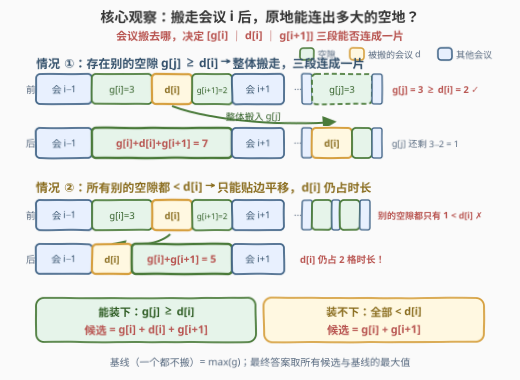
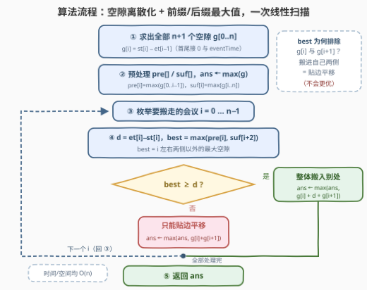

# 重新安排会议得到最多空余时间 II

- **题目名称**：重新安排会议得到最多空余时间 II
- **链接**：[3440. 重新安排会议得到最多空余时间 II](https://leetcode.cn/problems/reschedule-meetings-for-maximum-free-time-ii/)
- **难度**：中等
- **标签**：贪心、数组、枚举

## 1. 题目概述

给你一个整数 `eventTime` 表示一个活动的总时长，这个活动开始于 $t = 0$，结束于 $t = \text{eventTime}$。

同时给你两个长度为 `n` 的整数数组 `startTime` 和 `endTime`，表示这次活动中 `n` 个时间**没有重叠**的会议，其中第 `i` 个会议的时间为 $[\text{startTime}[i],\ \text{endTime}[i]]$。

你可以重新安排**至多一个**会议，安排的规则是**将会议时间平移**且**保持原来的会议时长**，目的是移动会议后**最大化最长连续空余时间**。请你返回重新安排会议以后，可以得到的最大空余时间。

注意：

- 会议**不能**安排到整个活动的时间以外（$[0,\ \text{eventTime}]$ 之外），且会议之间需要保持互不重叠；
- 重新安排会议以后，会议之间的**顺序可以发生改变**。

**示例 1**：

```text
输入：eventTime = 5, startTime = [1,3], endTime = [2,5]
输出：2
解释：将 [1, 2] 的会议平移到 [2, 3]，得到空余时间 [0, 2]。
```

**示例 2**：

```text
输入：eventTime = 10, startTime = [0,7,9], endTime = [1,8,10]
输出：7
解释：将 [0, 1] 的会议平移到 [8, 9]，得到空余时间 [0, 7]。
```

**示例 3**：

```text
输入：eventTime = 10, startTime = [0,3,7,9], endTime = [1,4,8,10]
输出：6
解释：将 [3, 4] 的会议平移到 [8, 9]，得到空余时间 [1, 7]。
```

**示例 4**：

```text
输入：eventTime = 5, startTime = [0,1,2,3,4], endTime = [1,2,3,4,5]
输出：0
解释：活动中的所有时间都被会议安排满了。
```

**约束条件**：

- $1 \le \text{eventTime} \le 10^9$
- $n == \text{startTime.length} == \text{endTime.length}$
- $2 \le n \le 10^5$
- $0 \le \text{startTime}[i] < \text{endTime}[i] \le \text{eventTime}$
- $\text{endTime}[i] \le \text{startTime}[i+1]$（会议按时间有序且不重叠）

> 💡 **读题关键**：① 只能动**至多一个**会议，且只能**平移**（时长不变）；② 平移后顺序可以改变——这句话是 I/II 两版的分水岭：**版本 II 允许把会议搬到任意远处的空隙里**，于是「这个会议能否被别的空隙装下」成为核心判定；③ 求的是**最长连续空余时间**，不是总空余时间（总空余时间恒等于 $\text{eventTime} - \sum d_i$，怎么搬都不变）。

---

## 2. 解题思路

### 2.1 暴力思路：枚举「搬哪个会议 + 搬到哪里」

最朴素的做法有两层枚举：

- **搬哪个**：$n$ 种选择；
- **搬到哪**：位置是连续的（$[0,\ \text{eventTime} - d_i]$ 内任一起点），但本质只有 $O(n)$ 个**离散候选**——要么贴着某个会议的边，要么塞进某个空隙里。逐位置模拟是 $O(\text{eventTime})$，不可行（$10^9$）。

即便把「搬到哪」离散化成 $O(n)$ 个候选，总复杂度也是 $O(n^2)$（$n = 10^5$ 时约 $10^{10}$ 次操作）。瓶颈在于：对每个会议 $i$，我们都要**重新扫描全部空隙**来判断「有没有别的地方装得下它」。

优化方向：**把「别处最大空隙」变成 $O(1)$ 可查**，这正是前缀/后缀最大值的拿手好戏。

### 2.2 核心观察：空隙视角 + 「搬走」与「平移」二分

**观察一：切换到空隙视角。** $n$ 个互不重叠的会议把 $[0,\ \text{eventTime}]$ 切成恰好 $n+1$ 段**空隙**：

$$g[0] = \text{startTime}[0],\quad g[i] = \text{startTime}[i] - \text{endTime}[i-1],\quad g[n] = \text{eventTime} - \text{endTime}[n-1]$$

搬走一个会议的效果，就是让**它两侧的空隙与它原本占的地盘连成一片**。

**观察二：搬走会议 $i$（时长 $d_i$）只有两种结局。**

- **结局 A（整体搬走）**：若存在**别的空隙** $g[j] \ge d_i$（$j \notin \{i,\ i+1\}$，即不在自己左右两侧），就把会议整体塞进去。此时原地的三段连成一片，贡献候选
  $$g[i] + d_i + g[i+1]$$
- **结局 B（贴边平移）**：若所有别的空隙都装不下（$< d_i$），会议只能在自己两侧的范围内贴边平移。$d_i$ 这段时长**仍然被占用**，只是从中间挪到了边上，贡献候选
  $$g[i] + g[i+1]$$

> ⚠️ **结局 B 的候选没有 $d_i$**——这是本题最容易写错的地方。会议平移后依然要占 $d_i$ 的时长，两段空隙拼起来只能是 $g[i] + g[i+1]$，多出来的 $d_i$ 是「拆东墙补西墙」，并不能凭空消失。



**观察三：「别处最大空隙」用前缀/后缀最大值 $O(1)$ 查询。** 判定结局 A 需要知道**排除 $g[i]$、$g[i+1]$ 之后**的最大空隙（搬进自己两侧等于贴边平移，属于结局 B）。预处理

$$\text{pre}[i] = \max(g[0..i-1]),\qquad \text{suf}[i] = \max(g[i..n])$$

则会议 $i$ 的「别处最大空隙」为 $\text{best} = \max(\text{pre}[i],\ \text{suf}[i+2])$。

> 💡 **为什么排除两个位置却只需前后缀各查一次？** 「别处」= $g[0..i-1]$ 全体 ∪ $g[i+2..n]$ 全体，恰好被 $\text{pre}[i]$ 和 $\text{suf}[i+2]$ **无缝覆盖**，不多不少。这与 [42. 接雨水](https://leetcode.cn/problems/trapping-rain-water/) 的左右最大值、[238. 除自身以外数组的乘积](https://leetcode.cn/problems/product-of-array-except-self/) 的前后缀乘积是同一个套路：**「排除自己」的前缀/后缀分解**。

最后别忘了**基线**：一个会议都不搬，答案至少是 $\max_j g[j]$。

### 2.3 算法流程

结合三个观察，算法一次线性扫描完成：



1. 求出 $n+1$ 个空隙 $g[0..n]$；
2. 预处理前缀最大值 `pre[]`、后缀最大值 `suf[]`，初始化 `ans = max(g)`（基线）；
3. 枚举要搬的会议 $i = 0 \dots n-1$：
   - $d = \text{endTime}[i] - \text{startTime}[i]$，$\text{best} = \max(\text{pre}[i],\ \text{suf}[i+2])$；
   - 若 $\text{best} \ge d$（装得下）：`ans = max(ans, g[i] + d + g[i+1])`；
   - 否则（只能平移）：`ans = max(ans, g[i] + g[i+1])`；
4. 返回 `ans`。

### 2.4 示例演算

以**示例 3**（`eventTime = 10, startTime = [0,3,7,9], endTime = [1,4,8,10]`）为例。先求空隙：$g = [0,\ 2,\ 3,\ 1,\ 0]$（共 $n+1 = 5$ 段），`pre/suf` 略，逐会议枚举：

| 搬会议 $i$ | 时段 | $d_i$ | $\text{best}$（别处最大空隙） | 装得下？ | 候选值 |
|-----------|------|-------|------------------------------|---------|--------|
| 0 | $[0,1]$ | 1 | $\max(g[2],g[3],g[4]) = 3$ | ✓ | $g[0]+1+g[1] = 3$ |
| 1 | $[3,4]$ | 1 | $\max(g[0],g[3],g[4]) = 1$ | ✓ | $g[1]+1+g[2] = \mathbf{6}$ |
| 2 | $[7,8]$ | 1 | $\max(g[0],g[1],g[4]) = 2$ | ✓ | $g[2]+1+g[3] = 5$ |
| 3 | $[9,10]$ | 1 | $\max(g[0],g[1],g[2]) = 3$ | ✓ | $g[3]+1+g[4] = 2$ |

基线 $\max(g) = 3$，全部候选的最大值为 $6$（搬会议 1 到空隙 $g[3]$ 里，对应官方解释「将 $[3,4]$ 平移到 $[8,9]$，得到空余时间 $[1,7]$」）✓。

再看**示例 1**（`eventTime = 5, startTime = [1,3], endTime = [2,5]`）：$g = [1,\ 1,\ 0]$。

| 搬会议 $i$ | 时段 | $d_i$ | $\text{best}$ | 装得下？ | 候选值 |
|-----------|------|-------|--------------|---------|--------|
| 0 | $[1,2]$ | 1 | $g[2] = 0$ | ✗ | $g[0]+g[1] = 2$ |
| 1 | $[3,5]$ | 2 | $g[0] = 1$ | ✗ | $g[1]+g[2] = 1$ |

两个会议都**装不进任何别处空隙**，全部走「贴边平移」分支；基线 $\max(g)=1$，答案 $2$ ✓。这正是结局 B 的价值：即使搬不走，平移也能把两侧空隙拼起来。

---

## 3. 参考代码

### C++

```cpp
class Solution {
public:
    int maxFreeTime(int eventTime, vector<int>& startTime, vector<int>& endTime) {
        int n = startTime.size();
        vector<int> gaps(n + 1);
        gaps[0] = startTime[0];
        for (int i = 1; i < n; i++) {
            gaps[i] = startTime[i] - endTime[i - 1];
        }
        gaps[n] = eventTime - endTime[n - 1];

        // pre[i] = max(gaps[0..i-1])，suf[i] = max(gaps[i..n])
        vector<int> pre(n + 2), suf(n + 3);
        for (int i = 0; i <= n; i++) pre[i + 1] = max(pre[i], gaps[i]);
        for (int i = n; i >= 0; i--) suf[i] = max(suf[i + 1], gaps[i]);

        int ans = pre[n + 1];  // 基线：一个都不搬
        for (int i = 0; i < n; i++) {
            int d = endTime[i] - startTime[i];
            int best = max(pre[i], suf[i + 2]);  // 排除 g[i]、g[i+1] 的最大空隙
            if (best >= d) {
                ans = max(ans, gaps[i] + d + gaps[i + 1]);  // 整体搬走
            } else {
                ans = max(ans, gaps[i] + gaps[i + 1]);      // 只能贴边平移
            }
        }
        return ans;
    }
};
```

### Python

```python
class Solution:
    def maxFreeTime(self, eventTime: int, startTime: List[int], endTime: List[int]) -> int:
        n = len(startTime)
        gaps = [0] * (n + 1)
        gaps[0] = startTime[0]
        for i in range(1, n):
            gaps[i] = startTime[i] - endTime[i - 1]
        gaps[n] = eventTime - endTime[n - 1]

        pre = [0] * (n + 2)
        for i in range(n + 1):
            pre[i + 1] = max(pre[i], gaps[i])
        suf = [0] * (n + 3)
        for i in range(n, -1, -1):
            suf[i] = max(suf[i + 1], gaps[i])

        ans = pre[n + 1]  # 基线：一个都不搬
        for i in range(n):
            d = endTime[i] - startTime[i]
            best = max(pre[i], suf[i + 2])  # 排除 g[i]、g[i+1] 的最大空隙
            if best >= d:
                ans = max(ans, gaps[i] + d + gaps[i + 1])  # 整体搬走
            else:
                ans = max(ans, gaps[i] + gaps[i + 1])      # 只能贴边平移
        return ans
```

> 💡 **实现细节**：① `suf` 多开 2 格（`n+3`），保证 `suf[i+2]` 在 $i = n-1$ 时取到 `suf[n+1] = 0`（空区间）；② 数值范围：所有候选 $\le \text{eventTime} \le 10^9$，`int` 足够；③ 「装得下」的判定是 `best >= d`（恰好相等也算，空隙两端贴满即可）。

---

## 4. 复杂度分析

| 维度 | 复杂度 | 说明 |
|------|--------|------|
| 时间复杂度 | $O(n)$ | 求空隙、前后缀最大值、逐会议枚举各一次线性扫描 |
| 空间复杂度 | $O(n)$ | `gaps`、`pre`、`suf` 三个长度 $n+O(1)$ 的数组 |
| 暴力对照 | $O(n^2)$ | 每个会议都要重新扫描全部空隙判断可安置性（「搬到哪」离散化后） |

---

## 5. 扩展：与版本 I 的对比、能否 $O(1)$ 额外空间

**与 [3439. 重新安排会议得到最多空余时间 I](https://leetcode.cn/problems/reschedule-meetings-for-maximum-free-time-i/) 的对比。** 两题题面几乎相同，差别在两处：

| | 版本 I（3439） | 版本 II（本题） |
|---|---|---|
| 可搬会议数 | 至多 $k$ 个 | 至多 $1$ 个 |
| 顺序约束 | 平移前后**相对顺序不变** | 顺序**可以改变** |

顺序不变意味着会议只能在自己相邻的空隙间腾挪，最优解一定是**把连续 $k+1$ 段空隙及其夹着的 $k$ 个会议「压扁合并」**——对空隙数组做长度为 $k+1$ 的**滑动窗口**求和即可，$O(n)$。本题（版本 II）顺序可变，会议可以搬到任意远处，考点从滑窗变成「别处最大空隙」的前后缀最大值判定。两题合起来正好覆盖「空隙数组」建模的两种经典处理方式。

**$O(1)$ 额外空间的实现。** 本题也可以不建 `pre/suf` 数组：先一次扫描记录**最大的三个空隙**（值 + 下标），对会议 $i$，在三大空隙中取第一个下标 $\notin \{i,\ i+1\}$ 者作为 `best`——排除两个位置、备选三个最大值，鸽笼原理保证必有一个可用。注意必须维护**前三**而非前二：若最大和次大恰好就是被排除的 $g[i]$、$g[i+1]$，还需要第三大兜底（数值并列时尤其容易踩坑，这也是很多题解 WA 的地方）。空间从 $O(n)$ 降到 $O(1)$，代码却更易错——工程上推荐可读性更好的前后缀版本。

---

## 6. 面试要点

1. **为什么「贴边平移」的候选是 $g[i] + g[i+1]$，没有 $d_i$？**

   - 平移不改变会议占用的总时长，$d_i$ 只是换了个位置仍横在中间。把会议推到最左（贴住会议 $i-1$），右边连出的空地是 $g[i] + g[i+1]$；推到最右对称。只有把会议**整体搬离**这片区域（塞进别处空隙），原地的 $d_i$ 才会真正腾出来，此时才有 $g[i] + d_i + g[i+1]$。

2. **判定「别处装得下」时为什么要排除 $g[i]$ 和 $g[i+1]$ 两个位置？**

   - 「别处」指会议当前位置以外的地方。把会议塞进 $g[i]$（左邻空隙）或 $g[i+1]$（右邻空隙），等价于贴着原位平移，得到的仍然只是 $g[i] + g[i+1]$ 档次的候选，不会更优；若不排除，会**误判成结局 A**，把 $d_i$ 重复计入，答案偏大。

3. **前缀/后缀最大值为什么恰好能覆盖「排除两个相邻位置」的查询？**

   - 会议 $i$ 的两个禁区是下标 $i$ 和 $i+1$，剩余空隙恰好分裂成前缀段 $g[0..i-1]$ 与后缀段 $g[i+2..n]$，两边各取最大值再取 max 即可，$O(1)$ 完成。若题目改成「排除任意两个不相邻位置」，前后缀就不够了——那时维护前三大值（鸽笼兜底）是通用解法。

4. **答案需要和「一个都不搬」比较吗？**

   - 需要。`ans` 初始化为 $\max(g)$ 这一基线不可省略：当所有会议都太长、任何空隙都装不下时（如示例 1、4），每个候选都来自「贴边平移」甚至全为 0，但原始最大空隙本身可能就是答案（例如只有一个大空隙、其他地方全满时，不动反而最优）。

5. **本题和接雨水（42 题）在套路上的共同点是什么？**

   - 都是「**排除当前位置的前缀/后缀最大值**」分解：接雨水求每个位置左右两侧最高墙取 min；本题求每个会议两侧以外最大空隙。识别信号是——查询「去掉自己（或自己附近）之后的整体最值」，且被去掉的恰好是连续/可分割的区间。

---

## 7. 同类练习题

- [3439. 重新安排会议得到最多空余时间 I](https://leetcode.cn/problems/reschedule-meetings-for-maximum-free-time-i/)：同系列姊妹题，顺序不可变 + 可搬 $k$ 个会议，改为对空隙数组做长度 $k+1$ 的滑动窗口求和
- [42. 接雨水](https://leetcode.cn/problems/trapping-rain-water/)（[站内题解](../0001-0100/42_接雨水.md)）：「排除自身的左右前缀/后缀最大值」套路的母题
- [238. 除自身以外数组的乘积](https://leetcode.cn/problems/product-of-array-except-self/)（[站内题解](../0201-0300/238_除自身以外数组的乘积.md)）：前后缀分解的经典形态，对照本题理解「排除自己」的不同变体
- [57. 插入区间](https://leetcode.cn/problems/insert-interval/)（[站内题解](../0001-0100/57_插入区间.md)）：区间/空隙离散化建模的基础练习
- [56. 合并区间](https://leetcode.cn/problems/merge-intervals/)（[站内题解](../0001-0100/56_合并区间.md)）：区间问题通用入门，熟悉「端点—空隙」视角的转换
