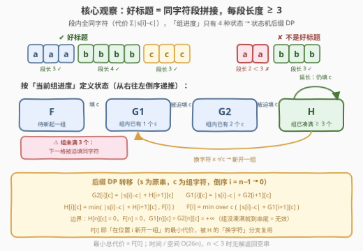
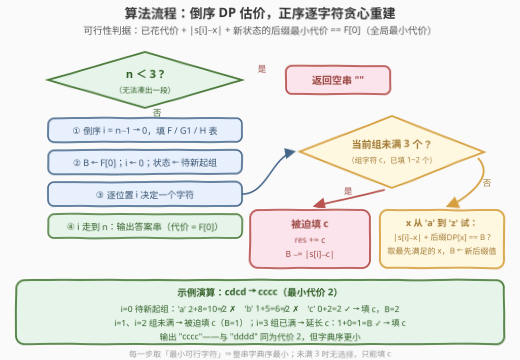

# LeetCode 变成好标题的最少代价 题解

- **关联**：926（前缀状态最小代价 DP）、2375（可行性 + 字典序贪心）、2953（字符分段约束）

## 1. 题目概述

- **标题 / 题号**：变成好标题的最少代价（#3441，hard）
- **链接**：https://leetcode.cn/problems/minimum-cost-good-caption/
- **难度**：困难
- **标签**：字符串、动态规划

**题意**：给你一个长度为 $n$ 的字符串 `caption`。如果字符串中**每一个**字符都位于**连续出现至少 3 次**的组中（即每个极大同字符段的长度都 ≥ 3），就称它是**好标题**。例如 `"aaabbb"`、`"aaaaccc"` 是好标题；`"aabbb"`（`aa` 段长 2）、`"ccccd"`（`d` 段长 1）不是。

你可以执行任意次操作：选择一个下标 $i$，把该处字符变成字母表中**前一个**或**后一个**字母。请求出把 `caption` 变成好标题的**最少操作次数**；若有多个代价最小的好标题，返回其中**字典序最小**的一个；若无法得到好标题，返回空字符串 `""`。

**示例 1**：

```text
输入：caption = "cdcd"
输出："cccc"
解释：2 次操作可得到 "dddd"（两个 'c' 各 +1）或 "cccc"（两个 'd' 各 −1），
     代价同为 2，"cccc" 字典序更小。
```

**示例 2**：

```text
输入：caption = "aca"
输出："aaa"
解释：把 caption[1] 的 'c' 变为 'a' 需 2 次操作（c→b→a），共 2 次得到 "aaa"。
```

**示例 3**：

```text
输入：caption = "bc"
输出：""
解释：长度小于 3，无法凑出任何长度 ≥ 3 的段。
```

**约束**：

- $1 \le \text{caption.length} \le 5 \times 10^4$
- `caption` 只包含小写英文字母。

> 💡 **读题关键**：① 每次 ±1 操作意味着把 $s[i]$ 改成字符 $c$ 的代价就是 $|s[i] - c|$，不必逐步模拟；② 「好标题」等价于「**若干条长度 ≥ 3 的同字符段**首尾相接」——答案是一个**分段结构**；③ 目标是双重的：先**总代价最小**，再在最小代价方案中取**字典序最小**；④ $n < 3$ 时连一段都凑不出，直接返回空串；$n \ge 3$ 时全串改成同一字符必然可行，故只有这一种无解情况。

## 2. 解题思路

### 2.1 暴力思路：枚举分段与每段字符

把答案串看成「若干段，每段长度 ≥ 3、段内全同字符」。暴力需要枚举：

- 段的划分方式：段长组合是指数级的（本质是「部分和 ≥ 3 的有序拆分」）；
- 每段的字符：每段 26 种选择，共 $26^{\text{段数}}$。

即使退一步用「每个位置枚举目标字符」的 $26^n$ 写法，$n \le 5 \times 10^4$ 也完全不可行。但暴力已经点破全部结构：**代价按段独立累加，段与段之间只通过「相邻拼接」耦合**。优化的方向就是把「段的精确边界和长度」从状态里挤出去。

### 2.2 核心观察：组进度状态机 + 后缀 DP



**观察一（代价拆分）**：设某段覆盖区间 $[l, r]$、字符为 $c$，它的代价是 $\sum_{k=l}^{r} |s[k] - c|$；总代价是各段之和。整个问题 = **选一个分段方案 + 每段选一个字符**。

**观察二（约束是局部的 → 状态机）**：段一旦开始又没填满 3 个，下一格**被迫**填同一个字符（否则这段就以长度 < 3 封顶，整串非法）；凑满 3 个之后，下一格**完全自由**（延长旧段，或换字符新开一段）。也就是说，从位置 $i$ 往右的一切填法，只由「当前组的进度」决定，共 4 类状态。

**观察三（长度到 3 即封顶）**：组凑满 3 个之后，究竟是 3 个、4 个还是 40 个，对未来的可行性与代价毫无影响——状态**不需要**记录精确长度。这一步把指数级的划分空间压成了 $O(26n)$。

于是定义**后缀 DP**（$c$ 取 $0 \sim 25$，$i$ 从 $n$ 往 $0$ 递推，$s$ 为原串）：

| 状态 | 含义 |
|------|------|
| $F[i]$ | $i$ 之前没有未完成的组，把 $i \dots n-1$ 填完的最小代价 |
| $G_1[i][c]$ | 以 $i-1$ 结尾有一个只填了 **1 个** $c$ 的组，把 $i \dots n-1$ 填完的最小代价 |
| $G_2[i][c]$ | 以 $i-1$ 结尾有一个填了 **2 个** $c$ 的组，把 $i \dots n-1$ 填完的最小代价 |
| $H[i][c]$ | 以 $i-1$ 结尾有一个**已凑满 ≥ 3 个** $c$ 的组，把 $i \dots n-1$ 填完的最小代价 |

转移方程（$F[i]$ 恰好就是「在位置 $i$ 新开一组」的最小代价，被 $H$ 的换字符分支复用）：

$$G_2[i][c] = |s[i]-c| + H[i+1][c] \qquad G_1[i][c] = |s[i]-c| + G_2[i+1][c]$$

$$H[i][c] = \min\big(\, |s[i]-c| + H[i+1][c],\ F[i] \,\big) \qquad F[i] = \min_{c}\big(\, |s[i]-c| + G_1[i+1][c] \,\big)$$

边界：$H[n][c] = 0$、$F[n] = 0$、$G_1[n][c] = G_2[n][c] = +\infty$（组没凑满就到串尾 = 非法）。**最小总代价 = $F[0]$**。

### 2.3 算法流程：倒序估价 + 正序逐字符贪心



代价最小化解决了，**字典序最小**才是本题真正的拦路虎。注意不能简单地「每段贪心选最小字符」：段长的选择会影响后续位置，例如 `bbb` 后面接 `a…`（短段）还是继续 `bbbb…`（长段），取决于下一段首字符与 `b` 的大小关系，局部比较不出全局字典序。

正解是**逐字符**贪心（而不是逐段）：维护剩余预算 $B$——它始终等于「当前状态的后缀 DP 值」。在位置 $i$：

| 当前状态 | 可选字符 | 转移与预算更新 |
|----------|----------|----------------|
| 组未满 3（进度 1 或 2） | 只能 $c$ | $B \gets B - \|s[i]-c\|$，进度 +1（无分支） |
| 组已满 / 待新起一组 | $x$ 从 `'a'` 到 `'z'` 试 | **延长**：$\|s[i]-c\| + H[i+1][c] = B$ 则填 $c$；**新开**：$\|s[i]-x\| + G_1[i+1][x] = B$ 则填 $x$，$B \gets G_1[i+1][x]$ |

取**第一个**满足判据的字符。正确性由两点保证：

1. **可行性被精确刻画**：状态 $(i, \text{组字符}, \text{组进度})$ 满足马尔可夫性，其后缀 DP 值就是从该状态出发的最小剩余代价。因此「已花代价 + $\|s[i]-x\|$ + 新状态的后缀值 $= F[0]$」**当且仅当**存在一个以 $x$ 开头的、总代价恰为 $F[0]$ 的补全方案。
2. **字典序逐位决定**：字典序由第一个不同位置决定，每位取最小可行字符，归纳即得整串字典序最小。

一个易错细节：从已满的 $c$ 组「新开一组同样填 $c$」与「延长」在串上是同一个字符，但判据不同——延长查 $H[i+1][c]$（之后仍自由），新开查 $G_1[i+1][c]$（之后还欠 2 个同字符）。由 $G_1 \ge H$（多受约束的代价只会更大），统一用更松的 $H$ 判 $x = c$ 即可，不会漏解也不会误收。

### 2.4 示例演算

用**示例 1**（`caption = "cdcd"`，$F[0] = 2$）走一遍，$B$ 为剩余预算：

| $i$ | $s[i]$ | 当前状态 | 决策 | $B$ |
|-----|--------|----------|------|-----|
| 0 | `c` | 待新起一组 | 试 `'a'`：$2+8 \ne 2$ ✗，`'b'`：$1+5 \ne 2$ ✗，`'c'`：$0+2=2$ ✓ → 填 `c` | $2 \to 2$ |
| 1 | `d` | 组内第 1 个 | 未满 3，被迫填 `c`（花 1） | $2 \to 1$ |
| 2 | `c` | 组内第 2 个 | 未满 3，被迫填 `c`（花 0） | $1 \to 1$ |
| 3 | `d` | 组已凑满 3 | 试延长 `c`：$1 + 0 = 1 = B$ ✓ → 填 `c` | $1 \to 0$ |

输出 `"cccc"`。同代价 2 的 `"dddd"` 首字符更大，在 $i=0$ 这一步就被贪心淘汰了。示例 2 中 $F[0]=2$，位置 0 试 `'a'`（$0+2=2$ ✓）直接命中，随后两位被迫填 `'a'`，得 `"aaa"`；示例 3 长度 2 < 3，返回空串。

## 3. 参考代码

### C++

```cpp
class Solution {
public:
    string minCostGoodCaption(string caption) {
        int n = caption.size();
        if (n < 3) return "";
        const int INF = 1e9;
        // G1[i][c]：以 i-1 结尾的组只填了 1 个 c，填完 i..n-1 的最小代价
        // H[i][c] ：以 i-1 结尾的组已凑满 >=3 个 c，填完 i..n-1 的最小代价
        // F[i]    ：i 之前无未完成组，从 i 开始填完的最小代价（= 在 i 新开一组）
        vector<vector<int>> G1(n + 1, vector<int>(26, INF));
        vector<vector<int>> H(n + 1, vector<int>(26, 0));
        vector<int> F(n + 1, INF);
        F[n] = 0;
        vector<int> G2next(26, INF), G1next(26, INF);  // 滚动行：G2 / G1 的第 i+1 行
        for (int i = n - 1; i >= 0; --i) {
            int ai = caption[i] - 'a';
            int cost[26];
            for (int c = 0; c < 26; ++c) cost[c] = abs(ai - c);
            const vector<int>& Hn = H[i + 1];
            vector<int> G2cur(26), G1cur(26), Hcur(26);
            int Fcur = INF;
            for (int c = 0; c < 26; ++c) {
                G2cur[c] = cost[c] + Hn[c];              // 凑第 2 个
                G1cur[c] = cost[c] + G2next[c];          // 凑第 1 个
                Fcur = min(Fcur, cost[c] + G1next[c]);   // 在 i 新开一组
            }
            for (int c = 0; c < 26; ++c)
                Hcur[c] = min(cost[c] + Hn[c], Fcur);    // 延长旧组 or 换字符新开
            G1[i] = move(G1cur);
            H[i] = move(Hcur);
            F[i] = Fcur;
            G2next = move(G2cur);
            G1next = G1[i];
        }
        string res;
        res.reserve(n);
        int B = F[0];          // 剩余预算 = 当前状态的后缀最小代价
        int mode = 0, c = -1;  // 0=待新起, 1/2=组内已有 1/2 个, 3=组已凑满
        for (int i = 0; i < n; ++i) {
            int ai = caption[i] - 'a';
            if (mode == 1 || mode == 2) {        // 未满 3：被迫填 c
                res.push_back('a' + c);
                B -= abs(ai - c);
                ++mode;
                continue;
            }
            for (int x = 0; x < 26; ++x) {       // 逐字符贪心：取最小可行 x
                int cst = abs(ai - x);
                if (mode == 3 && x == c) {       // 延长当前组（判据用更松的 H）
                    if (cst + H[i + 1][c] == B) {
                        res.push_back('a' + c);
                        B = H[i + 1][c];
                        break;
                    }
                } else if (cst + G1[i + 1][x] == B) {  // 新开一组
                    res.push_back('a' + x);
                    B = G1[i + 1][x];
                    c = x;
                    mode = 1;
                    break;
                }
            }
        }
        return res;
    }
};
```

### Python

```python
from array import array

class Solution:
    def minCostGoodCaption(self, caption: str) -> str:
        n = len(caption)
        if n < 3:
            return ""
        INF = 10 ** 9
        a = [ord(ch) - 97 for ch in caption]

        G1 = [None] * (n + 1)   # 以 i-1 结尾的组只填了 1 个 c，填完 i..n-1 的最小代价
        H = [None] * (n + 1)    # 以 i-1 结尾的组已凑满 >=3 个 c，填完 i..n-1 的最小代价
        G1[n] = array('i', [INF] * 26)
        H[n] = array('i', [0] * 26)
        G2next = array('i', [INF] * 26)   # 滚动行：G2 的第 i+1 行
        G1next = G1[n]
        F = [INF] * (n + 1)    # F[i]：i 之前无未完成组（= 在 i 新开一组）
        F[n] = 0

        rng = range(26)
        for i in range(n - 1, -1, -1):
            ai = a[i]
            cost = [abs(ai - c) for c in rng]
            Hn = H[i + 1]
            G2cur = array('i', [cost[c] + Hn[c] for c in rng])             # 凑第 2 个
            G1cur = array('i', [cost[c] + G2next[c] for c in rng])         # 凑第 1 个
            Fcur = min(cost[d] + G1next[d] for d in rng)                   # 在 i 新开一组
            Hcur = array('i', [min(cost[c] + Hn[c], Fcur) for c in rng])   # 延长 or 新开
            G1[i], H[i], F[i] = G1cur, Hcur, Fcur
            G2next, G1next = G2cur, G1cur

        res = []
        B = F[0]              # 剩余预算 = 当前状态的后缀最小代价
        mode, c = 0, -1       # 0=待新起, 1/2=组内已有 1/2 个, 3=组已凑满
        for i in range(n):
            ai = a[i]
            if mode == 1 or mode == 2:     # 未满 3：被迫填 c
                res.append(c)
                B -= abs(ai - c)
                mode += 1
                continue
            G1n, Hn = G1[i + 1], H[i + 1]
            for x in range(26):            # 逐字符贪心：取最小可行 x
                cst = abs(ai - x)
                if mode == 3 and x == c:   # 延长当前组（判据用更松的 H）
                    if cst + Hn[c] == B:
                        res.append(c)
                        B = Hn[c]
                        break
                elif cst + G1n[x] == B:    # 新开一组
                    res.append(x)
                    B = G1n[x]
                    c = x
                    mode = 1
                    break
        return ''.join(chr(97 + x) for x in res)
```

> 💡 **实现细节**：① `INF` 取 $10^9$：非法状态的「传染值」每层至多多加 25（单字符最大差），$10^9 + 25n < 2^{31}$，`int` 不会溢出；而重建时 $B \le 25n$，永远不可能与 INF 系的值相等，天然排除非法状态。② `G2` 只被转移引用，滚动即可；`G1`、`H` 在重建时要按任意下标随机访问，必须整表保存。③ Python 用 `array('i')` 存两张 26 宽的表（$n=5\times10^4$ 时约 20MB，纯 list 约 100MB）。④ 逐字符贪心里未满 3 的状态直接填 $c$，不必查表——预算做减法即可，进到「已满」状态时它自动等于 $H[i+1][c]$。

## 4. 复杂度分析

设 $n$ 为串长。

| 维度 | 复杂度 | 说明 |
|------|--------|------|
| **时间** | $O(26n)$ | 倒序 DP 每步对 26 个字符做常数次运算；正序重建每位至多试 26 个字符 |
| **空间** | $O(26n)$ | $G_1$、$H$ 两张 $(n+1) \times 26$ 的表（重建需要）+ 一维 $F$；$G_2$ 滚动 |
| **对比暴力** | 指数级 | 状态机把「段的精确长度与划分边界」压缩成 4 类组进度，26 的因子来自每位的字符枚举 |

$n = 5 \times 10^4$ 时约 $1.3 \times 10^6$ 个状态：C++ 约 20ms，Python 约 1s。

## 5. 扩展：段长 {3, 4, 5} 的划分型 DP

本题还有一条经典化简路线：**任何长度 $L \ge 6$ 的段都能拆成 $3 + (L-3)$**（对 $L$ 归纳，$L = 3,4,5$ 为基底），所以最优解总可以假定每段长度 $\in \{3,4,5\}$。于是令 $dp[i]$ 为前 $i$ 个字符的最小代价，转移枚举末段长度 $L \in \{3,4,5\}$ 与字符 $c$，配合「每字符前缀和」数组 $O(1)$ 算段代价，总时间 $O(78n)$，空间还能降到 $O(n)$。

但这个模型把「字符 × 段边界」绑死在一个转移里，**字典序重建**会变得非常别扭：同首字符下要比较「短段 + 下一字符」与「长段」的嵌套字典序（短更好还是长更好取决于下一段首字符与当前字符的大小），不得不递归比较后缀。状态机 + 逐字符贪心则完全绕开这个泥潭——每位独立决策、判据一行等式，这也正是本题选择这种建模的原因。另外，若题目只问最小代价、不要求字典序，一遍 DP 输出 $F[0]$ 即可，连重建阶段都能省掉。

## 6. 面试要点

1. **为什么组未满 3 个时，下一格被迫填同字符？**

   > 好标题要求每个**极大**同字符段长度 ≥ 3。若组内已有 1~2 个 $c$ 而下一格填了别的字符，这个段就以长度 < 3 封顶，整串立刻非法。不存在「先跳走再回来补救」——同字符不相邻就不属于同一段。

2. **状态为什么不用记录组的精确长度？**

   > 组凑满 3 个之后，无论之后延长到 3 还是 30，「下一格可填任意字符」的性质不变，后缀的最优代价只依赖「已满」这个布尔事实。记了精确长度也用不上——这正是能把指数级划分空间压成 $O(26n)$ 的关键一步（类比滑窗问题里「长度封顶」的套路）。

3. **逐字符贪心凭什么得到字典序最小的最小代价串？**

   > 两个要素：① 马尔可夫性——状态 $(i, \text{组字符}, \text{组进度})$ 囊括了未来的全部约束，其后缀 DP 值精确等于从该状态出发的最小剩余代价，因此「已花代价 + 填 $x$ 的代价 + 新状态后缀值 $= F[0]$」**当且仅当**存在以 $x$ 开头的最优补全；② 字典序由第一个不同位置决定，逐位取最小可行字符，归纳得整串字典序最小。

4. **「延长当前组」和「新开一组」的判据为什么分别查 $H$ 和 $G_1$？能混用吗？**

   > 延长后状态仍是「已满」，剩余代价是 $H[i+1][c]$；新开一组后还欠 2 个同字符，剩余代价是 $G_1[i+1][x]$。由「欠约束的状态可行方案 ⊆ 自由状态」可得 $G_1 \ge H$，两者不可混：把 $G_1$ 当延长判据会把可行解误判成不可行，反之会把欠约束的非法前缀放进答案。特别地，从已满的 $c$ 组新开一组也填 $c$，与延长在串上等价，判据取更松的 $H$ 即可。

5. **什么时候无解？空间还能不能省？**

   > 仅 $n < 3$ 无解；$n \ge 3$ 时全串改成同一字符（比如全 `a`）必然是合法好标题。空间上 $G_2$ 只被转移引用、可以滚动掉；但重建阶段要在任意 $i$ 随机访问 $G_1/H$，这两张表必须整表保存——想再省只能重建时重新分段计算后缀值，得不偿失。

## 同类练习题

| # | 题目 | 与本题的关联 |
|---|------|-------------|
| 926 | [将字符串翻转到单调递增](https://leetcode.cn/problems/flip-string-to-monotone-increasing/)（[站内题解](../0901-1000/926_将字符串翻转到单调递增.md)） | 同款「前缀末状态 + 最小代价」的字符串 DP，状态只有 0/1 两种，适合先练手感 |
| 2375 | [根据模式串构造最小数字](https://leetcode.cn/problems/construct-smallest-number-from-di-string/)（[站内题解](../2301-2400/2375_根据模式串构造最小数字.md)） | 字典序最小目标 + 可行性判定配合的贪心构造，与本题正序重建同源 |
| 2734 | [执行子串操作后的字典序最小字符串](https://leetcode.cn/problems/lexicographically-smallest-string-after-substring-operation/)（[站内题解](../2701-2800/2734_执行子串操作后的字典序最小字符串.md)） | 字典序最小目标下的分类贪心，体会「首位定生死」的比较规则 |
| 2953 | [统计完全子字符串](https://leetcode.cn/problems/count-complete-substrings/)（[站内题解](../2901-3000/2953_统计完全子字符串.md)） | 同样以「字符分段 / 出现次数」为约束的计数版，从求最优解变成数方案 |
| 2430 | [对字母串可执行的最大删除数](https://leetcode.cn/problems/maximum-deletions-on-a-string/)（[站内题解](../2401-2500/2430_对字母串可执行的最大删除数.md)） | 按相等前缀分段的字符串划分 DP，感受「段」这一基本单位的另一种用法 |
