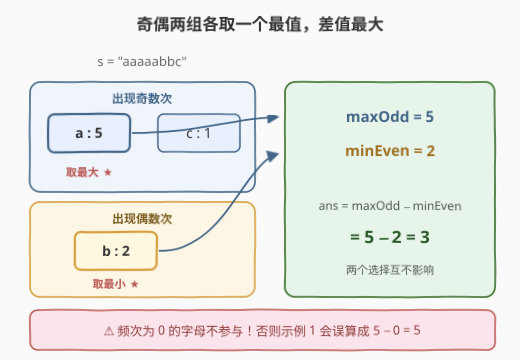
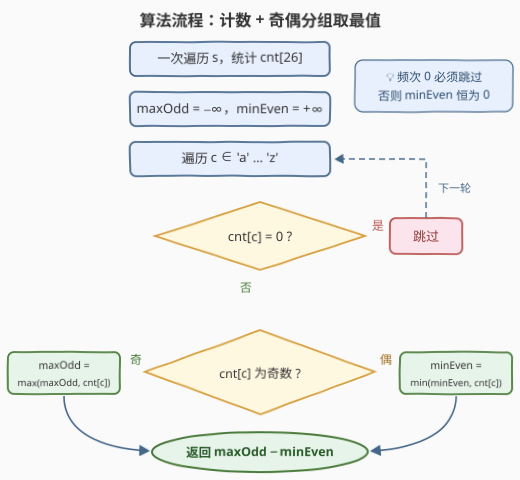

# 奇偶频次间的最大差值 I

- **题目名称**：奇偶频次间的最大差值 I
- **链接**：[3442. 奇偶频次间的最大差值 I](https://leetcode.cn/problems/maximum-difference-between-even-and-odd-frequency-i/)
- **难度**：简单
- **标签**：哈希表, 字符串, 计数

## 1. 题目概述

给你一个由小写英文字母组成的字符串 `s`。请你找出字符串中两个字符 `a1` 和 `a2` 的出现频次之间的**最大**差值 `diff = freq(a1) - freq(a2)`，这两个字符需要满足：

- `a1` 在字符串中出现**奇数次**；
- `a2` 在字符串中出现**偶数次**。

返回最大差值。

**示例 1**：

```text
输入：s = "aaaaabbc"
输出：3
解释：字符 'a' 出现奇数次，次数为 5；字符 'b' 出现偶数次，次数为 2。
     最大差值为 5 - 2 = 3。
```

**示例 2**：

```text
输入：s = "abcabcab"
输出：1
解释：字符 'a' 出现奇数次，次数为 3；字符 'c' 出现偶数次，次数为 2。
     最大差值为 3 - 2 = 1。
```

**约束条件**：

- $3 \le s.length \le 100$
- `s` 仅由小写英文字母组成
- `s` 至少由一个出现奇数次的字符和一个出现偶数次的字符组成

> 💡 **读题关键**：① `a1` 只要求奇数次、`a2` 只要求偶数次，二者之间**再无任何耦合约束**；②「出现偶数次」指**真的出现**（即至少 2 次）——**频次为 0 的字母不算**，否则示例 1 的答案会是 $5 - 0 = 5$ 而不是 3；③ 题目保证奇、偶两类字符都存在，答案必有定义，但**不一定为正**（如 `s = "aab"`，答案为 $1 - 2 = -1$）。

---

## 2. 解题思路

### 2.1 暴力思路：枚举所有字符对

先用哈希表（或 `cnt[26]` 数组）统计每个字母的频次，然后**枚举所有有序字符对** $(a_1, a_2)$：若 `freq[a1]` 为奇数且 `freq[a2]` 为偶数，就用 `freq[a1] - freq[a2]` 更新答案：

```python
best = float('-inf')
for c1 in chars:            # 出现过的字符
    for c2 in chars:        # 出现过的字符
        if freq[c1] % 2 == 1 and freq[c2] % 2 == 0:
            best = max(best, freq[c1] - freq[c2])
```

出现过的字符至多 26 个，$26 \times 26 = 676$ 对，必然能过。但这是**没注意到差值结构**的写法——被减数与减数的候选集完全独立，根本不需要两两配对。

### 2.2 核心观察：差值可拆，两组各取一个最值



把 $diff = freq(a_1) - freq(a_2)$ 拆开看：

- 想让 $diff$ **尽量大**，就要让 $freq(a_1)$ **尽量大**、$freq(a_2)$ **尽量小**；
- $a_1$ 的候选集（奇频字符）与 $a_2$ 的候选集（偶频字符）**互不依赖**——同一个字符的频次不可能既是奇数又是偶数，所以 $a_1 \ne a_2$ 自动成立，无需额外检查；
- 于是两个最值可以**独立选取**：

$$ans = \underbrace{\max_{freq(c) \text{ 为奇}} freq(c)}_{maxOdd} - \underbrace{\min_{\substack{freq(c) \text{ 为偶} \\ freq(c) > 0}} freq(c)}_{minEven}$$

计数之后扫一遍 26 个字母，一边分奇偶组一边维护两个最值即可。

> ⚠️ **频次 0 陷阱**：「出现偶数次」只算**实际出现**的字符。用 `cnt[26]` 数组计数时，23 个没出现的字母频次都是 0——若不加判断地把它们当成"偶数次"，`minEven` 恒为 0，示例 1 就会错误地返回 $5 - 0 = 5$。**必须跳过频次为 0 的字母**。（用 Python 的 `Counter` 则天然规避：它只存出现过的键。）

### 2.3 算法流程图



1. 一次遍历 `s`，统计频次 `cnt[26]`；
2. 初始化 `maxOdd = -∞`，`minEven = +∞`；
3. 遍历 26 个字母 `c`：
   - 若 `cnt[c] == 0`，跳过（不参与任何分组）；
   - 若 `cnt[c]` 为奇数，`maxOdd = max(maxOdd, cnt[c])`；
   - 否则，`minEven = min(minEven, cnt[c])`；
4. 返回 `maxOdd - minEven`。

### 2.4 示例演算

以**示例 1**（`s = "aaaaabbc"`）走一遍：

| 字符 | 频次 | 奇偶 | 归属 |
|---|---|---|---|
| a | 5 | 奇 | `maxOdd` 候选 ★ |
| b | 2 | 偶 | `minEven` 候选 ★ |
| c | 1 | 奇 | `maxOdd` 候选 |

得 `maxOdd = 5`、`minEven = 2`，答案 $5 - 2 = 3$ ✓。其余 23 个字母频次为 0，全部跳过。

**示例 2**（`s = "abcabcab"`）同法：`a:3, b:3, c:2` → `maxOdd = 3`（a 或 b）、`minEven = 2`（c），答案 $3 - 2 = 1$ ✓。

---

## 3. 参考代码

### C++

```cpp
class Solution {
  public:
    int maxDifference(string s) {
        int cnt[26] = {0};
        for (char c : s) ++cnt[c - 'a'];

        int maxOdd = -1, minEven = 101;   // 题目保证两者都会被更新
        for (int i = 0; i < 26; ++i) {
            if (cnt[i] == 0) continue;    // ⚠️ 频次 0 的字母不参与分组
            if (cnt[i] & 1) maxOdd = max(maxOdd, cnt[i]);
            else            minEven = min(minEven, cnt[i]);
        }
        return maxOdd - minEven;
    }
};
```

### Python

```python
class Solution:
    def maxDifference(self, s: str) -> int:
        cnt = Counter(s)                  # 只含出现过的字母，天然避开 0 频次
        max_odd = max(c for c in cnt.values() if c % 2 == 1)
        min_even = min(c for c in cnt.values() if c % 2 == 0)
        return max_odd - min_even
```

---

## 4. 复杂度分析

| 维度 | 复杂度 | 说明 |
|------|--------|------|
| 时间 | $O(n + \|\Sigma\|)$ | 遍历 `s` 计数 $O(n)$，再扫 26 个字母取最值 $O(26)$，$\|\Sigma\| = 26$ |
| 空间 | $O(\|\Sigma\|)$ | 频次数组 `cnt[26]`，与字符串长度无关 |

---

## 5. 扩展：进阶版 3445 与一行写法

**一行版**（Python，依赖题目保证两类字符都存在）：

```python
class Solution:
    def maxDifference(self, s: str) -> int:
        cnt = Counter(s)
        return max(v for v in cnt.values() if v % 2) - min(v for v in cnt.values() if v % 2 == 0)
```

**进阶版**：[3445. 奇偶频次间的最大差值 II](https://leetcode.cn/problems/maximum-difference-between-even-and-odd-frequency-ii/) 把本题搬进**长度恰为 k 的子串**里，且只考察字母 `a`–`d`。核心升级点在于：差值 $=$ 某个字符的奇频 $-$ 另一个字符的偶频这一「拆两项」思想不变，但要维护**每个字符频次的奇偶状态**（$2^4$ 种组合），用**滑动窗口 + 按状态分组的前缀最小值**在 $O(n)$ 内求出最优窗口——频次本身随窗口增减，奇偶状态才是真正可比较的量。

---

## 6. 面试要点

- **Q1：为什么 `maxOdd` 和 `minEven` 可以独立取，不用考虑 `a1`、`a2` 的配对关系？**
  答：$diff$ 可拆成「一项尽量大 + 另一项尽量小」，$a_1$ 与 $a_2$ 之间除奇偶约束外无任何耦合；又因同一频次不可能既是奇数又是偶数，$a_1 \ne a_2$ 自动成立，两个最值互不干扰，各取各的即可。
- **Q2：频次为 0 的字母算「出现偶数次」吗？**
  答：不算。「出现偶数次」隐含该字符实际出现。反例即示例 1：`a:5, b:2`，正确答案是 $5-2=3$；若把 0 频次算进去会得 $5-0=5$。用 `cnt[26]` 数组必须显式跳过 0；用哈希表/`Counter` 只存出现过的键，天然规避。
- **Q3：答案一定是正数吗？**
  答：不一定。题目只保证两类字符都存在，如 `s = "aab"`：`maxOdd = 1`（b）、`minEven = 2`（a），答案为 $-1$。初始化最值时别默认返回非负。
- **Q4：频次统计用数组还是哈希表？**
  答：字母表固定 26 个小写字母时，`cnt[26]` 数组更快（无哈希开销、缓存友好）且空间恒定；两者复杂度同阶，属于口味之选。若字符集大或未知（Unicode），才必须用哈希表。
- **Q5：还能更优吗？**
  答：不能也不必。$O(n)$ 读入是下界（每个字符至少看一次），26 侧扫描是常数；本题考点在「差值拆解 + 频次 0 的语义」这两个细节，而非复杂度优化。

---

## 7. 同类练习题

- [3445. 奇偶频次间的最大差值 II](https://leetcode.cn/problems/maximum-difference-between-even-and-odd-frequency-ii/)：本题加强版，滑窗内维护各字符频次奇偶状态的前缀最值
- [1941. 检查是否所有字符出现次数相同](https://leetcode.cn/problems/check-if-all-characters-have-equal-number-of-occurrences/)：同样是频次计数后按奇偶性质分类判断
- [387. 字符串中的第一个唯一字符](https://leetcode.cn/problems/first-unique-character-in-a-string/)：频次哈希表的基本应用，先计数再扫描
- [242. 有效的字母异位词](https://leetcode.cn/problems/valid-anagram/)：`cnt[26]` 计数比对的经典模板
- [2287. 重排字符形成目标字符串](https://leetcode.cn/problems/rearrange-characters-to-make-target-string/)：按频次上限计数，同样要区分「出现」与「未出现」
