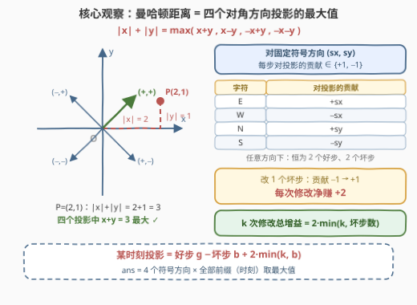
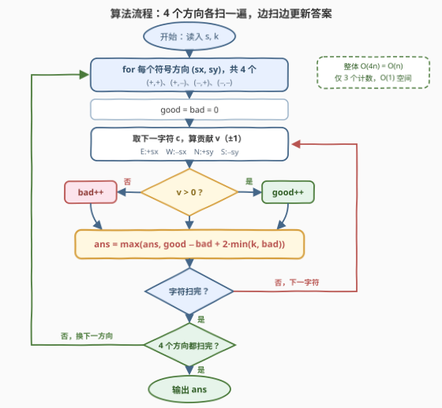

# LeetCode K 次修改后的最大曼哈顿距离 题解

## 1. 题目概述

- **标题 / 题号**：K 次修改后的最大曼哈顿距离（#3443，medium）
- **链接**：https://leetcode.cn/problems/maximum-manhattan-distance-after-k-changes/
- **难度**：中等
- **标签**：哈希表、数学、字符串、计数

**题意**：给你一个由字符 `'N'`、`'S'`、`'E'`、`'W'` 组成的字符串 `s`，$s[i]$ 表示在无限网格中的一次移动：`'N'`/`'S'`/`'E'`/`'W'` 分别向北/南/东/西移动 1 个单位。初始位于原点 $(0, 0)$。

你**最多可以修改 $k$ 个字符**为任意四个方向之一（修改在执行前一次性确定），随后**按顺序**执行所有移动。求执行过程中**任意时刻**所能达到的距原点的**最大曼哈顿距离**——两点 $(x_i, y_i)$、$(x_j, y_j)$ 的曼哈顿距离定义为 $|x_i - x_j| + |y_i - y_j|$。

**示例 1**：

```text
输入：s = "NWSE", k = 1
输出：3
解释：把 s[2] 从 'S' 改成 'N'，s 变为 "NWNE"。
逐时刻位置 (0,1) → (-1,1) → (-1,2) → (0,2)，
对应距离 1 → 2 → 3 → 2，最大为 3。
```

**示例 2**：

```text
输入：s = "NSWWEW", k = 3
输出：6
解释：把 s[1] 从 'S' 改成 'N'、s[4] 从 'E' 改成 'W'，
s 变为 "NNWWWW"，执行过程中的最大曼哈顿距离为 6。
```

**约束**：

- $1 \le |s| \le 10^5$
- $0 \le k \le |s|$
- `s` 仅由 `'N'`、`'S'`、`'E'`、`'W'` 组成

> 💡 **读题关键**：①「任意时刻」意味着答案要对**所有前缀**取最大值——第 $i$ 时刻的位置就是前 $i$ 步的位移之和；② 修改虽然必须**预先一次性确定**，但答案只在「取到最大值的那个时刻」结算，后缀怎么改不影响历史时刻——这为「逐前缀独立贪心」埋下伏笔（见 2.2 观察 4）；③ 曼哈顿距离有一个经典代数改写 $|x| + |y| = \max(x+y,\ x - y,\ -x + y,\ -x - y)$，是本题的破题点。

## 2. 解题思路

### 2.1 暴力思路：枚举「改哪些、改成什么」

朴素做法：枚举所有修改方案——选出至多 $k$ 个位置、每个位置枚举改成哪个新方向，共约 $\sum_{j \le k} \binom{n}{j} \cdot 3^j$ 种；再对每种方案模拟全程取最大距离。

即使 $k = 1$ 也有 $3n \approx 3 \times 10^5$ 种方案，每种 $O(n)$ 模拟共约 $3 \times 10^{10}$ 次操作；$k$ 更大时方案数指数膨胀。**瓶颈在于「按方案枚举」**：某时刻的位置只取决于每一步对某个方向的**投影贡献**，而贡献只有 $+1$ / $-1$ 两种取值——把「枚举方案」换成「按方向计数」，指数级立刻坍缩为线性。

### 2.2 核心观察：四个对角方向 + 坏步改好步净赚 2

**观察 1（距离的代数改写）**：对任意实数 $x, y$，

$$|x| + |y| = \max\big(\, x + y,\ \ x - y,\ \ -x + y,\ \ -x - y \,\big)$$

四个式子分别对应四个**对角方向** $(s_x, s_y) \in \{(+,+), (+,-), (-,+), (-,-)\}$ 上的投影 $s_x x + s_y y$。每个投影显然 $\le |x| + |y|$；取 $s_x = \operatorname{sgn}(x)$、$s_y = \operatorname{sgn}(y)$（约定 $\operatorname{sgn}(0) = 1$）时恰好取等。**最大化曼哈顿距离 ⇔ 枚举 4 个方向、最大化投影。**

**观察 2（每步贡献恰为 $\pm 1$）**：固定方向 $(s_x, s_y)$ 后，每个字符对投影的贡献为：

| 字符 | E | W | N | S |
|------|---|---|---|---|
| 贡献 | $+s_x$ | $-s_x$ | $+s_y$ | $-s_y$ |

无论 $(s_x, s_y)$ 取哪一组，贡献非 $+1$ 即 $-1$：恰好 **2 个好步**（贡献 $+1$）与 **2 个坏步**（贡献 $-1$）。于是第 $i$ 时刻的投影 $= g_i - b_i$（好步数 − 坏步数）——完全不必真的维护坐标。

**观察 3（修改的增益封顶 $2\min(k, b)$）**：修改一个字符可任选新方向。把**坏步**改成好方向，贡献从 $-1$ 变 $+1$，**净赚 $+2$**；好步已顶格 $+1$，怎么改都不赚。所以 $k$ 次修改对某前缀投影的增益至多（且恰好可达）$2 \cdot \min(k, b_i)$：

$$\text{投影}_i \;=\; g_i - b_i + 2 \cdot \min(k,\ b_i)$$

**观察 4（逐前缀贪心的合法性）**：修改需预先固定，看似不能「每个前缀各自优化」。两头论证：

- **上界**：任何固定修改方案下，时刻 $i$ 的投影 = 原始贡献和 + 被改字符的贡献变化。每个被改坏步至多 $+2$、被改好步至多 $0$，故投影 $\le g_i - b_i + 2\min(k, b_i)$；
- **可达**：设上式在方向 $\sigma^\*$、时刻 $i^\*$ 处取得最大值，构造方案：把前 $i^\*$ 个字符中的 $\min(k, b)$ 个坏步改成 $\sigma^\*$ 的好方向（$i^\*$ 之后怎么改无所谓）。时刻 $i^\*$ 的投影恰为该值，而投影 $\le$ 曼哈顿距离，故真实答案 $\ge$ 该值。

两边夹逼，得最终公式（对方向、前缀取最大，含原点时刻的 0）：

$$\text{ans} \;=\; \max_{\sigma \,\in\, 4\ \text{个方向}}\ \ \max_{0 \le i \le n}\ \Big[\, g_\sigma(i) - b_\sigma(i) + 2 \cdot \min\big(k,\ b_\sigma(i)\big) \Big]$$



> ⚠️ **为什么 4 个方向都必须枚举？** 最优时刻可能落在任意象限。如示例 2 中方向 $(+,+)$ 的最大值只有 5，而 $(-,+)$ 能到 6——「直觉地往第一象限改」并非全局最优。

### 2.3 算法流程：4 趟线性扫描

对 4 个符号方向各做一趟扫描：每趟维护好步数 `good`、坏步数 `bad`，逐字符查表分类并即时更新答案。**单指针、单趟、无回溯**，是「计数代替枚举」的典型形态。



### 2.4 示例演算：s = "NSWWEW", k = 3

取方向 $(-,+)$（好步 W、N；坏步 E、S）——这正是最终最优的方向：

| 步 | 字符 | 贡献 | 类型 | $g$ | $b$ | $g-b$ | $2\min(k,b)$ | 时刻值 |
|----|------|------|------|-----|-----|-------|--------------|--------|
| 1 | N | $+1$ | 好 | 1 | 0 | 1 | 0 | 1 |
| 2 | S | $-1$ | 坏 | 1 | 1 | 0 | 2 | 2 |
| 3 | W | $+1$ | 好 | 2 | 1 | 1 | 2 | 3 |
| 4 | W | $+1$ | 好 | 3 | 1 | 2 | 2 | 4 |
| 5 | E | $-1$ | 坏 | 3 | 2 | 1 | 4 | 5 |
| 6 | W | $+1$ | 好 | 4 | 2 | 2 | 4 | **6** |

最大值 6 ✓。对应的构造：把前缀中 2 个坏步（S、E）分别改成好方向——即 $s[1]$ 的 S 改 N、$s[4]$ 的 E 改 W，得到 `"NNWWWW"`，与官方解释完全一致。对照：方向 $(+,+)$ 在同一输入下最大只能到 5（第 5 步），再次说明 4 个方向缺一不可。

## 3. 参考代码

（官方函数签名 `maxDistance`；以下代码已在本地与暴力程序对拍通过 402 组随机用例及两个官方示例。）

### C++

```cpp
class Solution {
  public:
    int maxDistance(string s, int k) {
        const int dirs[4][2] = {{1, 1}, {1, -1}, {-1, 1}, {-1, -1}};
        int ans = 0;
        for (const auto& d : dirs) {              // 枚举 4 个对角方向
            int good = 0, bad = 0;
            for (char c : s) {
                int v = (c == 'E') ? d[0] : (c == 'W') ? -d[0]
                      : (c == 'N') ? d[1] : -d[1];  // 该步对投影的贡献 ±1
                if (v > 0) ++good; else ++bad;
                ans = max(ans, good - bad + 2 * min(k, bad));
            }
        }
        return ans;
    }
};
```

### Python

```python
class Solution:
    def maxDistance(self, s: str, k: int) -> int:
        ans = 0
        for sx, sy in ((1, 1), (1, -1), (-1, 1), (-1, -1)):
            contrib = {'E': sx, 'W': -sx, 'N': sy, 'S': -sy}
            good = bad = 0
            for c in s:
                if contrib[c] > 0:
                    good += 1
                else:
                    bad += 1
                ans = max(ans, good - bad + 2 * min(k, bad))
        return ans
```

> 💡 **实现细节**：① 贡献表 `contrib` 每个方向只建一次（常数大小），循环内 $O(1)$ 查表；② 答案初始化为 0（原点时刻），天然覆盖 $k = 0$ 等边界；③ 无需显式维护坐标——投影的计数就是坐标。

## 4. 复杂度分析

| 维度 | 复杂度 | 说明 |
|------|--------|------|
| 时间复杂度 | $O(4n) = O(n)$ | 4 个符号方向各一趟线性扫描；每字符 $O(1)$ 查表分类 + 更新答案 |
| 空间复杂度 | $O(1)$ | 仅维护 `good`、`bad`、`ans` 三个计数（贡献表为常数大小） |
| 暴力对照 | $O\big(n \sum_{j \le k} \binom{n}{j} 3^j\big)$ | 枚举全部修改方案再逐一模拟；$n = 10^5$ 时为天文数字，完全不可行 |

## 5. 扩展：45° 旋转与切比雪夫距离的对偶

观察 1 有一个漂亮的几何解释：令 $u = x + y$、$v = x - y$（坐标系**旋转 45°** 并放缩 $\sqrt{2}$ 倍），则 $|x| + |y| = \max(|u|, |v|)$——曼哈顿距离变成了 $uv$ 平面上的**切比雪夫距离**。四个符号组合 $s_x x + s_y y$ 恰是 $\pm u$ 与 $\pm v$。这族「绝对值 → 符号枚举」的技巧在同族题中反复出现（见第 7 节的 1131、3102）。

另两个值得玩味的点：① 由 $g - b + 2\min(k, b) \le g + b = i$（前缀长度）可知**答案不超过 $n$**——$k$ 充足时的极限就是「把整个前缀改成同一对角方向」；② 若题目改问「**最终位置**」的距离而非「任意时刻」，公式原样适用（最终位置就是最后一个前缀）——「任意时刻」版本反而因观察 4 的贪心合法性更容易写。

## 6. 面试要点

1. **为什么枚举 4 个对角方向就能覆盖曼哈顿距离？**

   因为 $|x| + |y| = \max(x+y,\ x - y,\ -x + y,\ -x - y)$：四个投影都不超过 $|x| + |y|$，且符号与 $x$、$y$ 一致的那个恰好取等。这是「绝对值和 → 符号枚举」的标准改写。

2. **修改必须预先一次性确定，为什么还能对每个前缀独立用满 $k$ 次？**

   答案取「任意时刻」的最大值：对取到最大值的时刻 $i$，位置只由前 $i$ 步决定，$i$ 之后的修改不影响该时刻。上界（每个被改坏步至多 +2）与构造（在前 $i$ 步内改坏步）两头夹逼即得等价性。

3. **增益为什么是 $2 \cdot \min(k, b)$ 而不是 $2k$？**

   改坏步净赚 $+2$、改好步不赚；坏步只有 $b$ 个，改完即封顶。这也直接给出答案上界：时刻值 $\le g + b =$ 前缀长度，故答案 $\le n$。

4. **与切比雪夫距离、45° 旋转有什么关系？**

   变换 $(u, v) = (x+y,\ x-y)$ 把曼哈顿距离变成 $\max(|u|, |v|)$（切比雪夫距离），四个符号组合就是 $\pm u$、$\pm v$。1131、3102 等题用的是同一族技巧。

5. **如果 $k \ge n$，答案是多少？**

   恰为 $n$：把所有字符改成同一方向（如全 `N`），第 $n$ 步到达距离 $n$；而由第 3 问的上界知答案不可能超过 $n$。

## 同类练习题

| # | 题目 | 与本题的关联 |
|---|------|-------------|
| 1131 | [绝对值表达式的最大值](https://leetcode.cn/problems/maximum-of-absolute-value-expression/)（[站内题解](../1101-1200/1131_绝对值表达式的最大值.md)） | 观察 1 的纯数学版——同样的「枚举 ± 符号组合」把 $O(n^2)$ 两两比较降到 $O(n)$ |
| 3102 | [最小化曼哈顿距离](https://leetcode.cn/problems/minimize-manhattan-distances/)（[站内题解](../3101-3200/3102_最小化曼哈顿距离.md)） | 同一符号枚举技巧的反向使用——删去一个点、**最小化**最大曼哈顿距离 |
| 1330 | [翻转子数组得到最大的数组值](https://leetcode.cn/problems/reverse-subarray-to-maximize-array-value/)（[站内题解](../1301-1400/1330_翻转子数组得到最大的数组值.md)） | 绝对值和 $\|a_i - a_{i+1}\|$ 的符号技巧进阶，同样靠枚举符号组合去绝对值 |
| 1266 | [访问所有点的最小时间](https://leetcode.cn/problems/minimum-time-visiting-all-points/)（[站内题解](../1201-1300/1266_访问所有点的最小时间.md)） | 曼哈顿距离与切比雪夫距离的基础对比——允许对角行走时两者互换 |
