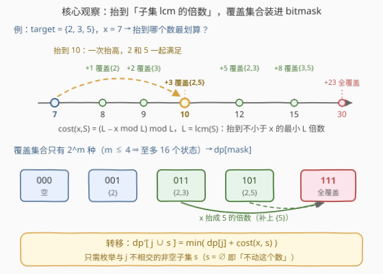
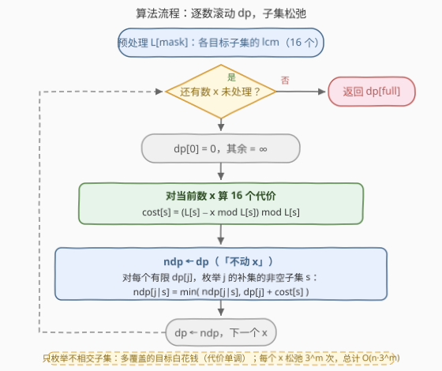

# 使数组包含目标值倍数的最少增量

- **题目名称**：使数组包含目标值倍数的最少增量
- **链接**：[3444. Minimum Increments for Target Multiples in an Array](https://leetcode.cn/problems/minimum-increments-for-target-multiples-in-an-array/)
- **难度**：困难
- **标签**：位运算、数组、数学、动态规划、状态压缩、数论

## 1. 题目概述

给你两个数组 `nums` 和 `target`。一次操作中，你可以将 `nums` 中的**任意一个元素递增 1**。返回要使 `target` 中的**每个元素**在 `nums` 中**至少存在一个倍数**所需的最少操作次数。

**示例 1**：

```text
输入：nums = [1,2,3], target = [4]
输出：1
解释：将 3 增加到 4，需要 1 次操作，4 是目标值 4 的倍数。
```

**示例 2**：

```text
输入：nums = [8,4], target = [10,5]
输出：2
解释：将 8 增加到 10，需要 2 次操作，10 是目标值 5 和 10 的倍数。
```

**示例 3**：

```text
输入：nums = [7,9,10], target = [7]
输出：0
解释：数组中已经包含目标值 7 的一个倍数，不需要执行任何额外操作。
```

**约束条件**：

- $1 \le nums.length \le 5 \times 10^4$
- $1 \le target.length \le 4$，且 $target.length \le nums.length$
- $1 \le nums[i],\ target[i] \le 10^4$

> 💡 **读题关键**：① 操作只能 **+1**，所以每个数只能**向上**爬到某个倍数，不能下降；② "至少一个倍数"意味着覆盖语义是**或**——多个数可以冗余覆盖同一目标，一个数也可以同时充当多个目标的倍数（如示例 2 的 10 同时是 5 和 10 的倍数）；③ $target.length \le 4$ 是全场最大的信号：覆盖集合只有 $2^4 = 16$ 种，**状态压缩 DP** 甜区。

---

## 2. 解题思路

### 2.1 暴力思路：每个数"改成什么"的组合爆炸

最朴素的想法：枚举每个数最终被抬到的值，检查所有目标是否被覆盖。但一个数 $x$ 的合法落点理论上有无穷多个（任何 $\ge x$ 的倍数都行），即便观察到"最优落点一定是某个 lcm 的最小倍数"，每个数仍有 $2^m$ 种子集选择，$n = 5 \times 10^4$ 个数共 $(2^m)^n$ 种组合，完全不可行。

暴力失败的本质原因是：**把"哪个数负责哪些目标"当成了显式的决策组合**。下面换一个视角——只记"哪些目标已被覆盖"。

### 2.2 核心观察：子集 lcm 定代价，覆盖集合做状态



**观察一（单个数的代价由目标子集唯一决定）**：若让数 $x$ 同时成为子集 $S \subseteq target$ 中**每个**目标的倍数，等价于让 $x$ 成为 $\operatorname{lcm}(S)$ 的倍数（记 $L(S)$）。由于只能 +1，最少代价是把 $x$ 抬到**不小于 $x$ 的最小 $L(S)$ 倍数**：

$$\text{cost}(x, S) = \big(L(S) - x \bmod L(S)\big) \bmod L(S)$$

且代价关于子集**单调**：$S \subseteq S'$ 时 $L(S) \mid L(S')$，倍数更稀疏，抬升距离不减，故 $\text{cost}(x, S) \le \text{cost}(x, S')$。

**观察二（一次抬高可能"买一送一"）**：如上图，把 7 抬到 10 花费 3，而 10 同时是 2 和 5 的倍数——覆盖的是目标**集合的并**，不是精确分配。这正是示例 2 中 8 抬到 10 一击搞定两个目标的原理。

**观察三（状态只需记覆盖集合）**：定义

$$dp[j] = \text{处理完已扫描的数后，} target \text{ 中恰有子集 } j \text{ 被覆盖的最小总代价}$$

其中 $j$ 是 $m$ 位 bitmask（$m \le 4$，至多 16 个状态）。处理新数 $x$ 时，枚举它服务的子集 $s$：

$$dp'[j \mid s] = \min\big(dp[j] + \text{cost}(x, s)\big)$$

> ⚠️ 由观察一的单调性，$s$ 与 $j$ **相交的部分是白花的**：把交集从 $s$ 中去掉，照样到达 $j \mid s$，代价不增。因此转移只需枚举**与 $j$ 不相交的非空子集** $s \subseteq \complement j$；$s = \varnothing$（不动这个数）由 dp 数组直接复制涵盖。这一剪枝把每个数的转移数从 $4^m$ 压到 $3^m$。

### 2.3 算法流程图



整体流程：

1. **预处理**：递推求出所有 $2^m$ 个子集的 lcm，$L[\text{mask}] = \operatorname{lcm}(L[\text{mask 去掉最低位}],\ target[\text{最低位}])$；
2. **初始化**：$dp[0] = 0$，其余为 $+\infty$；
3. **逐数滚动**：对每个 $x$，先算出 16 个 $\text{cost}[s]$，复制 $dp$ 为 $ndp$，再对每个有限的 $dp[j]$ 枚举 $\complement j$ 的非空子集 $s$ 松弛 $ndp[j \mid s]$；
4. **答案**即 $dp[\text{full}]$（约束保证 $target.length \le nums.length$，每个目标分配一个数即可全覆盖，必然可达）。

### 2.4 示例演算

以示例 2 `nums = [8,4]`，`target = [10,5]` 演算（$m=2$，位 0 ↔ 目标 10，位 1 ↔ 目标 5；$L = [1,\ 10,\ 5,\ 10]$，其中 $L[11] = \operatorname{lcm}(10,5) = 10$）：

| 处理 | $dp$（按 $00,01,10,11$） | 关键计算 |
|------|--------------------------|----------|
| 初始 | $(0,\ \infty,\ \infty,\ \infty)$ | 只覆盖空集 |
| $x=8$ | $(0,\ 2,\ 2,\ \mathbf{2})$ | $\text{cost}(8,01)=\text{cost}(8,11)=2$（$8 \to 10$）；$\text{cost}(8,10)=2$——注意 10 也是 5 的倍数，抬到 10 顺手覆盖 $\{5\}$ |
| $x=4$ | $(0,\ 2,\ 1,\ \mathbf{2})$ | $\text{cost}(4,10)=1$（$4 \to 5$）使 $dp[10]=1$；从 $dp[01]=2$ 出发补 $\{5\}$ 需 $2+1=3$，不及现有 $dp[11]=2$ |

最终 $dp[11] = \mathbf{2}$ ✓——最优方案正是"把 8 抬到 10"，一次抬高同时满足 10 和 5。注意 $dp[10]=1$（4 抬到 5）虽然更便宜，却只覆盖了 $\{5\}$，必须与覆盖 $\{10\}$ 的方案拼起来才行，而 $8 \to 10$ 一个数就完成了"买一送一"。

---

## 3. 参考代码

### C++

```cpp
class Solution {
  public:
    int minimumIncrements(vector<int>& nums, vector<int>& target) {
        int m = target.size();
        int full = (1 << m) - 1;

        vector<long long> L(1 << m, 1);                 // 每个子集的 lcm
        for (int mask = 1; mask <= full; ++mask) {
            int i = __builtin_ctz(mask);                // 最低位对应的 target 下标
            L[mask] = lcm(L[mask & (mask - 1)], (long long)target[i]);
        }

        const long long INF = LLONG_MAX / 4;
        vector<long long> dp(1 << m, INF);
        dp[0] = 0;

        for (int x : nums) {
            vector<long long> cost(1 << m);
            for (int mask = 0; mask <= full; ++mask)    // 抬到 >= x 的最小 L 倍数
                cost[mask] = (L[mask] - x % L[mask]) % L[mask];

            vector<long long> ndp = dp;                 // s = 空集：不动这个数
            for (int j = 0; j <= full; ++j) {
                if (dp[j] == INF) continue;
                int comp = full ^ j;
                for (int s = comp; s; s = (s - 1) & comp)   // 补集的非空子集
                    ndp[j | s] = min(ndp[j | s], dp[j] + cost[s]);
            }
            dp = move(ndp);
        }
        return (int)dp[full];
    }
};
```

> ⚠️ lcm 必须用 `long long`：4 个互异大素数（各近 $10^4$）的 lcm 可达约 $10^{16}$，超过 `int`；64 位整型上限约 $9.2 \times 10^{18}$，安全。答案本身上界很小（每个目标单独配一个数，总代价 $< 4 \times 10^4$），返回前转 `int` 无溢出风险。

### Python

```python
from math import lcm

class Solution:
    def minimumIncrements(self, nums: List[int], target: List[int]) -> int:
        m = len(target)
        full = (1 << m) - 1

        L = [1] * (1 << m)                      # 每个子集的 lcm
        for mask in range(1, 1 << m):
            i = (mask & -mask).bit_length() - 1
            L[mask] = lcm(L[mask & (mask - 1)], target[i])

        # 预先枚举好每个状态 j 的「补集非空子集」列表，避免内层重复推导
        subs = []
        for j in range(1 << m):
            comp, lst = full ^ j, []
            s = comp
            while s:
                lst.append(s)
                s = (s - 1) & comp
            subs.append(lst)

        INF = float('inf')
        dp = [INF] * (1 << m)
        dp[0] = 0

        for x in nums:
            cost = [(l - x % l) % l for l in L]  # 抬到 >= x 的最小 L 倍数
            ndp = dp[:]                          # s = 空集：不动这个数
            for j, dj in enumerate(dp):
                if dj == INF:
                    continue
                for s in subs[j]:                # s 与 j 不相交且非空
                    v = dj + cost[s]
                    if v < ndp[j | s]:
                        ndp[j | s] = v
            dp = ndp
        return dp[full]
```

> 💡 两份代码均已与指数级暴力对拍验证（3000+ 组随机数据），最坏规模（$n = 5 \times 10^4$、4 个互异大素数目标）下 Python 约 0.4 s。

---

## 4. 复杂度分析

| 维度 | 复杂度 | 说明 |
|------|--------|------|
| **时间复杂度** | $O(n \cdot 3^m)$ | 每个数：$2^m$ 个 cost 计算 + 对每个状态 $j$ 枚举补集子集，共 $\sum_j 2^{m-\|j\|} = 3^m$ 次松弛（$m=4$ 时 $81$ 次）；$n = 5 \times 10^4$ 时约 $4 \times 10^6$ 次基本操作 |
| **空间复杂度** | $O(2^m)$ | dp 数组、lcm 数组、cost 数组均为常数大小（$m \le 4 \Rightarrow 16$），与 $n$ 无关 |

> 💡 预处理 16 个 lcm 另需 $O(2^m \log V)$ 次最大公约数计算，完全可以忽略。

---

## 5. 扩展：最优解至多用掉 m 个数

最优解中被抬高的数**至多 $m$ 个**：若某个被抬的数没有新覆盖任何目标，抬它纯属浪费，去掉后代价更小。由这条性质可得另一种等价实现：

- 对每个非空子集 $s$，只记录 $\text{cost}(x, s)$ 最小的**至多 $m$ 个候选**（不同下标）；
- 再枚举全集的**集合划分**（Bell 数 $B_4 = 15$ 种），为每个组从其候选列表中挑互不相同的数，拼出最小总代价。

正确性：若某组选中的数不在其前 $m$ 小候选中，则存在 $m$ 个代价更小的候选，其中至少一个未被其余 $\le m-1$ 组占用，替换后总代价不增。复杂度 $O(n \cdot 2^m)$，当 $n$ 巨大而 $m$ 很小时比逐数滚动的 $O(n \cdot 3^m)$ 更省——本质是**按子集聚合候选**替代**逐数维护状态**。

另外注意数论细节：$m$ 个 $\le 10^4$ 的数的 lcm 最坏是互异大素数之积 $\approx 10^{16}$，落在 `long long` 安全范围内；若 $m$ 或值域再放大，需改用 Python 大整数或 `__int128`。

---

## 6. 面试要点

1. **为什么状态定义是"已覆盖目标的集合"而不是"每个目标由哪个数负责"？**

   - 后者的状态空间是 $O(n^m)$，$n = 5 \times 10^4$ 直接爆炸；前者只有 $2^m \le 16$。代价不需要记进状态——处理到某个数时，用 $\text{cost}(x, s)$ 即时算出它服务子集 $s$ 的花费。

2. **为什么转移只需枚举与 $j$ 不相交的子集 $s$？**

   - 代价关于子集单调（$S \subseteq S'$ 时 lcm 变大、抬升距离不减），所以 $s \cap j \ne \varnothing$ 的转移被 $s \setminus j$ 支配：到达同样的 $j \mid s$，花的钱不多。$s = \varnothing$（不动这个数）由 dp 复制涵盖。这条剪枝把单数转移从 $4^m$ 降到 $3^m$。

3. **cost 公式怎么来的？边界情况？**

   - 抬到 $\ge x$ 的最小 $L$ 倍数；$x \bmod L \in [0, L)$，故结果落在 $[0, L)$，$x$ 本身已是倍数时取 0。不会出现负数，也无需特判。

4. **"至少一个倍数"的覆盖语义为什么不影响正确性？**

   - dp 的语义是"集合 $j$ 中的目标都已被某个数覆盖"，转移用按位或合并；冗余覆盖不违反约束，只是被单调性支配掉。任何合法方案都能映射成一条 dp 转移路径（每个被抬的数取其实际覆盖集合），故 $dp[\text{full}]$ 就是全局最优。

5. **如果 target 长度增大到 10 还能这样做吗？**

   - $3^{10} \approx 6 \times 10^4$，乘上 $n$ 就不可行了。但"最优解至多 $m$ 个数被抬"仍成立，可切换到第 5 节的 $O(n \cdot 2^m)$ 候选聚合思路。经验上：纯 $2^m$ 转移的状态压缩 DP 甜区在 $m \le 20$，带子集枚举（$3^m$ 转移）的甜区在 $m \le 6 \sim 8$。

> 💡 **一句话总结**：子集 lcm 定代价、覆盖集合做状态——逐数滚动 16 个 dp 值，只枚举不相交子集松弛，$O(n \cdot 3^m)$ 收工。

---

## 7. 同类练习题

- [1125. 最小的必要团队](https://leetcode.cn/problems/smallest-sufficient-team/)：覆盖型状态压缩 DP 招牌题——技能需求做掩码、人选项并入覆盖集，与本题"目标做掩码、数并入覆盖集"同构
- [526. 优美的排列](https://leetcode.cn/problems/beautiful-arrangement/)（[题解](../0501-0600/526_优美的排列.md)）：状态压缩 DP 母题，bitmask 记已用集合
- [1879. 两个数组最小的异或值之和](https://leetcode.cn/problems/minimum-xor-sum-of-two-arrays/)（[题解](../1801-1900/1879_两个数组最小的异或值之和.md)）：配对型状态压缩 DP，转移同为"从未覆盖中挑一个并入"
- [1815. 得到新鲜甜甜圈的最多组数](https://leetcode.cn/problems/maximum-number-of-groups-getting-fresh-donuts/)（[题解](../1801-1900/1815_得到新鲜甜甜圈的最多组数.md)）：小状态空间 + 状态压缩记忆化的另一形态
- [878. 第 N 个神奇数字](https://leetcode.cn/problems/nth-magical-number/)：二分答案 + lcm 容斥，数论侧的 lcm 应用姊妹题
