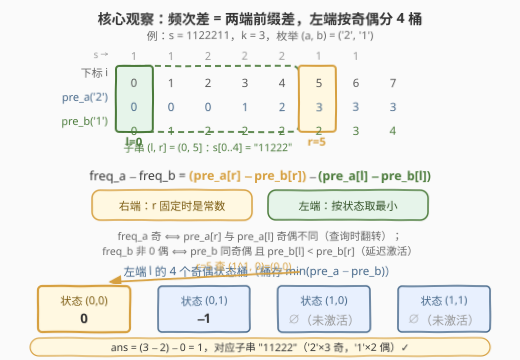
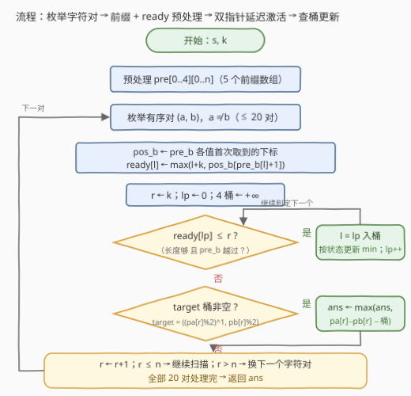

# 奇偶频次间的最大差值 II

- **题目名称**：奇偶频次间的最大差值 II
- **链接**：[3445. 奇偶频次间的最大差值 II](https://leetcode.cn/problems/maximum-difference-between-even-and-odd-frequency-ii/)
- **难度**：困难
- **标签**：字符串、枚举、前缀和、滑动窗口

## 1. 题目概述

给你一个字符串 `s` 和一个整数 `k`。请你找出 `s` 的子字符串 `subs` 中两个字符的出现频次之间的**最大**差值 $\text{freq}[a] - \text{freq}[b]$，其中：

- `subs` 的长度**至少**为 $k$；
- 字符 $a$ 在 `subs` 中出现**奇数次**；
- 字符 $b$ 在 `subs` 中出现**非 0 偶数次**。

返回最大差值。注意 `subs` 可以包含超过 2 个互不相同的字符。

**示例 1**：

```text
输入：s = "12233", k = 4
输出：-1
解释：对于子字符串 "12233"，'1' 出现 1 次，'3' 出现 2 次，差值 1 - 2 = -1。
```

**示例 2**：

```text
输入：s = "1122211", k = 3
输出：1
解释：对于子字符串 "11222"，'2' 出现 3 次，'1' 出现 2 次，差值 3 - 2 = 1。
```

**示例 3**：

```text
输入：s = "110", k = 3
输出：-1
```

**约束条件**：

- $3 \le s.length \le 3 \times 10^4$
- `s` 仅由数字 `'0'` 到 `'4'` 组成
- 输入保证至少存在一个子字符串是由一个出现奇数次的字符和一个出现偶数次的字符组成
- $1 \le k \le s.length$

> 💡 **读题关键**：① 差值是 $\text{freq}[a] - \text{freq}[b]$，**可以为负**——三个示例的答案全是负数或 1，「最大差值」是在一堆可能为负的候选里挑最大，不是求绝对值；② $b$ 的要求是「**非 0** 偶数」——$b$ 必须真的在子串里出现，这是本题所有隐蔽坑点的源头；③ 字符集只有 `'0'`–`'4'` 共 **5 种**，这个小值域是整题复杂度的救命稻草。

---

## 2. 解题思路

### 2.1 暴力思路

枚举所有 $O(n^2)$ 个子串，用增量计数（右端扩张时 `cnt[s[r]]++`）把每个子串的频次统计摊到 $O(1)$，再枚举有序字符对 $(a, b)$ 检查奇偶合法性——总计 $O(n^2 \cdot \sigma^2)$，$\sigma = 5$。$n = 3\times 10^4$ 时约 $2.25 \times 10^{10}$ 次操作，不可行。

瓶颈在于：**逐个子串评分**。与一切「子串区间和/差」问题一样，突破口是把「一个子串的量」改写成**只依赖区间两个端点的前缀量**，然后用双指针/分桶维护左端点的候选。

### 2.2 核心观察：枚举字符对 + 前缀奇偶状态分桶 + 延迟激活



**观察一：字符集只有 5 种，枚举有序对 $(a, b)$，共 $5 \times 4 = 20$ 对。**

答案里的 $a$（奇数次）和 $b$（非 0 偶数次）必是两个不同字符。把「谁当 $a$、谁当 $b$」固定下来后，问题变成：找一个子串，最大化 $\text{freq}_a - \text{freq}_b$，且 $\text{freq}_a$ 为奇数、$\text{freq}_b$ 为正偶数、长度 $\ge k$。

**观察二：子串频次 = 前缀差，三个条件全部转化为「左右端点的奇偶关系」。**

设 $pre_a[i]$ 为 $s[0..i-1]$ 中 $a$ 的出现次数（$pre_b$ 同理），子串取左开右闭区间 $(l, r]$（即 $s[l..r-1]$，长度 $r - l$），则 $\text{freq}_a = pre_a[r] - pre_a[l]$。三个条件转化为：

| 原条件 | 前缀等价形式 |
|--------|--------------|
| $\text{freq}_a$ 为奇数 | $pre_a[r]$ 与 $pre_a[l]$ **奇偶性不同** |
| $\text{freq}_b$ 为非 0 偶数 | $pre_b[r]$ 与 $pre_b[l]$ **奇偶性相同**，且 $pre_b[r] - pre_b[l] \ge 2$ |
| 长度 $\ge k$ | $r \ge l + k$ |

而 $pre_b$ 随下标单调不减，且 $l < r$ 蕴含 $pre_b[l] \le pre_b[r]$，所以「差 $\ge 2$」在奇偶相同的前提下等价于一个干净的不等式：

$$pre_b[l] < pre_b[r] \iff pre_b[l] \le pre_b[r] - 2 \iff \text{freq}_b \ge 2$$

**观察三：固定 $r$，最大化差值 = 在 4 个奇偶状态桶里查最小值。**

$$\text{freq}_a - \text{freq}_b = \big(pre_a[r] - pre_b[r]\big) - \big(pre_a[l] - pre_b[l]\big)$$

固定右端 $r$ 时第一项是常数，**只需为左端 $l$ 维护 $pre_a[l] - pre_b[l]$ 的最小值**。合法性只关心 $l$ 的奇偶组合 $(pre_a[l] \bmod 2,\; pre_b[l] \bmod 2)$——共 **4 种状态**，每种状态一个桶，桶里存该状态下 $pre_a[l] - pre_b[l]$ 的最小值。查询时目标状态由 $r$ 反推：$pre_a$ 奇偶要**不同**（翻转）、$pre_b$ 奇偶要**相同**。

**观察四（本题精髓）：「长度够」和「$pre_b[l] < pre_b[r]$」都是关于 $r$ 的激活下界，二者取 max 后随 $l$ 单调——一个指针完成延迟激活。**

为什么不能像 [1524](../1501-1600/1524_和为奇数的子数组数目.md) 那样「扫到 $r$ 就把 $l = r-k$ 扔进桶」？因为 **`freq_b` 的「非 0」约束还没检查**：若此刻 $pre_b[l] = pre_b[r]$（$b$ 在子串里一次都没出现），这个 $l$ 扔进桶会立刻生效，等于把 $\text{freq}_b = 0$ 的非法子串也计入了——这是本题最常见的错误。

正确姿势是让这样的 $l$ **迟到**：记 $pos_b[v]$ 为 $pre_b$ 首次取到 $v$ 的最小下标（$pre_b$ 每步 $+0$ 或 $+1$，取值不跳变，且一旦达到 $v$ 便不再低于 $v$），则

$$pre_b[r] > pre_b[l] \iff pre_b[r] \ge pre_b[l] + 1 \iff r \ge pos_b[pre_b[l] + 1]$$

于是左端点 $l$ 的**激活时刻**为

$$\text{ready}(l) = \max\big(l + k,\; pos_b[pre_b[l] + 1]\big)$$

（若 $pre_b[l] = \text{cnt}_b$ 已是 $b$ 的总数，则 $pos_b[pre_b[l]+1]$ 不存在，$l$ 永不激活——它右边再也没有 $b$ 了。）两个下界都随 $l$ 单调不减，取 max 仍单调不减，所以处理 $r = k, k+1, \dots, n$ 时用一个前进指针把 $\text{ready}(l) \le r$ 的 $l$ 依次入桶即可，每个 $l$ 恰好入桶一次。

> 💡 **一句话总结**：枚举 20 个字符对；子串频次差拆成两端前缀差；左端按 4 种奇偶状态分桶取最小；桶的入桶条件 =「长度够」∨「$pre_b$ 越过」两个单调下界的 max——延迟激活同时满足了长度与「非 0 偶数」约束。

### 2.3 算法流程图



1. **预处理**：一趟扫描建立 5 个字符的前缀计数数组 $pre[0..4][0..n]$；
2. **枚举有序字符对** $(a, b)$，$a \ne b$ 且 $b$ 在 $s$ 中出现过，共至多 20 对；
3. **求 $pos_b$**：扫一遍 $pre_b$，记录每个取值首次出现的下标；再为每个候选左端 $l \in [0, n-k]$ 计算 $\text{ready}(l) = \max(l + k,\; pos_b[pre_b[l]+1])$；
4. **扫描 $r = k \dots n$**：先把所有 $\text{ready}(l) \le r$ 的 $l$ 入桶（按奇偶状态更新 4 桶最小值），再用 $r$ 的目标状态查询桶，更新全局答案；
5. 所有字符对处理完，返回 `ans`（题目保证存在合法子串，`ans` 必被更新过）。

### 2.4 示例演算

以**示例 2**（$s = $ `1122211`，$k = 3$）演算 $(a, b) = ('2', '1')$ 这一对。前缀数组（下标 $0 \sim 7$）：

| $i$ | 0 | 1 | 2 | 3 | 4 | 5 | 6 | 7 |
|---|---|---|---|---|---|---|---|---|
| $s_i$ | 1 | 1 | 2 | 2 | 2 | 1 | 1 | |
| $pre_a$（'2'） | 0 | 0 | 0 | 1 | 2 | 3 | 3 | 3 |
| $pre_b$（'1'） | 0 | 1 | 2 | 2 | 2 | 2 | 3 | 4 |

$pos_b = \{1{\to}1,\ 2{\to}2,\ 3{\to}6,\ 4{\to}7\}$（$pre_b$ 首次取到该值的下标）。各左端点的激活时刻与状态：

| $l$ | $pre_b[l]$ | $pos_b[pre_b[l]{+}1]$ | $l+k$ | ready | 状态 $(pa\&1, pb\&1)$ | $pre_a{-}pre_b$ |
|---|---|---|---|---|---|---|
| 0 | 0 | 1 | 3 | **3** | (0,0) → 桶0 | 0 |
| 1 | 1 | 2 | 4 | **4** | (0,1) → 桶1 | −1 |
| 2 | 2 | 6 | 5 | **6** | (0,0) → 桶0 | −2 |
| 3 | 2 | 6 | 6 | **6** | (1,0) → 桶2 | −1 |
| 4 | 2 | 6 | 7 | **7** | (0,0) → 桶0 | 0 |

扫描过程（桶写成 `{状态: 最小值}`，查询值 $= (pre_a[r] - pre_b[r]) - \text{bucket}[\text{target}]$）：

| $r$ | 激活 | 桶 | target | 候选值 | 对应子串 |
|---|---|---|---|---|---|
| 3 | $l{=}0$ | `{0: 0}` | 0 | $(1-2) - 0 = -1$ | `112`（'2'×1 奇，'1'×2 偶）|
| 4 | $l{=}1$ | `{0: 0, 1: -1}` | 2 | 桶空 | — |
| 5 | — | 同上 | 0 | $(3-2) - 0 = \mathbf{1}$ | `11222`（'2'×3 奇，'1'×2 偶）|
| 6 | $l{=}2,3$ | `{0: -2, 1: -1, 2: -1}` | 1 | $(3-3) - (-1) = 1$ | `12221` |
| 7 | $l{=}4$ | `{0: -2, 1: -1, 2: -1}` | 0 | $(3-4) - (-2) = 1$ | `22211` |

这一对的最大值为 $1$ ✓（正是示例答案）。注意 $r=5$ 时 $l=2,3$ 虽然长度已够（$5-2 \ge 3$），但 $pos_b[3]=6 > 5$——$pre_b[5]$ 还停在 2，没越过它们的 $pre_b[l]=2$，所以**不许入桶**，这正是「非 0 偶数」约束在起作用。

---

## 3. 参考代码

### C++

```cpp
class Solution {
public:
    int maxDifference(string s, int k) {
        int n = s.size();
        const int INF = INT_MAX / 2;
        int ans = -INF;
        // pre[c][i]: 前 i 个字符中数字 c 出现的次数
        vector<vector<int>> pre(5, vector<int>(n + 1, 0));
        for (int i = 0; i < n; i++) {
            for (int c = 0; c < 5; c++) pre[c][i + 1] = pre[c][i];
            pre[s[i] - '0'][i + 1]++;
        }
        for (int a = 0; a < 5; a++) {
            for (int b = 0; b < 5; b++) {
                if (a == b || pre[b][n] == 0) continue;
                auto &pa = pre[a], &pb = pre[b];
                int cntb = pb[n];
                // posb[v]: pb 首次取到 v 的下标（v >= 1）
                vector<int> posb(cntb + 1, 0);
                for (int r = 0, v = 0; r <= n; r++)
                    if (pb[r] > v) posb[++v] = r;
                // ready[l]: 左端点 l 可被使用的最小 r（长度够 且 pre_b 越过）
                int top = n - k;
                vector<int> ready(top + 1);
                for (int l = 0; l <= top; l++) {
                    int w = pb[l] + 1;
                    ready[l] = (w > cntb) ? INF : max(l + k, posb[w]);
                }
                array<int, 4> bucket{INF, INF, INF, INF};
                int lp = 0;
                for (int r = k; r <= n; r++) {
                    while (lp <= top && ready[lp] <= r) {   // 延迟激活
                        int l = lp++;
                        int st = ((pa[l] & 1) << 1) | (pb[l] & 1);
                        bucket[st] = min(bucket[st], pa[l] - pb[l]);
                    }
                    int t = (((pa[r] & 1) ^ 1) << 1) | (pb[r] & 1);
                    if (bucket[t] < INF)
                        ans = max(ans, (pa[r] - pb[r]) - bucket[t]);
                }
            }
        }
        return ans;
    }
};
```

### Python

```python
class Solution:
    def maxDifference(self, s: str, k: int) -> int:
        n = len(s)
        INF = float('inf')
        # pre[c][i]: 前 i 个字符中数字 c 出现的次数
        pre = [[0] * (n + 1) for _ in range(5)]
        for i, ch in enumerate(s):
            for c in range(5):
                pre[c][i + 1] = pre[c][i]
            pre[ord(ch) - 48][i + 1] += 1
        ans = -INF
        for a in range(5):
            for b in range(5):
                if a == b or pre[b][n] == 0:
                    continue
                pa, pb = pre[a], pre[b]
                cntb = pb[n]
                # posb[v]: pb 首次取到 v 的下标（v >= 1）
                posb = [0] * (cntb + 1)
                v = 0
                for r in range(n + 1):
                    if pb[r] > v:
                        v += 1
                        posb[v] = r
                # ready[l]: 左端点 l 可被使用的最小 r（长度够 且 pre_b 越过）
                top = n - k
                ready = [0] * (top + 1)
                for l in range(top + 1):
                    w = pb[l] + 1
                    ready[l] = INF if w > cntb else max(l + k, posb[w])
                bucket = [INF] * 4
                lp = 0
                for r in range(k, n + 1):
                    while lp <= top and ready[lp] <= r:    # 延迟激活
                        l = lp
                        st = ((pa[l] & 1) << 1) | (pb[l] & 1)
                        if pa[l] - pb[l] < bucket[st]:
                            bucket[st] = pa[l] - pb[l]
                        lp += 1
                    t = (((pa[r] & 1) ^ 1) << 1) | (pb[r] & 1)
                    if bucket[t] < INF:
                        ans = max(ans, (pa[r] - pb[r]) - bucket[t])
        return ans
```

> 💡 三处易错点：① 桶查询的**目标状态**要把 $pre_a[r]$ 的奇偶**翻转**（差为奇数 ⟺ 奇偶不同），$pre_b[r]$ 的奇偶**保持**（差为偶数 ⟺ 奇偶相同），两个方向搞反是高频 bug；② `ready[l] = INF`（$pre_b[l]$ 已等于 $b$ 的总数）的 $l$ 要允许「卡住」指针——由于 ready 单调不减，后面的 $l$ 同样是 INF，卡住即正确跳过；③ $r$ 的循环必须从 $k$ 开始（保证 $l = 0$ 长度够），到 $n$ 结束（前缀数组长度 $n+1$）。

---

## 4. 复杂度分析

| 维度 | 复杂度 | 说明 |
|------|--------|------|
| **时间复杂度** | $O(\sigma^2 \cdot n)$，$\sigma = 5$ | 20 个字符对各一趟线性扫描（建 $pos_b$、算 ready、双指针激活 + 查询都是均摊 $O(n)$），$n = 3\times 10^4$ 时约 $6 \times 10^5$ 次基本操作 |
| **空间复杂度** | $O(\sigma \cdot n)$ | 5 个前缀数组共 $5(n+1)$ 个整数；其余（posb / ready / 桶）均不超过 $O(n)$，可被前缀数组复用摊平 |

---

## 5. 扩展：若字符集变大怎么办？

本题的 $O(\sigma^2 n)$ 完全建立在 `s` 只含 5 种字符上。若字符集是大写字母（$\sigma = 26$），$26 \times 25 = 650$ 对 × $n = 10^5$ 就是 $6.5 \times 10^7$，尚可接受；若是任意字符，枚举对退化到 $O(n^2)$。两个缓解方向：

- **只枚举出现过的字符**，且利用稀疏性：$pre_a - pre_b$ 只在 $s_i \in \{a, b\}$ 的位置变化，把扫描压缩到「关键点」序列上，总工作量为 $\sum_{a \ne b} (\text{cnt}_a + \text{cnt}_b) = (\sigma - 1) \cdot n$，当字符种类数不多时仍近线性；
- 「非 0 偶数」约束还有另一种等价实现：把左端点按 $pre_b[l]$ 的**值**分层，维护「层 $< pre_b[r]$ 的最小值」并随 $pre_b[r]$ 的增长逐步吸收新层——与本解的「延迟激活」互为对偶，二者复杂度相同，读者可以自行改写体会。

另外，去掉「长度 $\ge k$」约束（即 $k = 1$）后本题仍成立，但去掉「非 0」约束就塌缩成 [1524](../1501-1600/1524_和为奇数的子数组数目.md) 式的纯奇偶分类题——**「非 0」才是这道 Hard 的含金量所在**。

---

## 6. 面试要点

1. **为什么枚举字符对 $(a, b)$ 是安全的？**

   - 字符集只有 5 种，有序对至多 $5 \times 4 = 20$ 个；答案对应的 $(a, b)$ 必是不同字符且被完整枚举覆盖。小值域是复杂度合法性的唯一来源，面试中要先点明这一点再动手。

2. **「非 0 偶数」的约束是怎么被满足的？为什么不能直接入桶？**

   - 在奇偶相同的前提下，$\text{freq}_b \ne 0 \iff \text{freq}_b \ge 2 \iff pre_b[l] < pre_b[r]$。若 $l$ 一满足长度就入桶，$pre_b[l] = pre_b[r]$（$b$ 出现 0 次）的非法子串会被计入。用 $r \ge pos_b[pre_b[l]+1]$ 把这条不等式也变成关于 $r$ 的下界，与 $r \ge l+k$ 合并成激活时刻——「迟到」而非「提前」。

3. **为什么延迟激活的指针是均摊 O(1) 的？**

   - 两个下界 $l + k$ 与 $pos_b[pre_b[l]+1]$ 都随 $l$ 单调不减（后者因为 $l$ 增大时 $pre_b[l]$ 不减、$pos_b$ 随值递增），取 max 后仍单调。每个 $l$ 恰好入桶一次，指针只前进不回退。

4. **状态为什么是 4 个桶而不是 2 个？**

   - 合法性由 $pre_a[l]$ 与 $pre_b[l]$ 的奇偶**组合**共同决定（一个要求与 $r$ 不同、一个要求相同），$(pre_a \bmod 2, pre_b \bmod 2)$ 共 $2 \times 2 = 4$ 种；只按 $pre_a$ 分桶会把 $pre_b$ 奇偶不匹配的 $l$ 混进来。

5. **本题与 2272（最大波动的子字符串）有什么异同？**

   - 同：都是「枚举字符对 + 前缀差 + 左端取最值」骨架。异：2272 优化 $\text{freq}_a - \text{freq}_b$ 但只要求 $b$ 出现（Kadane 改造），无奇偶约束、无长度下界；本题的约束全长在**奇偶**与**长度**上，用状态分桶 + 延迟激活取代 Kadane。

> 💡 **一句话总结**：小字符集 → 枚举 20 对；频次差 = 两端前缀差；奇偶条件 → 4 桶取最小；「长度 ≥ k」与「freq_b ≠ 0」合并成单调激活时刻——双指针延迟入桶，一趟解决。

---

## 7. 同类练习题

- [3442. 奇偶频次间的最大差值 I](https://leetcode.cn/problems/maximum-difference-between-even-and-odd-frequency-i/)：本题的简单版，整个字符串统计一次即可，先做它再回来体会「子串化」带来的所有麻烦
- [2272. 最大波动的子字符串](https://leetcode.cn/problems/substring-with-largest-variance/)（[题解](../2201-2300/2272_最大波动的子字符串.md)）：同款「枚举字符对 + 前缀差」骨架，用 Kadane 处理「$b$ 至少出现一次」，与本题的延迟激活互为印证
- [1524. 和为奇数的子数组数目](https://leetcode.cn/problems/number-of-sub-arrays-with-odd-sum/)（[题解](../1501-1600/1524_和为奇数的子数组数目.md)）：前缀和奇偶状态分类的计数版原型，理解本题观察二的最佳前置
- [1371. 每个元音包含偶数次的最长子字符串](https://leetcode.cn/problems/find-the-longest-substring-containing-vowels-in-even-counts/)（[题解](../1301-1400/1371_每个元音包含偶数次的最长子字符串.md)）：奇偶状态压缩（前缀异或 + 最早出现），把「偶数次」约束玩到极致的姊妹题
- [974. 和可被 K 整除的子数组](https://leetcode.cn/problems/subarray-sums-divisible-by-k/)（[题解](../0901-1000/974_和可被K整除的子数组.md)）：前缀和按余数分桶的祖师爷题，本题的 4 桶就是它的 $\bmod\ 2$ 版本
