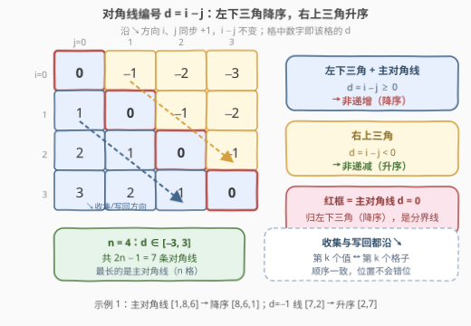
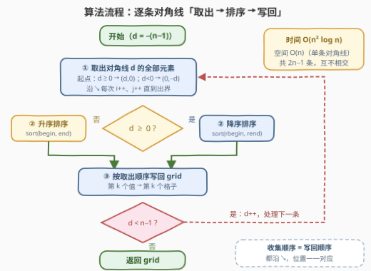

# 按对角线进行矩阵排序

- **题目名称**：按对角线进行矩阵排序
- **链接**：[3446. 按对角线进行矩阵排序](https://leetcode.cn/problems/sort-matrix-by-diagonals/)
- **难度**：中等
- **标签**：数组、矩阵、排序

## 1. 题目概述

给你一个大小为 `n x n` 的整数方阵 `grid`。返回一个经过如下调整的矩阵：

- **左下角三角形**（包括中间对角线）的对角线按**非递增顺序**排序；
- **右上角三角形**的对角线按**非递减顺序**排序。

这里的「对角线」指**从左上到右下**（↘）方向的斜线。主对角线是两个三角形的分界，题目明确它**归入左下角三角形**，按非递增排序。

**示例 1**：

```text
输入：grid = [[1,7,3],[9,8,2],[4,5,6]]
输出：[[8,2,3],[9,6,7],[4,5,1]]
解释：
  左下三角（含主对角线）按非递增排序：
    主对角线 [1, 8, 6] → [8, 6, 1]
    d=1 线 [9, 5]、d=2 线 [4] 已符合要求
  右上三角按非递减排序：
    d=−1 线 [7, 2] → [2, 7]
    d=−2 线 [3] 已符合要求
```

**示例 2**：

```text
输入：grid = [[0,1],[1,2]]
输出：[[2,1],[1,0]]
解释：主对角线 [0, 2] 按非递增排序变为 [2, 0]，其余对角线不变。
```

**示例 3**：

```text
输入：grid = [[1]]
输出：[[1]]
解释：只有一个元素的对角线无需修改。
```

**约束条件**：

- `grid.length == grid[i].length == n`
- `1 <= n <= 10`
- `-10^5 <= grid[i][j] <= 10^5`

---

## 2. 解题思路

### 2.1 暴力思路

最直接的想法：枚举全部 $2n-1$ 条对角线；对每条对角线，**双重循环扫描整个矩阵**，把满足 $i - j = d$ 的格子挑出来排序，再扫一遍写回。

每条对角线要花 $O(n^2)$ 找成员，共 $O(n)$ 条，总时间 $O(n^3)$。本题 `n <= 10` 自然能过，但「逐格判断它属于哪条线」完全可以一次做完——遍历矩阵时顺手把格子放进对应的桶即可。

> 💡 更省事的暴力是**按行扫描 + 哈希分桶**：`diag[i-j].append(grid[i][j])`，一次遍历 $O(n^2)$ 完成分组。这其实已经是优化后的写法了，见第 5 节。

### 2.2 核心观察：d = i − j 是对角线的「身份证」



三个关键事实：

1. **同一条对角线 ⇔ $d = i - j$ 相同**。沿 ↘ 方向走一步，`i`、`j` 各 `+1`，差值 $d$ 保持不变；不同对角线的 $d$ 互不相同。$d$ 的取值范围是 $[-(n-1),\, n-1]$，共 $2n-1$ 条。
2. **$d$ 的符号天然划分两个三角形**：$d \ge 0$ 的格子全在主对角线及其左下方（左下三角，含主对角线 $d = 0$），按**非递增**排序；$d < 0$ 的格子全在主对角线右上方（右上三角），按**非递减**排序。一次符号判断就能定出排序方向。
3. **对角线可以 $O(1)$ 定位起点**：$d \ge 0$ 时从 `(d, 0)` 出发，$d < 0$ 时从 `(0, -d)` 出发，之后每次 `i++、j++` 直到出界。无需扫描全矩阵找成员。

于是算法就是：**逐条对角线「取出 → 按方向排序 → 按原顺序写回」**。收集时沿 ↘ 把第 `k` 个元素记为 `vals[k]`，写回时同样沿 ↘ 把第 `k` 个格子填上 `vals[k]`——顺序天然一致，不会错位。

**时间复杂度**：$O(n^2 \log n)$，**空间复杂度**：$O(n)$（辅助数组只存当前一条对角线）。

### 2.3 算法流程图



统一让 $d$ 从 $-(n-1)$ 遍历到 $n-1$：取出对角线 $d$ 的元素后，用**一次判断 $d \ge 0$** 决定降序还是升序，写回后处理下一条，共 $2n-1$ 轮。

---

## 3. 参考代码

### C++

```cpp
class Solution {
  public:
    vector<vector<int>> sortMatrix(vector<vector<int>>& grid) {
        int n = grid.size();

        // 左下三角（含主对角线）：d = i - j ∈ [0, n-1]，非递增
        for (int d = 0; d < n; d++) {
            vector<int> vals;
            for (int i = d; i < n; i++) {
                vals.push_back(grid[i][i - d]);   // 起点 (d, 0)，沿 ↘ 收集
            }
            sort(vals.rbegin(), vals.rend());     // 降序
            for (int i = d; i < n; i++) {
                grid[i][i - d] = vals[i - d];     // 按收集顺序写回
            }
        }

        // 右上三角：e = j - i ∈ [1, n-1]，非递减
        for (int e = 1; e < n; e++) {
            vector<int> vals;
            for (int i = 0; i + e < n; i++) {
                vals.push_back(grid[i][i + e]);   // 起点 (0, e)，沿 ↘ 收集
            }
            sort(vals.begin(), vals.end());       // 升序
            for (int i = 0; i + e < n; i++) {
                grid[i][i + e] = vals[i];         // 按收集顺序写回
            }
        }
        return grid;
    }
};
```

### Python

```python
class Solution:
    def sortMatrix(self, grid: List[List[int]]) -> List[List[int]]:
        n = len(grid)

        # 左下三角（含主对角线）：d = i - j ∈ [0, n-1]，非递增
        for d in range(n):
            vals = sorted((grid[i][i - d] for i in range(d, n)), reverse=True)
            for i in range(d, n):
                grid[i][i - d] = vals[i - d]

        # 右上三角：e = j - i ∈ [1, n-1]，非递减
        for e in range(1, n):
            vals = sorted(grid[i][i + e] for i in range(n - e))
            for i in range(n - e):
                grid[i][i + e] = vals[i]

        return grid
```

---

## 4. 复杂度分析

| 维度 | 复杂度 | 说明 |
|------|--------|------|
| 时间复杂度 | O(n² log n) | 所有对角线长度之和为 n²，取出/写回共 O(n²)；各线排序代价之和不超过 O(n² log n) |
| 空间复杂度 | O(n) | 辅助数组只存当前一条对角线，最长 n 个元素（原地写回，不计返回矩阵） |

> 💡 输出本身就有 $n^2$ 个数，因此 $O(n^2)$ 是不可逾越的下界；$O(n^2 \log n)$ 的排序开销已非常接近最优。

---

## 5. 扩展：哈希分桶写法与变体

**哈希分桶版**（对应 2.1 的思路，一次遍历完成分组）：

```python
class Solution:
    def sortMatrix(self, grid: List[List[int]]) -> List[List[int]]:
        n = len(grid)
        diag = defaultdict(list)
        for i in range(n):
            for j in range(n):
                diag[i - j].append(grid[i][j])   # 按行扫描，同一条线上 i 递增
        for d in diag:
            diag[d].sort(reverse=(d >= 0))       # d≥0 降序，d<0 升序
        return [[diag[i - j].pop(0) for j in range(n)] for i in range(n)]
```

按行扫描时，同一条对角线上的格子按 `i` 递增入桶（恰好是 ↘ 方向），因此 `pop(0)` 取出的顺序与收集顺序一致。

> ⚠️ 注意 `pop(0)` 的隐藏代价：列表头部弹出是 $O(\text{线长})$，写回总量退化为 $O(n^3)$。数据放大时应换成 `collections.deque.popleft()` 或「预排序 + 按下标写回」（即第 3 节的写法），回到 $O(n^2)$ 级别。

**相关变体**：

- [1329. 将矩阵按对角线排序](https://leetcode.cn/problems/sort-the-matrix-diagonally/)：所有对角线**统一升序**，同一个 $d = i - j$ 套路，只是不再区分方向；
- 若题目改成**反对角线**（↗ 方向）分组，把「身份证」换成 $i + j$ 即可，起点与步进方向相应调整（如 [498. 对角线遍历](https://leetcode.cn/problems/diagonal-traverse/)）；
- 若要求**相邻对角线交替升降**，把排序方向的下标从 $d$ 换成对角线序号 $d + n - 1$ 的奇偶性即可。

---

## 6. 面试要点

1. **如何快速判断两个格子是否在同一条对角线上？**
   - 左上→右下方向看 $i - j$（相等即同线）；右上→左下（反对角线）方向看 $i + j$。本题是前者。

2. **主对角线属于哪个三角形？按什么方向排序？**
   - $d = 0$ 属于左下三角（题目明确「包括中间对角线」），按非递增排序。这是最容易写反的边界。

3. **为什么「取出—写回」不会错位？**
   - 收集与写回都沿 ↘ 方向（`i` 递增）遍历同一条对角线，第 `k` 次取出的值恰好填到第 `k` 个格子，位置一一对应。

4. **怎么第一时间发现排序方向写反了？**
   - 用示例 1 自测：主对角线 `[1,8,6]` 必须变成 `[8,6,1]`（降序）；若输出 `[1,6,8]`，说明左下三角误写成了升序。

5. **`n <= 10` 这么小，为什么还要计较 `pop(0)` 的复杂度？**
   - 面试官可能追问数据放大后的表现：`pop(0)` 让写回退化为 $O(n^3)$；换 `deque.popleft()` 或按下标写回即可回到 $O(n^2)$，这是列表头部操作的常见陷阱。

---

## 7. 同类练习题

- [1329. 将矩阵按对角线排序](https://leetcode.cn/problems/sort-the-matrix-diagonally/)（[题解](../1301-1400/1329_将矩阵按对角线排序.md)）：同一套 $d = i - j$ 分桶，区别是所有对角线统一升序
- [498. 对角线遍历](https://leetcode.cn/problems/diagonal-traverse/)：按反对角线 $i + j$ 分层 + 方向交替，对角线遍历变体
- [1572. 矩阵对角线元素的和](https://leetcode.cn/problems/matrix-diagonal-sum/)（[题解](../1501-1600/1572_矩阵对角线元素的和.md)）：主/副对角线遍历基本功，注意奇数阶中心只算一次
- [566. 重塑矩阵](https://leetcode.cn/problems/reshape-the-matrix/)（[题解](../0501-0600/566_重塑矩阵.md)）：二维下标与一维下标的线性映射
- [867. 转置矩阵](https://leetcode.cn/problems/transpose-matrix/)（[题解](../0801-0900/867_转置矩阵.md)）：沿 $i = j$ 对称轴行列互换，矩阵遍历基本功
