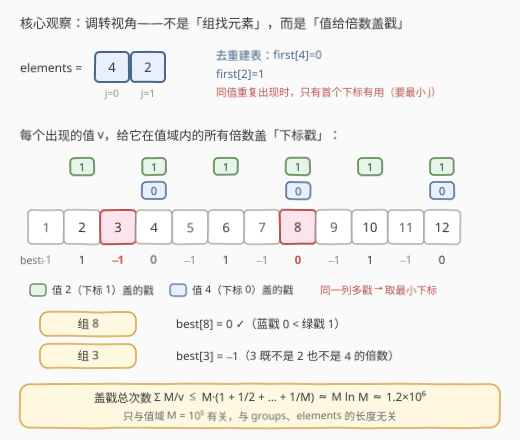
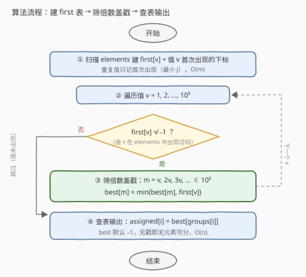

# LeetCode 将元素分配给有约束条件的组 题解

## 1. 题目概述

- **标题 / 题号**：将元素分配给有约束条件的组（#3447，medium）
- **链接**：https://leetcode.cn/problems/assign-elements-to-groups-with-constraints/
- **难度**：中等
- **标签**：数组、哈希表

**题意**：给你一个整数数组 `groups`，其中 `groups[i]` 表示第 `i` 组的大小。另给你一个整数数组 `elements`。

请你根据以下规则为每个组分配**一个**元素：

- 如果 `groups[i]` 能被 `elements[j]` 整除，则下标为 `j` 的元素可以分配给组 `i`；
- 如果有多个元素满足条件，则分配**最小的下标** `j` 的元素；
- 如果没有元素满足条件，则分配 `-1`。

返回一个整数数组 `assigned`，其中 `assigned[i]` 是分配给组 `i` 的元素的索引，若无合适的元素，则为 `-1`。注意：**一个元素可以分配给多个组**。

**示例 1**：

```text
输入：groups = [8,4,3,2,4], elements = [4,2]
输出：[0,0,-1,1,0]
解释：elements[0] = 4 被分配给组 0、1 和 4；elements[1] = 2 被分配给组 3；
      无法为组 2 分配任何元素，分配 -1。
```

**示例 2**：

```text
输入：groups = [2,3,5,7], elements = [5,3,3]
输出：[-1,1,0,-1]
解释：elements[1] = 3 被分配给组 1；elements[0] = 5 被分配给组 2；
      无法为组 0 和组 3 分配任何元素。
```

**示例 3**：

```text
输入：groups = [10,21,30,41], elements = [2,1]
输出：[0,1,0,1]
解释：elements[0] = 2 被分配给所有偶数值的组，elements[1] = 1 被分配给所有奇数值的组。
```

**约束**：

- $1 \le \text{groups.length} \le 10^5$
- $1 \le \text{elements.length} \le 10^5$
- $1 \le \text{groups[i]} \le 10^5$
- $1 \le \text{elements[j]} \le 10^5$

> 💡 **读题关键**：① 「一个元素可以分配给多个组」说明组与组**互不影响**——本题不是匹配/流问题，每个组的答案独立可查；② 值域被压到 $10^5$，这是复杂度的钥匙（见 2.2）；③ 「分配最小下标」意味着**同值元素只有首次出现的有用**，天然可去重。

## 2. 解题思路

### 2.1 暴力思路：每组从头扫一遍 elements

按题面直译：对每个组 `groups[i]`，从 `j = 0` 起顺序扫描 `elements`，找到第一个满足 `groups[i] % elements[j] == 0` 的下标即为答案，扫完都没有则记 `-1`。

单次扫描最坏 $O(m)$（找不到整除元素时扫全表），总体 $O(n \cdot m)$。代入上界 $n = m = 10^5$ 得 $10^{10}$ 次取模运算，必然超时。瓶颈在于：**大量组重复扫描同一段 elements，而整除关系只取决于两边的数值**——相同的计算被做了成千上万遍。

### 2.2 核心观察：调转视角，用「筛法」给倍数盖戳

**观察一：答案只依赖 `groups[i]` 的值。** 元素可复用、组间互不影响，因此本质是一个纯查询问题：对值 $g$，求最小的 $j$ 使得 `elements[j]` 整除 $g$。相同的 $g$ 查 $n$ 次结果也相同。

**观察二：整除关系可以反向摊销。** 「$v$ 整除 $m$」⇔「$m$ 是 $v$ 的倍数」。与其对每个组 $g$ 去 elements 里找因数，不如**对每个出现的元素值 $v$，把值域内 $v$ 的所有倍数都标记一遍**——这正是埃氏筛「划掉合数」的骨架。值域上限 $M = 10^5$，而

$$\sum_{v=1}^{M} \frac{M}{v} \;\le\; M \cdot \left(1 + \frac12 + \cdots + \frac1M\right) \;\approx\; M \ln M \;\approx\; 1.2 \times 10^6$$

一次「盖戳」的代价与 $n$、$m$ 都无关，只与值域相关。

**观察三：同值去重。** 由于要的是最小下标，同一个值重复出现时，只有**首次出现**的那个下标可能成为答案（后出现的同值元素永远被前者遮挡）。预处理 `first[v] = 值 v 首次出现的下标`，筛的时候每个值只盖一次戳。

综合三者：预处理数组 `best[m]` = 「能整除 $m$ 的元素值中，`first[v]` 的最小值」，筛完后每组一次 $O(1)$ 查表。



### 2.3 算法流程：建表 → 筛倍数 → 查表

1. **建 `first` 表**：初始化 `first[v] = -1`；顺序扫描 `elements`，`first[elements[j]]` 尚为 `-1` 时记录 `j`（先到先得，天然去重留首现），$O(m)$；
2. **筛倍数盖戳**：初始化 `best[m] = -1`；遍历值 $v = 1 \dots M$，若 `first[v] ≠ -1`，则对 $m = v, 2v, 3v, \dots \le M$ 逐一更新 `best[m] = min(best[m], first[v])`；
3. **查表输出**：`assigned[i] = best[groups[i]]`，无戳即为 `-1`，$O(n)$。



> ⚠️ 与埃氏筛的一个差别：埃氏筛可以从 $i^2$ 开始划倍数（更小的倍数已被更小的素数划过），本题**必须从 $m = v$ 开始盖**——因为 $v$ 本身也要能查到自己；且一个 $m$ 会被多个 $v$ 重复盖戳（如 8 同时被 2 和 4 盖），靠 `min` 收敛，不能「已盖就跳过整个值」。

### 2.4 示例演算：示例 1

`groups = [8,4,3,2,4]`，`elements = [4,2]`：

**第一步（建表）**：`first[4] = 0`，`first[2] = 1`，其余值 `-1`。

**第二步（盖戳，以值域前 12 为例）**：

| 倍数 m | 1 | 2 | 3 | 4 | 5 | 6 | 7 | 8 | 9 | 10 | 11 | 12 |
|--------|---|---|---|---|---|---|---|---|---|----|----|----|
| v=4 盖 `0` | | | | 0 | | | | 0 | | | | 0 |
| v=2 盖 `1` | | 1 | | 1 | | 1 | | 1 | | 1 | | 1 |
| **best[m]** | −1 | 1 | −1 | **0** | −1 | 1 | −1 | **0** | −1 | 1 | −1 | **0** |

（`best[4]`、`best[8]`、`best[12]` 两戳取小，得 `0`。）

**第三步（查表）**：

| 组值 groups[i] | 8 | 4 | 3 | 2 | 4 |
|----------------|---|---|---|---|---|
| best[groups[i]] | 0 | 0 | −1 | 1 | 0 |

输出 `[0,0,-1,1,0]` ✓。组值 3 不是任何出现值的倍数，落空得 `-1`，与示例一致。

## 3. 参考代码

### C++

```cpp
class Solution {
  public:
    vector<int> assignElements(vector<int>& groups, vector<int>& elements) {
        const int M = 100000;
        vector<int> first(M + 1, -1);
        for (int j = 0; j < (int)elements.size(); ++j) {
            if (first[elements[j]] == -1) {
                first[elements[j]] = j;  // 先到先得，重复值只留首现
            }
        }
        vector<int> best(M + 1, -1);
        for (int v = 1; v <= M; ++v) {
            if (first[v] == -1) continue;
            for (int m = v; m <= M; m += v) {
                if (best[m] == -1 || first[v] < best[m]) {
                    best[m] = first[v];
                }
            }
        }
        vector<int> assigned;
        assigned.reserve(groups.size());
        for (int g : groups) assigned.push_back(best[g]);
        return assigned;
    }
};
```

### Python

```python
class Solution:
    def assignElements(self, groups: List[int], elements: List[int]) -> List[int]:
        M = 100_000
        first = [-1] * (M + 1)
        for j, v in enumerate(elements):
            if first[v] == -1:
                first[v] = j  # 先到先得，重复值只留首现
        best = [-1] * (M + 1)
        for v in range(1, M + 1):
            j = first[v]
            if j == -1:
                continue
            for m in range(v, M + 1, v):
                if best[m] == -1 or j < best[m]:
                    best[m] = j
        return [best[g] for g in groups]
```

> 💡 **实现细节**：① `first` 用「先到先得」写入，等价于对同值取最小下标，无需显式 `min`；② 盖戳必须从 `m = v` 起步（见 2.3 的 ⚠️）；③ 若 `elements` 含 `1`，则值域内全部 `best` 都会被盖戳，任何组都不会落空；④ `best` 初始化为 `-1` 同时充当「未盖戳」哨兵，查表无需特判。

## 4. 复杂度分析

| 维度 | 复杂度 | 说明 |
|------|--------|------|
| 时间复杂度 | $O(n + m + M\log M)$ | 建 `first` 表 $O(m)$；筛倍数 $\sum_v M/v \approx M \ln M \approx 1.2\times10^6$（调和级数，只与值域 $M=10^5$ 相关）；查表输出 $O(n)$ |
| 空间复杂度 | $O(M)$ | `first` 与 `best` 两个值域数组，$O(10^5)$，与 $n$、$m$ 无关 |
| 暴力对照 | $O(n \cdot m)$ | 每组顺序扫 `elements`，上界 $10^{10}$ 次取模，必然超时 |

实测（纯 Python，最坏输入 $n = m = 10^5$、`elements` 恰为 $1 \dots 10^5$ 的排列）：盖戳循环总计约 120 万次内层迭代，全程约 0.2 秒——这正是调和级数上界的直观体现。

## 5. 扩展：反向思路——枚举每个组的因数

hints 里给出了另一个方向：**不筛倍数，而是对每个组值 $g$ 枚举它的全部因数** $d$，在 `first` 表里查 `first[d]` 是否非 `-1`，取最小的那个。枚举 $g$ 的因数只需试除到 $\sqrt{g}$，复杂度 $O(n\sqrt{M}) \approx 10^5 \times 316 \approx 3\times10^7$，同样能过。

两种方向的取舍：

| 方向 | 复杂度 | 依赖条件 | 适用场景 |
|------|--------|---------|---------|
| 筛倍数（本文主解） | $O(M \log M + n + m)$ | **值域 $M$ 必须小**（要开值域数组） | 值域 $\le 10^6$ 量级、组数多 |
| 枚举因数（反向） | $O(n\sqrt{M_{\max}})$ | 只需单次试除，无需值域数组 | 值域大（如 $10^9$）、组数相对少 |

本题 $M \le 10^5$ 且 $n$ 与 $M$ 同量级，筛倍数代码更短、常数更小；但若把约束改成 $1 \le \text{groups[i]} \le 10^9$，筛法直接失效（内存与时间都崩），枚举因数就成了唯一出路。**值域大小是「筛」类技巧的生死线**，面试中值得主动点出。

## 6. 面试要点

1. **为什么同值元素只保留首次出现的下标？**

   - 题目要求「多个满足条件的元素中取最小下标 $j$」。对固定值 $v$，任何组若能被 $v$ 整除，答案候选里 $v$ 的贡献永远是它的**首次出现下标**——后出现的同值元素不可能更小。去重后，筛的遍历对象从「元素个数 $m$」降为「不同值的个数」，且保证每个值只盖一轮戳。

2. **筛倍数的总代价为什么是 $O(M \log M)$ 而不是 $O(M^2)$？**

   - 每个值 $v$ 盖 $\lfloor M/v \rfloor$ 个戳，总和是调和级数 $\sum_{v=1}^{M} M/v \approx M \ln M$。直观理解：一半的值只盖 $\le M/2$ 次、四分之三的值只盖 $\le M/4$ 次……越大的值戳越稀。$M = 10^5$ 时约 $1.2\times10^6$，比 $M^2 = 10^{10}$ 小了将近四个数量级。

3. **和埃氏筛有什么异同？能否从 $v^2$ 开始盖戳？**

   - 同：都是「以值为单位向外扩散标记倍数」，复杂度同为调和级数。异：埃氏筛标记的是布尔状态，且可从 $i^2$ 起步（更小倍数已被更小素数覆盖）；本题 `best[m]` 承载的是**最小下标**信息，$v$ 自身也必须被盖（组值恰等于 $v$ 时要查到），且同一 $m$ 被多个 $v$ 盖戳时要取 `min`——既不能从 $v^2$ 开始，也不能「已盖即弃」。

4. **如果值域升到 $10^9$ 怎么办？**

   - 值域数组开不下，筛法失效。改走「枚举因数」方向：对每个组值 $g$ 用 $O(\sqrt g)$ 试除找全部因数，在 `first`（换成哈希表）里查首现下标取最小，总复杂度 $O(n\sqrt{M_{\max}})$。若组值也有大量重复，可先对组值去重再枚举。

5. **`first`、`best` 两张表能否合并成一张？**

   - 可以合并语义但不建议合并数组：`first` 按「值」索引、`best` 按「倍数」索引，含义不同（前者是输入指纹，后者是查询缓存）。合并后盖戳时 `best[m] = min(best[m], first[v])` 中读写同一数组，虽然本题 $m \ge v$ 且互不干扰仍正确，但可读性变差；保留两张表在面试白板上更清晰。

## 同类练习题

| # | 题目 | 与本题的关联 |
|---|------|-------------|
| 204 | [计数质数](https://leetcode.cn/problems/count-primes/)（[站内题解](../0201-0300/204_计数质数.md)） | 埃氏筛原型——「以值为单位划掉倍数」的鼻祖，本题筛法的直系来源 |
| 1819 | [序列中不同最大公约数的数目](https://leetcode.cn/problems/number-of-different-subsequences-gcds/)（[站内题解](../1801-1900/1819_序列中不同最大公约数的数目.md)） | 同样「枚举候选值的所有倍数验证存在性」，把子序列 GCD 问题转成筛，与本题的视角转换如出一辙 |
| 952 | [按公因数计算最大组件大小](https://leetcode.cn/problems/largest-component-size-by-common-factor/)（[站内题解](../0901-1000/952_按公因数计算最大组件大小.md)） | 枚举每个数的因数做并查集合并——第 5 节「枚举因数」方向的进阶应用 |
| 2183 | [统计可以被 K 整除的下标对数目](https://leetcode.cn/problems/count-array-pairs-divisible-by-k/)（[站内题解](../2101-2200/2183_统计可以被K整除的下标对数目.md)） | 整除关系哈希化的另一形态——按 gcd 值分桶计数，练习「整除 ⇒ 倍数/因数」的双向转译 |
