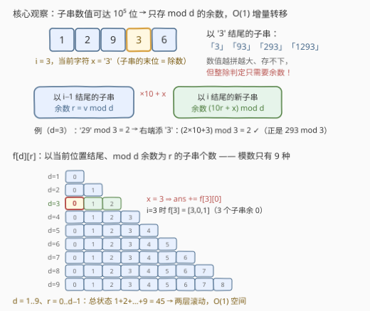
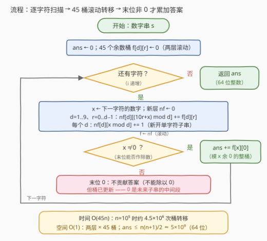

# LeetCode 统计可以被最后一个数位整除的子字符串数目 题解

## 1. 题目概述

- **标题 / 题号**：统计可以被最后一个数位整除的子字符串数目（#3448，hard）
- **链接**：https://leetcode.cn/problems/count-substrings-divisible-by-last-digit/
- **难度**：困难
- **标签**：字符串、动态规划、计数、数学

**题意**：给你一个只包含数字的字符串 `s`。

请你返回 `s` 的**最后一位不是 0** 的子字符串中，可以被子字符串**最后一位整除**的数目。

子字符串是字符串里一段**连续非空**的字符序列。注意：子字符串可以有前导 0。

**示例 1**：

```text
输入：s = "12936"
输出：11
解释：子字符串 "29"、"129"、"293" 和 "2936" 不能被它们的最后一位整除，
总共有 15 个子字符串，所以答案是 15 - 4 = 11。
```

**示例 2**：

```text
输入：s = "5701283"
输出：18
解释："01"、"12"、"701"、"012"、"128"、"5701"、"7012"、"0128"、"57012"、"70128"、
"570128"、"701283" 共 12 个多字符子串可被末位整除；另有 6 个非 0 单字符子串，
12 + 6 = 18。
```

**示例 3**：

```text
输入：s = "1010101010"
输出：25
解释：只有最后一位数字为 '1' 的子字符串可以被它们的最后一位整除，
总共有 25 个这样的字符串。
```

**约束**：

- $1 \le s.length \le 10^5$
- `s` 只包含数字。

> 💡 **读题关键**：① 除数是子串的**末位数字** $x$，且末位为 0 的子串直接排除（除以 0 无意义）；② **前导 0 合法**——`"01"` 的数值就是 1，能被末位 1 整除；③ 子串最长 $10^5$ 位、数值达 $10^{10^5}$ 量级，**任何整数类型都存不下**——这决定了本题不能「转成整数再取模」，而必须围绕余数做文章。

## 2. 解题思路

### 2.1 暴力思路

枚举所有 $O(n^2)$ 个子串，逐个转成整数判断整除。两个致命伤：

- **数值本身存不下**：$10^5$ 位的整数连 `long long` 都远远装不下（Python 大整数能存，但逐子串转数值是 $O(n)$ 的，总计 $O(n^3)$）；
- **子串数太多**：$n = 10^5$ 时约 $5 \times 10^9$ 个子串，连枚举都枚举不完。

即使退一步：固定右端点、右端每扩张一位就「乘 10 加数字」地增量维护余数——这方向是对的，但每个 (左端, 右端) 对仍要处理一次，总量还是 $O(n^2)$。真正的突破口在于：**除数的取值只有末位数字的 9 种（1~9），而整除判定只关心余数**——余数域极小，且能随右端扩张 $O(1)$ 转移，于是可以把「每个子串的余数」压缩成「以 $i$ 结尾的子串在各个模数下的余数**分布**」。

### 2.2 核心观察：按模数分桶的「余数分布」DP



**观察一：数值巨大，但余数可以 O(1) 增量转移。**

设子串 $s[j..i]$ 的数值为 $v$，右端再拼接数字 $x$ 后新数值为 $10v + x$。对任意模数 $d$：

$$
(10v + x) \bmod d = \big(10 \cdot (v \bmod d) + x\big) \bmod d
$$

只要知道旧子串的余数，新子串的余数一步就能算出来——**那个高达 $10^{10^5}$ 的数值本身从头到尾都不需要出现**。

**观察二：状态定义为「以 i 结尾的子串，在模数 d 下的余数分布」。**

$$
f_i[d][r] = \#\{\, j \le i : \text{value}(s[j..i]) \bmod d = r \,\}
$$

其中模数 $d \in [1, 9]$、余数 $r \in [0, d)$。设当前位置数字为 $x$，从 $i-1$ 转移到 $i$ 有两类来源：

| 来源 | 转移 |
|------|------|
| **延长**：以 $i-1$ 结尾的子串右端添上 $x$ | $f_i[d][(10r + x) \bmod d] \mathrel{+}= f_{i-1}[d][r]$，对所有 $d$、$r$ |
| **新开**：单字符子串 `"x"` 自身（数值就是 $x$） | $f_i[d][x \bmod d] \mathrel{+}= 1$，对所有 $d$ |

而**答案**在位置 $i$ 的贡献由末位一锤定音：

$$
x \ne 0 \ \Longrightarrow\ \text{ans} \mathrel{+}= f_i[x][0]
$$

（即以 $i$ 结尾、末位为 $x$、数值是 $x$ 的倍数的子串个数。）$x = 0$ 的位置**不贡献答案**，但 $f$ 必须照常更新——比如 `"105"` 中的 `'0'`：以它结尾的子串（`"0"`、`"10"`）确实都不合法，但它们是未来的 `"105"` 等更长子串的**中间段**，余数分布还得继续向右传递。

**观察三：状态总数只有 45，滚动两层就是 O(1) 空间。**

$d$ 从 1 到 9，每个模数的余数只有 $d$ 种，总状态数 $1 + 2 + \dots + 9 = 45$；转移只依赖上一层 $f_{i-1}$，用两个 45 桶的层交替覆盖即可。

> 💡 **一句话总结**：右端每添一个字符 $x$，9 个模数下的余数分布各自「乘 10 加 $x$」重排一遍，再塞进一个新开的单字符子串；末位 $x \ne 0$ 时，答案就加上模 $x$ 余 0 的那一整桶计数。数值本身从头到尾没有出现。

### 2.3 算法流程图



1. 初始化两层 45 桶为 0，`ans = 0`；
2. 逐字符扫描：取当前数字 $x$，新层清零；
3. 对 $d = 1 \dots 9$、$r = 0 \dots d-1$ 执行延长转移；对每个 $d$ 加上单字符子串；
4. 两层滚动（`f ← nf`）；
5. 若 $x \ne 0$，`ans += f[x][0]`；
6. 扫描结束返回 `ans`（64 位整数）。

### 2.4 示例演算

以**示例 1**（$s = $ `12936`）演算，每个位置只列出对答案有直接贡献的那一桶：

| 右端 $i$ | 末位 $x$ | $f[x][0]$ | 对应的合法子串 | 累计答案 |
|---|---|---|---|---|
| 0 | 1 | 1 | `1` | 1 |
| 1 | 2 | 2 | `2`、`12` | 3 |
| 2 | 9 | 1 | `9` | 4 |
| 3 | 3 | 3 | `3`、`93`、`1293` | 7 |
| 4 | 6 | 4 | `6`、`36`、`936`、`12936` | **11** |

看 $i = 3$（$x = 3$） internals：以 3 结尾的子串共 4 个——`3`、`93`、`293`、`1293`，模 3 的余数分别是 $0, 0, 2, 0$，所以 $f_3[3] = [3, 0, 1]$，`ans += 3`。同一时刻其余 8 个模数的桶也在悄悄更新（例如 $f_3[6]$ 记录着这 4 个子串模 6 的余数分布），等待未来某个末位为 6 的位置来查询。

再看 $i = 4$（$x = 6$）：以 6 结尾的子串共 5 个——`6`、`36`、`936`、`2936`、`12936`，模 6 余数 $0, 0, 0, 2, 0$，$f_4[6] = [4, 0, 1]$，`ans += 4`。其中 `936`、`12936` 正是把 $i \le 3$ 的旧子串一路「乘 10 加数字」接力出来的——它们从未以完整数值的形态出现过。

## 3. 参考代码

### C++

```cpp
class Solution {
public:
    long long countSubstrings(string s) {
        long long ans = 0;
        // f[d][r]: 以当前字符结尾、数值 mod d == r 的子串个数（两层滚动）
        long long f[10][9] = {}, nf[10][9] = {};
        for (char ch : s) {
            int x = ch - '0';
            memset(nf, 0, sizeof(nf));
            for (int d = 1; d <= 9; d++) {
                for (int r = 0; r < d; r++) {
                    if (f[d][r]) nf[d][(r * 10 + x) % d] += f[d][r];
                }
                nf[d][x % d] += 1;          // 新开的单字符子串 "x"
            }
            memcpy(f, nf, sizeof(nf));      // 滚动
            if (x) ans += f[x][0];          // 末位 x 作除数：模 x 余 0 的整桶计数
        }
        return ans;
    }
};
```

### Python

```python
class Solution:
    def countSubstrings(self, s: str) -> int:
        ans = 0
        # f[d][r]: 以当前字符结尾、数值 mod d == r 的子串个数（两层滚动）
        f = [[0] * d for d in range(10)]
        for ch in s:
            x = ord(ch) - 48
            nf = [None] * 10
            for d in range(1, 10):
                row = f[d]
                nrow = [0] * d
                m = 10 % d
                for r in range(d):
                    v = row[r]
                    if v:
                        nrow[(r * m + x) % d] += v
                nrow[x % d] += 1            # 新开的单字符子串 "x"
                nf[d] = nrow
            f = nf                          # 滚动
            if x:
                ans += f[x][0]
        return ans
```

> 💡 两处易错点：① **`x = 0` 时也要做转移**——桶更新与答案累加是两件独立的事，漏了转移会让一切穿过 0 的长子串全部算错；② 答案上限 $\frac{n(n+1)}{2} \approx 5 \times 10^9$ **超出 32 位整型**，C++ 必须用 `long long` 累加（本题签名返回 `long long`），Python 天然大整数无虞。

## 4. 复杂度分析

| 维度 | 复杂度 | 说明 |
|------|--------|------|
| **时间复杂度** | $O(45 \cdot n) \approx O(n)$ | 每个字符做 45 次桶转移（$d = 1 \dots 9$ 各 $d$ 个余数）+ 9 次单字符入桶；$n = 10^5$ 时约 $4.5 \times 10^6$ 次操作 |
| **空间复杂度** | $O(1)$ | 两层滚动 × 45 桶 = 90 个计数器；单桶计数 $\le n$，答案 $\le 5 \times 10^9$，64 位即可 |

## 5. 扩展：利用各数字的整除判据「打表」优化

通用 DP 一步到位，但 9 个模数里藏着不少「白给」的：

| 末位 $d$ | 整除判据 | 处理方式 |
|---|---|---|
| 1 | 任何整数都被 1 整除 | 末位为 1 的位置，以它结尾的子串**全部**合法 |
| 2 / 5 | 看末位：末位是偶数必被 2 整除；末位是 5 必被 5 整除 | 同上，**全部**合法 |
| 4 | 末两位组成的数被 4 整除 | 只需查前一个字符 |
| 8 | 末三位组成的数被 8 整除 | 只需查前两个字符 |
| 3 / 9 | 数位和被 3 / 9 整除 | 前缀数位和取模即可 |
| 6 | 被 2 且被 3 整除；末位 6 已保证偶 | 退化为模 3 |
| 7 | 没有捷径 | 必须维护模 7 余数（DP 的一般情形） |

于是 $d = 1, 2, 5$ 的桶纯属浪费、$d = 3, 6, 9$ 可换成前缀数位和、$d = 4, 8$ 只看末两/三位——真正需要 DP 桶的只剩 $d = 7$（7 个桶）。这个「打表版」常数更小，但正确性论证零碎、代码分支多；面试里**先写通用版讲清框架，再口头给出这张表**，是性价比最高的展示路径。

顺带一提：若把「末位数字」换成任意整数 $k$ 作除数，状态数变成 $O(k)$；当 $\gcd(k, 10) = 1$ 时还能用 [974](../0901-1000/974_和可被K整除的子数组.md) 式的**前缀同余计数**把单个模数做到 $O(n)$，但 $\gcd(k, 10) > 1$ 时 $10^t \bmod k$ 不可逆、前缀同余失效，只能回到本题这种逐层余数 DP。

## 6. 面试要点

1. **子串数值高达 $10^{10^5}$，怎么判整除？**

   - 整除判定只需要余数：$(10v + x) \bmod d$ 由 $v \bmod d$ 一步推出，数值本身永远不必构造。这是所有「大数子串 + 小模数」问题的通用钥匙。

2. **为什么 9 个模数的桶要同时维护，而不是只留当前末位那一个？**

   - 除数由**未来**的末位决定：位置 $i$ 的转移要为所有可能的后续末位准备好余数分布。好在 $d \in [1, 9]$ 的总状态只有 $1 + \dots + 9 = 45$ 个，代价可忽略。

3. **末位是 0 的位置怎么处理？**

   - 答案不累加（不能除以 0，题目也明确排除），但转移照做：`"105"` 里的 `'0'` 是合法子串 `"105"` 的中间段，其余数分布必须继续向右传递。「跳过答案、不跳过转移」是最容易写错的一处。

4. **计数会溢出吗？**

   - 单桶计数 $\le$ 以 $i$ 结尾的子串数 $\le n = 10^5$，32 位绰绰有余；但答案上限 $\frac{n(n+1)}{2} \approx 5 \times 10^9$ **超过 `int`**，必须用 64 位累加。

5. **和 974「和可被 K 整除的子数组」有何异同？**

   - 同：都是「子串 + 整除 + 计数」，都靠余数把大数/大和压进小值域。异：974 是前缀和的**减法结构**，同余配对可哈希计数；本题是「后缀数值」的 **×10 加 x 结构**、且模数随末位变化，前缀同余不可用，只能按模数分桶逐层转移。

> 💡 **一句话总结**：数值不现身、只传余数；末位定模数，45 桶滚动转移；`x = 0` 跳过答案但不跳过转移；答案 64 位——四条守住，本题就是一道线性扫描题。

## 同类练习题

| # | 题目 | 与本题的关联 |
|---|------|-------------|
| 2575 | [找出字符串的可整除数组](https://leetcode.cn/problems/find-the-divisibility-array-of-a-string/)（[题解](../2501-2600/2575_找出字符串的可整除数组.md)） | 同一个 $(r \times 10 + d) \bmod m$ 增量余数技巧的入门版，只是模数固定、判定对象是前缀 |
| 974 | [和可被 K 整除的子数组](https://leetcode.cn/problems/subarray-sums-divisible-by-k/)（[题解](../0901-1000/974_和可被K整除的子数组.md)） | 前缀同余计数祖师爷，对比理解「减法结构可哈希、乘 10 结构要分桶」 |
| 2950 | [可整除子串的数量](https://leetcode.cn/problems/number-of-divisible-substrings/)（[题解](../2901-3000/2950_可整除子串的数量.md)） | 另一维度的「可整除子串」——映射值之和被**长度**整除，枚举 9 种平均值的前缀和解法 |
| 1015 | [可被 K 整除的最小整数](https://leetcode.cn/problems/smallest-integer-divisible-by-k/)（[题解](../1001-1100/1015_可被K整除的最小整数.md)） | 把「余数」当节点做集合扩张，同余类思维的另一个出口 |
| 2435 | [矩阵中和能被 K 整除的路径](https://leetcode.cn/problems/paths-in-matrix-whose-sum-is-divisible-by-k/)（[题解](../2401-2500/2435_矩阵中和能被K整除的路径.md)） | 把 $\bmod\ k$ 作为 DP 状态维度的网格经典版 |
