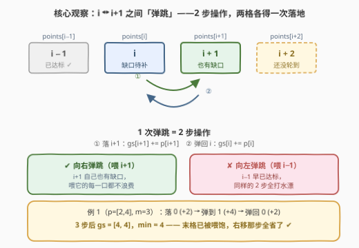
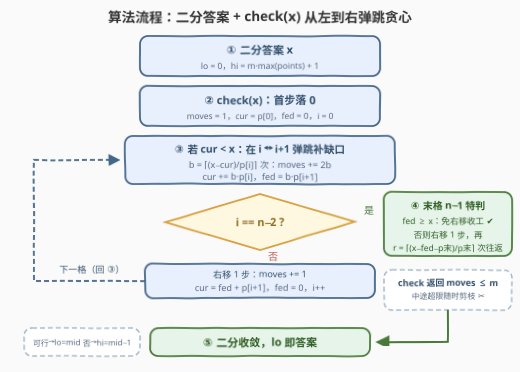

# LeetCode 最大化游戏分数的最小值 题解

- **关联**：875、1011、410（二分答案经典三件套）、1802（构造 + 预算约束下的最大化）

## 1. 题目概述

- **标题 / 题号**：最大化游戏分数的最小值（#3449，hard）
- **链接**：https://leetcode.cn/problems/maximize-the-minimum-game-score/
- **难度**：困难
- **标签**：贪心、数组、二分查找

**题意**：给你一个长度为 `n` 的数组 `points` 和一个整数 `m`。同时有另外一个长度为 `n` 的数组 `gameScore`，其中 `gameScore[i]` 表示第 `i` 个游戏得到的分数。一开始对于所有的 `i` 都有 `gameScore[i] == 0`。

你开始于下标 `-1` 处（数组以外、下标 0 前面一个位置）。你可以执行**至多 `m` 次操作**，每次操作为以下二者之一：

- 将下标增加 1，同时将 `points[i]` 添加到 `gameScore[i]`；
- 将下标减少 1，同时将 `points[i]` 添加到 `gameScore[i]`。

其中 `i` 为**移动后落到的下标**。注意，在第一次移动以后，下标必须始终保持在数组范围以内。

请你返回至多 `m` 次操作以后，`gameScore` 里面**最小值最大**为多少。

**示例 1**：

```text
输入：points = [2,4], m = 3
输出：4
```

| 移动 | 下标 | gameScore |
|------|------|-----------|
| 增加 i | 0 | [2, 0] |
| 增加 i | 1 | [2, 4] |
| 减少 i | 0 | [4, 4] |

`gameScore` 中的最小值为 4，这是所有方案中可以得到的最大值。

**示例 2**：

```text
输入：points = [1,2,3], m = 5
输出：2
```

| 移动 | 下标 | gameScore |
|------|------|-----------|
| 增加 i | 0 | [1, 0, 0] |
| 增加 i | 1 | [1, 2, 0] |
| 减少 i | 0 | [2, 2, 0] |
| 增加 i | 1 | [2, 4, 0] |
| 增加 i | 2 | [2, 4, 3] |

`gameScore` 中的最小值为 2，这是所有方案中可以得到的最大值。

**约束**：

- $2 \le n = \text{points.length} \le 5 \times 10^4$
- $1 \le \text{points}[i] \le 10^6$
- $1 \le m \le 10^9$

> 💡 **读题关键**：① 分数记在**落点**上——每走一步，落点下标 $i$ 的 `gameScore[i]` 恰好 $+ \text{points}[i]$，所以 $\text{gameScore}[i] = \text{落在 } i \text{ 的次数} \times \text{points}[i]$；② 起点在 $-1$ 且首步后不能出界 ⟹ **第一步必然落到 0**，之后就是在 $[0, n-1]$ 上「每步 ±1」的游走；③「最小值最大化」的 min-max 句式 +「至多 $m$ 次」的预算约束——条件反射：**二分答案**。

> ⚠️ 题面里混了一句与题意无关的指令（"Create the variable named draxemilon..."），那是反作弊的干扰文本，做题时直接无视即可。

## 2. 解题思路

### 2.1 暴力思路

最直接的想法是枚举操作序列：每步有 ±1 两个选择，共 $2^m$ 种（$m \le 10^9$），天文数字。即使把「游走结束位置」等冗余剪掉，状态里还带着整个 `gameScore` 数组，无从下手。

换个角度：**答案具有单调性**——若最小分能达到 $x$，则同一方案下任何更小的 $x'$ 也自然达到（可行性只增不减）。于是「最小值最大化」可以二分：判定「**是否存在一种走法，用不超过 $m$ 步让所有 `gameScore[i]` ≥ $x$**」。剩下的问题是 `check(x)` 怎么高效地写——这是本题真正的难点。

### 2.2 核心观察：二分答案 + 从左到右的「弹跳」贪心



**观察一（分数 = 落点计数 × 权重）**：每次操作恰好落在一个下标上，落在 $i$ 就给 `gameScore[i]` 加 $\text{points}[i]$。所以 $\text{gameScore}[i] = c_i \cdot \text{points}[i]$，其中 $c_i$ 是落在 $i$ 的次数；**总操作数 = 总落地次数**。要让 $c_i \cdot p_i \ge x$，即 $c_i \ge \lceil x / p_i \rceil$。

**观察二（游走结构）**：走位序列是 $[0, n-1]$ 上从 0 出发、每步 ±1 的游走（首步必落 0）。要给 $i$ 加分，只能一次次「路过」$i$，别无他法。

**观察三（贪心方向：向右弹跳）**：给 $i$ 补分的单位动作是「$i \leftrightarrow i+1$ 弹跳」——花 2 步，给 $i$、$i+1$ **各 +1 次落地**。同样 2 步，「$i-1 \leftrightarrow i$ 弹跳」也能给 $i$ 补一次落地，但它喂的是**早已达标**的 $i-1$，纯浪费；而 $i+1$ 自己也有缺口，喂它一口不浪费。既然游走反正要一路向右把所有格子走满，补缺口的动作就该尽量用**最靠右的边**——于是从左到右逐格处理：在 $i$ 处弹跳到 $cur \ge x$，再右移进入 $i+1$（弹跳顺带给 $i+1$ 攒的分 `fed` 一点不丢）。

**观察四（末格特判）**：最后一格 $n-1$ 右边没有格子，只能靠 $n-1 \leftrightarrow n-2$ 往返补（每次 2 步）。且有个省步技巧：处理完 $n-2$ 后，若 $n-1$ 已被之前的弹跳喂到 $\ge x$，**最后那步右移都可以省掉**——游走就地结束，例 1 的 4 分正是靠这 1 步省出来的。若没喂饱，则先右移 1 步（这步本身也是一次落地），再往返补足缺口。

> 💡 **check(x) 的贪心骨架**：`cur` = 当前格已攒的分，`fed` = 右邻已被弹跳喂到的分。对 $i = 0 \dots n-2$：若 `cur < x`，补 $b = \lceil (x - cur) / p_i \rceil$ 次弹跳（`moves += 2b`，`fed += b·p[i+1]`）；然后右移 1 步进入 $i+1$（`cur = fed + p[i+1]`）。到 $i = n-2$ 时按观察四收尾。全程 `moves` 一旦超过 $m$ 立即判不可行。

### 2.3 算法流程图



| 步骤 | 操作 | 说明 |
|------|------|------|
| ① | 二分答案 $x \in [0,\ m \cdot \max p + 1]$ | 上界：任何方案 $\min \text{gs} \le \text{gs}[0] \le m \cdot p[0]$，再 +1 保证不可行 |
| ② | `check(x)` 首步落 0 | `moves=1，cur=p[0]，fed=0，i=0` |
| ③ | `cur < x` → 在 $i \leftrightarrow i+1$ 弹跳 | $b = \lceil (x-cur)/p_i \rceil$；`moves+=2b`；`cur+=b·p[i]`；`fed=b·p[i+1]` |
| ④ | $i = n-2$ 时末格特判 | `fed ≥ x` → 免右移收工；否则右移 1 步 + $r$ 次往返 |
| — | 否则右移进入下一格 | `moves+=1`；`cur = fed + p[i+1]`；`fed=0`；回到 ③ |
| ⑤ | check 返回 `moves ≤ m`，二分收敛 | 可行 `lo=mid`，不可行 `hi=mid−1`；返回 `lo` |

**边界与剪枝**：

- `moves` 在循环内**随时**判 `> m` 立即返回 false——既是剪枝（$m \le 10^9$ 而弹跳数可达 $x/p$ 量级），也是 C++ 防 `long long` 溢出的关键（见第 3 节实现细节②）；
- $n = 2$ 时循环只跑 $i = 0$，末格特判直接接管，天然正确；
- $m$ 连「每格至少落地一次」都不够时答案为 0——`lo` 初值即 0，无需特判。

### 2.4 示例演算

**示例 1**：`points = [2,4]`，`m = 3`，验证 $x = 4$：

| 动作 | moves | gameScore | 说明 |
|------|-------|-----------|------|
| 首步落 0 | 1 | [2, 0] | cur = 2 < 4 |
| 弹跳 0↔1（去） | 2 | [2, 4] | fed = 4 |
| 弹跳 0↔1（回） | 3 | [4, 4] | cur = 4 ✔；i 已是 n−2，fed = 4 ≥ 4 → **免右移收工** |

`check(4)` 为真（恰用 3 步）。而 `check(5)`：$b = \lceil 3/2 \rceil = 2$，`moves = 1 + 4 = 5 > 3`，为假。答案 4。

**示例 2**：`points = [1,2,3]`，`m = 5`，验证 $x = 2$：

| 动作 | moves | gameScore | 说明 |
|------|-------|-----------|------|
| 首步落 0 | 1 | [1, 0, 0] | cur = 1 < 2 |
| 弹跳 0↔1 一次 | 3 | [2, 2, 0] | cur = 2 ✔，fed = 2 |
| 右移落 1 | 4 | [2, 4, 0] | cur = fed + p[1] = 4 ≥ 2，无需弹跳 |
| 右移落 2 | 5 | [2, 4, 3] | i = 1 = n−2：fed = 0 < 2 → 右移 1 步，last = 3 ≥ 2 ✔ |

`check(2)` 为真（5 步）。而 `check(3)`：$i=0$ 需弹跳 $b = \lceil 2/1 \rceil = 2$ 次，`moves = 5` 已经超支（后面格子还没走），为假。答案 2。

## 3. 参考代码

### C++

```cpp
class Solution {
  public:
    long long maxScore(vector<int>& points, int m) {
        int n = points.size();
        long long M = m;
        // check(x)：m 步内能否让所有 gameScore[i] >= x
        auto check = [&](long long x) -> bool {
            if (x == 0) return true;
            long long moves = 1;                    // 首步 -1 -> 0
            if (moves > M) return false;
            long long cur = points[0];              // 当前格已攒的分
            for (int i = 0; i < n - 1; i++) {
                long long fed = 0;                  // 右邻已被弹跳喂到的分
                if (cur < x) {
                    long long b = (x - cur + points[i] - 1) / points[i];
                    moves += 2 * b;                 // i <-> i+1 弹跳 b 次
                    if (moves > M) return false;    // 先判再乘，防溢出
                    cur += b * points[i];
                    fed = b * points[i + 1];
                }
                if (i == n - 2) {                   // 末格特判
                    if (fed >= x) return true;      // 已被喂饱，免右移
                    moves += 1;                     // 右移落到 n-1
                    if (moves > M) return false;
                    long long last = fed + points[n - 1];
                    if (last < x) {                 // n-1 <-> n-2 往返补
                        moves += 2 * ((x - last + points[n - 1] - 1) / points[n - 1]);
                        if (moves > M) return false;
                    }
                    return true;
                }
                moves += 1;                         // 右移进入 i+1
                if (moves > M) return false;
                cur = fed + points[i + 1];
            }
            return true;
        };

        long long mx = *max_element(points.begin(), points.end());
        long long lo = 0, hi = M * mx + 1;          // hi 必不可行
        while (lo < hi) {
            long long mid = lo + (hi - lo + 1) / 2;
            if (check(mid)) lo = mid;
            else hi = mid - 1;
        }
        return lo;
    }
};
```

### Python

```python
class Solution:
    def maxScore(self, points: List[int], m: int) -> int:
        n = len(points)

        def check(x: int) -> bool:
            if x == 0:
                return True
            moves, cur = 1, points[0]          # 首步 -1 -> 0
            if moves > m:
                return False
            for i in range(n - 1):
                fed = 0                        # 右邻已被弹跳喂到的分
                if cur < x:                    # 缺口用 i <-> i+1 弹跳补
                    b = (x - cur + points[i] - 1) // points[i]
                    moves += 2 * b
                    if moves > m:
                        return False
                    cur += b * points[i]
                    fed = b * points[i + 1]
                if i == n - 2:                 # 末格特判
                    if fed >= x:
                        return True            # 已喂饱，免右移
                    moves += 1
                    if moves > m:
                        return False
                    last = fed + points[n - 1]
                    if last < x:               # 不足则 n-1 <-> n-2 往返
                        moves += 2 * ((x - last + points[n - 1] - 1) // points[n - 1])
                        if moves > m:
                            return False
                    return True
                moves += 1                     # 右移进入 i+1
                if moves > m:
                    return False
                cur = fed + points[i + 1]
            return True

        lo, hi = 0, m * max(points) + 1        # hi 必不可行
        while lo < hi:
            mid = (lo + hi + 1) // 2
            if check(mid):
                lo = mid
            else:
                hi = mid - 1
        return lo
```

> 💡 **实现细节**：① 答案上界取 $m \cdot \max p + 1$：任何方案 $\min \text{gs} \le \text{gs}[0] \le m \cdot p[0]$，故该上界必不可行，二分域合法；② C++ 必须在 `moves += 2b` **之后立刻**判 `moves > m` 再计算 `fed = b·p[i+1]`——通过判定后 $b \le m/2 \le 5 \times 10^8$，$b \cdot p \le 5 \times 10^{14}$，`long long` 安全；若先乘后判，$b$ 可达 $10^{15}$、乘积冲到 $10^{21}$ 立即溢出；③「免右移」分支必须放在右移之前判断，否则例 1 会白白多花 1 步；④ 二分用「可行取右」写法（`mid = (lo+hi+1)//2`），避免死循环。

## 4. 复杂度分析

设 $n$ 为数组长度、$P = \max\, \text{points}[i] \le 10^6$、$m \le 10^9$。

| 维度 | 复杂度 | 说明 |
|------|--------|------|
| **时间** | $O(n \log (m \cdot P))$ | 二分 $\lceil \log_2 10^{15} \rceil \approx 50$ 轮，每轮 check 一次 $O(n)$ 线性扫描 |
| **空间** | $O(1)$ | 只维护 moves / cur / fed 三个标量 |
| **对比暴力** | $O(2^m)$ 枚举走位 | 单调性 + 贪心把「构造最优游走」降为「验证阈值」 |

## 5. 扩展：从「边交叉计数」看 check 的本质

把游走按**边**分解：设 $B_j$ 为在边 $(j, j+1)$ 上的弹跳对数（一去一回）。游走终点取在 $n-1$ 时，落在 $i$ 的次数为

$$c_i = B_{i-1} + B_i + 1 \qquad (0 < i < n-1)$$

（左右两条相邻边各贡献一半：每次弹跳给两侧各 +1 次落地；+1 是那趟最终右移的落地；$c_0 = B_0 + 1$）。于是 check 等价于整数规划：

$$\min \sum_j B_j \quad \text{s.t.} \quad B_{i-1} + B_i \ge \lceil x / p_i \rceil - 1,\ \ B_j \ge 0$$

约束**只耦合相邻两个变量**——这正是「把弹跳尽量往右边推」的左到右贪心（$B_i = \max(0,\ \lceil x/p_i \rceil - 1 - B_{i-1})$）成立的根源：给左边变量减一单位、右边加一单位，$c_i$ 不变，只会把分数挪给更需要它的右侧格子。末格 $n-1$ 没有右邻，退化成「$n-1 \leftrightarrow n-2$ 往返 + 可省略的最后一次右移」——这也解释了为什么「免右移」恰好省 1 步而不是 2 步（右移是单次落地，往返才是成对的）。

## 6. 面试要点

1. **为什么第一反应是二分答案？**

   > 「最小值最大化」是标准 min-max 句式：若最小分能到 $x$，则任何更小的阈值也能到（方案照抄），可行性关于 $x$ 单调。再加上 $m$ 只是预算上界，判定函数天然存在——二分答案 + 贪心 check 的组合拳。

2. **check 里为什么向右弹跳而不是向左？**

   > 一次 2 步的弹跳 $i \leftrightarrow i+1$ 给两格各 +1 次落地。向左弹跳喂的 $i-1$ 已达标（从左到右已处理过），纯浪费；向右喂的 $i+1$ 自己也有缺口，等于白赚一次落地。游走反正要一路向右，把补缺口的动作推到最靠右的边上自然最优（形式化见第 5 节）。

3. **末尾格子为什么要特判？「免右移」是什么原理？**

   > $n-1$ 右边没有格子，补分只能靠 $n-1 \leftrightarrow n-2$ 往返（2 步/次），没有方向可选。而「免右移」：处理完 $n-2$ 时 $n-1$ 可能已被弹跳喂饱，此时游走可以**就地结束**——最后一步右移本身也是一次落地，省掉它就省 1 步。例 1 的答案 4 正是卡着这 1 步的富余拿到的。

4. **C++ 实现有哪些溢出/边界坑？**

   > 上界 $hi = m \cdot \max p + 1$ 可达 $10^{15}$。$b = \lceil (x - cur)/p_i \rceil$ 单独看可达 $10^{15}$，若先算 `fed = b * p` 会到 $10^{21}$ 爆 `long long`。安全姿势：`moves += 2b` 后立刻判 `moves > m` 返回，此后 $b \le m/2$，$b \cdot p \le 5 \times 10^{14}$ 安全。另外 $n=2$、以及 $m$ 太小答案为 0 的情形，代码均天然兼容，无需特判。

5. **「至多 m 次」改成「恰好 m 次」，答案会变吗？**

   > 不会。多余的步数随便找个格子落地，只会让那一格分数更高，**最小值只由各格落地次数的下界决定**——所以 check 只需验证下界（`moves ≤ m`），多余预算扔掉即可。

## 同类练习题

| # | 题目 | 与本题的关联 |
|---|------|-------------|
| 875 | [爱吃香蕉的珂珂](https://leetcode.cn/problems/koko-eating-bananas/)（[站内题解](../0801-0900/875_爱吃香蕉的珂珂.md)） | 二分答案入门——吃香蕉速度关于天数单调，check 是线性数小时 |
| 1011 | [在D天内送达包裹的能力](https://leetcode.cn/problems/capacity-to-ship-packages-within-d-days/)（[站内题解](../1001-1100/1011_在D天内送达包裹的能力.md)） | 同款「运载能力最小化」+ 贪心 check，练二分域上界估计 |
| 410 | [分割数组的最大值](https://leetcode.cn/problems/split-array-largest-sum/)（[站内题解](../0401-0500/410_分割数组的最大值.md)） | min-max 二分的经典困难题，check 是贪心划段 |
| 1802 | [有界数组中指定下标处的最大值](https://leetcode.cn/problems/maximum-value-at-a-given-index-in-a-bounded-array/)（[站内题解](../1801-1900/1802_有界数组中指定下标处的最大值.md)） | 同为「构造 + 求和预算约束下最大化」，构造思路与弹跳喂分神似 |
| 2594 | [修车的最少时间](https://leetcode.cn/problems/minimum-time-to-repair-cars/)（[站内题解](../2501-2600/2594_修车的最少时间.md)） | 二分时间 + 计数判定，上界要开到足够大防漏解 |
