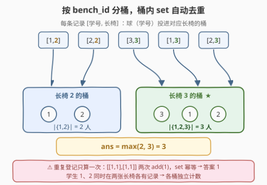
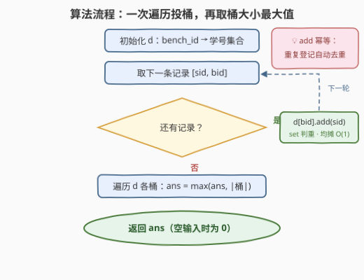

# 一张长椅上的最多学生

- **题目名称**：一张长椅上的最多学生
- **链接**：[3450. 一张长椅上的最多学生](https://leetcode.cn/problems/maximum-students-on-a-single-bench/)
- **难度**：简单
- **标签**：数组、哈希表

## 1. 题目概述

> ⚠️ 本题为 LeetCode 付费题（Plus 会员专享），题意描述根据官方示例用例与 hints 重建，并已与社区镜像 doocs/leetcode 的官方中文翻译交叉核对（示例输入输出、约束条件、函数签名 `maxStudentsOnBench` 均一致，出入风险较低）。

给定一个包含学生数据的二维数组 `students`，其中 `students[i] = [student_id, bench_id]` 表示学生 `student_id` 正坐在长椅 `bench_id` 上。

返回**单个长椅上坐着的不同学生**的最大数量。如果没有学生，返回 `0`。

**注意**：一个学生在输入中可以出现在同一张长椅上多次，但每个长椅上只能计算一次。

**示例 1**：

```text
输入：students = [[1,2],[2,2],[3,3],[1,3],[2,3]]
输出：3
解释：长椅 2 上有 2 个不同学生 [1, 2]；长椅 3 上有 3 个不同学生 [1, 2, 3]。
```

**示例 2**：

```text
输入：students = [[1,1],[2,1],[3,1],[4,2],[5,2]]
输出：3
解释：长椅 1 上有 3 个不同学生 [1, 2, 3]；长椅 2 上有 2 个不同学生 [4, 5]。
```

**示例 3**：

```text
输入：students = [[1,1],[1,1]]
输出：1
解释：学生 1 被登记两次，但去重后长椅 1 上只有 1 个学生。
```

**示例 4**：

```text
输入：students = []
输出：0
解释：不存在学生，输出为 0。
```

**约束条件**：

- $0 \le students.length \le 100$
- $students[i] = [student\_id, bench\_id]$
- $1 \le student\_id \le 100$
- $1 \le bench\_id \le 100$

> 💡 **读题关键**：① 求的是每张长椅上「**不同**学生」数的最大值——「不同」二字是本题唯一的坑，示例 3 的重复登记必须去重；② 每条记录是一次独立的「落座登记」：同一个学生可以在**多张**长椅上都有记录（示例 1 中学生 1、2 同时登记在长椅 2 和长椅 3 上），各长椅各自计数；③ 本质就是数据库里的 `GROUP BY bench_id` + `COUNT(DISTINCT student_id)` + `MAX`。

---

## 2. 解题思路

### 2.1 暴力思路：逐长椅扫描判重

枚举每一个出现过的长椅 $b$（至多 $B \le 100$ 种），再完整扫一遍 `students`，把 `bench_id == b` 的学生收进一个列表，收集时还要判断「这个学号是否已经收过」：

- 外层 $O(B)$ 次全量扫描，总量 $O(B \cdot n)$；判重若也线性扫已收列表，则到 $O(n^2)$。

本题 $n \le 100$ 怎么写都能过，但这写法把同一份数据**按长椅反复扫描**，本质上是在手动模拟「分组」——不如让哈希表一次遍历把组分好。

### 2.2 核心观察：按 bench_id 分桶，桶内集合天然去重



把每条记录 $[sid, bid]$ 看作一次「投球」：**球（学号）按长椅编号投入对应的桶**。两个关键点：

1. **分桶**：用哈希表 $d$ 维护 `bench_id → 学号集合`。键是 $bench\_id$（按长椅聚合），值是 **set**（自动判重）——同一学号重复插入无任何效果，示例 3 的坑被数据结构天然抹平；
2. **取最值**：投完后答案就是 $\max\limits_{b} |d[b]|$；输入为空时 $d$ 为空表，答案取 $0$。

$$\text{ans} = \max_{b \,\in\, \text{长椅}} \left|\{\,sid : [\,sid,\ b\,] \in students\,\}\right|$$

一次遍历完成分组（每次插入均摊 $O(1)$），再扫一遍桶取最大——总代价线性。

> 💡 为什么值不用 `list` + 计数器？因为「不同学生」关心的是**身份去重**而非出现次数：计数器会把示例 3 的两条记录算成 2，set 则稳定地只保留 1 个元素。

### 2.3 算法流程图



1. 初始化哈希表 $d$（`bench_id → 学号集合`），`ans = 0`；
2. 依次取出记录 $[sid, bid]$：执行 $d[bid].\mathrm{add}(sid)$（集合判重，均摊 $O(1)$）；
3. 记录用尽后，遍历 $d$ 的每个桶：`ans = max(ans, 桶大小)`；
4. 返回 `ans`（空输入时 $d$ 为空，直接返回 0）。

### 2.4 示例演算

以**示例 1**（`students = [[1,2],[2,2],[3,3],[1,3],[2,3]]`）逐步投桶：

| 记录 | 操作 | 长椅 2 的桶 | 长椅 3 的桶 |
|------|------|------------|------------|
| [1,2] | add(1) → 桶 2 | {1} | — |
| [2,2] | add(2) → 桶 2 | {1,2} | — |
| [3,3] | add(3) → 桶 3 | {1,2} | {3} |
| [1,3] | add(1) → 桶 3 | {1,2} | {3,1} |
| [2,3] | add(2) → 桶 3 | {1,2} | {3,1,2} |

答案 $= \max(2, 3) = 3$ ✓。注意学生 1、2 在两张长椅的桶里各留一份——这正是「每条记录独立计入对应长椅」的体现。

**示例 3**：两条 $[1,1]$ 记录，第二次 `add(1)` 对集合 $\{1\}$ 毫无影响，答案 $1$ ✓；**示例 4**：无记录，$d$ 为空，`max` 落到默认值 $0$ ✓。

---

## 3. 参考代码

### C++

```cpp
class Solution {
  public:
    int maxStudentsOnBench(vector<vector<int>>& students) {
        unordered_map<int, unordered_set<int>> d;   // bench_id → 学号集合
        for (const auto& e : students) {
            d[e[1]].insert(e[0]);                   // 集合自动判重
        }
        int ans = 0;                                // 空表时保持 0
        for (const auto& [bench, ids] : d) {
            ans = max(ans, (int)ids.size());
        }
        return ans;
    }
};
```

### Python

```python
class Solution:
    def maxStudentsOnBench(self, students: List[List[int]]) -> int:
        d = defaultdict(set)                    # bench_id → 学号集合
        for student_id, bench_id in students:
            d[bench_id].add(student_id)          # 集合自动判重
        return max(map(len, d.values()), default=0)
```

> 💡 `max(..., default=0)`（Python 3.4+ 的 `default` 形参）让空输入免掉 if 判断，正好对应示例 4。

---

## 4. 复杂度分析

| 维度 | 复杂度 | 说明 |
|------|--------|------|
| 时间 | $O(n)$ | 每条记录一次均摊 $O(1)$ 的集合插入；随后扫一遍桶（桶数 $\le n$） |
| 空间 | $O(n)$ | 哈希表至多存 $n$ 个（长椅, 学号）对；本题 $n \le 100$，也可视作 $O(U)$（$U$ 为 id 上界） |

---

## 5. 扩展：ID 上界 100 ⇒ 数组 + 位图，免哈希

约束里 $1 \le student\_id, bench\_id \le 100$——键与元素的值域都极小，可以**直接用数组下标当哈希**：长椅维度开 101 个桶，桶内用 `bitset` 的一个位表示「该学号是否已在桶中」：

```cpp
class Solution {
  public:
    int maxStudentsOnBench(vector<vector<int>>& students) {
        bitset<101> benches[101];                 // benches[b][s]：学生 s 是否坐长椅 b
        for (const auto& e : students) {
            benches[e[1]][e[0]] = 1;              // 重复置位无害
        }
        int ans = 0;
        for (int b = 1; b <= 100; ++b) {
            ans = max(ans, (int)benches[b].count());   // popcount 数不同学生
        }
        return ans;
    }
};
```

时间 $O(n + 100^2/64)$、空间约 $101 \times 13$ 字节，免哈希、免扩容、缓存友好。「**值域小就用数组换哈希**」是面试里的标准加分项。

同构的 SQL 版（本题的数据表形态）：

```sql
SELECT MAX(cnt) AS max_students
FROM (SELECT COUNT(DISTINCT student_id) AS cnt
      FROM Students
      GROUP BY bench_id) t;
```

pandas 一行版：`students.groupby(1)[0].nunique().max()`（空表时得到 `NaN`，需 `fillna(0)` 兜底）。

---

## 6. 面试要点

- **Q1：桶的值为什么是 set 而不是计数器？**
  答：题目要的是「不同学生」数——身份去重。计数器统计出现次数，会把示例 3 的两条 `[1,1]` 算成 2；set 对重复元素幂等，天然给出 1。
- **Q2：哈希表的键为什么是 bench_id？**
  答：聚合维度是「长椅」。键取 bench_id 后每条记录均摊 $O(1)$ 定位到所属桶。注意示例 1 中学生 1、2 在两张长椅都有记录，按长椅分组意味着他们在两个桶里各被计一次——这正是题意（每条记录独立登记）。
- **Q3：空输入怎么保证返回 0？**
  答：C++ 里 `ans` 初始化为 0、循环不执行即返回 0；Python 用 `max(iterable, default=0)` 给空序列兜底。漏掉兜底是本题最常见的 WA 点。
- **Q4：$student\_id, bench\_id \le 100$，还能怎么优化？**
  答：用数组下标代替哈希：开 101 个桶，桶内 `bitset<101>` 记录学号是否出现，`count()`（popcount）即桶大小。常数与空间都更优，见第 5 节。
- **Q5：如果改问「人数最多的长椅编号」（并列取最小编号）呢？**
  答：取最值时把比较对象换成（桶大小, 相反数的长椅编号）这样的复合键，或先求最大桶大小、再从小到大找第一个达到它的 bench_id，仍是线性扫一遍。

---

## 7. 同类练习题

- [1748. 唯一元素的和](https://leetcode.cn/problems/sum-of-unique-elements/)：哈希计数后按频次筛选，「不同元素」统计的入门款
- [2085. 统计出现过一次的公共字符串](https://leetcode.cn/problems/count-common-words-with-one-occurrence/)：两个列表各建一张计数表再合并，分组统计的进阶版
- [2248. 多个数组求交集](https://leetcode.cn/problems/intersection-of-multiple-arrays/)：按「值 → 出现集合」分桶后取交集，与本题同属 set 分桶套路
- [1207. 独一无二的出现次数](https://leetcode.cn/problems/unique-number-of-occurrences/)：先按值分桶计数、再对计数结果去重判定，两层哈希串联
- [347. 前 K 个高频元素](https://leetcode.cn/problems/top-k-frequent-elements/)：哈希分桶计数 + Top-K 选择，分组统计套路的收官题
