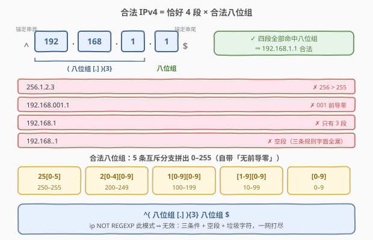
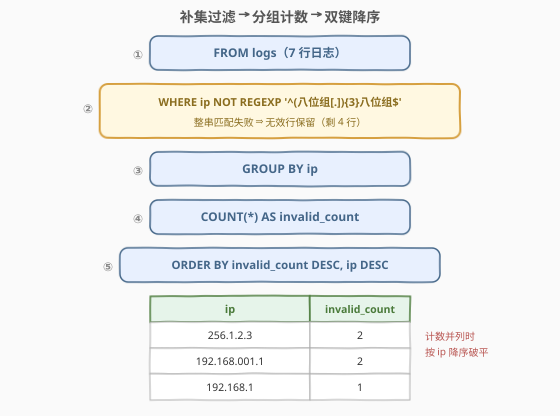

# 查找无效的 IP 地址

- **题目名称**：查找无效的 IP 地址
- **链接**：[3451. 查找无效的 IP 地址](https://leetcode.cn/problems/find-invalid-ip-addresses/)
- **难度**：困难
- **标签**：SQL、数据库、正则表达式、`GROUP BY` + 聚合计数、补集思维

## 1. 题目概述

给定 `logs` 表（每行一条访问日志），统计**每个无效 IP 地址出现的次数**。一个 IPv4 地址若满足以下**任一**条件即为无效：

1. 任何 **8 位字节**（octet，点分四段中的一段）的数值**大于 255**（如 `256.1.2.3`）；
2. 任何 8 位字节含有**前导零**（如 `192.168.001.1` 中的 `001`）；
3. **少于或多于 4 个** 8 位字节（如 `192.168.1` 只有 3 段）。

返回 `ip` 与 `invalid_count` 两列，先按 `invalid_count` **降序**、再按 `ip` **降序**排序。

**表结构**：

```text
Table: logs
+-------------+---------+
| Column Name | Type    |
+-------------+---------+
| log_id      | int     |  ← 主键
| ip          | varchar |
| status_code | int     |
+-------------+---------+
```

**示例 1**：

```text
输入：
logs 表:
+--------+---------------+-------------+
| log_id | ip            | status_code |
+--------+---------------+-------------+
| 1      | 192.168.1.1   | 200         |
| 2      | 256.1.2.3     | 404         |
| 3      | 192.168.001.1 | 200         |
| 4      | 192.168.1.1   | 200         |
| 5      | 192.168.1     | 500         |
| 6      | 256.1.2.3     | 404         |
| 7      | 192.168.001.1 | 200         |
+--------+---------------+-------------+

输出：
+---------------+---------------+
| ip            | invalid_count |
+---------------+---------------+
| 256.1.2.3     | 2             |
| 192.168.001.1 | 2             |
| 192.168.1     | 1             |
+---------------+---------------+
```

**解释**：

| ip | 判定 | 依据 | 出现次数 |
|----|------|------|---------|
| `256.1.2.3` | 无效 | `256 > 255` | 2（log_id 2、6） |
| `192.168.001.1` | 无效 | `001` 前导零 | 2（log_id 3、7） |
| `192.168.1` | 无效 | 只有 3 段 | 1（log_id 5） |
| `192.168.1.1` | 合法 | — 不进入输出 | 2 |

**示例 2**：

```text
输入：
logs 表:
+--------+-------------+-------------+
| log_id | ip          | status_code |
+--------+-------------+-------------+
| 8      | 127.0.0.1   | 200         |
| 9      | 192.168..1  | 400         |
+--------+-------------+-------------+

输出：
+------------+---------------+
| ip         | invalid_count |
+------------+---------------+
| 192.168..1 | 1             |
+------------+---------------+
```

`192.168..1` 中间是**空段**（两个连续的点）——注意这条数据：它是后文「逐条翻译三条规则会漏判」的关键反例。

> 💡 本题 = 「**正则行级过滤** + **分组计数** + **双键排序**」三件套。难点不在聚合，而在把「0–255 且无前导零」写成一个滴水不漏的**八位组模式**，并想到用**补集思维**——不枚举「无效长什么样」，只定义「合法长什么样」，剩下的全是无效。

---

## 2. 解题思路

### 2.1 暴力思路：把三条无效规则逐条翻译

最直觉的写法是把题面三条规则各自翻译成 SQL 条件，再 `OR` 起来：

```sql
-- 规则③ 段数 ≠ 4：点数 ≠ 3
LENGTH(ip) - LENGTH(REPLACE(ip, '.', '')) <> 3
-- 规则② 前导零：行首或点后紧跟「0 + 数字」
ip REGEXP '(^|[.])0[0-9]'
-- 规则① 某段 > 255：至少要枚举四类形态，且极难写全
ip REGEXP '(^|[.])(25[6-9]|2[6-9][0-9]|[3-9][0-9]{2}|[0-9]{4,})([.]|$)'
```

三条各写各的，已经开始打地鼠了，更糟的是**存在漏网之鱼**：

- `192.168..1`（示例 2）：点数恰好 3 → 规则③ 放行；没有 `0+数字` → 规则② 放行；没有超标的数字段 → 规则① 放行——**三条全漏，但它显然无效**；
- `1.2.3.abc`、`+1.2.3.4`、`1.2.3.4 `（尾随空格）这类垃圾字符，三条规则同样不置可否。

> ⚠️ 根本问题：题面的三条规则是对「无效」的**不完全枚举**（自然语言描述），而「无效」的严格定义只能是「**不是合法的 IPv4**」。枚举无效 = 无穷追反例；定义合法 = 一条模式搞定——这正是**补集思维**的用武之地。

### 2.2 核心观察：补集思维 + 八位组模式



**第一步：定义「合法八位组」。** 一段合法 = 数值在 0–255 内、且是**规范十进制写法**（无前导零）。正则没有数值比较能力，范围约束要靠**区间拆分**编码进字符类：

| 分支 | 覆盖区间 | 位数 |
|------|---------|------|
| `25[0-5]` | 250–255 | 3 |
| `2[0-4][0-9]` | 200–249 | 3 |
| `1[0-9][0-9]` | 100–199 | 3 |
| `[1-9][0-9]` | 10–99 | 2 |
| `[0-9]` | 0–9 | 1 |

五条分支按「百位/十位是否顶到上界」切开，**两两互斥、并集恰为 $[0, 255]$**。

> 💡 **「无前导零」不需要单独写**：五条分支中能以 `0` 开头的只有 `[0-9]`（单字符）——即只有 `0` 本身合法。`01`、`007` 在任何分支都对不上。「无前导零」是「规范写法」的**结构副产品**，与邮箱题的「结构即约束」同理。

**第二步：拼出整串模式。** 记八位组模式为 `O`，合法 IPv4 的整串模式就是：

```text
^( O [.] ){3} O $
```

- `( O [.] ){3}` + 末段 `O` ⇒ **恰好 4 段、3 个点**：`192.168.1`（3 段）在末段处失配，`1.2.3.4.5`（5 段）在 `$` 前吃不完；
- **空段**（`192.168..1`）在「连续两个点」处失配——八位组至少要 1 位数字；
- **非数字垃圾**（`1.2.3.abc`）同样无分支可配。

**第三步：取补集。** 无效 = 不匹配上述合法模式，翻译成 SQL 就是一个 `NOT`：

```sql
WHERE ip NOT REGEXP '^((25[0-5]|2[0-4][0-9]|1[0-9][0-9]|[1-9][0-9]|[0-9])[.]){3}(25[0-5]|2[0-4][0-9]|1[0-9][0-9]|[1-9][0-9]|[0-9])$'
```

一条 `NOT REGEXP` 同时覆盖：三条显式规则（超 255 / 前导零 / 段数 ≠ 4）+ 隐含反例（空段、垃圾字符、首尾多余字符）。

> ⚠️ **三个高频翻车点**：
> 1. **别写 `[0-9]{1,3}`**：它只约束「1–3 个数字」，会放行 `999`（超范围）和 `007`（前导零）；
> 2. **点号必须转义**：写 `[.]`（或 MySQL 里 `'\\.'`）。裸 `.` 是「任意单字符」，`192x168x1x1` 会被误判合法；
> 3. **`^...$` 锚定不可省**：`REGEXP` 默认「包含即匹配」，`evil.1.2.3.4` 含子串 `1.2.3.4`，不锚定整串会被误判合法而漏出结果。

### 2.3 算法流程图



**逻辑执行步骤**：

| 步骤 | 子句 | 说明 |
|------|------|------|
| ① | `FROM logs` | 逐行扫描日志（示例 1 共 7 行） |
| ② | `WHERE ip NOT REGEXP '…'` | 整串校验：**匹配 ⇒ 合法 ⇒ 丢弃；失配 ⇒ 无效 ⇒ 保留** |
| ③ | `GROUP BY ip` | 无效行按 `ip` 值分桶（示例 1 剩 4 行 → 3 桶） |
| ④ | `SELECT ip, COUNT(*)` | 每桶行数即该 ip 的出现次数 |
| ⑤ | `ORDER BY invalid_count DESC, ip DESC` | 双键降序；计数并列时按 `ip` **字符串序**破平 |

> 💡 SQL 逻辑执行顺序为 `FROM → WHERE → GROUP BY → SELECT（聚合在此求值）→ ORDER BY`：过滤发生在分组**之前**，合法 IP 在 `WHERE` 阶段就被扔掉，根本不进分组；`ORDER BY` 在 `SELECT` 之后，可直接引用输出别名 `invalid_count`。

### 2.4 示例演算

对示例 1 的 7 行逐一做整串匹配：

| log_id | ip | 各段判定 | 结论 |
|--------|----|---------|------|
| 1 | `192.168.1.1` | 192 ✓ 168 ✓ 1 ✓ 1 ✓，结构 ✓ | 合法 → 丢弃 |
| 2 | `256.1.2.3` | `256` 无分支可配（>255） | 无效 → 保留 |
| 3 | `192.168.001.1` | `001` 前导零，无分支可配 | 无效 → 保留 |
| 4 | `192.168.1.1` | 同 log_id 1 | 合法 → 丢弃 |
| 5 | `192.168.1` | 只有 3 段，`(O[.]){3}` 之后没有末段 | 无效 → 保留 |
| 6 | `256.1.2.3` | 同 log_id 2 | 无效 → 保留 |
| 7 | `192.168.001.1` | 同 log_id 3 | 无效 → 保留 |

分组计数与排序：

| ip | COUNT(*) | 排序说明 |
|----|---------|---------|
| `256.1.2.3` | 2 | 与下行计数并列 → 比较 ip：首字符 `2` > `1` → 排前 |
| `192.168.001.1` | 2 | — |
| `192.168.1` | 1 | 计数最小 → 排最后 |

示例 2 同理：`127.0.0.1` 四段全合规 → 丢弃；`192.168..1` 在「连续两个点」处失配（空段不是八位组）→ 无效，计数 1。

---

## 3. 参考代码

### SQL（解法 A：MySQL `NOT REGEXP`，推荐）

```sql
SELECT ip, COUNT(*) AS invalid_count
FROM logs
WHERE ip NOT REGEXP '^((25[0-5]|2[0-4][0-9]|1[0-9][0-9]|[1-9][0-9]|[0-9])[.]){3}(25[0-5]|2[0-4][0-9]|1[0-9][0-9]|[1-9][0-9]|[0-9])$'
GROUP BY ip
ORDER BY invalid_count DESC, ip DESC;
```

> 💡 **写法要点**：
> - **`NOT REGEXP`**：等价于 `NOT (ip REGEXP …)`；`RLIKE` 是 `REGEXP` 的同义词，也可写 `NOT RLIKE`；
> - **整条模式没有一个 `\`**：点号用 `[.]`、数字用 `[0-9]`，从源头规避 MySQL 字符串的双重转义；
> - **`{3}` 有界重复**：MySQL 8 的 ICU 引擎支持（LeetCode 判题环境即 MySQL 8）；若目标引擎不支持，把四段**展开写全** `^O[.]O[.]O[.]O$`（`O` 代入八位组模式）即可，长但处处可移植；
> - **`COUNT(*)` vs `COUNT(log_id)`**：`log_id` 是主键非空，两者等值，`COUNT(*)` 更直白。

### SQL（解法 B：PostgreSQL `!~`）

```sql
SELECT ip, COUNT(*) AS invalid_count
FROM logs
WHERE ip !~ '^((25[0-5]|2[0-4][0-9]|1[0-9][0-9]|[1-9][0-9]|[0-9])[.]){3}(25[0-5]|2[0-4][0-9]|1[0-9][0-9]|[1-9][0-9]|[0-9])$'
GROUP BY ip
ORDER BY invalid_count DESC, ip DESC;
```

> 💡 `~` 是 PostgreSQL 的正则匹配运算符，`!~` 即「不匹配」（忽略大小写版为 `!~*`）。PostgreSQL 用 POSIX 正则，`{3}`、`[.]` 均支持，模式可原样复用。

### Python（pandas）

```python
import pandas as pd

def find_invalid_ips(logs: pd.DataFrame) -> pd.DataFrame:
    o = r'(?:25[0-5]|2[0-4][0-9]|1[0-9][0-9]|[1-9][0-9]|[0-9])'
    pattern = '^' + o + '[.]' + o + '[.]' + o + '[.]' + o + '$'
    invalid = logs[~logs['ip'].str.fullmatch(pattern)]
    result = (invalid.groupby('ip', as_index=False)
                     .size()
                     .rename(columns={'size': 'invalid_count'}))
    return result.sort_values(['invalid_count', 'ip'], ascending=[False, False])
```

> 💡 **pandas 写法要点**：
> - **`str.fullmatch`**：整串匹配，自带 `^...$` 语义（若用 `str.contains` 必须手写锚点）；`~` 取反即补集；
> - **`(?:…)` 非捕获组**：纯分组不捕获，比普通括号更省；四段用字符串拼接展开，与 SQL 的 `{3}` 语义一致；
> - **`groupby + size`**：对应 `GROUP BY ip` + `COUNT(*)`；`as_index=False` 让 `ip` 落回普通列；
> - **双键降序**：`ascending=[False, False]` 对应 `ORDER BY … DESC, … DESC`。本题数据为 ASCII 数字点号，pandas 与 MySQL 的字符串排序结果一致，无 collation 差异风险。

---

## 4. 复杂度分析

| 维度 | 复杂度 | 说明 |
|------|--------|------|
| 时间复杂度 | $O(n \cdot m + k \log k)$ | $n$ = 行数、$m$ = ip 平均长度：每行一次整串正则，五分支均为**定长**匹配且互斥，回溯有界；分组哈希 $O(n)$；$k$ 个不同无效 ip 排序 $O(k \log k)$ |
| 空间复杂度 | $O(k)$ | 分组哈希表 + 结果集，$k$ = 不同无效 ip 数 |

> ⚠️ **索引提示**：`NOT REGEXP` 是「否定 + 非前缀」条件，无法走 B+ 树索引，必然全表扫描。日志表巨大（亿级）且高频查询时，应在写入侧用**生成列/函数索引**物化 `is_valid` 标志，或把校验前移到 ETL/应用层。本题数据量小，无需优化。

---

## 5. 扩展

### 5.1 区间拆分通式：任意上界的「规范数字」模式

「0–255 五分支」是**通用技法**的一个实例。要匹配 $[0, U]$ 的规范十进制写法，套路是**按位数从高到低、按「是否顶到上界」切开**：对上界 $U$ 的每一位，取「该位严格小于上界数字 + 后续各位全自由」的所有前缀，最后补一条「位数更少」的兜底分支。例如端口号上界 65535：

```text
6553[0-5] | 655[0-2][0-9] | 65[0-4][0-9]{2} | 6[0-4][0-9]{3} | [1-5][0-9]{4} | [1-9][0-9]{1,3} | [0-9]
```

七条分支依次覆盖 65530–65535、65500–65529、65000–65499、60000–64999、10000–59999、10–9999、0–9，不重不漏。记忆锚点：**每条分支 = 上界的一个前缀 + 一处「让位」+ 任意尾巴**。

### 5.2 各数据库的正则运算符方言

| 数据库 | 匹配 | 不匹配（补集） | 备注 |
|--------|------|--------------|------|
| MySQL | `REGEXP` / `RLIKE` | `NOT REGEXP` | 8.0 起 ICU 引擎，支持 `{n}` |
| PostgreSQL | `~` | `!~` | POSIX 正则；`~*`/`!~*` 忽略大小写 |
| Oracle | `REGEXP_LIKE(col, p)` | `NOT REGEXP_LIKE(col, p)` | 函数式写法 |
| Hive / Spark SQL | `col RLIKE p` | `NOT (col RLIKE p)` | 与 MySQL 语法同源 |
| SQL Server | ❌ 无原生正则 | — | 只能用多个 `LIKE` + `ISNUMERIC` 拼，或 CLR 函数 |
| SQLite | ❌ 默认未启用 | — | `REGEXP` 需注册用户函数 |

> ⚠️ SQL Server 没有正则时的可行路线：`ip LIKE '%.%.%.%'` 粗筛含 3 个点 → 拆四段（`CHARINDEX` + `SUBSTRING`）→ 逐段做「纯数字 + 数值范围 + 无前导零」校验。啰嗦但能过，也反衬出正则的表达力。

---

## 6. 面试要点

1. **为什么不逐条枚举「无效」条件，而是先定义「合法」再取补集？**

   > 三条规则是自然语言的**不完全枚举**：字面翻译后 `192.168..1`（空段）三条全漏，`1.2.3.abc` 等垃圾字符也不置可否。「无效」的严格定义只能是「不是合法 IPv4」，即合法集合的补集。枚举无效是打地鼠（反例无穷）；定义合法只需一条锚定正则，**天然完备**。

2. **八位组模式的五条分支各覆盖什么区间？为什么互斥且完备？**

   > `25[0-5]`=250–255、`2[0-4][0-9]`=200–249、`1[0-9][0-9]`=100–199、`[1-9][0-9]`=10–99、`[0-9]`=0–9。切分依据是「最高位是否顶到上界」：百位为 2 时十位再细分（5 顶格看个位、0–4 自由），百位为 1 全自由，两位/一位另列。区间两两不交、并为 $[0,255]$。互斥还保证回溯有界——每个位置至多试 5 条定长分支，单次匹配近似线性。

3. **`[0-9]{1,3}` 错在哪？**

   > 它只表达「1–3 个数字」，不含数值与写法约束：放行 `999`（>255）和 `007`（前导零）。正则没有数值比较能力，**范围只能靠区间拆分编码**——这正是本题标为「困难」的核心考点。

4. **`ip NOT REGEXP …` 遇到 `ip IS NULL` 会怎样？**

   > 三值逻辑：`NULL NOT REGEXP p` 的结果是 `NULL`，`WHERE` 只保留 TRUE，该行被**静默过滤**——不报错也不进结果。若业务上「缺失 ip 也算无效」，须显式写 `ip IS NULL OR ip NOT REGEXP …`。本题保证非空，但主动指出这点是加分项。

5. **如果要输出每条无效记录的「失效原因」，怎么改？**

   > 补集只回答「是否无效」，归因必须把条件拆开：`CASE WHEN 点数 <> 3 THEN 'octet-count' WHEN 前导零 THEN 'leading-zero' ELSE 'out-of-range' END`，并注意条件的**优先级与掩盖**（`256.01.1.1` 同时命中前导零与超范围，只能报一个）。一句话：**判定用补集，归因用枚举**。

> 💡 **一句话总结**：3451 = 一条锚定正则 + 一个 `NOT` + 一套标准聚合。核心只有两步：把「0–255 无前导零」用五条互斥分支写成八位组模式；用 `^(O[.]){3}O$` 定义合法、`NOT REGEXP` 取补集。剩下的 `GROUP BY` + `COUNT(*)` + 双键 `DESC` 都是送分项。

---

## 7. 同类练习题

- [1517. 查找拥有有效邮箱的用户](https://leetcode.cn/problems/find-users-with-valid-e-mails/)：同款「锚定正则判合法」入门，规则更少，热身首选
- [3436. 查找合法邮箱](https://leetcode.cn/problems/find-valid-emails/)（[题解](3436_查找合法邮箱.md)）：孪生姊妹题——它取正集（找合法），本题取补集（找非法），一正一反凑成完整闭环
- [1683. 无效的推文](https://leetcode.cn/problems/invalid-tweets/)：`LENGTH` + `REGEXP` 双条件行级过滤，巩固 `WHERE` 中的正则用法
- [596. 超过5名学生的课](https://leetcode.cn/problems/classes-with-at-least-5-students/)：`GROUP BY` + 聚合计数骨架题，补上本题「分组统计」那一半
- [1527. 患者没用药](https://leetcode.cn/problems/patients-with-a-condition/)：`LIKE 'DIAB1%'` 前缀匹配，体会 `LIKE` 与 `REGEXP` 的能力边界
