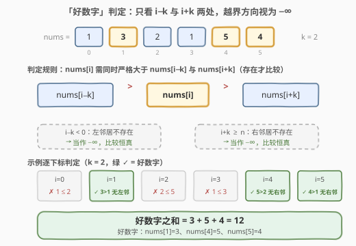
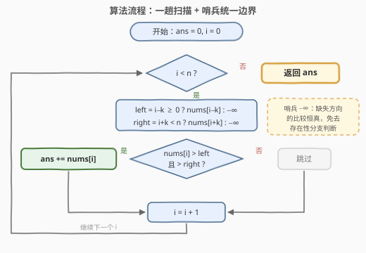

# LeetCode 好数字之和 题解

## 1. 题目概述

- **标题 / 题号**：好数字之和（#3452，easy）
- **链接**：https://leetcode.cn/problems/sum-of-good-numbers/
- **难度**：简单
- **标签**：数组、模拟

**题意**：给定一个整数数组 `nums` 和一个整数 $k$。如果元素 `nums[i]` **严格大于**下标 $i-k$ 和 $i+k$ 处的元素（如果这些元素存在），则 `nums[i]` 被认为是**好**的；如果这两个下标处的元素**都不存在**，`nums[i]` 仍然被认为是**好**的。

返回数组中所有**好**元素的**和**。

**示例 1**：

```text
输入：nums = [1,3,2,1,5,4], k = 2
输出：12
解释：好数字包括 nums[1] = 3、nums[4] = 5 和 nums[5] = 4，
      因为它们严格大于下标 i−k 和 i+k 处的数字。
```

**示例 2**：

```text
输入：nums = [2,1], k = 1
输出：2
解释：唯一的好数字是 nums[0] = 2，因为它严格大于 nums[1]。
```

**约束**：

- $2 \le nums.length \le 100$
- $1 \le nums[i] \le 1000$
- $1 \le k \le \lfloor nums.length / 2 \rfloor$

## 2. 解题思路

### 2.1 暴力思路：逐下标「搜」邻居

最直接的笨办法：枚举每个下标 $i$，再**重新扫描一遍数组**，找出哪些下标 $j$ 满足 $j = i-k$ 或 $j = i+k$，取出对应元素做比较：

```text
for i in 0 .. n-1:
    for j in 0 .. n-1:          # 全表搜 i−k / i+k 的位置
        if j == i-k: 左邻居 = nums[j]
        if j == i+k: 右邻居 = nums[j]
    若两个存在的方向都严格小于 nums[i]：
        ans += nums[i]
```

两层循环 $O(n^2)$；且「左是否存在 × 右是否存在」共有 4 种组合，`if` 分支层层嵌套，极易漏掉「都不存在仍为好」这类边界。**问题在于：邻居的位置根本不需要「搜」——它可以直接算出来。**

### 2.2 核心观察：邻居是「算」出来的，边界用哨兵统一



两个关键观察把暴力做法直接砍成一趟扫描：

| 观察 | 说明 |
|------|------|
| **邻居 $O(1)$ 可定位** | `nums[i]` 的两个比较对象就是 `nums[i−k]` 与 `nums[i+k]`，下标算术直达，无需内层循环 |
| **越界 = $-\infty$ 哨兵** | 「存在才比较」可统一成「永远比较两个值」：把越界方向当作 $-\infty$，而 $nums[i] \ge 1 > -\infty$ 恒成立，该方向比较**自动为真** |

于是判定收敛为一个不含任何存在性分支的统一条件：

$$nums[i] \text{ 是好数字} \iff nums[i] > \max(left,\ right), \quad \text{越界方向取 } -\infty$$

> 💡 哨兵法的本质：把「**不存在**」这种**结构性判断**，转写成「**比较恒真**」这种**数值判断**，4 种存在性组合坍缩成 1 条比较语句。只要哨兵严格小于所有可能元素（题给 $nums[i] \ge 1$，取 $-\infty$ 或 0 均可），转换就是无损的。

顺带一提：在题给约束 $1 \le k \le \lfloor n/2 \rfloor$ 下有 $2k \le n$，「两侧都越界」的下标其实**不可能出现**——若 $i-k<0$ 且 $i+k \ge n$ 同时成立，则 $n < 2k$，与约束矛盾。但哨兵写法天然覆盖这种情况，即使约束放开也不用改一行代码。

**时间复杂度**：$O(n)$（每个下标两次 $O(1)$ 比较）；**空间复杂度**：$O(1)$。

### 2.3 算法流程图



整个算法就是**一趟 `for` 循环**：先算出左/右邻居（越界取 $-\infty$），再做一次统一比较，好则累加，坏则跳过。

### 2.4 示例演算

以 `nums = [1,3,2,1,5,4]`，$k=2$ 为例（「越界」即该方向取 $-\infty$）：

| i | nums[i] | 左邻居 nums[i−2] | 右邻居 nums[i+2] | 判定 | 累加 |
|---|---------|------------------|------------------|------|------|
| 0 | 1 | 越界（$-\infty$） | nums[2] = 2 | $1 \le 2$，✗ | — |
| 1 | 3 | 越界（$-\infty$） | nums[3] = 1 | $3 > 1$，✓ | +3 |
| 2 | 2 | nums[0] = 1 | nums[4] = 5 | $2 \le 5$，✗ | — |
| 3 | 1 | nums[1] = 3 | nums[5] = 4 | $1 \le 3$，✗ | — |
| 4 | 5 | nums[2] = 2 | 越界（$-\infty$） | $5 > 2$，✓ | +5 |
| 5 | 4 | nums[3] = 1 | 越界（$-\infty$） | $4 > 1$，✓ | +4 |

好数字之和 $= 3 + 5 + 4 = 12$。

> ⚠️ 注意 $i=2$：它满足 $2 > nums[0]=1$（左方向过关），但被右方向 $2 \le nums[4]=5$ 否决——**两个方向必须全部严格大于**，缺一不可。

## 3. 参考代码

### C++

```cpp
class Solution {
  public:
    int sumOfGoodNumbers(vector<int>& nums, int k) {
        int n = nums.size();
        int ans = 0;
        for (int i = 0; i < n; i++) {
            int left = (i - k >= 0) ? nums[i - k] : INT_MIN;
            int right = (i + k < n) ? nums[i + k] : INT_MIN;
            if (nums[i] > left && nums[i] > right) {
                ans += nums[i];
            }
        }
        return ans;
    }
};
```

### Python

```python
class Solution:
    def sumOfGoodNumbers(self, nums: List[int], k: int) -> int:
        n = len(nums)
        ans = 0
        for i in range(n):
            left = nums[i - k] if i - k >= 0 else float("-inf")
            right = nums[i + k] if i + k < n else float("-inf")
            if nums[i] > left and nums[i] > right:
                ans += nums[i]
        return ans
```

> 💡 两版哨兵的取法：C++ 用 `INT_MIN`（题给 $nums[i] \ge 1$，不会与之相等或更小，比较安全；若值域放开到可能等于 `INT_MIN`，需改回显式分支）；Python 的 `float("-inf")` 与任意 `int` 比较恒为「更大」，无值域顾虑。判定也可写成更紧凑的 `nums[i] > max(left, right)`。

## 4. 复杂度分析

| 维度 | 复杂度 | 说明 |
|------|--------|------|
| 时间复杂度 | $O(n)$ | 一趟扫描，每个下标做两次 $O(1)$ 的邻居定位与比较 |
| 空间复杂度 | $O(1)$ | 仅 `ans`、`left`、`right` 等常数个变量，不随 $n$ 增长 |

## 5. 扩展：环形数组与判定变体

- **环形变体**：若把数组视为**环形**，下标取模 $i \pm k \to (i \pm k + n) \bmod n$，两个邻居**恒存在**，「都不存在仍为好」的规则自然消失，代码反而更短——哨兵三元表达式整体删掉即可。
- **统计变体**：求好数字的**个数**（`ans += 1`）、**最大**好数字（`ans = max(ans, nums[i])`）、或好数字的**下标集合**（收集 $i$）——骨架不变，只换累加动作。
- **窗口泛化**：若比较对象扩展为窗口 $[i-k, i+k]$ 内**所有**元素，可预处理滑动窗口最大值（单调队列），判定退化为 $nums[i] > \max(\text{窗口})$，整体仍是 $O(n)$。

## 6. 面试要点

1. **为什么越界方向可以直接当 $-\infty$ 处理？**

   > 「不存在则视为好」的语义等价于「不存在的比较恒真」。哨兵只要**严格小于一切可能元素**即可（题给 $nums[i] \ge 1$，取 $-\infty$、0、甚至 $-1$ 都行）。这把 4 种存在性分支坍缩成 1 条统一比较。

2. **在题给约束下会出现「两个邻居都不存在」的下标吗？**

   > 不会。$1 \le k \le \lfloor n/2 \rfloor \Rightarrow 2k \le n$；若 $i-k<0$ 且 $i+k \ge n$ 同时成立，需 $n \le i < k$，即 $n < 2k$，矛盾。但哨兵写法天然兼容该情形，约束放开也无需改代码。

3. **本题最容易踩的三个坑是什么？**

   > ①「严格大于」误写成 $\ge$；②误比较**相邻**元素 `nums[i±1]` 而非 `nums[i±k]`；③「好」的判定是**两方向全部满足**（AND），不是任一满足（OR）——示例 1 中 $i=2$ 左方向过关，仍被右方向否决。

4. **暴力 $O(n^2)$ 与优化解的差距本质在哪？**

   > 暴力把「邻居在哪」当成**搜索问题**（内层循环找 $j = i \pm k$）；优化认识到邻居位置由下标算术 $O(1)$ 直达，是**计算问题**。识别「搜索可被直接计算替代」是常见的优化切入点。

5. **这题有必要上前缀和、线段树等数据结构吗？**

   > 没有必要。判定是逐点独立的 $O(1)$ 比较，没有任何区间查询需求，一切预处理都是负优化。面试中主动说明「本题下限就是一趟扫描」是加分项。

## 同类练习题

| # | 题目 | 与本题的关联 |
|---|------|-------------|
| 3105 | [最长的严格递增或严格递减子数组](https://leetcode.cn/problems/longest-strictly-increasing-or-strictly-decreasing-subarray/) | 同为「与邻居严格比较」的一趟扫描，只是比较对象换成相邻的 $i-1$ |
| 896 | [单调数列](https://leetcode.cn/problems/monotonic-array/) | 相邻元素严格/非严格比较的判定骨架，与本题一样要区分「严格」与「非严格」 |
| 1470 | [重新排列数组](https://leetcode.cn/problems/shuffle-the-array/) | 同为下标算术定位目标位置（$i \leftrightarrow 2i$、$2i+1$ 映射），体会「位置是算出来的」 |
| 1480 | [一维数组的动态和](https://leetcode.cn/problems/running-sum-of-1d-array/) | 一趟扫描 + 累加器的入门模板，与本题骨架一致 |
