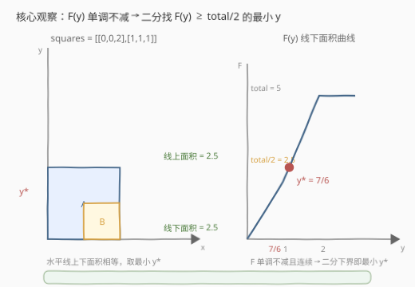
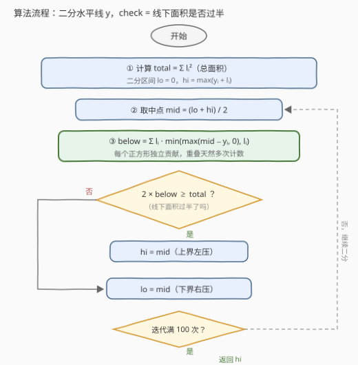

# LeetCode 分割正方形I 题解

## 1. 题目概述

- **标题 / 题号**：分割正方形I（#3453，medium）
- **链接**：https://leetcode.cn/problems/separate-squares-i/
- **难度**：中等
- **标签**：数组、二分查找

**题意**：给你一个二维整数数组 `squares`，其中 `squares[i] = [x_i, y_i, l_i]` 表示一个与 x 轴平行的正方形的**左下角坐标**和**边长**。

找到一个**最小的 y 坐标**，它对应一条水平线，该线满足：**线以上正方形的总面积等于线以下正方形的总面积**。

答案与实际答案误差在 $10^{-5}$ 以内视为正确。注意：正方形**可能重叠**，重叠区域被**多次计数**。

**示例 1**：

```text
输入：squares = [[0,0,1],[2,2,1]]
输出：1.00000
解释：任何在 y = 1 和 y = 2 之间的水平线都会有 1 平方单位的面积在其上方，
      1 平方单位的面积在其下方。最小的 y 坐标是 1。
```

**示例 2**：

```text
输入：squares = [[0,0,2],[1,1,1]]
输出：1.16667
解释：线下面积：7/6 × 2（红）+ 1/6（蓝）= 15/6 = 2.5；
      线上面积：5/6 × 2（红）+ 5/6（蓝）= 15/6 = 2.5。输出 7/6 = 1.16667。
```

**约束**：

- $1 \le \text{squares.length} \le 5 \times 10^4$
- $\text{squares[i].length} = 3$
- $0 \le x_i, y_i \le 10^9$
- $1 \le l_i \le 10^9$
- 所有正方形的总面积不超过 $10^{12}$

> 💡 **读题关键**：① 答案是**实数**且允许 $10^{-5}$ 误差——这是「数值逼近」类题目（典型为二分答案）的标志性信号；② 「最小 y 坐标」暗示满足条件的 y 可能是一段**区间**（示例 1 中 $[1,2]$ 内任意 y 都行），要取区间左端；③ 重叠多次计数反而**简化**了问题——每个正方形独立计算面积再求和即可，无需处理并集。

## 2. 解题思路

### 2.1 暴力思路：枚举 y 逐一验证

最直接的想法：在 $[0, \max(y_i + l_i)]$ 上以 $10^{-5}$ 的步长枚举每个候选 $y$，逐个计算线上/线下面积并比较。

候选 y 约 $2 \times 10^9 / 10^{-5} = 2 \times 10^{14}$ 个，每个验证还需 $O(n)$ 遍历所有正方形——总计 $10^{19}$ 量级的运算，完全不可行。瓶颈在于：**候选 y 的取值是连续且巨大的实数区间**，逐个验证注定爆炸。

突破口是**单调性**：线越往上，线下面积越大。只要「验证条件」关于 y 单调，就能把线性扫描换成二分。

### 2.2 核心观察：二分答案

定义 $F(y)$ 为水平线 $y$ **以下**的总面积（正方形被线切开的部分计入线下）：

$$F(y) \;=\; \sum_{i} l_i \cdot \min\big(\max(y - y_i,\ 0),\ l_i\big)$$

即每个正方形贡献一块「宽度 $l_i$、高度 $\mathrm{clamp}(y - y_i,\ 0,\ l_i)$」的矩形面积。由于每个正方形独立求和，**重叠区域天然被多次计数**，与题意一致，完全不用管 x 方向的重叠。

$F(y)$ 有三个关键性质：

1. **单调不减**：$y$ 越大线下面积越大，$F$ 从 $0$ 一路涨到总面积 $\text{total} = \sum_i l_i^2$；
2. **连续**：$F$ 是**分段线性**的连续函数（拐点只在各正方形的底边/顶边处），不存在跳变；
3. **目标等价转化**：所求即「最小的 $y$ 使 $F(y) \ge \text{total}/2$」。由连续性，这个下界处恰好 $F(y) = \text{total}/2$；若解是一段区间（$F$ 存在平台，如示例 1），**下界二分自动收敛到平台最左端**，天然满足「最小 y 坐标」。

于是套用经典**二分答案**模板，判定条件为 $\text{check}(y) \equiv 2 F(y) \ge \text{total}$（乘 2 比较避免除法舍入）。

**精度与迭代次数**：坐标上界 $C \le 2 \times 10^9$（$y_i + l_i \le 2 \times 10^9$），要求误差 $10^{-5}$。二分每轮区间减半，需要 $\lceil \log_2(C / 10^{-6}) \rceil \approx \lceil \log_2(2 \times 10^{15}) \rceil \approx 51$ 轮即可把区间压到 $10^{-6}$ 以下。写死 **100 次迭代**更保险，代价可忽略。



### 2.3 算法流程



### 2.4 示例演算

以示例 2 `squares = [[0,0,2],[1,1,1]]` 为例，$\text{total} = 2^2 + 1^2 = 5$，目标 $\text{total}/2 = 2.5$。

先手工展开 $F(y)$ 的分段表达式：

| $y$ 所在区间 | 被切开的正方形 | $F(y)$ | 斜率 |
|---|---|---|---|
| $[0, 1]$ | 仅 A（宽 2） | $2y$ | 2 |
| $[1, 2]$ | A（宽 2）+ B（宽 1） | $2 + 3(y-1)$ | 3 |
| $\ge 2$ | 无（都在线下） | $5$ | 0 |

$F(y) = 2.5$ 落在第二段：$2 + 3(y - 1) = 2.5 \Rightarrow y = 7/6 \approx 1.16667$，与期望输出一致。

二分的收缩过程（`lo = 0, hi = 2`）：

| 迭代 | lo | hi | mid | $F(\text{mid})$ | $2F \ge 5$ ? | 动作 |
|---|---|---|---|---|---|---|
| 1 | 0 | 2 | 1.0 | 2.0 | 否（4 < 5） | lo = 1.0 |
| 2 | 1.0 | 2.0 | 1.5 | 3.5 | 是（7 ≥ 5） | hi = 1.5 |
| 3 | 1.0 | 1.5 | 1.25 | 2.75 | 是（5.5 ≥ 5） | hi = 1.25 |
| 4 | 1.0 | 1.25 | 1.125 | 2.375 | 否 | lo = 1.125 |
| … | | | | | | 收敛至 $7/6$ |

## 3. 参考代码

### C++

```cpp
class Solution {
public:
    double separateSquares(vector<vector<int>>& squares) {
        long long total = 0;
        double lo = 0.0, hi = 0.0;
        for (const auto& s : squares) {
            total += 1LL * s[2] * s[2];
            hi = max(hi, (double)s[1] + s[2]);
        }

        // F(y): 水平线 y 以下的面积（重叠多次计数）
        auto below = [&](double y) {
            double area = 0;
            for (const auto& s : squares) {
                double h = min(max(y - s[1], 0.0), (double)s[2]);
                area += h * s[2];
            }
            return area;
        };

        // 下界二分：找最小的 y 使 2*F(y) >= total
        for (int i = 0; i < 100; i++) {
            double mid = (lo + hi) / 2;
            if (2 * below(mid) >= total) hi = mid;
            else lo = mid;
        }
        return hi;
    }
};
```

### Python

```python
class Solution:
    def separateSquares(self, squares: List[List[int]]) -> float:
        total = sum(l * l for _, _, l in squares)
        lo, hi = 0.0, max(y + l for _, y, l in squares)

        def below(y: float) -> float:
            return sum(min(max(y - y0, 0.0), l) * l for _, y0, l in squares)

        for _ in range(100):
            mid = (lo + hi) / 2
            if 2 * below(mid) >= total:
                hi = mid
            else:
                lo = mid
        return hi
```

> 💡 **实现细节**：返回 `hi` 而非 `lo`——二分全程维持不变量「`hi` 满足 check、`lo` 不满足」，因此 `hi` 始终是可行解一侧，100 轮后 `hi - lo < 10^{-6}`，返回 `hi` 即最小可行 y 的近似。

## 4. 复杂度分析

| 维度 | 复杂度 | 说明 |
|---|---|---|
| 时间 | $O\!\left(n \log \frac{C}{\varepsilon}\right)$ | 每轮二分 $O(n)$ 计算 $F(\text{mid})$；$n = 5\times10^4$、$C = 2\times10^9$、$\varepsilon = 10^{-6}$，约 51–100 轮，总量 $\sim 5\times10^6$ |
| 空间 | $O(1)$ | 仅常数个变量（不计输入数组） |

## 5. 扩展：事件点扫描 + 线性插值（精确解）

二分是数值逼近，其实本题存在**无浮点误差**的精确解。$F(y)$ 是分段线性函数，拐点只出现在各正方形的**底边** $y_i$ 与**顶边** $y_i + l_i$ 处，共 $2n$ 个事件点：

1. 将 $2n$ 个事件坐标排序，得到相邻小区间；
2. 从下往上扫描，维护当前「被切开的正方形总宽度」$w = \sum_{\text{被切开}} l_i$（即该段内 $F$ 的斜率）与段起点面积 $F_0$；
3. 段内 $F(y) = F_0 + w \cdot (y - y_{\text{start}})$，若 $\text{total}/2 \in [F_0, F_{\text{end}}]$，直接解出 $y = y_{\text{start}} + (\text{total}/2 - F_0) / w$，即精确的有理数答案。

复杂度 $O(n \log n)$，且不存在误差累积问题，是理论最优解。

进阶题 [3454. 分割正方形 II](https://leetcode.cn/problems/separate-squares-ii/) 把「重叠多次计数」改为「重合计一次」，需要离散化 x 坐标 + 扫描线维护并集宽度，难度升至困难，可作为后续练习。

## 6. 面试要点

**Q1：为什么二分出来的一定是「最小」的满足条件的 y？**

> 因为判定用的是下界二分：全程保持「`hi` 满足 $F(y) \ge \text{total}/2$、`lo` 不满足」，收敛目标是满足条件的 y 集合的**左端点**。再由 $F$ 的连续性，该处恰好 $F(y) = \text{total}/2$；若满足条件的是一段区间（$F$ 有平台，如示例 1），收敛到的就是平台最左端，即题目要求的最小 y 坐标。

**Q2：坐标到 $10^9$、总面积到 $10^{12}$，浮点数精度够吗？**

> `double` 有 53 位尾数，可精确表示到 $9 \times 10^{15}$ 的整数。本题中间量：坐标 $\le 2 \times 10^9$、总面积 $\le 10^{12}$、`mid` 与 $y_i$ 的差 $\le 2 \times 10^9$，全部在安全范围内，乘加的相对误差远小于 $10^{-5}$ 的容限。另注意用 `long long` 累加 `total`（C++），比较时写 $2 F \ge \text{total}$ 避免 $\text{total}/2$ 的舍入。

**Q3：二分迭代次数怎么定？能不能用 `while (hi - lo > eps)`？**

> 需要区间宽度 $< 10^{-5}$（取 $10^{-6}$ 留余量），初始宽度 $\le 2 \times 10^9$，故 $\lceil \log_2(2\times10^9 / 10^{-6}) \rceil \approx 51$ 轮足够，写死 100 次最稳妥。固定次数的写法在浮点区间上**必然终止**；`while (hi - lo > eps)` 在极端值域下也可用，但要小心 eps 取得比答案容限小、否则可能提前退出。

**Q4：为什么完全不用考虑 x 方向的重叠？**

> 题目明确「重叠区域多次计数」，所以每个正方形的线下贡献就是一块独立的矩形面积 $l_i \cdot \mathrm{clamp}(y - y_i, 0, l_i)$，求和即是总面积——x 坐标根本不进入计算。若改成「重合计一次」（3454），就必须离散化 x + 扫描线维护并集宽度了。

**Q5：如果面试官要求精确解（不依赖浮点）？**

> 用第 5 节的事件点扫描 + 线性插值：$F$ 分段线性、拐点只有 $2n$ 个，排序后一趟扫描定位 $\text{total}/2$ 所在段，解一次线性方程得精确有理数答案，$O(n \log n)$ 无误差。

## 同类练习题

| # | 题目 | 与本题的关联 |
|---|------|-------------|
| 875 | [爱吃香蕉的珂珂](https://leetcode.cn/problems/koko-eating-bananas/) | 二分吃香蕉速度，check 关于速度单调，同一套「二分答案」入门模板。 |
| 1011 | [在 D 天内送达包裹的能力](https://leetcode.cn/problems/capacity-to-ship-packages-within-d-days/) | 二分运载能力，求「最小的满足 check 的值」，与本题的下界二分完全同构。 |
| 410 | [分割数组的最大值](https://leetcode.cn/problems/split-array-largest-sum/) | 二分「最大段和」，练习把最优化问题转成单调判定问题。 |
| 1802 | [有界数组中指定下标处的最大值](https://leetcode.cn/problems/maximum-value-at-a-given-index-in-a-bounded-array/) | 数值域上的单调 check + 边界收缩，巩固二分答案的边界处理。 |
| 3454 | [分割正方形 II](https://leetcode.cn/problems/separate-squares-ii/) | 本题进阶版（困难），重叠只计一次，练离散化 + 扫描线。 |
