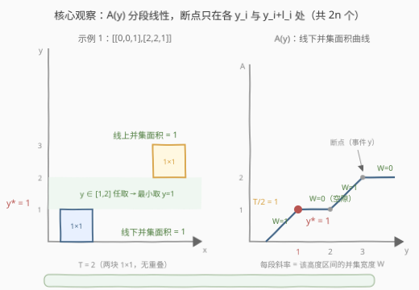
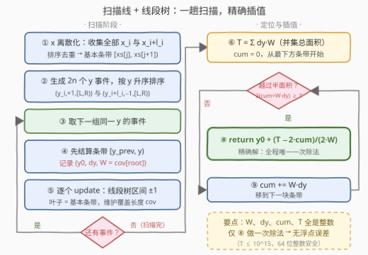

# LeetCode 分割正方形II 题解

## 1. 题目概述

- **标题 / 题号**：分割正方形II（#3454，hard）
- **链接**：https://leetcode.cn/problems/separate-squares-ii/
- **难度**：困难
- **标签**：线段树、数组、二分查找、扫描线

**题意**：给你一个二维整数数组 `squares`，其中 `squares[i] = [x_i, y_i, l_i]` 表示一个与 x 轴平行的正方形的**左下角坐标**和正方形的边长。

找到一个**最小的 y 坐标**，它对应一条水平线，该线需要满足它以上正方形的总面积**等于**该线以下正方形的总面积。

答案如果与实际答案的误差在 $10^{-5}$ 以内，将视为正确答案。

注意：正方形**可能重叠**，重叠区域只**统计一次**。

**示例 1**：

```text
输入：squares = [[0,0,1],[2,2,1]]
输出：1.00000
解释：任何在 y = 1 和 y = 2 之间的水平线都会有 1 平方单位的面积在其上方，
      1 平方单位的面积在其下方。最小的 y 坐标是 1。
```

**示例 2**：

```text
输入：squares = [[0,0,2],[1,1,1]]
输出：1.00000
解释：由于蓝色正方形和红色正方形有重叠区域且重叠区域只统计一次。
      所以直线 y = 1 将正方形分割成两部分且面积相等。
```

**约束**：

- $1 \le \text{squares.length} \le 5 \times 10^4$
- $\text{squares[i].length} = 3$
- $0 \le x_i, y_i \le 10^9$
- $1 \le l_i \le 10^9$
- 所有正方形的总面积不超过 $10^{15}$

> 💡 **读题关键**：① 与 [3453. 分割正方形 I](https://leetcode.cn/problems/separate-squares-i/) 只差半句话——重叠从「多次计数」变成「只统计一次」，难度却从中等跳到困难：线下面积从「逐正方形独立求和」变成了「**矩形并的面积**」，x 方向的重叠再也不能无视；② 答案是实数且允许 $10^{-5}$ 误差，但本题存在**整数精确解**（见 2.2），完全不必浮点二分；③ 「最小 y 坐标」暗示解可能是一段区间（垂直空隙），要取左端点；④ 总面积上界从 I 的 $10^{12}$ 提到 $10^{15}$——这是给 `long long` 留的余量，也是精度论证的依据（见 Q3/Q5）。

## 2. 解题思路

### 2.1 暴力思路：照搬 I 的二分答案，check 却变贵了

I 的解法是二分答案：$F(y) = \sum_i l_i \cdot \mathrm{clamp}(y - y_i,\ 0,\ l_i)$，每次 check 只需 $O(n)$。到了 II，重叠只计一次，$F(y)$ 变成「**并集**位于水平线以下的面积」——每个正方形不再独立，check 必须真正计算**矩形并的面积**。

朴素的矩形并面积算法：把相关 x 坐标全部离散化，对每个小矩形打二维差分标记再求前缀和，单次 $O(n^2)$；实数二分约需 50 轮，总量 $O(50\,n^2) \approx 1.25 \times 10^{11}$，必然超时。即便把单次 check 优化成 $O(n\log n)$ 的扫描线（每轮都完整扫一遍），也是 $O\!\left(n\log n \cdot \log\frac{C}{\varepsilon}\right)$——相当于把同一个扫描过程重复跑了约 50 遍，还要提防浮点二分的舍入误差。

> 💡 瓶颈的本质：**二分把「同一个扫描过程」重复执行了 $\log\frac{C}{\varepsilon}$ 遍**。而答案函数的形态——分段线性——其实允许我们一趟扫描直接解出来。

### 2.2 核心观察：A(y) 分段线性，扫描线一趟精确求解

3453 的扩展一节已经预告了这条路，这里把它做完。

**观察一：A(y) 仍是分段线性连续函数，断点只有 2n 个。** 定义 $A(y)$ 为并集位于水平线 $y$ 下方的面积，高度 $t$ 处并集的水平宽度记为 $W(t)$（该高度上所有活跃正方形 x 区间**并**的长度），则

$$A(y) \;=\; \int_{-\infty}^{y} W(t)\,\mathrm{d}t$$

$W(t)$ 是**阶梯函数**：只会在某个正方形的底边 $y_i$（宽度可能增大）或顶边 $y_i + l_i$（宽度可能减小）处跳变，其余高度恒定。因此 $A(y)$ 单调不减、连续、分段线性，断点集合 $\subseteq \{y_i,\ y_i + l_i\}$，至多 $2n$ 个。

**观察二：断点处的 A 值可以一趟扫描全部拿到。** 把 $2n$ 个 y 事件按坐标排序，从下往上扫描；相邻两个事件之间活跃正方形集合不变 → $W$ 恒定 → 该条带贡献面积 $W \cdot dy$。边扫边累加，每个断点处的累计面积全部到手——这正是经典的**矩形并面积扫描线**，只需把「最后求总和」改成「记录沿途每一段的 $(y_0,\ dy,\ W)$」。

**观察三：定位 + 插值，一步到位且全程整数。** 设 $T$ 为并集总面积。从最下方条带起扫描，`cum` 为当前条带底部的累计面积，找到第一个满足 $2(\text{cum} + W \cdot dy) \ge T$ 的条带；由不变量 $2 \cdot \text{cum} < T$ 知该条带 $W > 0$，答案为

$$y^* \;=\; y_0 + \frac{T - 2\cdot\text{cum}}{2W}$$

坐标全是整数，因此 $W$（整数区间并的长度）、$dy$、`cum`、$T$ **全是整数**——插值前的所有运算零舍入误差，最后只做一次除法，`double` 完全罩得住（$T \le 10^{15} < 2^{53}$）。

**维护 W 的数据结构**：x 坐标离散化成至多 $2n$ 个基本条带，线段树每个节点存 `cnt`（该管辖区间被完整覆盖的层数）与 `cov`（该管辖区内被覆盖的 x 长度）；正方形底边事件做区间 `+1`、顶边事件做区间 `−1`，根节点 `cov` 即当前 $W$。这是「矩形并面积/周长」的教科书结构，与 [850. 矩形面积 II](https://leetcode.cn/problems/rectangle-area-ii/) 同款。



### 2.3 算法流程



1. **x 离散化**：收集所有 $x_i$ 与 $x_i + l_i$，排序去重得 `xs`；基本条带 $j$ 即 $[\text{xs}[j],\ \text{xs}[j{+}1])$；
2. **生成 y 事件**：每个正方形产生 $(y_i,\ +1,\ [L, R))$ 与 $(y_i + l_i,\ -1,\ [L, R))$（$L, R$ 为 x 条带下标），按 $y$ 升序排序；
3. **分组扫描**：同一 $y$ 的事件为一组。**先结算**条带 $[y_{\text{prev}},\ y)$——记录 $(y_{\text{prev}},\ y - y_{\text{prev}},\ W = \text{cov}[\text{root}])$；**再**逐个更新线段树。顺序不能反：条带的宽度只由 $y$ **之前**的事件决定；
4. **累计与插值**：$T = \sum W \cdot dy$；从最下方条带起找第一个 $2(\text{cum} + W\cdot dy) \ge T$ 的条带，解一次线性方程得 $y^*$。

> ⚠️ **「最小 y」的处理**：若半面积恰好落在条带边界，或落在垂直空隙里（$W = 0$ 的条带，如示例 1 的 $[1,2]$ 平台），插值公式返回的都是**下方那块非空条带的右端点**——即空隙的下沿，天然是最小解。判定的 $\ge$ 号与不变量 $2 \cdot \text{cum} < T$ 共同保证了这一点（详见 Q4）。

### 2.4 示例演算

以示例 2 `squares = [[0,0,2],[1,1,1]]` 为例（正方形 A：$[0,2]\times[0,2]$，B：$[1,2]\times[1,2]$，重叠面积为 1）：

**x 离散化**：`xs = [0,1,2,3]`，基本条带 `[0,1)`、`[1,2)`、`[2,3)`。

**y 事件与扫描**：

| 事件组 | 线段树操作 | 结算出的条带 | 该条带 W | 结算后累计面积 |
|---|---|---|---|---|
| y=0：加入 A=[0,2) | 区间 +1 | —（首个事件，下方无面积） | — | 0 |
| y=1：加入 B=[1,2) | 区间 +1 | [0,1) | 2（仅 A 覆盖 [0,2)） | 2 |
| y=2：移除 A、移除 B | 区间 −1 ×2 | [1,2) | 2（A∪B = [0,2)，重叠只计一次） | 4 = T |

并集总面积 $T = 2 + 2 = 4$（若按 I 的「多次计数」口径则是 $4 + 1 = 5$）。

**插值**：条带 $[0,1)$ 上，$2 \times (0 + 2 \times 1) = 4 \ge T = 4$ → 在本条带内越过一半，$y^* = 0 + \dfrac{4 - 0}{2 \times 2} = 1.0$ ✓。

对比 I 同输入的答案 $7/6 \approx 1.16667$：重叠只计一次使总面积从 5 缩到 4，分割线随之下移——两题的全部差距就在这个「并」字上。

## 3. 参考代码

### C++

```cpp
class Solution {
    int m;
    vector<int> cnt;         // 该节点管辖区间的「整段覆盖」层数（不下传）
    vector<long long> cov;   // 该节点管辖区间内被覆盖的 x 总长度
    vector<long long> xs;    // 离散化后的 x 坐标

    void update(int node, int nl, int nr, int l, int r, int v) {
        if (r <= nl || nr <= l) return;
        if (l <= nl && nr <= r) {
            cnt[node] += v;                       // 整段被正方形盖住 / 移出
        } else {
            int mid = (nl + nr) >> 1;
            update(node << 1, nl, mid, l, r, v);
            update(node << 1 | 1, mid, nr, l, r, v);
        }
        if (cnt[node] > 0)      cov[node] = xs[nr] - xs[nl];
        else if (nr - nl == 1)  cov[node] = 0;
        else                    cov[node] = cov[node << 1] + cov[node << 1 | 1];
    }

public:
    double separateSquares(vector<vector<int>>& squares) {
        int n = squares.size();
        for (auto& s : squares) {
            xs.push_back(s[0]);
            xs.push_back((long long)s[0] + s[2]);
        }
        sort(xs.begin(), xs.end());
        xs.erase(unique(xs.begin(), xs.end()), xs.end());
        m = (int)xs.size() - 1;                    // 基本条带数
        cnt.assign(4 * m, 0);
        cov.assign(4 * m, 0);

        struct Ev { long long y; int l, r, v; };
        vector<Ev> evs;
        evs.reserve(2 * n);
        for (auto& s : squares) {
            int l = lower_bound(xs.begin(), xs.end(), s[0]) - xs.begin();
            int r = lower_bound(xs.begin(), xs.end(), (long long)s[0] + s[2]) - xs.begin();
            evs.push_back({(long long)s[1], l, r, +1});          // 底边：加入
            evs.push_back({(long long)s[1] + s[2], l, r, -1});   // 顶边：移除
        }
        sort(evs.begin(), evs.end(), [](const Ev& a, const Ev& b) { return a.y < b.y; });

        // 自下而上扫描，记录每个 y 条带 (y0, dy, W)
        vector<array<long long, 3>> slabs;
        int i = 0;
        long long prevY = evs[0].y;
        while (i < (int)evs.size()) {
            long long y = evs[i].y;
            if (y > prevY) slabs.push_back({prevY, y - prevY, cov[1]});  // 先结算
            while (i < (int)evs.size() && evs[i].y == y) {               // 后更新
                update(1, 0, m, evs[i].l, evs[i].r, evs[i].v);
                ++i;
            }
            prevY = y;
        }

        long long T = 0;
        for (auto& s : slabs) T += s[1] * s[2];    // 并集总面积（整数，精确）
        long long cum = 0;                          // 当前条带底部的累计面积
        for (auto& [y0, dy, W] : slabs) {
            if (2 * cum >= T) return (double)y0;                 // 半面积恰在条带边界
            if (2 * (cum + W * dy) >= T)                         // 本条带内越过一半
                return y0 + (double)(T - 2 * cum) / (2.0 * W);   // W > 0 由不变量保证
            cum += W * dy;
        }
        return (double)prevY;                       // 兜底（理论不可达）
    }
};
```

### Python

```python
class Solution:
    def separateSquares(self, squares: List[List[int]]) -> float:
        # ---- x 离散化：条带 j = [xs[j], xs[j+1]) ----
        xs = set()
        for x, _, l in squares:
            xs.add(x)
            xs.add(x + l)
        xs = sorted(xs)
        pos = {v: i for i, v in enumerate(xs)}
        m = len(xs) - 1                     # 基本条带数

        cnt = [0] * (4 * m)                 # 整段覆盖层数
        cov = [0] * (4 * m)                 # 管辖范围内覆盖长度

        def update(node, nl, nr, l, r, v):
            if r <= nl or nr <= l:
                return
            if l <= nl and nr <= r:
                cnt[node] += v
            else:
                mid = (nl + nr) >> 1
                update(node << 1, nl, mid, l, r, v)
                update(node << 1 | 1, mid, nr, l, r, v)
            if cnt[node] > 0:
                cov[node] = xs[nr] - xs[nl]
            elif nr - nl == 1:
                cov[node] = 0
            else:
                cov[node] = cov[node << 1] + cov[node << 1 | 1]

        # ---- y 事件：底边 +1、顶边 -1，按 y 升序 ----
        evs = []
        for x, y, l in squares:
            L, R = pos[x], pos[x + l]
            evs.append((y, L, R, 1))
            evs.append((y + l, L, R, -1))
        evs.sort(key=lambda e: e[0])

        # ---- 自下而上扫描：先结算条带、后更新线段树 ----
        slabs = []                          # (y0, dy, W)
        i, K = 0, len(evs)
        prev_y = evs[0][0]
        while i < K:
            y = evs[i][0]
            if y > prev_y:
                slabs.append((prev_y, y - prev_y, cov[1]))
            while i < K and evs[i][0] == y:
                _, L, R, v = evs[i]
                update(1, 0, m, L, R, v)
                i += 1
            prev_y = y

        total = sum(dy * W for _, dy, W in slabs)   # 并集总面积（整数精确）
        cum = 0
        for y0, dy, W in slabs:
            if 2 * cum >= total:
                return float(y0)
            if 2 * (cum + W * dy) >= total:
                return y0 + (total - 2 * cum) / (2 * W)
            cum += W * dy
        return float(prev_y)
```

> 💡 **实现细节**：① 「先结算、后更新」：条带 $[y_{\text{prev}}, y)$ 的宽度只取决于 $y$ 之前的事件，必须在处理 $y$ 组之前读根节点 `cov`；同一组内加/删的先后次序则无关紧要；② 线段树**不需要懒标记下传**：`cnt` 表示整段覆盖层数，任何 `update` 都会自底向上重算路径上的 `cov`，而查询永远只发生在根节点（见 Q2）；③ 判定用 $2 \cdot \text{cum} \ge T$ 的整数比较，避免 $\text{cum} \ge T/2$ 的除法舍入；④ C++ 用 `long long`：单条带面积 $W \cdot dy$ 不超过总面积 $10^{15}$，$2(\text{cum} + W\cdot dy) \le 2 \times 10^{15}$，远小于 int64 上限；Python 大整数天然精确；⑤ 返回值 $(T - 2\cdot\text{cum})/(2W)$：分子 $\le 10^{15}$、分母 $\le 4\times10^9$，都在 $2^{53}$ 内，转 double 无损，一次除法的误差远小于 $10^{-5}$。

## 4. 复杂度分析

| 维度 | 复杂度 | 说明 |
|---|---|---|
| 时间复杂度 | $O(n \log n)$ | 排序 $2n$ 个事件 $O(n\log n)$；每个事件一次线段树区间更新 $O(\log m)$（$m \le 2n$）；插值阶段线性扫条带 $O(n)$ |
| 空间复杂度 | $O(n)$ | 离散化坐标、线段树（$4m$ 个节点）、事件与条带列表 |
| 对照：二分 + 扫描线 | $O\!\left(n\log n\log\frac{C}{\varepsilon}\right)$ | 同一条扫描线要跑约 50 遍，还有浮点舍入风险；本解一趟完成且整数精确 |

实测（本机，$n = 5\times10^4$ 随机坐标取满 $[0, 10^9]$）：C++ 约 0.07 秒；Python 约 2.4 秒——瓶颈在递归线段树的 $10^5$ 次区间更新（约 $7\times10^6$ 次函数调用），量级与 $O(n\log n)$ 的估计吻合。

## 5. 扩展：I 与 II 的对比，以及「二分还能用吗」

| | 3453 分割正方形 I | 3454 分割正方形 II |
|---|---|---|
| 重叠 | 多次计数 | 只计一次 |
| 线下面积 | $\sum_i l_i\cdot\mathrm{clamp}(y-y_i,\,0,\,l_i)$，逐块独立 | 并集面积，需扫描线 + 线段树 |
| A(y) 的斜率 | 被切开正方形的宽度之和 | 并集宽度 $W$ |
| 推荐解法 | 实数二分 $O(n\log\frac{C}{\varepsilon})$ | 事件扫描 $O(n\log n)$ 精确解 |

二分在 II 里依然**能用**：check(y) 用本文的扫描线算出 $A(y)$（把事件裁剪到 $y$ 以下），复杂度 $O\!\left(n\log n\log\frac{C}{\varepsilon}\right)$，多数语言可过。但既然 $A(y)$ 的全部断点一趟扫描就能拿到，二分纯属把同一过程重复 50 遍。这背后的通用心法是：**先看函数形态，再选数值方法**——单调 + 分段线性 + 断点有限 $\Rightarrow$ 事件扫描精确解；只有当断点求不动（比如 check 是黑盒）时，才退回二分。

## 6. 面试要点

**Q1：为什么 A(y) 的断点只有 2n 个？一趟扫描为什么能全部拿到？**

> $A(y) = \int_{-\infty}^y W(t)\,\mathrm{d}t$，而 $W(t)$ 是阶梯函数，只会在正方形底边 $y_i$（覆盖增加）或顶边 $y_i + l_i$（覆盖减少）处跳变，故断点集合 $\subseteq \{y_i, y_i + l_i\}$，至多 $2n$ 个。把 $2n$ 个事件排序后从下往上扫，相邻事件之间活跃集合不变、$W$ 恒定，逐条带累计面积——每个断点处的 $A$ 值一趟全拿到。二分每次只探测一个 $y$，等于把这趟扫描的信息只用了 $\log$ 分之一。

**Q2：线段树如何维护「区间并的长度」？为什么不需要懒标记下传？**

> 每个节点存 `cnt`（管辖区间被**整段**覆盖的层数）与 `cov`（管辖区内被覆盖的 x 长度）。更新规则：`cnt > 0` 时 `cov` 取整个管辖区间长度；否则叶子取 0、内部节点取两子 `cov` 之和。查询永远只读根节点，而每次 `update` 都会自底向上重算沿途 `cov`，根节点始终最新——`cnt` 只增不减地挂在节点上即可，无需 pushdown。这是矩形并面积/周长问题（850、391）一脉相承的经典结构。

**Q3：精度如何保证到 $10^{-5}$？**

> 坐标与边长全是整数，因此 $W$（整数区间并的长度）、$dy$、`cum`、$T$ 全是整数，插值前**零舍入**。最后一步 $(T - 2\cdot\text{cum})/(2W)$：分子 $\le 10^{15}$、分母 $\le 4\times10^9$，均小于 $2^{53} \approx 9\times10^{15}$，转 double 无损，除法本身相对误差约 $10^{-16}$，加回 $y_0 \le 2\times10^9$ 后绝对误差在 $10^{-6}$ 量级。相比之下，实数二分要在 $2\times10^9$ 的值域上压到 $10^{-5}$，每轮 check 还要做浮点面积累加，误差预算紧得多。

**Q4：「最小 y」怎么保证？空隙/平台情形怎么处理？**

> $A$ 单调连续，故 $\{y : A(y) \ge T/2\}$ 是闭区间 $[y^*, +\infty)$，$y^*$ 即最小解。扫描时维持不变量「进入每块条带时 $2\cdot\text{cum} < T$」，于是越过半面积的第一块条带必有 $W > 0$、内部 $A$ 严格递增，解唯一且被插值公式精确命中；若半面积恰落在条带边界或 $W = 0$ 的空隙里，上一块非空条带的公式恰好返回其**右端点**（= 空隙下沿）——示例 1 中 $y \in [1,2]$ 都能平分，返回的正是 1。

**Q5：C++ 溢出风险在哪里？**

> 最危险的是 $W \cdot dy$：理论上 $W \le 2\times10^9$、$dy \le 2\times10^9$，乘积可达 $4\times10^{18}$，贴近 int64 上限——但「总面积 $\le 10^{15}$」保证**任何一块条带的面积都不超过 $10^{15}$**，实际安全。其余量：$2(\text{cum} + W\cdot dy) \le 2\times10^{15}$、事件坐标 $\le 2\times10^9$，`long long` 全程够用。若没有总面积约束，应改用 `__int128` 累加。另注意 `s[0] + s[2]` 要先转 `long long` 再相加。

## 同类练习题

| # | 题目 | 与本题的关联 |
|---|------|-------------|
| 3453 | [分割正方形 I](https://leetcode.cn/problems/separate-squares-i/)（[站内题解](../3401-3500/3453_分割正方形I.md)） | 本题前作——重叠多次计数，二分答案即可，正好体会「一句话约束改动带来的难度跃迁」 |
| 850 | [矩形面积II](https://leetcode.cn/problems/rectangle-area-ii/)（[站内题解](../0801-0900/850_矩形面积II.md)） | 矩形并面积——本文扫描线 + 线段树的直系原型，只求总面积、不求分割线 |
| 218 | [天际线问题](https://leetcode.cn/problems/the-skyline-problem/)（[站内题解](../0201-0300/218_天际线问题.md)） | 同一套「事件排序 + 数据结构维护活跃区间」的扫描线骨架，输出轮廓而非面积 |
| 699 | [掉落的方块](https://leetcode.cn/problems/falling-squares/)（[站内题解](../0601-0700/699_掉落的方块.md)） | 动态维护区间最高高度，练「坐标离散化 + 区间覆盖类线段树」的另一种聚合 |
| 715 | [Range模块](https://leetcode.cn/problems/range-module/)（[站内题解](../0701-0800/715_Range模块.md)） | 把「区间并的长度」换成「区间并的布尔跟踪」，同一离散化思路的在线化变体 |
