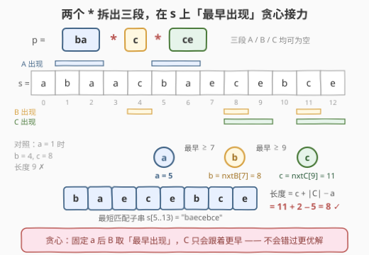
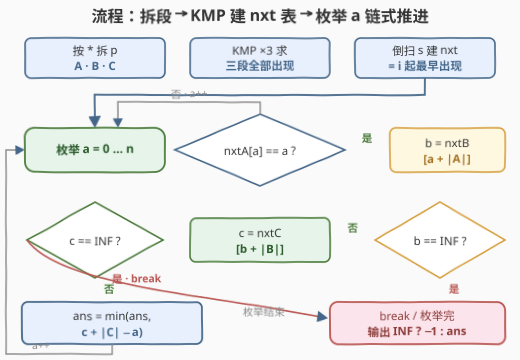

# 最短匹配子字符串

- **题目名称**：最短匹配子字符串
- **链接**：[3455. 最短匹配子字符串](https://leetcode.cn/problems/shortest-matching-substring/)
- **难度**：困难
- **标签**：字符串、字符串匹配、双指针、二分查找

## 1. 题目概述

给你一个字符串 `s` 和一个模式字符串 `p`，其中 `p` **恰好包含两个** `'*'` 字符。`'*'` 匹配**零个或多个**字符的任意序列。返回 `s` 中与 `p` 匹配的**最短**子字符串的长度；不存在这样的子字符串时返回 `-1`。空子字符串也被视为合法的匹配对象。

**示例 1**：

```text
输入：s = "abaacbaecebce", p = "ba*c*ce"
输出：8
解释：p 在 s 中的最短匹配子字符串是 "baecebce"。
```

**示例 2**：

```text
输入：s = "baccbaadbc", p = "cc*baa*adb"
输出：-1
解释：s 中没有匹配 p 的子字符串。
```

**示例 3**：

```text
输入：s = "a", p = "**"
输出：0
解释：空子字符串是最短的匹配子字符串。
```

**示例 4**：

```text
输入：s = "madlogic", p = "*adlogi*"
输出：6
解释：p 在 s 中的最短匹配子字符串是 "adlogi"。
```

**约束条件**：

- $1 \le \text{s.length} \le 10^5$
- $2 \le \text{p.length} \le 10^5$
- `s` 仅包含小写英文字母
- `p` 仅包含小写英文字母，并且恰好包含两个 `'*'`

> 💡 **读题关键**：① 「恰好两个 `*`」是极强的结构性条件——`p` 天然被拆成**三段**，这正是 hints 第一条的提示；② 本题求的是「**最短**」而非「是否存在」，44 题那套 $O(nm)$ 的通配符 DP 在 $n = m = 10^5$ 下单次就要 $10^{10}$，直接搬必然超时；③ 空子串合法，所以 `p = "**"` 的答案是 `0`，空段（`*` 相邻、位于串首/串尾）的边界要先想清楚。

---

## 2. 解题思路

### 2.1 暴力思路：枚举子串 + 三段验证

按题面直译：枚举所有子串 $s[i..j)$，验证它能否写成「$A$ + 任意串 + $B$ + 任意串 + $C$」的形式——即前缀恰为 $A$、后缀恰为 $C$、去掉头尾后中间含 $B$。

- 枚举 $(i, j)$ 有 $O(n^2)$ 对；
- 每对验证前缀 / 后缀 / 中间查找各需 $O(n + m)$。

总体 $O(n^2 (n+m))$，在 $n = m = 10^5$ 下是 $10^{15}$ 量级，毫无希望。即便改成「对每个起点 $i$ 贪心延伸」或「二分答案 + 存在性判定」，单次存在性判定本身就没有便宜的做法。瓶颈在于：**两个 `*` 的匹配区间是完全自由的，朴素的验证无法利用三段各自的结构**。

### 2.2 核心观察：拆三段 + 「最早出现」贪心接力

**观察一：匹配条件是一条「起点链」。** 设 $p$ 按两个 `*` 拆成三段 $A$、$B$、$C$（各自可能为空）。子串 $s[a..a+\ell)$ 匹配 $p$，当且仅当存在起点 $b, c$ 满足：

$$\underbrace{a + |A| \le b}_{A\text{ 之后接 }B},\qquad \underbrace{b + |B| \le c}_{B\text{ 之后接 }C},\qquad \ell = c + |C| - a$$

也就是说，**每个可行解由三元组 $(a, b, c)$ 唯一刻画**：$A$ 从 $a$ 整段出现、$B$ 从 $b$ 整段出现、$C$ 从 $c$ 整段出现，且三段起点依次错开、互不重叠。目标是最小化 $c + |C| - a$。

**观察二：固定 $a$，$B$ 取「最早出现」不会错。** 这是本题的贪心心脏，用交换论证：

设 $b^\ast$ 是满足 $b \ge a + |A|$ 的**最早**的 $B$ 出现位置。对任何可行解 $(b, c)$，由 $b^\ast \le b$ 得 $b^\ast + |B| \le b + |B| \le c$，而「$\ge$ 某下标的最早出现」关于下标单调不降，于是 $c^\ast = \text{nxtC}[b^\ast + |B|] \le c$。即**换用最早的 $B$，$C$ 的最优起点只会更早**，候选长度 $c^\ast + |C| - a \le c + |C| - a$。$\blacksquare$

于是算法骨架只有一步：枚举每个 $A$ 的出现位置 $a$，让 $B$、$C$ 依次取「不早于前一段终点的最早出现」，链式推进。

**观察三：「最早出现」可以 $O(1)$ 查询。** 对每段做一次 **KMP**，得到 `match[i]`（该段是否在 $i$ 处整段出现），再**从右往左**扫一遍得到后缀数组：

$$\text{nxt}[i] = \begin{cases} i, & \text{match}[i] \\ \text{nxt}[i+1], & \text{否则} \end{cases}$$

即「位置 $i$ 及之后该段最早出现的起点」，无出现时为哨兵 $\infty$。查询退化为一次数组访问。



> ⚠️ **空段的统一处理**：三段中任意一段可能为空（`*` 相邻，或位于 `p` 首尾）。空段在 $s$ 的**每个位置**（$0 \dots n$，共 $n+1$ 个）都视为出现，故约定 $\text{nxt}[i] = i$。这一约定让 `p = "**"`（三段全空）自然得到答案 $0$：$a = b = c$ 任意重合，长度为 $0$——与示例 3 一致。

### 2.3 算法流程：KMP 建表 → 枚举链式推进

1. **拆段**：按 `*` 把 $p$ 切成 $A$、$B$、$C$；
2. **KMP ×3**：对每段求失配数组，扫描 $s$ 得到各段所有出现位置 `match`；
3. **倒扫建 `nxt`**：对每段从右往左扫出「$i$ 起最早的段出现」，空段特判为 $\text{nxt}[i] = i$；
4. **枚举 $a = 0 \dots n$**：若 `nxtA[a] == a`（$A$ 恰在 $a$ 出现），则 $b = \text{nxtB}[a + |A|]$，再 $c = \text{nxtC}[b + |B|]$，更新 $\text{ans} \leftarrow \min(\text{ans},\, c + |C| - a)$；
5. **输出**：`ans` 仍为 $\infty$ 则返回 `-1`。



> ⚠️ 两个实现要点：① 判「$A$ 在 $a$ 出现」不必另存出现列表——`nxtA[a] == a` 当且仅当 $a$ 本身就是出现位置（空段时恒真）；② 一旦 $b$ 或 $c$ 取到 $\infty$ 可以直接 **break**：`nxt` 关于下标单调不降，$a$ 递增时 $a + |A|$ 递增 ⇒ $b$ 单调不降 ⇒ $c$ 单调不降，后面的 $a$ 只会同样无解。这是把 $O(n)$ 主循环里的无效迭代剪掉的顺手优化（不 break 也不影响正确性）。

### 2.4 示例演算：示例 1

`s = "abaacbaecebce"`，`p = "ba*c*ce"`，三段 $A=$`ba`、$B=$`c`、$C=$`ce`，各段出现位置：

| 段 | 出现位置（起点） |
|----|------------------|
| A = "ba" | 1, 5 |
| B = "c" | 4, 8, 11 |
| C = "ce" | 8, 11 |

枚举 $a$（用 `nxtA[a] == a` 筛出 1 和 5）：

| $a$ | $a+\|A\|$ | $b=\text{nxtB}[\cdot]$ | $b+\|B\|$ | $c=\text{nxtC}[\cdot]$ | 候选长度 $c+\|C\|-a$ |
|-----|-----------|------------------------|-----------|------------------------|----------------------|
| 1 | 3 | 4 | 5 | 8 | $8 + 2 - 1 = 9$ |
| 5 | 7 | 8 | 9 | 11 | $11 + 2 - 5 = \mathbf{8}$ |

答案 $8$，对应子串 $s[5..13) = $ `"baecebce"` ✓。

再看示例 2（无解的形态）：$A=$`cc` 出现于 2，$B=$`baa` 出现于 4，但 $B$ 的终点是 7，而 $C=$`adb` 只出现于 6——起点 6 早于下界 7，`nxtC[7]` 取到 $\infty$，链断在第三段，返回 `-1` ✓。

---

## 3. 参考代码

### C++

```cpp
class Solution {
  public:
    int shortestMatchingSubstring(string s, string p) {
        // 按 '*' 拆成三段（相邻/首尾的 * 会产生空段）
        array<string, 3> part;
        int idx = 0;
        for (char c : p) {
            if (c == '*') ++idx;
            else part[idx] += c;
        }
        const int n = s.size();
        const int INF = n + 1;

        // nxt[i] = 该段在 s 中「起点 >= i 的最早出现」，无则 INF
        auto build = [&](const string& pat) {
            vector<int> nxt(n + 2, INF);
            int m = pat.size();
            if (m == 0) {                      // 空段：处处出现
                iota(nxt.begin(), nxt.end() - 1, 0);
                return nxt;
            }
            vector<int> pi(m, 0);              // KMP 失配数组
            for (int i = 1, k = 0; i < m; ++i) {
                while (k && pat[i] != pat[k]) k = pi[k - 1];
                if (pat[i] == pat[k]) ++k;
                pi[i] = k;
            }
            vector<char> match(n + 1, 0);      // pat 是否在 i 处整段出现
            for (int i = 0, k = 0; i < n; ++i) {
                while (k && s[i] != pat[k]) k = pi[k - 1];
                if (s[i] == pat[k]) ++k;
                if (k == m) {
                    match[i - m + 1] = 1;
                    k = pi[k - 1];
                }
            }
            for (int i = n - m; i >= 0; --i)   // 倒扫：后缀最早出现
                nxt[i] = match[i] ? i : nxt[i + 1];
            return nxt;
        };

        auto nxtA = build(part[0]), nxtB = build(part[1]), nxtC = build(part[2]);
        int la = part[0].size(), lb = part[1].size(), lc = part[2].size();
        int ans = INT_MAX;
        for (int a = 0; a <= n; ++a) {
            if (nxtA[a] != a) continue;        // A 未在 a 处出现
            int b = nxtB[a + la];
            if (b == INF) break;               // nxt 单调不降，后面全无解
            int c = nxtC[b + lb];
            if (c == INF) break;
            ans = min(ans, c + lc - a);
        }
        return ans == INT_MAX ? -1 : ans;
    }
};
```

### Python

```python
class Solution:
    def shortestMatchingSubstring(self, s: str, p: str) -> int:
        A, B, C = p.split('*')          # 恰好两个 *，切出三段（可为空）
        n = len(s)
        INF = n + 1

        def build(pat: str) -> list:
            # nxt[i] = 该段在 s 中「起点 >= i 的最早出现」，无则 INF
            m = len(pat)
            if m == 0:                  # 空段：处处出现
                return list(range(n + 2))
            pi = [0] * m                # KMP 失配数组
            k = 0
            for i in range(1, m):
                while k and pat[i] != pat[k]:
                    k = pi[k - 1]
                if pat[i] == pat[k]:
                    k += 1
                pi[i] = k
            match = [False] * (n + 1)   # pat 是否在 i 处整段出现
            k = 0
            for i, ch in enumerate(s):
                while k and ch != pat[k]:
                    k = pi[k - 1]
                if ch == pat[k]:
                    k += 1
                if k == m:
                    match[i - m + 1] = True
                    k = pi[k - 1]
            nxt = [INF] * (n + 2)       # 倒扫：后缀最早出现
            for i in range(n - m, -1, -1):
                nxt[i] = i if match[i] else nxt[i + 1]
            return nxt

        nxtA, nxtB, nxtC = build(A), build(B), build(C)
        la, lb, lc = len(A), len(B), len(C)
        ans = INF
        for a in range(n + 1):
            if nxtA[a] != a:            # A 未在 a 处出现
                continue
            b = nxtB[a + la]
            if b == INF:                # nxt 单调不降，后面全无解
                break
            c = nxtC[b + lb]
            if c == INF:
                break
            ans = min(ans, c + lc - a)
        return -1 if ans == INF else ans
```

> 💡 **实现细节**：① 通过 `nxtA[a] == a` 筛选后，$a + |A| \le n$ 恒成立（$A$ 真的在 $a$ 出现过），因此 `nxtB[a + la]`、`nxtC[b + lb]` 的下标不会越界；② KMP 扫描中匹配成功后 `k = pi[k-1]` 回退，保证**所有**出现（含重叠出现）都被记录；③ 哨兵 `INF = n + 1` 同时兼任「无出现」标记与 `ans` 初值。

---

## 4. 复杂度分析

| 维度 | 复杂度 | 说明 |
|------|--------|------|
| 时间复杂度 | $O(n + m)$ | KMP 三次各 $O(n + m)$；倒扫建 `nxt` 三次各 $O(n)$；主循环枚举 $a$ 至多 $n + 1$ 轮、每轮 $O(1)$ |
| 空间复杂度 | $O(n + m)$ | 三张 `nxt` 表 $O(n)$，KMP 失配数组 $O(m)$ |
| 暴力对照 | $O(n^2(n+m))$ | 枚举全部子串再验证三段，$10^{15}$ 量级 |

$n = m = 10^5$ 时线性解约几十万次基本操作，远低于时限。

---

## 5. 扩展：「最早出现」的两种实现与更多星号

**二分写法**（对应标签 Binary Search）：`nxt` 数组可以换成**出现位置升序列表** `occ` + 二分查找——查 $b$ 时在 `occB` 中 `lower_bound(a + |A|)`。复杂度 $O\big((n + m) + n\log n\big)$，多一个 $\log$ 但少两张 $O(n)$ 的表，且「列表 + 二分」的写法更容易现场写对。两种实现的对比如下：

| 实现 | 单次查询 | 预处理 | 特点 |
|------|----------|--------|------|
| `nxt` 后缀数组（本文主解） | $O(1)$ | $O(n)$ | 严格线性；空段需特判 `nxt[i]=i` |
| `occ` 列表 + 二分 | $O(\log n)$ | $O(n)$ | 列表天然排除空段歧义；空段需特判为「任意位置」 |

**如果星号更多会怎样？** 一个 `*`（两段）是本题的退化版，同样的贪心更短；但 $k$ 个 `*`（$k + 1$ 段）时「每段取最早」的贪心**依然正确**（同样的交换论证逐段传递），只是需要 $k + 1$ 条链依次推进，主循环仍是每个 $A$ 出现 $O(k)$ 查询。真正变难的是 `?` 与 `*` 混排的通配匹配（44 题型），那时段内还有单字符通配，KMP 不再直接适用，才需要 DP 或更重的字符串工具（Z 函数、FFT 等）。

---

## 6. 面试要点

1. **为什么固定 $a$ 后 $B$ 取「最早出现」不会漏掉最优解？**

   - 交换论证：设 $(b, c)$ 是任意可行接力，$b^\ast \le b$ 是最早的 $B$，则 $c^\ast = \text{nxtC}[b^\ast + |B|] \le \text{nxtC}[b + |B|] \le c$（`nxt` 单调不降），故 $(b^\ast, c^\ast)$ 可行且长度不更长。最早出现只会「把后面段往前顶」，不可能更差。

2. **空段是怎么被统一处理的？为什么 `p = "**"` 答案是 0？**

   - 空段在 $s$ 的每个位置（$0 \dots n$）都出现，约定 $\text{nxt}[i] = i$。三段全空时任取 $a = b = c$，长度 $c + |C| - a = 0$，主循环自然给出 0——不需要任何针对空子串的特判分支。

3. **主循环里为什么敢直接 `break` 而不是 `continue`？**

   - `nxt` 关于查询下标单调不降，$a$ 递增 ⇒ $a + |A|$ 递增 ⇒ $b$ 单调不降 ⇒ $b + |B|$ 递增 ⇒ $c$ 单调不降。一旦链在 $B$（或 $C$）处断裂，后续所有 $a$ 也必然断在同一位置或更早。注意这是**伴随单调链结构的剪枝**，没有链式单调性的场合不能乱用。

4. **和 44 题「通配符匹配」的 DP 相比，本题特殊在哪？**

   - 44 题是「是否存在」+ 任意多个 `*`/`?`，需要 $O(nm)$ 区间 DP；本题是「最短」+ **恰好两个 `*`**，且段内无通配——三段都是普通串，可以整体用 KMP 定位，匹配的自由度只集中在两个间隙上，于是能拆成「精确匹配 + 贪心」的线性结构。条件一变（段内混入 `?`）线性性就没了。

5. **为什么必须手写 KMP，不能用库的 `find` / `in`？**

   - 本题要对**三段各做一次全文多位置匹配**。`std::string::find` 是朴素匹配，最坏 $O(nm)$，构造 `aaaa...ab` 型数据会退化到 $10^{10}$；KMP 保证 $O(n + m)$。（Python 的 `in` 底层是 Two-Way 算法，复杂度有保障，但自建 `nxt` 表仍是需要 `match` 数组的本题更顺手的形态。）

---

## 7. 同类练习题

- [28. 找出字符串中第一个匹配项的下标](https://leetcode.cn/problems/find-the-index-of-the-first-occurrence-in-a-string/)（[站内题解](../0001-0100/28_找出字符串中第一个匹配项的下标.md)）：KMP 基础原型——本题 `build` 函数就是它的「记录所有出现」版
- [1764. 通过连接另一个数组的子数组得到一个数组](https://leetcode.cn/problems/form-array-by-concatenating-subarrays-of-another-array/)（[站内题解](../1701-1800/1764_通过连接另一个数组的子数组得到一个数组.md)）：KMP 多段「按序接力」匹配——把本题的三段贪心换成依次消耗的序列判定，同一骨架
- [44. 通配符匹配](https://leetcode.cn/problems/wildcard-matching/)（[站内题解](../0001-0100/44_通配符匹配.md)）：任意多 `*` 的存在性判定 DP——对照理解「为什么恰好两个 `*` 能降成线性」
- [10. 正则表达式匹配](https://leetcode.cn/problems/regular-expression-matching/)（[站内题解](../0001-0100/10_正则表达式匹配.md)）：`*` 依附于前一字符的正则 DP，44 题的进阶对照
- [796. 旋转字符串](https://leetcode.cn/problems/rotate-string/)：KMP 经典应用（$s + s$ 中找 $t$），巩固失配数组的另一形态
