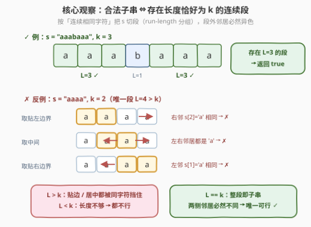
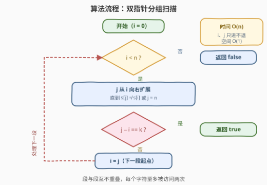

# LeetCode 找出长度为 K 的特殊子字符串 题解

## 1. 题目概述

- **标题 / 题号**：找出长度为 K 的特殊子字符串（#3456，easy）
- **链接**：https://leetcode.cn/problems/find-special-substring-of-length-k/
- **难度**：简单
- **标签**：字符串、双指针

**题意**：给你一个字符串 `s` 和一个整数 `k`。判断是否存在一个长度**恰好**为 `k` 的子字符串，该子字符串需要满足以下条件：

1. 该子字符串**只包含一个唯一字符**（例如，`"aaa"` 或 `"bbb"`）。
2. 如果该子字符串的**前面**有字符，则该字符必须与子字符串中的字符不同。
3. 如果该子字符串的**后面**有字符，则该字符也必须与子字符串中的字符不同。

如果存在这样的子串，返回 `true`；否则，返回 `false`。

**子字符串**是字符串中的连续、非空字符序列。

**示例 1**：

```text
输入：s = "aaabaaa", k = 3
输出：true
解释：子字符串 s[4..6] == "aaa" 满足条件：
  - 长度为 3。
  - 所有字符相同。
  - 子串 "aaa" 前的字符是 'b'，与 'a' 不同。
  - 子串 "aaa" 后没有字符。
```

**示例 2**：

```text
输入：s = "abc", k = 2
输出：false
解释：不存在长度为 2、仅由一个唯一字符组成且满足所有条件的子字符串。
```

**约束**：

- `1 <= k <= s.length <= 100`
- `s` 仅由小写英文字母组成

## 2. 解题思路

### 2.1 暴力思路

枚举所有长度为 $k$ 的子串起点 $i$（共 $n - k + 1$ 个），对每个起点做三项检查：

- `s[i..i+k-1]` 内字符全部相同（$O(k)$ 扫一遍）；
- 起点左侧字符不同（`i == 0 || s[i-1] != s[i]`）；
- 终点右侧字符不同（`i + k == n || s[i+k] != s[i]`）。

时间复杂度 $O(n \cdot k)$，本题 $n \le 100$ 轻松通过，但「逐起点重复扫描同一段字符」显然有冗余——同一批连续相同字符被反复检查。

### 2.2 核心观察：合法子串 ⇔ 存在长度恰好为 k 的连续段



把 `s` 按**连续相同字符**切分成若干段（run-length 分组），例如 `"aaabaaa"` 切成 `aaa | b | aaa`。三个关键事实：

1. **合法子串必然完整覆盖某个段**。若段长 $L > k$，从段中任取连续 $k$ 个字符：
   - 取在段**中间**：子串左右两侧都是段内同字符 → 违反条件 2、3；
   - 取**贴左边界**：右侧第 $k+1$ 个字符仍是段内字符（因为 $L > k$）→ 违反条件 3；
   - 取**贴右边界**：同理违反条件 2。
   三种取法全军覆没，所以 $L > k$ 无解。
2. **$L = k$ 时恰好可行**：整段就是候选子串，而段的定义保证段外相邻字符（若有）必然不同。
3. **$L < k$ 时长度不够**，直接排除。

> ⚠️ **最大陷阱**：直觉容易写成「段长 $\ge k$ 即返回 true」。反例 `s = "aaaa", k = 2`：段长 $4 \ge 2$，但任何长度 2 的子串两侧都会撞上同字符，正确答案是 `false`。**必须严格相等**。

于是问题化归为：**一次分组扫描，检查是否存在长度恰好为 $k$ 的段**。

### 2.3 算法流程图



用双指针 `i`、`j`：`i` 指向当前段起点，`j` 从 `i` 出发向右扩展直到字符不同或越界，段长即 `j - i`。命中 `k` 立即返回 `true`；否则 `i` 直接跳到 `j`（下一段起点），段与段互不重叠，每个字符最多被访问两次。

## 3. 参考代码

### C++

```cpp
class Solution {
  public:
    bool hasSpecialSubstring(string s, int k) {
        int n = s.size();
        int i = 0;
        while (i < n) {
            int j = i;
            while (j < n && s[j] == s[i]) {
                j++;
            }
            if (j - i == k) {
                return true;    // 找到长度恰为 k 的段
            }
            i = j;              // 跳到下一段起点
        }
        return false;
    }
};
```

### Python

```python
class Solution:
    def hasSpecialSubstring(self, s: str, k: int) -> bool:
        n = len(s)
        i = 0
        while i < n:
            j = i
            while j < n and s[j] == s[i]:
                j += 1
            if j - i == k:
                return True     # 找到长度恰为 k 的段
            i = j               # 跳到下一段起点
        return False
```

## 4. 复杂度分析

| 维度 | 复杂度 | 说明 |
|------|--------|------|
| 时间复杂度 | O(n) | `i`、`j` 都只前进不回退，每个字符至多被访问两次 |
| 空间复杂度 | O(1) | 只用常数个指针变量，无需存储分组结果 |

## 5. 扩展：两种等价写法

**Python `groupby` 一行版**（利用标准库做 run-length 分组）：

```python
from itertools import groupby

class Solution:
    def hasSpecialSubstring(self, s: str, k: int) -> bool:
        return any(len(list(g)) == k for _, g in groupby(s))
```

**定长窗口逐位判断版**（对应 2.1 暴力，但只用 $O(1)$ 额外逻辑判断窗口合法性）：

```cpp
class Solution {
  public:
    bool hasSpecialSubstring(string s, int k) {
        int n = s.size();
        for (int i = 0; i + k <= n; i++) {
            bool same = true;
            for (int j = i + 1; j < i + k; j++) {
                if (s[j] != s[i]) { same = false; break; }
            }
            if (!same) continue;
            if (i > 0 && s[i - 1] == s[i]) continue;      // 左邻居同字符，违规
            if (i + k < n && s[i + k] == s[i]) continue;  // 右邻居同字符，违规
            return true;
        }
        return false;
    }
};
```

> 💡 若把条件放宽为「段长 $\ge k$ 即可」（即允许子串两侧紧贴同字符），答案就变成「最长段长度 $\ge k$」，只需在分组时记录 `maxLen` 即可——与本题一字之差，正好用来检验对条件 2、3 的理解。

## 6. 面试要点

1. **为什么段长大于 k 也不行？这是本题最大的坑吗？**

   - 是。设段长 $L > k$：子串取在段中间则两侧撞同字符；贴任一边界则另一侧仍留在段内、必然撞同字符。三种取法都不合法，只有 $L = k$（整段恰好用完）可行。

2. **分组扫描为什么是 O(n) 而不是 O(n²)？**

   - `j` 扩展到段尾后，`i` 直接跳到 `j`，两指针均单调前进、段与段互不重叠，总移动次数不超过 $2n$。

3. **k > n 或 k == n 时算法正确吗？**

   - 正确。$k > n$ 时不存在任何起点，暴力版循环体不执行；分组版中任何段长 $\le n < k$，判等自然失败，均返回 `false`。$k = n$ 时当且仅当整个字符串是单一字符段时为 `true`。

4. **run-length 分组思想还能解哪些题？**

   - 凡是「连续相同元素」的问题都可以先分组：如统计最长连续段（1446）、对每段计数求和（1759）、段间比较（1869）、相邻同色去重成本（1578）。分组后段的边界信息常常就是解题钥匙。

5. **如果输入是流式数据（无法预知长度）怎么办？**

   - 分组扫描天然支持流式：只需维护「当前字符 + 当前段长」两个状态，字符变化时结算上一段并判断是否等于 $k$，无需缓存整个字符串。

## 同类练习题

| # | 题目 | 与本题的关联 |
|---|------|-------------|
| 1446 | [连续字符](https://leetcode.cn/problems/consecutive-characters/)（[题解](../1401-1500/1446_连续字符.md)） | 同样的 run-length 分组，改为求最长段长度 |
| 1759 | [统计同质子字符串的数目](https://leetcode.cn/problems/count-number-of-homogenous-substrings/)（[题解](../1701-1800/1759_统计同质子字符串的数目.md)） | 对每个长度为 L 的段贡献 $\frac{L(L+1)}{2}$，分组的直接应用 |
| 1869 | [哪种连续子字符串更长](https://leetcode.cn/problems/longer-contiguous-segments-of-ones-than-zeros/)（[题解](../1801-1900/1869_哪种连续子字符串更长.md)） | 分组后比较 1 段与 0 段的最大长度 |
| 1578 | [使绳子变成彩色的最短时间](https://leetcode.cn/problems/minimum-time-to-make-rope-colorful/)（[题解](../1501-1600/1578_使绳子变成彩色的最短时间.md)） | 相邻同色段内必须删除到只剩一个，段内保留最大值 |
| 3019 | [按键变更的次数](https://leetcode.cn/problems/number-of-changing-keys/)（[题解](../3001-3100/3019_按键变更的次数.md)） | 段数 − 1 就是按键变更次数，run-length 计数 |
