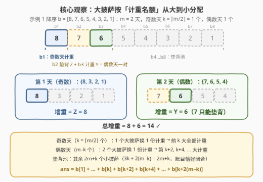
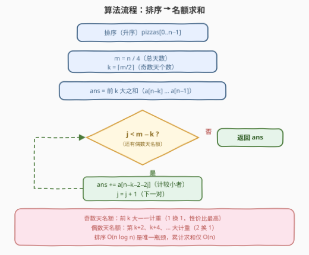

# LeetCode 吃披萨 题解

## 1. 题目概述

- **标题 / 题号**：吃披萨（#3457，medium）
- **链接**：https://leetcode.cn/problems/eat-pizzas/
- **难度**：中等
- **标签**：贪心、数组、排序

**题意**：给定长度为 $n$ 的整数数组 `pizzas`，`pizzas[i]` 表示第 $i$ 个披萨的重量（$n$ 是 4 的倍数）。你每天吃**恰好 4 个**披萨。设某天吃掉的 4 个重量为 $W \le X \le Y \le Z$，则增重规则为：

- **奇数天**（从 1 开始计数）：增重 $Z$（组内**最大**）；
- **偶数天**：增重 $Y$（组内**第二大**）。

请设计吃掉**所有**披萨的方案，使总增重**最大**。

**示例 1**：

```text
输入：pizzas = [1,2,3,4,5,6,7,8]
输出：14
解释：第 1 天吃 [2,3,5,8]，增重 8；第 2 天吃 [1,4,6,7]，增重 6；合计 14。
```

**示例 2**：

```text
输入：pizzas = [2,1,1,1,1,1,1,1]
输出：3
解释：第 1 天吃 [1,1,1,2]，增重 2；第 2 天吃 [1,1,1,1]，增重 1；合计 3。
```

**约束**：

- $4 \le n = \text{pizzas.length} \le 2 \times 10^5$
- $1 \le \text{pizzas}[i] \le 10^5$
- $n$ 是 4 的倍数

> 💡 **读题关键**：① 每天 4 个披萨里**只有 1 个计入增重**，其余 3 个都是「垫背」；② 奇数天计最大、偶数天计第二大——偶数天想计重大披萨，就必须**再搭进一个更大的披萨当垫背**（「计 1 送 1」）；③ 天数 $m = n/4$ 固定，奇/偶天数也固定（$\lceil m/2 \rceil$ 与 $\lfloor m/2 \rfloor$），不能挑天数。这三点合起来指向一个排序贪心。

## 2. 解题思路

### 2.1 暴力思路

枚举所有「分组方式 × 组到奇/偶天的分配」：把 $n$ 个披萨切成 $m = n/4$ 组的组合数是 $\dfrac{n!}{(4!)^m \, m!}$，$n = 8$ 时已有 70 种分组，$n = 2\times10^5$ 时是天文数字；状压 DP 也只撑得到 $n \approx 20$。**病根**：把「哪些披萨垫背」当成需要搜索的自由度，而最优解里垫背的必然是小披萨——**排序之后名额直接确定**，根本没有搜索的必要。

### 2.2 核心观察：排序后按「计重名额」从大到小分配

设 $m = n/4$ 为天数，其中奇数天 $k = \lceil m/2 \rceil$ 个、偶数天 $m - k = \lfloor m/2 \rfloor$ 个。将披萨**降序**排列为 $b[1] \ge b[2] \ge \dots \ge b[n]$。

每天 4 个披萨中只有 1 个计重，但两种天的「大披萨开销」不同：

| 天型 | 计重者 | 需要的大披萨数 | 说明 |
|------|--------|----------------|------|
| 奇数天 | $Z$（最大） | 1 个 | 该披萨自己就是组内最大，配 3 个小披萨垫背即可 |
| 偶数天 | $Y$（第二大） | 2 个 | 组内必须还有一个 $\ge Y$ 的 $Z$ **不计重地垫背** |

于是「大披萨名额」的分配唯一自然：**奇数天性价比高（1 换 1），优先占名额且拿最大的；偶数天（2 换 1）成对地拿，每对只计较小者**：

- $b[1], b[2], \dots, b[k]$ 全部给奇数天计重；
- 接下来 $2(m-k)$ 个两两成对给偶数天：$b[k+1]$ 垫背、$b[k+2]$ 计重，$b[k+3]$ 垫背、$b[k+4]$ 计重……即计重的是 $b[k+2], b[k+4], \dots, b[k+2(m-k)]$；
- 其余 $2m + k$ 个小披萨全部垫背。

$$\text{ans} \;=\; \sum_{i=1}^{k} b[i] \;+\; \sum_{j=1}^{m-k} b\left[k + 2j\right]$$



**正确性**（计数论证）：

- **上界**：任取一种合法方案，考察前 $j$ 大的披萨，设其中含 $x$ 个奇数天计重、$y$ 个偶数天计重。每个偶数天计重披萨的同组 $Z$（降序名次更小、不计重）也落在前 $j$ 中，故 $x + 2y \le j$；又 $x \le k$。于是前 $j$ 大中计重个数 $\le k + \lfloor (j-k)/2 \rfloor$（$j \ge k$ 时）。总增重是所有计重披萨之和，**逐前缀**被贪心方案占满上界（前 $k$ 名 + $k+2, k+4, \dots$ 恰在每个 $j$ 处达到该界），故贪心总和最大（majorization / 逐位求和）。
- **可行性**（凑得出组）：大端消耗 $k + 2(m-k) = 2m - k$ 个，剩余 $4m - (2m - k) = 2m + k$ 个恰等于垫背需求 $3k + 2(m-k) = 2m + k$。**账目闭合**，上述分配可以原样落成每天 4 个的合法分组。

> 💡 一句话：**把「分组 + 排天」两级决策压缩成排序后的一维名额分配**——奇数天 1 换 1 拿走前 $k$ 大，偶数天 2 换 1 拿走 $k+2, k+4, \dots$，其余全部垫背。

### 2.3 算法流程



升序排序后下标更顺手（前 $k$ 大即尾部 $k$ 个；偶数天计重下标为 $a[n-k-2-2j]$），流程共 5 步：排序 → 算 $m, k$ → 累加尾部 $k$ 个 → 循环累加 $a[n-k-2-2j]$ → 返回。

### 2.4 示例演算

**示例 1**（$n = 8$，$m = 2$，$k = 1$，降序 $b = [8,7,6,5,4,3,2,1]$）：

| 披萨 | 名额 | 去向 |
|------|------|------|
| 8 | 奇数天计重 | 第 1 天的 $Z$ |
| 7 | 偶数天垫背 $Z$ | 第 2 天当最大，不计重 |
| 6 | 偶数天计重 $Y$ | 第 2 天的 $Y$ |
| 5, 4, 3, 2, 1 | 垫背池（$2m+k = 5$ 个 ✓） | 凑满每天 4 个 |

分组：第 1 天（奇）$\{8, 3, 2, 1\} \to +8$；第 2 天（偶）$\{7, 6, 5, 4\} \to +6$。合计 $14$ ✓。

**示例 2**（降序 $b = [2,1,1,1,1,1,1,1]$）：奇数天计 $2$；偶数天一对 $\{1, 1\}$ 计 $1$。第 1 天 $\{2,1,1,1\} \to +2$，第 2 天 $\{1,1,1,1\} \to +1$，合计 $3$ ✓。

## 3. 参考代码

### C++

```cpp
class Solution {
  public:
    long long maxWeight(vector<int>& pizzas) {
        sort(pizzas.begin(), pizzas.end());   // 升序
        int n = pizzas.size();
        int m = n / 4;                        // 总天数
        int k = (m + 1) / 2;                  // 奇数天个数
        long long ans = 0;
        for (int i = 0; i < k; i++)           // 前 k 大：奇数天一一计重
            ans += pizzas[n - 1 - i];
        for (int j = 0; j < m - k; j++)       // 偶数天成对取，计较小者
            ans += pizzas[n - k - 2 - 2 * j];
        return ans;
    }
};
```

### Python

```python
class Solution:
    def maxWeight(self, pizzas: List[int]) -> int:
        pizzas.sort()                          # 升序
        n = len(pizzas)
        m = n // 4                             # 总天数
        k = (m + 1) // 2                       # 奇数天个数
        ans = sum(pizzas[n - k:])              # 前 k 大：奇数天一一计重
        for j in range(m - k):                 # 偶数天成对取，计较小者
            ans += pizzas[n - k - 2 - 2 * j]
        return ans
```

> 💡 **实现细节**：① 偶数天计重下标是 $a[n-k-2-2j]$ 而非 $a[n-k-1-2j]$——每对中名次靠前的那个是垫背 $Z$，**不**计重；② 最小用到的下标为 $n - k - 2(m-k) = 2m + k \ge 0$，恒不越界（$m \ge 1 \Rightarrow k \ge 1$）；③ 答案上界 $\approx \frac{n}{4} \times 10^5 = 5 \times 10^9$，C++ 必须 `long long`。

## 4. 复杂度分析

| 维度 | 复杂度 | 说明 |
|------|--------|------|
| 时间 | $O(n \log n)$ | 排序主导；两段求和共 $O(n)$ |
| 空间 | $O(1)$ | 原地排序，仅若干计数变量（不计语言排序栈） |

实测：官方示例输出 $14 / 3$ ✓；与「枚举全部分组 × 奇偶分配」的暴力程序对拍随机数据（$n \le 12$、值域 $\le 6$，共 400 组）全部一致；$n = 2 \times 10^5$ 的极端用例瞬间出解。

## 5. 扩展：偶数天计「第 c 大」的通式

若规则改为偶数天计组内**第 $c$ 大**（$c = 2$ 即本题），同款计数论证给出通式：

$$\text{ans} \;=\; \sum_{i=1}^{k} b[i] \;+\; \sum_{j=1}^{m-k} b\left[k + cj\right]$$

直觉：偶数天计第 $c$ 大 ⇒ 每个偶数天要消耗 $c$ 个大披萨（$c-1$ 个更大的垫背 + 1 个计重），仍是「前 $k$ 大照单全收、之后每 $c$ 个计最后 1 个」。已用暴力对拍验证 $c = 2, 3$ 均成立。把 $c$ 当参数想一遍，能检验你是否真正理解了 2.2 的名额结构，而不是背公式。

## 6. 面试要点

1. **为什么前 $k$ 大一定全部计重？**

   - 奇数天计重组内最大：1 个大披萨换 1 份计重；偶数天计第二大：2 个大披萨换 1 份计重（组内必须存在更大的 $Z$ 垫背）。奇数天名额固定 $k$ 个、性价比最高，理应拿最大的。严格说：任意方案中前 $j$ 大披萨的计重个数满足 $x + 2y \le j,\ x \le k$，上界为 $k + \lfloor (j-k)/2 \rfloor$，贪心逐前缀取满，故总和最大。

2. **偶数天为什么必须「赔」一个更大的披萨？能否避免？**

   - $Y$ 是组内第二大，按定义组内名次更靠前的 $Z$ 必须存在且不计重，无法避免——这是「2 换 1」的根源。同值时按名次打破平局（$Z$ 取名次更小者），结论不变。

3. **顺序陷阱：为什么必须先安排奇数天？**

   - 若先把大披萨成对分给偶数天，每个名额吃掉 2 个大披萨，会挤占只需 1 个的奇数天名额。本质是**名额间有性价比差**：先用高性价比名额（1 换 1）吸收最大值，再用低性价比名额（2 换 1）吸收次大值。

4. **哪些量会溢出 `int`？**

   - $n \le 2\times10^5$、$1 \le \text{pizzas}[i] \le 10^5$，每天最多计重 $10^5$、共 $m = 5\times10^4$ 天，答案上界 $5 \times 10^9 > 2^{31} - 1$。C++ 中累加器与返回值用 `long long`；Python 无此问题。

5. **本题与 561 数组拆分是什么关系？**

   - 561 是本题「全员偶数天、组大小为 2」的退化版（排序后隔一取一，最小化被浪费的名次）。本题多了一层**奇偶名额不对称**：两类名额性价比不同（1 换 1 vs 2 换 1），高性价比名额优先拿最大值——识别这种「不对称配额」是本题相对 561 的增量。

## 同类练习题

| # | 题目 | 与本题的关联 |
|---|------|-------------|
| 561 | [数组拆分](https://leetcode.cn/problems/array-partition/) | 排序后隔一取一最大化 $\min$ 之和，本题「偶数天成对计较小者」的同款结构 |
| 2144 | [打折购买糖果的最小开销](https://leetcode.cn/problems/minimum-cost-of-buying-candies-with-discount/) | 从大到小每 3 个只付最贵的 2 个，「垫背/凑单」贪心的镜像题 |
| 881 | [救生艇](https://leetcode.cn/problems/boats-to-save-people/) | 排序后首尾配对成组、每组限 2 人，分组贪心的经典模板 |
| 455 | [分发饼干](https://leetcode.cn/problems/assign-cookies/) | 排序 + 双指针贪心分配，「排序定顺序、顺序定分配」的入门 |
| 2279 | [装满石头的背包的最大数量](https://leetcode.cn/problems/maximum-bags-with-full-capacity-of-rocks/) | 排序后贪心分配增量资源，同款「名额性价比」权衡 |
