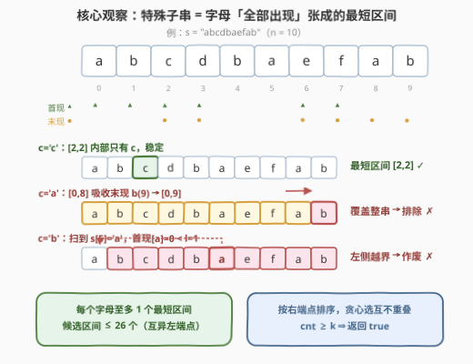
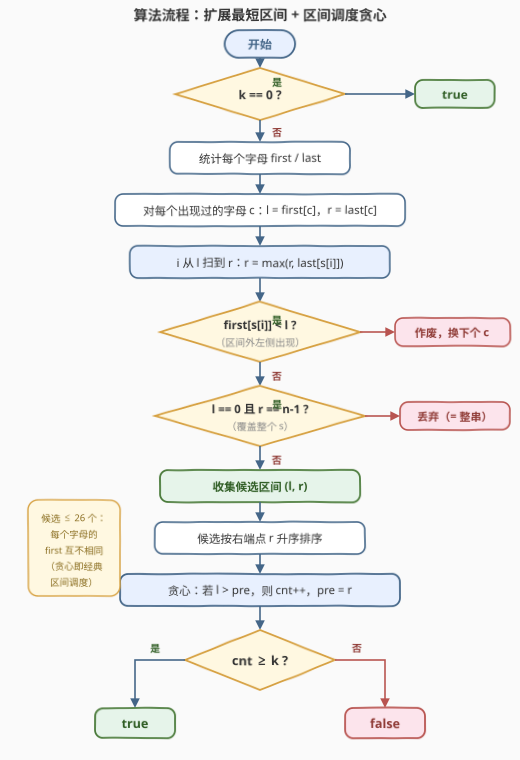

# 选择K个互不重叠的特殊子字符串

- **题目名称**：选择K个互不重叠的特殊子字符串
- **链接**：[3458. 选择 K 个互不重叠的特殊子字符串](https://leetcode.cn/problems/select-k-disjoint-special-substrings/)
- **难度**：中等
- **标签**：贪心、哈希表、字符串、动态规划、排序

## 1. 题目概述

给定长度为 $n$ 的字符串 `s` 和整数 $k$，判断能否选出 $k$ 个**互不重叠**的**特殊子字符串**。

**特殊子字符串**需同时满足：

1. 子串中的任何字符都**不出现在字符串其余部分**（即子串必须「包住」其中每个字符的全部出现）；
2. 子串**不能是整个**字符串 `s`。

**示例 1**：

```text
输入：s = "abcdbaefab", k = 2
输出：true
解释：可选 "cd" 与 "ef"——'c'、'd' 只出现在 "cd" 中，'e'、'f' 只出现在 "ef" 中，二者不重叠。
```

**示例 2**：

```text
输入：s = "cdefdc", k = 3
输出：false
解释：最多只能找到 2 个（"e" 和 "f"），k = 3 时返回 false。
```

**示例 3**：

```text
输入：s = "abeabe", k = 0
输出：true
```

**约束条件**：

- $2 \le n = s.length \le 5 \times 10^4$
- $0 \le k \le 26$
- `s` 仅由小写英文字母组成

> 💡 **读题关键**：①「字符不出现在其余部分」等价于「子串必须覆盖其中每个字母的**全部出现**」——这把子串和字母的 `first`/`last` 出现位置绑定；② 不能选整串；③ $k$ 个子串互不重叠 → 转化为**区间不相交**。三点合起来把问题送进「区间」世界：先用 `first`/`last` 求出至多 26 个候选区间，再做经典的区间调度贪心。

---

## 2. 解题思路

### 2.1 暴力思路

枚举所有 $O(n^2)$ 个子串，每个花 $O(n)$ 统计区间内外字符判断「特殊」，共 $O(n^3) \approx 10^{14}$，爆炸；即便拿到全部合法子串，还要在其中组合搜索 $k$ 个互不重叠者。**病根**：误以为候选子串有 $O(n^2)$ 个——实际上合法子串的**左端点**只有至多 26 个（见下），候选极少，根本没有搜索空间。

### 2.2 核心观察：特殊子串 = 某字母「全部出现」张成的最短区间

记 $first[c]$、$last[c]$ 为字母 $c$ 的首次/最后一次出现下标。子串 $[l, r]$ 合法当且仅当：

$$\forall\, c \in s[l..r]:\quad first[c] \ge l \ \text{且}\ last[c] \le r$$

由它可直接推出四条结构性结论：

| 推论 | 内容 | 理由 |
|------|------|------|
| **端点结构** | 合法子串的 $l$ 必是某字母的 $first$，$r$ 必是某字母的 $last$ | 若 $l > first[s[l]]$，则 $s[l]$ 在左侧出现，违约；右端对称 |
| **吸收扩展** | 从 $l = first[c]$ 出发令 $r = last[c]$，向右扫描并不断吸收 $r = \max(r, last[s[i]])$，直到稳定——得到以 $first[c]$ 为左端点的**最短**合法区间 | 「包住全部出现」具有单调吸收性 |
| **左侧越界作废** | 扫描中若发现某字母 $x$ 满足 $first[x] < l$，该起点作废 | $x$ 在区间外左侧出现，向右扩展永远修不好 |
| **整串排除** | 扩展结果为 $[0, n-1]$ 时按定义丢弃 | 子串不能等于整个 $s$ |

**为什么只保留「最短」区间不亏**：任取合法特殊子串 $[L, R]$，以 $s[L]$（其 $first[s[L]] = L$）为起点做吸收扩展得到的最短区间 $[L, r']$ 必然满足 $r' \le R$，即**含于** $[L, R]$。把候选换成更短的区间，与其它区间不相交的关系只会更容易保持。又因为每个字母的 $first$ 互不相同，**候选区间至多 26 个**。

于是问题归结为：给定至多 26 个区间，最多能选出多少个**互不重叠**者——按右端点升序排序、维护已选区间的最右端 $pre$、遇 $l > pre$ 就选，是经典贪心，答案 $cnt \ge k$ 即返回 `true`。



> 💡 一句话：**「特殊」把子串钉死在每个字母的 first 上，吸收扩展产出 ≤ 26 个最短候选区间，剩下交给区间调度贪心。**

### 2.3 算法流程



流程共四段：① 预处理 `first`/`last`；② 对每个出现过的字母从 $first[c]$ 吸收扩展出最短区间，途中 $first[x] < l$ 作废、结果覆盖整串丢弃；③ 候选按右端点排序；④ 贪心计数并与 $k$ 比较。$k = 0$ 直接返回 `true`（空选择天然合法，见示例 3）。

### 2.4 示例演算

**示例 1**（$s =$ `"abcdbaefab"`，$n=10$）：

| 字母 | $l = first$ | 扩展过程 | 最短区间 | 去向 |
|------|-------------|----------|----------|------|
| a | 0 | 扫到 $b$ 末现 9，$[0,8] \to [0,9]$ | $[0,9]$ | ✗ 覆盖整串 |
| b | 1 | 扫到 $s[5]=$'a'，$first[a]=0 < 1$ | — | ✗ 作废 |
| c | 2 | 内部只有 c，稳定 | $[2,2]$ | ✓ |
| d | 3 | 内部只有 d，稳定 | $[3,3]$ | ✓ |
| e | 6 | 内部只有 e，稳定 | $[6,6]$ | ✓ |
| f | 7 | 内部只有 f，稳定 | $[7,7]$ | ✓ |

候选 $\{[2,2],[3,3],[6,6],[7,7]\}$ 两两不重叠，$cnt = 4 \ge 2$ → `true` ✓

**示例 2**（$s =$ `"cdefdc"`）：c 扩展成 $[0,5]$ 整串 ✗；d 得 $[1,4]$ ✓；e 得 $[2,2]$ ✓；f 得 $[3,3]$ ✓。按右端点排序后贪心：选 $[2,2]$（$pre=2$）、选 $[3,3]$（$3>2$，$pre=3$）、$[1,4]$ 因 $1 \le 3$ 落选。$cnt = 2 < 3$ → `false` ✓

---

## 3. 参考代码

### C++

```cpp
class Solution {
  public:
    bool maxSubstringLength(string s, int k) {
        if (k == 0) return true;
        int n = s.size();
        vector<int> first(26, -1), last(26, -1);
        for (int i = 0; i < n; i++) {
            int c = s[i] - 'a';
            if (first[c] == -1) first[c] = i;
            last[c] = i;
        }
        vector<pair<int, int>> intervals;
        for (int c = 0; c < 26; c++) {
            if (first[c] == -1) continue;
            int l = first[c], r = last[c];
            bool ok = true;
            for (int i = l; i <= r; i++) {          // 吸收扩展
                int x = s[i] - 'a';
                if (first[x] < l) { ok = false; break; }   // 左侧越界，作废
                r = max(r, last[x]);
            }
            if (ok && !(l == 0 && r == n - 1))      // 排除整串
                intervals.push_back({l, r});
        }
        sort(intervals.begin(), intervals.end(),
             [](const auto& a, const auto& b) { return a.second < b.second; });
        int cnt = 0, pre = -1;
        for (auto& [l, r] : intervals) {            // 经典区间调度贪心
            if (l > pre) {
                cnt++;
                pre = r;
            }
        }
        return cnt >= k;
    }
};
```

### Python

```python
class Solution:
    def maxSubstringLength(self, s: str, k: int) -> bool:
        if k == 0:
            return True
        n = len(s)
        first, last = {}, {}
        for i, c in enumerate(s):
            if c not in first:
                first[c] = i
            last[c] = i

        intervals = []
        for c in first:
            l, r = first[c], last[c]
            ok = True
            i = l
            while i <= r:                    # 吸收扩展
                if first[s[i]] < l:          # 左侧越界，作废
                    ok = False
                    break
                if last[s[i]] > r:
                    r = last[s[i]]
                i += 1
            if ok and not (l == 0 and r == n - 1):   # 排除整串
                intervals.append((l, r))

        intervals.sort(key=lambda x: x[1])   # 按右端点排序
        cnt, pre = 0, -1
        for l, r in intervals:               # 经典区间调度贪心
            if l > pre:
                cnt += 1
                pre = r
        return cnt >= k
```

> 💡 **实现细节**：① 不同字母的 $first$ 互不相同，候选区间天然无重复，无需去重；② 扩展循环里 `first[x] < l` 的判断必须**先于**吸收 `r`——越界即弃，继续扫没有意义；③ `k = 0` 提前返回 `true`，也顺带绕开了「候选为空」的边界；④ 互不重叠定义为区间不相交（不含端点相接），故贪心条件是 `l > pre` 而非 `l >= pre`。

---

## 4. 复杂度分析

| 维度 | 复杂度 | 说明 |
|------|--------|------|
| 时间 | $O(\sigma \cdot n)$，$\sigma = 26$ | 26 个字母各扫一次其扩展区间，最坏 $26n \approx 1.3\times10^6$；对 26 个区间排序可忽略 |
| 空间 | $O(\sigma)$ | `first`/`last` 数组与候选区间列表 |

实测：官方三个示例输出 `true / false / true` ✓；与「枚举全部子串 + 组合检查」的暴力程序对拍随机数据（$n \le 10$、字母表 $\le 5$、$k \le 4$，共 3000 组）全部一致；$n = 5\times10^4$ 的极端用例瞬间出解。

---

## 5. 扩展：DP 写法与贪心正确性

官方 hint 给出的第三步是**动态规划**：候选按右端点排序后，令 $dp[i]$ 为「以第 $i$ 个区间结尾」的最大选择数，则

$$dp[i] = 1 + \max\left(\{0\} \cup \{dp[j] : r_j < l_i\}\right),\qquad \text{ans} = \max_i dp[i]$$

$\sigma \le 26$ 时 $O(\sigma^2)$ 转移毫无压力。它与贪心殊途同归——贪心的正确性可用**交换论证**：若某最优解未选右端点最小的可行区间 $A$，把它的第一个区间换成 $A$（右端点不增），后续所有选择仍然合法，选择数不变；逐个替换即得贪心解。DP 是通式（区间带权、三维约束等变种仍适用），贪心是本题最快的特化。

---

## 6. 面试要点

1. **为什么合法子串的左端点必是某字母的首次出现？**

   - 设 $[l, r]$ 特殊，则 $s[l]$ 不能在 $l$ 左侧出现，即 $first[s[l]] = l$。同理 $last[s[r]] = r$。所以候选左端点至多 26 个——这是把 $O(n^2)$ 子串压缩到 $O(26)$ 的关键。

2. **为什么只需保留每个字母的「最短」合法区间？**

   - 最短区间 $[L, r']$ 含于任何以 $L$ 为左端点的合法子串 $[L, R]$。区间越短，与其它区间不相交越容易。选大的永远不比选小的好，故可安全丢弃非最短者。

3. **发现 $first[x] < l$ 时，为什么不向左扩展而是直接作废？**

   - 左端点被钉死在 $first[c]$ 上：向左扩会越过起点，得到的区间左端点不再是任何字母的 $first$（它属于另一个起点的候选）。该起点无解，而字母 $x$ 自己的候选（从 $first[x]$ 出发）会覆盖这片区域，不会漏解。

4. **为什么必须排除覆盖整串的区间？$k=0$ 为何直接返回 true？**

   - 题目定义特殊子串不能是整个 $s$；若不排除，只要全串字符互不相同就会误判。$k = 0$ 对应空选择，不需要任何区间，天然可行（示例 3）。

5. **区间调度贪心为什么按右端点排序？**

   - 每选一个区间，代价是「占用到 $r$」，收益是 +1。右端点越早结束，留给后续区间的空间越大。交换论证：任何最优解都可把首个区间换成右端点最小的可行区间而不减少选择数。

---

## 7. 同类练习题

- [763. 划分字母区间](https://leetcode.cn/problems/partition-labels/)：同款 `first`/`last` 吸收扩展，把串切成「每字母只出现在一块」的最少段数
- [435. 无重叠区间](https://leetcode.cn/problems/non-overlapping-intervals/)：右端点排序贪心的镜像——保留最多不重叠区间等于删除最少区间
- [452. 用最少数量的箭引爆气球](https://leetcode.cn/problems/minimum-number-of-arrows-to-burst-balloons/)：区间调度贪心的经典变形，端点相接的处理细节值得对比
- [1288. 删除被覆盖区间](https://leetcode.cn/problems/remove-covered-intervals/)：区间包含关系的判定，与「最短区间不亏」的直觉同源
