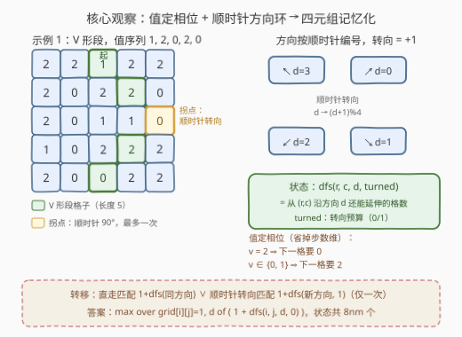
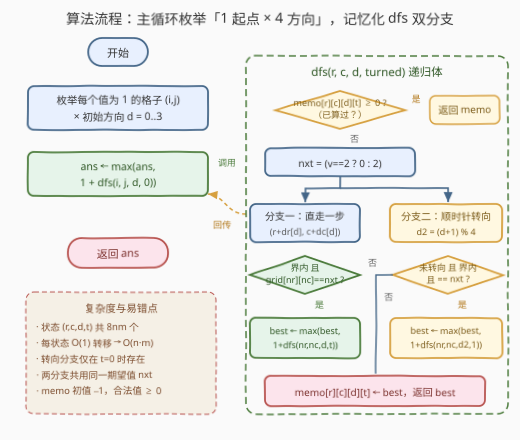

# LeetCode 最长V形对角线段的长度 题解

## 1. 题目概述

- **标题 / 题号**：最长 V 形对角线段的长度（#3459，hard）
- **链接**：https://leetcode.cn/problems/length-of-longest-v-shaped-diagonal-segment/
- **难度**：困难
- **标签**：记忆化、数组、动态规划、矩阵

**题意**：给定 $n \times m$ 的二维整数矩阵 `grid`，每个元素取值 $0$、$1$ 或 $2$。

**V 形对角线段**的定义：

- 线段从 $1$ 开始；
- 后续元素按无限序列 $2, 0, 2, 0, \dots$ 的模式排列（即整段值序列为 $1, 2, 0, 2, 0, \dots$）；
- 起始于某个对角方向（左上→右下、右下→左上、右上→左下、左下→右上之一），沿该方向前进；
- 在保持序列模式的前提下，**最多允许一次顺时针 90 度转向**到另一个对角方向。

返回**最长 V 形对角线段的长度**；不存在则返回 $0$。

**示例 1**：

```text
输入：grid = [[2,2,1,2,2],[2,0,2,2,0],[2,0,1,1,0],[1,0,2,2,2],[2,0,0,2,2]]
输出：5
解释：路径 (0,2) → (1,3) → (2,4)，在 (2,4) 处顺时针转向，继续 (3,3) → (4,2)。
      值序列 1, 2, 0, 2, 0。
```

**示例 2**：

```text
输入：grid = [[2,2,2,2,2],[2,0,2,2,0],[2,0,1,1,0],[1,0,2,2,2],[2,0,0,2,2]]
输出：4
解释：路径 (2,3) → (3,2)，在 (3,2) 处顺时针转向，继续 (2,1) → (1,0)。
```

**示例 3**：

```text
输入：grid = [[1,2,2,2,2],[2,2,2,2,0],[2,0,0,0,0],[0,0,2,2,2],[2,0,0,2,0]]
输出：5
解释：不转向，沿主对角线 (0,0) → (1,1) → (2,2) → (3,3) → (4,4)。
```

**示例 4**：

```text
输入：grid = [[1]]
输出：1
解释：单独一个 1 也是合法线段，长度为 1。
```

**约束**：

- $n == \text{grid.length}$，$m == \text{grid}[i].\text{length}$
- $1 \le n, m \le 500$
- $\text{grid}[i][j] \in \{0, 1, 2\}$

> 💡 **读题关键**：① 段**必须从 1 开始**——孤立的 1 也算长度 1 的段，全图无 1 才返回 0；② 转向是**顺时针** 90°，且**最多一次**，逆时针转向不合法；③ 转向后仍要延续 $2, 0, 2, 0$ 的序列模式，转向后踩到的第一个格子必须恰好是"期望值"。

## 2. 解题思路

### 2.1 暴力思路

最直接的模拟：枚举每个值为 $1$ 的格子作起点、枚举初始对角方向，先沿该方向直走出一条**极长**前缀；再枚举前缀上每个格子作为**拐点**，从拐点顺时针转向后继续直走模拟第二段。取所有组合的最大长度。

设 $L = \min(n, m) + 1$ 为单段长度上界（见面试要点 Q5），起点 $\times$ 方向有 $4nm$ 种，每种最多模拟 $O(L)$ 长度并枚举 $O(L)$ 个拐点，总复杂度 $O(n \cdot m \cdot \min(n, m))$。$n = m = 500$ 时约 $5 \times 10^7$ 次**格子访问**看似可行，但每步都要做边界与匹配判断，Python 下必然超时，C++ 也相当勉强。**病根**：同一个"(当前格, 当前方向, 是否已转向)"局面会在不同起点的模拟中被反复展开——这正是记忆化搜索的信号。

### 2.2 核心观察：值定相位 + 顺时针方向环 → 四元组记忆化



**观察一：当前格子的值唯一决定下一格的期望值。**
段内值序列是 $1, 2, 0, 2, 0, \dots$：$2$ 和 $0$ **交替出现**。于是给定当前格值 $v$：

$$\text{nxt} = \begin{cases} 2, & v = 1 \text{（下一个是序列第 2 项）} \\ 0, & v = 2 \\ 2, & v = 0 \end{cases} \quad\Longrightarrow\quad \text{nxt} = (v = 2)\ ?\ 0\ :\ 2$$

**"走到第几步"不需要进状态**——序列的相位信息已经编码在 `grid[r][c]` 里。这是本题最关键的状态压缩：若序列换成任意 pattern，就必须把"步数 mod 周期"编进状态（见第 5 节）。

**观察二：四个对角方向按顺时针编号，转向就是 +1 mod 4。**
把方向按**顺时针顺序**编号：$d=0$ 东北 $\nearrow(-1,+1)$、$d=1$ 东南 $\searrow(+1,+1)$、$d=2$ 西南 $\swarrow(+1,-1)$、$d=3$ 西北 $\nwarrow(-1,-1)$。顺时针 90° 转向即

$$d \;\longmapsto\; (d + 1) \bmod 4$$

（示例 1：第一段方向 $\searrow$ 即 $d=1$，拐点 $(2,4)$ 处转向 $\swarrow$ 即 $d=2$，恰为 $(1+1)\bmod 4$ ✓。）方向若随意编号，转向就要查表，还容易写错。

**状态设计**：$dfs(r, c, d, \text{turned})$ = 当前格 $(r,c)$ 已在段内、即将沿方向 $d$（或转向后的方向）继续延伸、`turned` 记录是否已用掉唯一一次转向时，**还能再延伸的格子数**（不含当前格）。转移只有两个分支：

- **直走**：下一格 $(r + dr_d,\ c + dc_d)$ 在界内且等于 $\text{nxt}$，得 $1 + dfs(\text{下一格}, d, \text{turned})$；
- **转向**（仅 $\text{turned} = 0$ 时）：顺时针转向 $d_2 = (d+1) \bmod 4$，下一格在界内且等于 $\text{nxt}$，得 $1 + dfs(\text{下一格}, d_2, 1)$。

**答案收集**：段必须从 $1$ 开始，故枚举所有 $\text{grid}[i][j] = 1$ 的格子作起点，对 4 个初始方向取

$$\text{ans} = \max_{\text{grid}[i][j]=1,\ d}\ \bigl(1 + dfs(i, j, d, 0)\bigr)$$

状态总数 $n \cdot m \cdot 4 \cdot 2 = 8nm \le 2 \times 10^6$，每个状态 $O(1)$ 转移，记忆化后整体 $O(n \cdot m)$。

> 💡 一句话：**"值定相位"砍掉步数维，"顺时针编号"把转向变成 +1 mod 4，剩下一个 0/1 转向预算——四元组 $(r, c, d, \text{turned})$ 就是完整状态。**

### 2.3 算法流程图



要点回顾：

1. 主循环只从值为 $1$ 的格子发起，且 $1 + dfs(\dots)$ 中的 $1$ 已把起点计入——孤立起点自然得到长度 1；
2. 两个分支共用同一个期望值 $\text{nxt}$：转向改变的是**方向**，不改变**序列相位**；
3. 记忆化数组初始化为 $-1$ 表示未计算（合法返回值 $\ge 0$，不会混淆）。

### 2.4 示例演算

以**示例 1** 演算最长路径（起点 $(0,2)$，初始方向 $d=1$ 东南）：

| 步骤 | 当前格 (值) | 方向 | nxt | 直走目标 | 转向目标 | 结果 |
|------|------------|------|-----|----------|----------|------|
| 1 | $(0,2)$，$v=1$ | $\searrow$ | $2$ | $(1,3)=2$ ✓ | $(1,1)=0$ ✗ | 走直路 |
| 2 | $(1,3)$，$v=2$ | $\searrow$ | $0$ | $(2,4)=0$ ✓ | $(2,2)=1$ ✗ | 走直路 |
| 3 | $(2,4)$，$v=0$ | $\searrow$ | $2$ | $(3,5)$ 出界 ✗ | $(3,3)=2$ ✓ | **顺时针转向** $\searrow \to \swarrow$ |
| 4 | $(3,3)$，$v=2$ | $\swarrow$ | $0$ | $(4,2)=0$ ✓ | 已转向 | 走直路 |
| 5 | $(4,2)$，$v=0$ | $\swarrow$ | $2$ | $(5,1)$ 出界 ✗ | 已转向 | 段终止 |

自底向上回传：$dfs(4,2)=0 \Rightarrow dfs(3,3)=1 \Rightarrow dfs(2,4)=2 \Rightarrow dfs(1,3)=3 \Rightarrow dfs(0,2)=4$，加上起点自身得 $1 + 4 = 5$ ✓。

再验证**示例 4**：唯一格子值为 $1$，四个方向的下一步都出界，$dfs = 0$，答案 $1 + 0 = 1$ ✓。**示例 2** 的最优段 $(2,3) \to (3,2) \to (2,1) \to (1,0)$ 中 $\swarrow \to \nwarrow$ 同样是 $(d+1) \bmod 4$，得 $4$ ✓。

## 3. 参考代码

### C++

```cpp
class Solution {
  public:
    int lenOfVDiagonal(vector<vector<int>>& grid) {
        int n = grid.size(), m = grid[0].size();
        const int dr[4] = {-1, 1, 1, -1};   // 顺时针序：东北→东南→西南→西北
        const int dc[4] = {1, 1, -1, -1};
        vector memo(n, vector(m, array<array<int, 2>, 4>{}));
        for (auto& row : memo)
            for (auto& cell : row)
                for (auto& st : cell) st.fill(-1);

        function<int(int, int, int, int)> dfs = [&](int r, int c, int d, int t) -> int {
            int& res = memo[r][c][d][t];
            if (res != -1) return res;
            int nxt = grid[r][c] == 2 ? 0 : 2;      // 观察一：值定相位
            int best = 0;
            int nr = r + dr[d], nc = c + dc[d];     // 分支一：同方向直走
            if (nr >= 0 && nr < n && nc >= 0 && nc < m && grid[nr][nc] == nxt)
                best = max(best, 1 + dfs(nr, nc, d, t));
            if (!t) {                               // 分支二：顺时针转向（仅一次）
                int d2 = (d + 1) % 4;               // 观察二：转向 = +1 mod 4
                nr = r + dr[d2]; nc = c + dc[d2];
                if (nr >= 0 && nr < n && nc >= 0 && nc < m && grid[nr][nc] == nxt)
                    best = max(best, 1 + dfs(nr, nc, d2, 1));
            }
            return res = best;
        };

        int ans = 0;
        for (int i = 0; i < n; ++i)
            for (int j = 0; j < m; ++j)
                if (grid[i][j] == 1)
                    for (int d = 0; d < 4; ++d)
                        ans = max(ans, 1 + dfs(i, j, d, 0));
        return ans;
    }
};
```

### Python

```python
class Solution:
    def lenOfVDiagonal(self, grid: List[List[int]]) -> int:
        n, m = len(grid), len(grid[0])
        DIRS = ((-1, 1), (1, 1), (1, -1), (-1, -1))  # 顺时针序：东北→东南→西南→西北

        @lru_cache(maxsize=None)
        def dfs(r: int, c: int, d: int, turned: int) -> int:
            nxt = 0 if grid[r][c] == 2 else 2        # 观察一：值定相位
            best = 0
            nr, nc = r + DIRS[d][0], c + DIRS[d][1]  # 分支一：同方向直走
            if 0 <= nr < n and 0 <= nc < m and grid[nr][nc] == nxt:
                best = max(best, 1 + dfs(nr, nc, d, turned))
            if not turned:                           # 分支二：顺时针转向（仅一次）
                d2 = (d + 1) % 4                     # 观察二：转向 = +1 mod 4
                nr, nc = r + DIRS[d2][0], c + DIRS[d2][1]
                if 0 <= nr < n and 0 <= nc < m and grid[nr][nc] == nxt:
                    best = max(best, 1 + dfs(nr, nc, d2, 1))
            return best

        ans = 0
        for i in range(n):
            for j in range(m):
                if grid[i][j] == 1:
                    for d in range(4):
                        ans = max(ans, 1 + dfs(i, j, d, 0))
        return ans
```

> 💡 **实现细节**：① 记忆化标记用 $-1$（合法值恒 $\ge 0$），C++ 中 `int& res` 引用别名让"查表—写表"只做一次下标运算；② Python 递归深度上界约 $\min(n,m)+1 \le 501$（证明见面试要点 Q5），默认递归限制即可承受；③ 转向分支必须在 `turned == 0` 时才尝试，且转向后固定传 `1`——`turned` 是"已用预算"而非"剩余预算"，两种写法等价，选定一种不要混用。

## 4. 复杂度分析

| 维度 | 复杂度 | 说明 |
|------|--------|------|
| 时间 | $O(n \cdot m \cdot 4 \cdot 2) = O(n \cdot m)$ | 状态 $(r, c, d, \text{turned})$ 共 $8nm \le 2 \times 10^6$ 个，每个 $O(1)$ 转移；$500 \times 500$ 实测约 1 秒（Python 记忆化） |
| 空间 | $O(n \cdot m \cdot 8)$ | 记忆化表 + 递归栈（栈深 $\le \min(n, m) + 1 \le 501$） |

实测：官方 4 个示例输出 $5 / 4 / 5 / 1$ ✓；与"枚举起点 × 方向 × 拐点位置"的独立暴力程序对拍随机数据（$n, m \le 6$，值域 $\{0,1,2\}$，共 600 组）全部一致；$500 \times 500$ 随机矩阵 0.83 秒出解。

## 5. 扩展：两个推广方向

**推广一：允许最多 $K$ 次顺时针转向。** 把状态里的 0/1 预算 `turned` 扩成"已转次数" $k \in \{0, 1, \dots, K\}$，转向分支改为 $dfs(\dots, (d+1) \bmod 4, k+1)$，复杂度变为 $O(n \cdot m \cdot 4 \cdot (K{+}1))$。转向次数上限进入状态维度，与"感化次数、剩余体力"一类资源型状态是同一套路。注意值序列**不受转向影响**——相位仍由当前格值唯一决定，"值定相位"的观察照常成立。

**推广二：值序列换成任意 pattern。** 若段内序列不再是"当前值决定下一值"的形式（例如 pattern 为 $1, 2, 2, 0$，值 $2$ 的下一项可能是 $2$ 也可能是 $0$，仅凭格子值无法区分相位），就必须把**步数 mod 周期**编进状态：$dfs(r, c, d, \text{turned}, \text{step} \bmod p)$，复杂度乘上周期 $p$。本题的 $2, 0$ 交替恰好周期为 2 且两种相位对应不同取值，才把这一维省掉——**识别"哪些信息已隐含在现有状态里"正是状态设计的功力所在**。

## 6. 面试要点

1. **为什么不用把"步数 / 序列位置"放进状态？**

   - 段内序列 $1, 2, 0, 2, 0, \dots$ 中 $2$、$0$ 交替，当前格值唯一决定下一格期望值（$v=2$ 期望 $0$，否则期望 $2$）。相位信息已编码在 `grid[r][c]` 中，步数维是冗余的。若序列不满足此性质（见第 5 节推广二），必须补上步数 mod 周期维。

2. **顺时针转向如何编码才不容易写错？**

   - 方向按顺时针顺序编号（东北 $\nearrow$、东南 $\searrow$、西南 $\swarrow$、西北 $\nwarrow$，即 $d = 0..3$），转向即 $(d + 1) \bmod 4$。若按"右上、左上、左下、右下"等随意顺序编号，转向需查表且极易配错方向向量；先固定顺时针环序，方向向量 $(-1,1),(1,1),(1,-1),(-1,-1)$ 随之唯一确定。

3. **记忆化把复杂度从多少降到多少？**

   - 朴素模拟是 $O(n \cdot m \cdot \min(n, m))$（每个起点 × 方向要重新走出整条前缀并枚举拐点）。记忆化后状态 $(r, c, d, \text{turned})$ 共 $8nm$ 个、每个 $O(1)$ 转移，总 $O(n \cdot m)$。同一局面（格子、方向、预算）在不同起点的路径中被大量重复展开，是典型的"重叠子问题"信号。

4. **起点和边界有哪些易错点？**

   - 段必须从 $1$ 开始：主循环只对值为 $1$ 的格子发起；孤立的 $1$ 返回长度 $1$（$1 + dfs$ 中起点自身已计入）；全图无 $1$ 返回 $0$。转向后踩的第一格也必须匹配期望值——"最多一次转向"不是自由传送。记忆化初始值用 $-1$ 与合法返回值 $\ge 0$ 区分。

5. **递归深度有上界吗？（Python 栈安全）**

   - 有。顺时针 90° 转向意味着两段在某个坐标轴上**位移同号**（如 $\searrow \to \swarrow$ 都是行增，$\nearrow \to \searrow$ 都是列增），该轴总位移不超过 $n-1$ 或 $m-1$，而每步行列各移动 1，故段长 $\le \min(n, m) + 1 \le 501$，递归深度不超过 500，Python 默认递归限制（1000）即可承受，无需手动调栈。

## 同类练习题

| # | 题目 | 与本题的关联 |
|---|------|-------------|
| 329 | [矩阵中的最长递增路径](https://leetcode.cn/problems/longest-increasing-path-in-a-matrix/) | 网格 + 四方向记忆化搜索的鼻祖题，"方向进状态防重复访问"的同款设计 |
| 2328 | [网格图中递增路径的数目](https://leetcode.cn/problems/number-of-increasing-paths-in-a-grid/) | 同款方向记忆化，但从求最值改为统计方案数 |
| 2435 | [矩阵中和能被 K 整除的路径](https://leetcode.cn/problems/paths-in-matrix-whose-sum-is-divisible-by-k/) | 网格路径 DP + 附加状态维（路径和 mod K），练习"该把什么编进状态" |
| 576 | [出界的路径数](https://leetcode.cn/problems/out-of-boundary-paths/) | 带"剩余步数"维的记忆化，体会资源维如何进入状态 |
| 1219 | [黄金矿工](https://leetcode.cn/problems/path-with-maximum-gold/) | 网格 DFS 回溯求最值，对比"访问过需撤销"与本题"方向决定无回环"何时能记忆化 |
