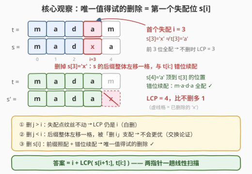
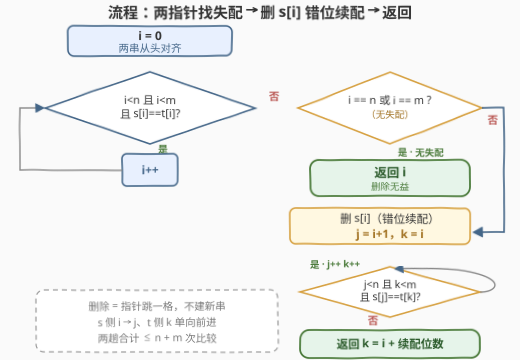

# 最多删除一次后的最长公共前缀

- **题目名称**：最多删除一次后的最长公共前缀
- **链接**：[3460. 最多删除一次后的最长公共前缀](https://leetcode.cn/problems/longest-common-prefix-after-at-most-one-removal/)
- **难度**：中等
- **标签**：双指针、字符串

## 1. 题目概述

> ⚠️ 本题为 LeetCode 付费题，题意描述根据官方示例用例与 hints 重建，可能与官方题面有出入。

给你两个字符串 `s` 和 `t`。你可以从 `s` 中**删除至多一个**字符（也可以不删）。请求出删除后 `s` 与 `t` 的**最长公共前缀**的长度。

**示例 1**：

```text
输入：s = "madxa", t = "madam"
输出：4
解释：删除 s[3] = 'x'，s 变为 "mada"，与 "madam" 的最长公共前缀是 "mada"，长度为 4；不删时前缀只有 "mad"（长度 3）。
```

**示例 2**：

```text
输入：s = "leetcode", t = "eetcode"
输出：7
解释：删除 s[0] = 'l'，s 变为 "eetcode"，与 t 完全相同，最长公共前缀长度为 7。
```

**示例 3**：

```text
输入：s = "one", t = "one"
输出：3
解释：两串本来就相同，不删即可，最长公共前缀长度为 3。
```

**示例 4**：

```text
输入：s = "a", t = "b"
输出：0
解释：无论删不删，首字符都对不上，最长公共前缀长度为 0。
```

**约束条件**（付费题，按同类题惯例推测）：

- $1 \le \text{s.length}, \text{t.length} \le 10^5$ 量级
- 字符串仅包含小写英文字母

> 💡 **读题关键**：① 删除发生在 **`s` 一侧**、**至多一个**字符——这是「一次容错」类问题的标志（680 验证回文串 II、161 相隔为 1 的编辑距离同族）；② 求的是「最长公共前缀」，只关心**从头开始**逐位相等能走多远，后面乱成什么样都与答案无关；③ 官方 hint 已经把答案剧透了一半：*“remove the first position where they differ in s (if any)”*——为什么删在**第一个失配位**就一定最优，是本题唯一需要论证的地方。

---

## 2. 解题思路

### 2.1 暴力思路：枚举删除位置

按题面直译：删除位置共有 $n + 1$ 种选择（不删，或删 $s[0..n)$ 中任意一位），对每种选择从头 $O(\min(n, m))$ 求一次 LCP，取最大值：

- 枚举 $n + 1$ 种选择；
- 每种选择逐位比较，$O(\min(n, m))$。

总体 $O(n \cdot \min(n, m))$，等长时即 $O(n^2)$——$n = 10^5$ 时约 $10^{10}$ 次字符比较，毫无希望。瓶颈在于：**绝大多数删除位置根本影响不到前缀**，暴力却一视同仁地全部重算。

### 2.2 核心观察：只删「第一个失配位」

设 $i$ 为 $s$ 与 $t$ 的**第一个失配位**：$s[0..i) = t[0..i)$ 且 $s[i] \ne t[i]$（若两串一路相等直到一方耗尽，则 $i = \min(n, m)$，视为无失配）。

把 $n + 1$ 种删除选择按删除位置 $j$ 与 $i$ 的相对位置分成三类，逐一清算：

**① 不删，或删在 $i$ 之后（$j > i$）**：删除只影响 $j$ 及以后的位置，失配点 $i$ 纹丝不动——第 $i$ 位仍是 $s[i] \ne t[i]$，LCP 恰为 $i$，一分不多。

**② 删在 $i$ 之前（$j < i$）**：设这样删得到的 LCP 为 $L$，意味着对每个 $k \in [j, L)$ 都有 $s[k+1] = t[k]$（$s$ 自 $j$ 起整体左移一格与 $t$ 对齐）。而 $[i, L) \subseteq [j, L)$，把这些条件原封不动搬过来：**改成删 $s[i]$** 后，前 $i$ 位天然匹配，第 $k \ge i$ 位比较的同样是 $s[k+1]$ 对 $t[k]$——LCP 只会 $\ge L$。即「删 $i$」**支配**「删 $j$」。

**③ 删在 $i$ 处**：删除后 $s' = s[:i] + s[i{+}1:]$，前缀 $s[:i] = t[:i]$ 照常贡献 $i$ 位，此后 $s[i{+}1..]$ 与 $t[i..]$ **错位一格**续配，于是答案为

$$\text{ans} = i + \operatorname{LCP}\big(s[i{+}1:\,],\; t[i:\,]\big)$$



> 💡 **直观理解**：失配点 $i$ 是前缀推进路上的唯一「路障」。删在路障之后，路障还在；删在路障之前，等于把整段后缀提前一格——效果不会比「精准拆掉路障本身」更好。所以唯一值得试的删除就是 $s[i]$，做一次错位续配即可。

**无失配时**（$i = \min(n, m)$）：若 $s$ 先耗尽（$i = n \le m$），删任何字符只会让 $s$ 更短，LCP 至多 $n - 1 < i$；若 $t$ 先耗尽（$i = m < n$），LCP 的上限就是 $m$，已经到手。两种情况答案都是 $i$，删除无益。

### 2.3 算法流程：两指针一趟扫描

1. `i` 从 0 出发，`s[i] == t[i]` 就前进，直到失配或一方耗尽；
2. 若一方耗尽（无失配），直接返回 `i`；
3. 否则**删掉 `s[i]`**：`s` 的指针跳到 `i + 1`，`t` 的指针留在 `i`，错位续配；
4. 续配停止时 `t` 侧指针的位置就是答案（= 前缀 $i$ 位 + 续配位数）。



> ⚠️ **实现要点**：第 3 步的「删除」只是**指针跳一格**，不需要真的构造新串——$s[i{+}1:]$ 与 $t[i:]$ 的比较用下标 `j = i + 1`、`k = i` 续写一个同构的 while 循环即可，全程 $O(1)$ 额外空间。

### 2.4 示例演算：示例 1

`s = "madxa"`，`t = "madam"`：

| 阶段 | 对齐情况 | 结果 |
|------|----------|------|
| 第一趟：找失配 | `mad` 逐位相等，`s[3]='x'` ≠ `t[3]='a'` | $i = 3$ |
| 不删 / 删别处 | 失配点仍停在第 3 位 | LCP $= 3$ |
| 删 `s[3]`，错位续配 | `s[4]='a'` 对上 `t[3]='a'` ✓，之后 `s` 耗尽 | LCP $= 3 + 1 = \mathbf{4}$ |

答案 $4$ ✓。示例 2 同理：$i = 0$（`'l'` ≠ `'e'`），删 `s[0]` 后 `"eetcode"` 与 $t$ 完全相同，LCP $= 0 + 7 = 7$ ✓。

---

## 3. 参考代码

### C++

```cpp
class Solution {
  public:
    int longestCommonPrefix(string s, string t) {
        const int n = s.size(), m = t.size();
        int i = 0;
        while (i < n && i < m && s[i] == t[i]) ++i;   // 第一趟：找首个失配位
        if (i == n || i == m) return i;               // 无失配：删除无益
        int j = i + 1, k = i;                         // 删 s[i]：错位一格续配
        while (j < n && k < m && s[j] == t[k]) { ++j; ++k; }
        return k;                                     // k = i + 续配位数
    }
};
```

### Python

```python
class Solution:
    def longestCommonPrefix(self, s: str, t: str) -> int:
        n, m = len(s), len(t)
        i = 0
        while i < n and i < m and s[i] == t[i]:       # 第一趟：找首个失配位
            i += 1
        if i == n or i == m:                          # 无失配：删除无益
            return i
        j, k = i + 1, i                               # 删 s[i]：错位一格续配
        while j < n and k < m and s[j] == t[k]:
            j += 1
            k += 1
        return k                                      # k = i + 续配位数
```

> 💡 **实现细节**：① 「删除」退化为指针跳格，两个 while 共用一次线性扫描，总比较次数不超过 $n + m$；② 续配循环结束时直接返回 `k`（`t` 侧指针），它天然等于 $i + $ 续配位数，无需再算差值；③ 若官方实际要求返回前缀**字符串**而非长度，把返回值改成 `t[:k]` 即可，算法不变；若题意允许从 `t` 侧删除（本文按 hint 重建为仅 `s` 侧），对称地再算一遍取 $\max$ 即可。

---

## 4. 复杂度分析

| 维度 | 复杂度 | 说明 |
|------|--------|------|
| 时间复杂度 | $O(n + m)$ | 两个 while 的指针各自单调前进，每个字符至多被比较常数次 |
| 空间复杂度 | $O(1)$ | 只用下标 `i / j / k`，不构造删除后的新串 |
| 暴力对照 | $O(n \cdot \min(n, m))$ | 枚举 $n+1$ 种删除各重算一遍 LCP，等长时 $10^{10}$ 量级 |

---

## 5. 扩展：「一次容错」家族与至多删 $k$ 次

**一次容错双指针**是一整个家族，套路统一为「线性推进到第一个矛盾点，再枚举寥寥几种容错方式」：

| 题目 | 失配后的分支 |
|------|--------------|
| 680. 验证回文串 II | 左跳一格 or 右跳一格，再验证回文 |
| 161. 相隔为 1 的编辑距离 | 删 / 增 / 改一次后两串相等，归结为同一套错位比较 |
| 本题 | 只删 $s[i]$ 一侧，错位续配取最长 |

**至多删 $k$ 次**的推广：把「删在第一个失配位」迭代执行——每次失配就删掉 `s` 的当前字符（预算 $k$ 次），等价于让 `s` 的指针最多**滞后** `t` 的指针 $k$ 格。形式化地说，答案是最大的 $L$，使得存在下标 $q_0 < q_1 < \cdots < q_{L-1}$ 满足 $s[q_r] = t[r]$ 且 $q_r \le r + k$——一个**带期限的贪心匹配**：每一步取最早的可行匹配，只会给后面留出更宽裕的期限（交换论证逐位传递），因此整体仍是 $O(n + m)$ 的线性扫描。

---

## 6. 面试要点

1. **为什么删第一个失配位就一定最优？删别处为什么不行？**

   - 分三类清算：删 $j > i$，失配点 $i$ 不受影响，LCP 仍是 $i$；删 $j < i$，若得 LCP 为 $L$，则 $[i, L) \subseteq [j, L)$ 上的错位条件 $s[k+1] = t[k]$ 对「删 $i$」同样成立，故删 $i$ 的 LCP $\ge L$（支配关系）。最优解必在「不删」与「删 $s[i]$」之中，而后者恒不小于前者。

2. **无失配（一方先耗尽）时为什么直接返回 $i$？**

   - $i = n \le m$：删任何字符都让 $s$ 更短，LCP 至多 $n - 1 < i$；$i = m < n$：LCP 上限就是 $m$，已经到手。两种情况答案均为 $i$，删除无益。

3. **「删除」在代码里是怎么实现的？**

   - 不构造新串，只把 `s` 侧指针从 `i` 跳到 `i + 1`，`t` 侧指针留在 `i`，续写一个同构的 while 循环——删除即错位，空间 $O(1)$。

4. **这题和 680（验证回文串 II）、161（相隔为 1 的编辑距离）是什么关系？**

   - 同属「一次容错双指针」：都是先推进到第一个矛盾点，再枚举少数几种容错方式各验证一次。区别只在容错动作：680 是双侧跳（回文对称性），161 是删/增/改（两侧对称），本题是单侧删且求最长而非判定。

5. **如果允许删至多 $k$ 个字符呢？**

   - 迭代同一贪心：每次失配删掉 `s` 当前字符，至多 $k$ 次，等价于 `s` 指针允许滞后 `t` 指针至多 $k$ 格的带期限贪心匹配，仍可 $O(n + m)$ 完成。

---

## 7. 同类练习题

- [14. 最长公共前缀](https://leetcode.cn/problems/longest-common-prefix/)（[站内题解](../0001-0100/14_最长公共前缀.md)）：LCP 纵向扫描的基础原型——本题去掉「删除」就是它
- [680. 验证回文串 II](https://leetcode.cn/problems/valid-palindrome-ii/)（[站内题解](../0601-0700/680_验证回文串II.md)）：「至多删一个」的判定版——第一个失配点两侧各试一次，同一容错骨架
- [161. 相隔为 1 的编辑距离](https://leetcode.cn/problems/one-edit-distance/)（[站内题解](../0101-0200/161_相隔为1的编辑距离.md)）：一次编辑（删/增/改）判定——错位比较的另一种分支枚举
- [392. 判断子序列](https://leetcode.cn/problems/is-subsequence/)（[站内题解](../0301-0400/392_判断子序列.md)）：双指针贪心匹配的纯化版——「删任意多个」的极端推广（$s$ 删剩子序列去对齐 $t$）
- [28. 找出字符串中第一个匹配项的下标](https://leetcode.cn/problems/find-the-index-of-the-first-occurrence-in-a-string/)（[站内题解](../0001-0100/28_找出字符串中第一个匹配项的下标.md)）：从头匹配的另一形态——对比「前缀匹配」与「任意位置匹配」的难度差异
