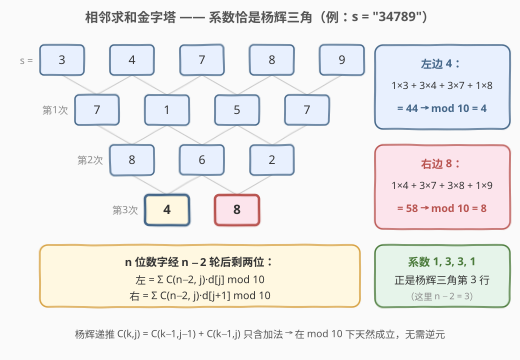
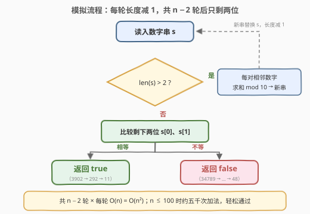

# 判断操作后字符串中的数字是否相等 I

- **题目名称**：判断操作后字符串中的数字是否相等 I
- **链接**：[3461. 判断操作后字符串中的数字是否相等 I](https://leetcode.cn/problems/check-if-digits-are-equal-in-string-after-operations-i/)
- **难度**：简单
- **标签**：数学、字符串、组合数学、数论、模拟

## 1. 题目概述

给你一个由数字组成的字符串 `s`。重复执行以下操作，直到字符串恰好包含**两个**数字：

- 从第一个数字开始，对于 `s` 中的**每一对连续数字**，计算这两个数字的**和模 10**；
- 用计算得到的新数字依次替换 `s` 的每一个字符，并保持原本的顺序。

如果 `s` 最后剩下的两个数字**相同**，返回 `true`；否则，返回 `false`。

**示例 1**：

```text
输入：s = "3902"
输出：true
解释：
  第一次操作：(3+9)%10=2, (9+0)%10=9, (0+2)%10=2 → s = "292"
  第二次操作：(2+9)%10=1, (9+2)%10=1           → s = "11"
  "11" 两位相同，返回 true
```

**示例 2**：

```text
输入：s = "34789"
输出：false
解释：
  第一次操作后 s = "7157"，第二次后 s = "862"，第三次后 s = "48"
  '4' != '8'，返回 false
```

**约束条件**：

- `3 <= s.length <= 100`
- `s` 仅由数字组成。

---

## 2. 解题思路

### 2.1 暴力思路：直接模拟

题意本身就是一份伪代码：每一轮把当前串的所有相邻数对 `(s[i], s[i+1])` 收缩成一个新数字 `(s[i] + s[i+1]) mod 10`，串长减 1；从长度 `n` 一路缩到 2 共需 `n − 2` 轮，最后比较剩下的两位。

```text
while len(s) > 2:
    s = [(s[i] + s[i+1]) % 10 for i in 0 .. len(s)-2]
return s[0] == s[1]
```

每轮扫描当前整串，总时间 `O(n^2)`。本题 `n <= 100`，全程不到一万次加法，轻松通过——这也是官方 hint 给出的预期解法。

### 2.2 核心观察：相邻求和金字塔 = 杨辉三角系数加权



把整个过程画成金字塔（以 `"34789"` 为例）：每一层的每个数是上一层相邻两数之和 mod 10。**关键在于这个操作是线性的**——新串每一位都是旧串若干位的加权和，而「求和后取模」不会破坏这种线性结构。

对轮数归纳可以精确写出系数：设初始数字为 $d_0, d_1, \dots, d_{n-1}$，则第 `k` 轮操作后第 `i` 位为

$$T_k(i) = \sum_{j=0}^{k} \binom{k}{j} \cdot d_{i+j} \pmod{10}$$

- `k = 1` 时显然成立（系数为 `1, 1`）；
- 若对 `k` 成立，再做一轮：$T_{k+1}(i) = T_k(i) + T_k(i+1) = \sum_j \left[\binom{k}{j} + \binom{k}{j-1}\right] d_{i+j} = \sum_j \binom{k+1}{j} d_{i+j}$，恰好用上**杨辉三角递推** $\binom{k+1}{j} = \binom{k}{j-1} + \binom{k}{j}$。

于是 `n` 个数字经 `n − 2` 轮后剩下的两位有闭式（系数即杨辉三角第 `n − 2` 行）：

$$L = \sum_{j=0}^{n-2} \binom{n-2}{j} d_j \pmod{10}, \qquad R = \sum_{j=0}^{n-2} \binom{n-2}{j} d_{j+1} \pmod{10}$$

> 💡 验证 `"34789"`：`n − 2 = 3`，系数为 `1, 3, 3, 1`。$L = 1{\times}3 + 3{\times}4 + 3{\times}7 + 1{\times}8 = 44 \equiv 4$，$R = 1{\times}4 + 3{\times}7 + 3{\times}8 + 1{\times}9 = 58 \equiv 8$，与逐轮模拟得到的 `"48"` 完全一致。

> ⚠️ 模数 **10 是合数**，不能用费马小定理求逆元来算 $\binom{n-2}{j} \bmod 10$（逆元要求 $\gcd(x, 10) = 1$）。好在杨辉递推**只含加法**，模意义下天然保持同态——直接对递推取模即可；Python 也可以用大数算出精确组合数后再取模。

### 2.3 算法流程图



模拟解法只有一个主循环：判断长度、生成新串、回到判断；长度缩到 2 时比较两位输出。

---

## 3. 参考代码

### C++（直接模拟）

```cpp
class Solution {
  public:
    bool hasSameDigits(string s) {
        vector<int> a;
        for (char c : s) a.push_back(c - '0');
        while (a.size() > 2) {
            vector<int> b;
            for (int i = 0; i + 1 < (int)a.size(); i++)
                b.push_back((a[i] + a[i + 1]) % 10);
            a = move(b);
        }
        return a[0] == a[1];
    }
};
```

### Python（zip 相邻配对）

```python
class Solution:
    def hasSameDigits(self, s: str) -> bool:
        a = [int(c) for c in s]
        while len(a) > 2:
            a = [(x + y) % 10 for x, y in zip(a, a[1:])]
        return a[0] == a[1]
```

---

## 4. 复杂度分析

| 维度 | 复杂度 | 说明 |
|------|--------|------|
| 时间复杂度 | O(n^2) | 共 `n − 2` 轮，第 `i` 轮处理 `n − i` 个数对，总计约 `n² / 2` 次加法 |
| 空间复杂度 | O(n) | 存放当前串与临时新串；逐位原地覆写可降到 O(1) 额外空间 |

---

## 5. 扩展：O(n) 组合数闭式（通往第 II 版）

利用 2.2 的闭式可以**跳过全部中间轮次**，直接算出最终两位。`n <= 100` 时 Python 的大数 `math.comb` 绰绰有余：

```python
from math import comb

class Solution:
    def hasSameDigits(self, s: str) -> bool:
        d = list(map(int, s))
        k = len(d) - 2
        L = sum(comb(k, j) * d[j] for j in range(k + 1)) % 10
        R = sum(comb(k, j) * d[j + 1] for j in range(k + 1)) % 10
        return L == R
```

进阶版 [3463. 判断操作后字符串中的数字是否相等 II](https://leetcode.cn/problems/check-if-digits-are-equal-in-string-after-operations-ii/) 把长度放大到 `10^5`：模拟 `O(n^2)` 与大数组合数都会超时，需要把模数 $10 = 2 \times 5$ 拆开计算：

- $\binom{k}{j} \bmod 2$：二进制 Lucas 定理——当且仅当 `j` 的二进制是 `k` 的子掩码时为 `1`；
- $\binom{k}{j} \bmod 5$：对 `k`、`j` 的五进制各位逐位套用 Lucas 定理；
- 最后用**中国剩余定理（CRT）** 把 mod 2 与 mod 5 的结果合并回 mod 10，整体 `O(n log n)`。

---

## 6. 面试要点

1. **模拟的时间复杂度是多少，本题够用吗？**
   - 每轮 `O(当前长度)`，共 `n − 2` 轮，总计 `O(n^2)`；`n <= 100` 时约五千次加法，绰绰有余。进阶版 `n` 到 `10^5` 时必须改用组合数闭式。

2. **为什么最终两位恰好是二项式系数加权和？**
   - 单轮操作是线性变换；对轮数归纳，系数从 `(1, 1)` 出发每轮按杨辉递推 $\binom{k+1}{j} = \binom{k}{j-1} + \binom{k}{j}$ 演化，`n − 2` 轮后即杨辉三角第 `n − 2` 行。

3. **模 10 不是质数，组合数取模有什么坑？**
   - 不能用费马小定理求逆元（逆元存在性要求 $\gcd(x, 10) = 1$，偶数和 5 的倍数没有逆元）。但杨辉递推只含加法，模意义下天然同态；要快速精确计算需拆成 mod 2 / mod 5 分别用 Lucas 定理，再 CRT 合并。

4. **为什么 mod 10 可以拆成 mod 2 和 mod 5？**
   - $10 = 2 \times 5$ 且 $\gcd(2, 5) = 1$，中国剩余定理保证一对 `(x mod 2, x mod 5)` 唯一确定 `x mod 10`；而 2 和 5 都是质数，正好可以套 Lucas 定理。

5. **中途能否提前判断「两位是否相等」来剪枝？**
   - 不能。「两位相等」只在长度为 2 时才有定义，中途数字不携带任何关于最终结果的单调信息，只能一路算到底。

---

## 7. 同类练习题

- [3463. 判断操作后字符串中的数字是否相等 II](https://leetcode.cn/problems/check-if-digits-are-equal-in-string-after-operations-ii/)（[题解](../3401-3500/3463_判断操作后字符串中的数字是否相等II.md)）：本题进阶版（困难），`n` 放大到 `10^5`，必须用 Lucas 定理求 $\binom{n-2}{j} \bmod 2 / \bmod 5$ 再 CRT 合并
- [118. 杨辉三角](https://leetcode.cn/problems/pascals-triangle/)：杨辉递推 $\binom{k}{j} = \binom{k-1}{j-1} + \binom{k-1}{j}$ 的生成表基础练习
- [62. 不同路径](https://leetcode.cn/problems/unique-paths/)（[题解](../0001-0100/62_不同路径.md)）：路径计数 = $\binom{m+n-2}{m-1}$，二项式系数的另一经典来源
- [2400. 恰好移动 k 步到达某一位置的方法数目](https://leetcode.cn/problems/number-of-ways-to-reach-a-position-after-exactly-k-steps/)（[题解](../2301-2400/2400_恰好移动k步到达某一位置的方法数目.md)）：模**质数**下的组合数计数（费马小定理求逆元），可与本题「模合数 10」形成对照
