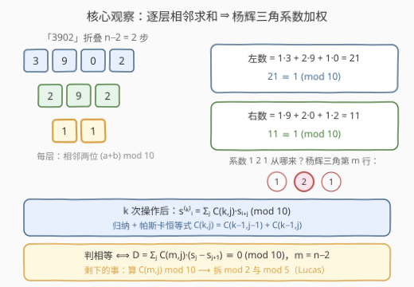
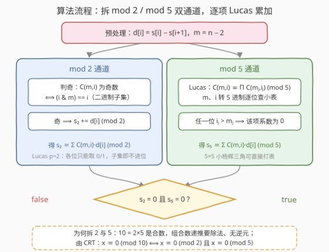

# 判断操作后字符串中的数字是否相等II

- **题目名称**：判断操作后字符串中的数字是否相等II
- **链接**：[3463. Check if Digits are Equal in String After Operations II](https://leetcode.cn/problems/check-if-digits-are-equal-in-string-after-operations-ii/)
- **难度**：困难
- **标签**：数学、字符串、组合数学、数论

## 1. 题目概述

给你一个由数字组成的字符串 `s`。重复执行以下操作，直到字符串恰好包含**两个**数字：

- 从第一个数字开始，对于 `s` 中的每一对连续数字，计算这两个数字的**和模 10**；
- 用计算得到的新数字依次替换 `s` 的每一个字符，并保持原本的顺序。

如果 `s` 最后剩下的两个数字相同，则返回 `true`；否则返回 `false`。

**示例 1**：

```text
输入：s = "3902"
输出：true
解释：
一开始 s = "3902"
第一次操作：(3+9)%10=2, (9+0)%10=9, (0+2)%10=2 → s = "292"
第二次操作：(2+9)%10=1, (9+2)%10=1 → s = "11"
由于 "11" 中的数字相同，输出 true。
```

**示例 2**：

```text
输入：s = "34789"
输出：false
解释：
第一次操作后 s = "7157"，第二次后 s = "862"，第三次后 s = "48"。
由于 '4' != '8'，输出 false。
```

**约束条件**：

- $3 \le s.length \le 10^5$
- `s` 仅由数字组成

> 💡 **读题关键**：① 每次操作让长度减 1，`n` 个数字恰好操作 $n-2$ 次后剩 2 个；② 相邻求和模 10 是**线性运算**，可以层层展开——这正是通往组合数学（杨辉三角）的入口；③ $n$ 高达 $10^5$，逐层模拟 $O(n^2)$ 必然超时，必须一步跳到"最终公式"。

---

## 2. 解题思路

### 2.1 暴力思路：逐层模拟

最直接的做法是照着题意模拟：每轮对长度为 $L$ 的串做 $L-1$ 次相邻求和，总共 $\sum_{L=3}^{n}(L-1) = O(n^2)$ 次操作。$n = 10^5$ 时约 $5 \times 10^9$ 次基本运算，必然超时——这正是本题与 Part I（[3461](https://leetcode.cn/problems/check-if-digits-are-equal-in-string-after-operations-i/)，$n \le 300$ 可直接模拟）的分水岭。

暴力失败的本质是：**把"过程"当成了必须逐步走完的东西**。而相邻求和是线性的，$n-2$ 层复合可以一步展开成闭式。

### 2.2 核心观察：相邻求和收敛到杨辉三角系数



**观察一（一层操作 = 一次相邻线性组合）**：记一次操作为 $T(s)_i = s_i + s_{i+1} \pmod{10}$。

**观察二（k 层复合 = 二项式系数加权）**：对 $k$ 归纳可证

$$s^{(k)}_i = \sum_{j=0}^{k} \binom{k}{j} \, s_{i+j} \pmod{10}$$

- $k=1$ 时显然；归纳步由**帕斯卡恒等式** $\binom{k}{j} = \binom{k-1}{j-1} + \binom{k-1}{j}$ 直接合项，如上图底部公式框所示。

**观察三（最终判等 = 差值加权判零）**：设 $m = n - 2$，两个终值分别是

$$r_1 = \sum_{j=0}^{m}\binom{m}{j} s_j, \qquad r_2 = \sum_{j=0}^{m}\binom{m}{j} s_{j+1} \pmod{10}$$

两式系数**完全相同**，故

$$r_1 \equiv r_2 \pmod{10} \iff D = \sum_{j=0}^{m}\binom{m}{j}\,\big(s_j - s_{j+1}\big) \equiv 0 \pmod{10}$$

只需对差值数组 $d[j] = s_j - s_{j+1}$ 做一次加权求和。

**观察四（模 10 是合数，组合数没法"递推"）**：想逐项递推 $\binom{m}{j+1} = \binom{m}{j} \cdot \frac{m-j}{j+1}$，需要除法；而模 10 下分母含因子 2 或 5 时**不存在逆元**，递推链断裂。出路是把 10 拆成素数：

$$x \equiv 0 \pmod{10} \iff x \equiv 0 \pmod 2 \ \text{且}\ x \equiv 0 \pmod 5 \quad (\text{CRT 唯一性})$$

两个素数模下都能用**卢卡斯定理（Lucas' theorem）**逐项求 $\binom{m}{i} \bmod p$：

$$\binom{m}{i} \equiv \prod_j \binom{m_j}{i_j} \pmod p$$

其中 $m_j, i_j$ 是 $m, i$ 的 $p$ 进制各位——每位上的小组合数查 $5\times5$ 的杨辉三角小表即可，任一位 $i_j > m_j$ 则整个系数为 0。

- **模 2 特例（一行位运算）**：$p=2$ 时每位 $m_j, i_j \in \{0,1\}$，$\binom{m_j}{i_j}$ 只在 $i_j \le m_j$ 时为 1。因此 $\binom{m}{i}$ 为**奇数**当且仅当 $i$ 的二进制是 $m$ 的子集，即 `(i & m) == i`。

### 2.3 算法流程图



整体流程：

1. **预处理**：计算差值数组 $d[i] = s_i - s_{i+1}$（共 $n-1$ 个），令 $m = n-2$；打表 $5 \times 5$ 的小杨辉三角（模 5）；
2. **mod 2 通道**：对每个 $i \in [0, m]$，若 `(i & m) == i` 则把 $d[i]$ 累加进 $s_2$（模 2）；
3. **mod 5 通道**：对每个 $i$，用 Lucas 定理把 $m, i$ 转成 5 进制逐位查小表算出 $c_5 = \binom{m}{i} \bmod 5$，把 $c_5 \cdot d[i]$ 累加进 $s_5$（模 5）；
4. **判定**：`s2 == 0 && s5 == 0` 即为答案。

### 2.4 示例演算

以示例 1 `s = "3902"` 演算（$n=4$，$m=2$，$d = [-6, 9, -2]$，系数 $\binom{2}{i} = 1, 2, 1$）：

| 通道 | 逐项计算 | 累加结果 |
|------|----------|----------|
| 直接验证 | $D = 1\cdot(-6) + 2\cdot 9 + 1\cdot(-2) = 10$ | $10 \equiv 0 \pmod{10}$ ✓ |
| mod 2 | $m=2=(10)_2$，$i=0,2$ 是子集（$i=1$ 不是） | $s_2 = -6 + (-2) = -8 \equiv 0 \pmod 2$ ✓ |
| mod 5 | $\binom{2}{i} \bmod 5 = 1, 2, 1$ | $s_5 = -6 + 2\cdot 9 - 2 = 10 \equiv 0 \pmod 5$ ✓ |

两个通道均为 0 → 输出 `true` ✓。

再看示例 2 `s = "34789"`（$m=3$，$d = [-1, -3, -1, -1]$，系数 $1,3,3,1$）：$D = -1 - 9 - 3 - 1 = -14 \equiv 6 \pmod{10} \ne 0$，且 mod 5 通道 $-14 \equiv 1 \not\equiv 0$ → 输出 `false` ✓。

---

## 3. 参考代码

### C++

```cpp
class Solution {
  public:
    bool hasSameDigits(string s) {
        int n = s.size(), m = n - 2;
        vector<int> d(n - 1);
        for (int i = 0; i + 1 < n; i++) d[i] = (s[i] - '0') - (s[i + 1] - '0');

        int C5[5][5] = {};                          // 5×5 小杨辉三角（模 5）
        for (int a = 0; a < 5; a++) {
            C5[a][0] = 1;
            for (int b = 1; b <= a; b++)
                C5[a][b] = (C5[a - 1][b - 1] + C5[a - 1][b]) % 5;
        }
        auto lucas5 = [&](int mm, int ii) {         // C(mm, ii) mod 5
            int r = 1;
            while (mm || ii) {
                int a = mm % 5, b = ii % 5;
                if (b > a) return 0;                // 某位 i_j > m_j ⇒ 系数为 0
                r = r * C5[a][b] % 5;
                mm /= 5;
                ii /= 5;
            }
            return r;
        };

        int s2 = 0, s5 = 0;
        for (int i = 0; i <= m; i++) {
            if (d[i] == 0) continue;
            if ((i & m) == i)                       // C(m,i) 为奇数
                s2 = (s2 + d[i] % 2 + 2) % 2;       // d[i] 可能为负，先 +2 归正
            s5 = (s5 + lucas5(m, i) * (d[i] % 5 + 5) % 5 + 5) % 5;
        }
        return s2 == 0 && s5 == 0;
    }
};
```

> ⚠️ `d[i]` 取值 $[-9, 9]$，C++ 的 `%` 对负数返回负余数，累加前必须 `+2` / `+5` 归正；Python 的 `%` 天然返回非负，无此坑。

### Python

```python
class Solution:
    def hasSameDigits(self, s: str) -> bool:
        n = len(s)
        m = n - 2
        d = [int(s[i]) - int(s[i + 1]) for i in range(n - 1)]

        C5 = [[0] * 5 for _ in range(5)]            # 5×5 小杨辉三角（模 5）
        for a in range(5):
            C5[a][0] = 1
            for b in range(1, a + 1):
                C5[a][b] = (C5[a - 1][b - 1] + C5[a - 1][b]) % 5

        def lucas5(mm: int, ii: int) -> int:        # C(mm, ii) mod 5
            r = 1
            while mm or ii:
                a, b = mm % 5, ii % 5
                if b > a:
                    return 0
                r = r * C5[a][b] % 5
                mm //= 5
                ii //= 5
            return r

        s2 = s5 = 0
        for i, dv in enumerate(d):
            if dv == 0:
                continue
            if (i & m) == i:                        # C(m,i) 为奇数
                s2 = (s2 + dv) % 2
            s5 = (s5 + lucas5(m, i) * dv) % 5
        return s2 == 0 and s5 == 0
```

> 💡 两份代码均已与 $O(n^2)$ 逐层模拟对拍验证（20000 组随机数据）；$n = 10^5$ 时 C++ 约 2 ms、Python 约 0.12 s。

---

## 4. 复杂度分析

| 维度 | 复杂度 | 说明 |
|------|--------|------|
| **时间复杂度** | $O(n \log_5 n)$ | 每个下标 $i$：模 2 判断 $O(1)$ 位运算，模 5 的 Lucas 逐位处理 $O(\log_5 n)$（$n=10^5$ 时仅约 8 位）；总计约 $8 \times 10^5$ 次基本操作 |
| **空间复杂度** | $O(n)$ | 差值数组 $d$；小杨辉三角恒为 $5 \times 5$ 常数空间（改为流式读入可降到 $O(1)$） |

---

## 5. 扩展：Kummer 定理视角与"数字子集"优化

**为什么 Lucas 的"逐位比较"等价于"不进位"？** Kummer 定理指出：$\binom{m}{i}$ 中素数 $p$ 的幂次，等于 $m - i$ 与 $i$ 在 $p$ 进制**加法中的进位次数**。进位次数为 0 ⟺ 每位 $i_j \le m_j$ ⟺ Lucas 乘积中没有任何 $\binom{m_j}{i_j}$ 因 0 项。模 2 的子集判据正是它的特例：二进制每位只有 0/1，"每位 $i_j \le m_j$"就是"$i$ 的 1 位都被 $m$ 覆盖"，即 `(i & m) == i`。

**为什么不能拆成素数后递推？** 即便模 2 / 模 5 分开，递推式 $\binom{m}{i+1} = \binom{m}{i}\cdot\frac{m-i}{i+1}$ 的分母仍可能含 $p$ 本身（如 $i+1 = 5$），逆元依然不存在。通用解法是带 $p$ 幂次追踪的"扩展 Lucas"（把组合数拆成 $p^e \cdot u$，$u$ 与 $p$ 互素的部分才用逆元），但对本题**每个系数独立查询**的形态，直接 Lucas 一次 $O(\log_p n)$ 反而更简单。

**只枚举非零系数**：满足 $\binom{m}{i} \not\equiv 0 \pmod 5$ 的 $i$ 恰是 $m$ 的 5 进制"数字子集"（每位独立取 $0 \sim m_j$），共 $\prod_j (m_j + 1)$ 个。当 $m$ 的 5 进制各位偏小时（如大量位是 1、2），非零项远少于 $n$，可 DFS 枚举子集代替全量扫描；最坏情况（各位全是 4，$m$ 接近 $5^8$）为 $5^8 \approx 3.9 \times 10^5$ 项，仍在安全范围内。本题全量扫描已足够快，此优化仅作视野扩展。

---

## 6. 面试要点

1. **怎么从"逐层求和"想到杨辉三角？**

   - 小数据打表：手算 `"3902"` 的折叠过程，会发现第 2 层的每个数恰好是"1 份 + 2 份 + 1 份"的加权；或直接归纳：相邻求和复合一次，系数按帕斯卡恒等式 $\binom{k}{j} = \binom{k-1}{j-1} + \binom{k-1}{j}$ 合并——这正是杨辉三角的生成规则。

2. **为什么模 10 下组合数不能递推？怎么破？**

   - 递推要做除法，10 = 2×5 是合数，含因子 2/5 的分母没有逆元。破法是 CRT 拆解：$x \bmod 10$ 由 $x \bmod 2$ 与 $x \bmod 5$ 唯一确定；判 $x \equiv 0 \pmod{10}$ 更是只需两个分量都为 0，连显式 CRT 合并都省了。

3. **Lucas 定理的内容与复杂度？**

   - $\binom{m}{i} \bmod p = \prod_j \binom{m_j}{i_j} \bmod p$，$m_j, i_j$ 为 $p$ 进制各位；单次查询 $O(\log_p n)$，本题为 $O(n \log_5 n)$。各位的小组合数用 $p \times p$ 杨辉小表查得，任一位 $i_j > m_j$ 直接为 0。

4. **模 2 为什么退化成 `(i & m) == i`？**

   - Kummer 定理：$\binom{m}{i}$ 不被 $p$ 整除 ⟺ $i + (m-i)$ 在 $p$ 进制下不进位 ⟺ 逐位 $i_j \le m_j$。$p=2$ 时各位非 0 即 1，条件变成"i 的 1 位都被 m 覆盖"，即二进制子集判断，一条位运算搞定。

5. **不判差值、直接分别算 $r_1, r_2$ 行不行？**

   - 完全可行：对起点 0 和起点 1 各做一次系数加权求和再比较。合并成差值 $d[i] = s_i - s_{i+1}$ 的好处是**一次遍历同时覆盖两个终值**，且 $d[i] = 0$ 的项可直接跳过，常数更小。

> 💡 **一句话总结**：相邻求和 $n-2$ 层 = 杨辉三角第 $n-2$ 行系数加权，判等即差值加权判零；模 10 合数无逆元，拆 mod 2（位运算判子集）+ mod 5（Lucas 逐位查表）双通道累加即可。

---

## 7. 同类练习题

- [3461. 判断操作后字符串中的数字是否相等 I](https://leetcode.cn/problems/check-if-digits-are-equal-in-string-after-operations-i/)：本题的暴力版，$n \le 300$ 直接逐层模拟，体会 I/II 之间"模拟 → 数学"的经典升级
- [118. 杨辉三角](https://leetcode.cn/problems/pascals-triangle/)：帕斯卡恒等式的直接应用，理解本题系数来源的母题
- [119. 杨辉三角 II](https://leetcode.cn/problems/pascals-triangle-ii/)：只要一行组合数，滚动生成与空间压缩的基本功
- [1735. 生成乘积数组的方案数](https://leetcode.cn/problems/count-ways-to-make-array-with-product/)：组合数 + 质因数分解的数论组合题，同样考察"模运算下组合数怎么算"
- [2338. 统计理想数组的数目](https://leetcode.cn/problems/count-the-number-of-ideal-arrays/)：大组合数模素数 + 质因数幂分解的进阶组合计数，与本题共用"组合数取模"工具箱
