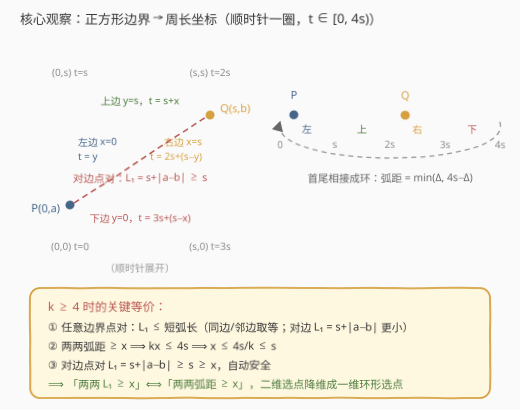
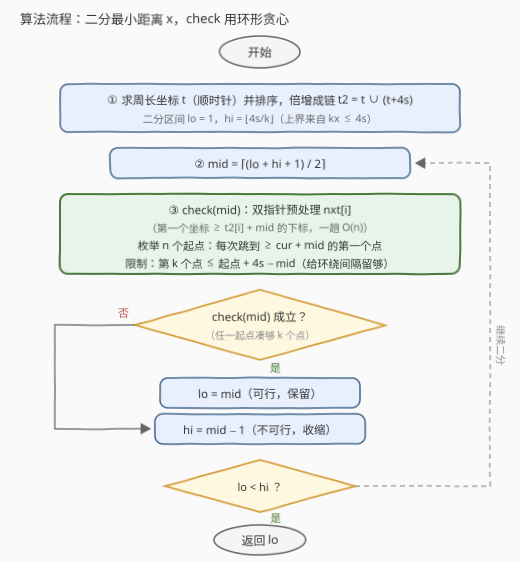

# 正方形上的点之间的最大距离

- **题目名称**：正方形上的点之间的最大距离
- **链接**：[3464. 正方形上的点之间的最大距离](https://leetcode.cn/problems/maximize-the-distance-between-points-on-a-square/)
- **难度**：困难
- **标签**：几何、二分查找、贪心、排序

## 1. 题目概述

给你一个整数 `side`，表示一个正方形的边长，正方形的四个角分别位于笛卡尔平面的 `(0, 0)`、`(0, side)`、`(side, 0)` 和 `(side, side)` 处。

同时给你一个正整数 `k` 和一个二维整数数组 `points`，其中 `points[i] = [x_i, y_i]` 表示一个点在正方形**边界**上的坐标。

你需要从 `points` 中选择 `k` 个元素，使得任意两个点之间的**最小曼哈顿距离最大化**。返回选定的 `k` 个点之间的最小曼哈顿距离的最大可能值。

两个点 $(x_i, y_i)$ 和 $(x_j, y_j)$ 之间的曼哈顿距离为 $|x_i - x_j| + |y_i - y_j|$。

**示例 1**：

```text
输入：side = 2, points = [[0,2],[2,0],[2,2],[0,0]], k = 4
输出：2
解释：选择所有四个点（恰为四个角）。
      相邻角距离 2，对角距离 4，最小值为 2。
```

**示例 2**：

```text
输入：side = 2, points = [[0,0],[1,2],[2,0],[2,2],[2,1]], k = 4
输出：1
解释：选择点 (0, 0)、(2, 0)、(2, 2) 和 (2, 1)。
```

**示例 3**：

```text
输入：side = 2, points = [[0,0],[0,1],[0,2],[1,2],[2,0],[2,2],[2,1]], k = 5
输出：1
解释：选择点 (0, 0)、(0, 1)、(0, 2)、(1, 2) 和 (2, 2)。
```

**约束条件**：

- $1 \le \text{side} \le 10^9$
- $4 \le \text{points.length} \le \min(4 \times \text{side},\ 15 \times 10^3)$
- $\text{points[i]} = [x_i, y_i]$，且 $\text{points[i]}$ 位于正方形的边界上
- 所有 $\text{points[i]}$ 互不相同
- $4 \le k \le \min(25,\ \text{points.length})$

> 💡 **读题关键**：① 「最小值最大化」是**二分答案**的标志性信号——把最优问题转成「给定距离 $x$，能否选出 $k$ 个两两距离 $\ge x$ 的点」的单调判定问题；② 所有点都在**边界**上，这是全题的命门：边界是一条**闭合曲线**，可以展开成一条周长为 $4s$ 的「数轴」，二维距离问题即可降维成一维；③ $k \le 25$ 很小，判定过程里允许 $O(nk)$ 级别的扫描。

---

## 2. 解题思路

### 2.1 暴力思路：枚举所有 k 元子集

从 $n \le 15000$ 个点中枚举所有 $\binom{n}{k}$ 个大小为 $k$ 的子集，对每个子集用 $O(k^2)$ 算出最小两两曼哈顿距离，取最大值。

$\binom{15000}{25}$ 是天文数字（远超 $10^{80}$），完全不可行。瓶颈在于**组合爆炸**——但注意判定「是否存在一个最小距离 $\ge x$ 的子集」这件事本身未必难，于是自然引向二分答案。

### 2.2 核心观察：周长展开 + 二分答案 + 环形贪心

**观察一：边界点与周长坐标一一对应。**

从 $(0,0)$ 出发**顺时针**沿边界走一圈（先沿左边向上，再沿上边向右，再沿右边向下，最后沿下边向左回到原点），把走过的距离记为周长坐标 $t \in [0, 4s)$。每个边界点由 $t$ 唯一确定（$t$ 与边界点一一对应）：

| 所在边 | 判定条件 | 周长坐标 $t$ |
|---|---|---|
| 左边 | $x = 0$ | $t = y$ |
| 上边 | $y = s$ | $t = s + x$ |
| 右边 | $x = s$ | $t = 2s + (s - y)$ |
| 下边 | $y = 0$ | $t = 3s + (s - x)$ |

（角点属于两条边的公共端点，按上表分支顺序任取一种即可，四个角恰好分到 $t = 0, s, 2s, 3s$，互不冲突。）

**观察二：曼哈顿距离 ≤ 环上较短弧长，且只在「对边点对」时可能严格小于。**

设两点的周长坐标差为 $\Delta = |t_P - t_Q|$，环上较短弧长即 $\min(\Delta,\ 4s - \Delta)$。对 $P, Q$ 所在的边分类讨论：

- **同一条边**：$L_1 = |\Delta t| = $ 沿边弧长，显然等于较短弧长；
- **相邻边**（共享角 $C$）：$L_1 = |PC| + |CQ|$，恰为经过角 $C$ 的那段弧长，且它一定不超过绕另一侧的弧长，故 $L_1 = $ 较短弧长；
- **相对边**（左/右 或 上/下）：设两点沿各自边的「进度」为 $a, b$（如左/右边上取纵坐标），则 $L_1 = s + |a - b|$；而两条弧长分别为 $s + a + b$ 与 $3s - a - b$，较短弧 $= s + \min(a+b,\ 2s - a - b) \ge s + |a - b| = L_1$，等号当且仅当至少一点位于角上。

于是恒有 $L_1 \le \min(\Delta, 4s - \Delta)$。这给出一个**必要条件**：若两两 $L_1 \ge x$，则两两弧距 $\ge x$。

**观察三（本题命门）：$k \ge 4$ 把答案压进 $s$ 以内，恰好屏蔽对边误差。**

若能选出 $k$ 个两两弧距 $\ge x$ 的点，将它们按环序排列，相邻间隔 $g_i \ge x$，求和：

$$\sum_{i=1}^{k} g_i = 4s \ \ge\ kx \quad\Longrightarrow\quad x \le \frac{4s}{k} \le s \ \ (\text{因 } k \ge 4)$$

于是对任意被选中的**对边点对**：$L_1 = s + |a - b| \ge s \ge x$ 自动成立！结合观察二（同边/邻边点对 $L_1$ = 较短弧长 $\ge x$），得到等价性：

$$\text{存在 } k \text{ 点两两 } L_1 \ge x \iff \text{存在 } k \text{ 点两两弧距} \ge x$$

> ⚠️ **$k \ge 4$ 不可省**：若 $k = 2$，取 $s = 2$、$P = (0,1)$、$Q = (2,1)$，两两弧距 $= 4$ 但 $L_1 = 2$，弧距判定会**高估**答案。本题约束保证 $k \ge 4$，等价性才成立。

**观察四：环上「两两弧距 $\ge x$」⟺「环序相邻间隔都 $\ge x$」。**

（⟸）任意两点间的顺时针弧 $G$ 由若干个相邻间隔组成，$G \ge (\text{间隔数}) \cdot x \ge x$；另一侧弧 $4s - G$ 同理由其余间隔组成，也 $\ge x$。（⟹）相邻点对也是点对，显然。

于是判定问题变成纯粹的**一维环形选点**：能否从 $n$ 个坐标中选 $k$ 个，使环上相邻间隔（含首尾环绕间隔）都 $\ge x$？

**贪心判定 $\text{check}(x)$**：把坐标数组复制一份拼接（$t$ 和 $t + 4s$），破环成链。枚举每个点作为**起点**（选中的第一个点必是给定点）：从起点出发，每次跳到「坐标 $\ge \text{cur} + x$ 的第一个点」，同时要求第 $k$ 个点 $\le$ 起点 $+ 4s - x$（给环绕间隔留足 $x$）。贪心每步取**最靠前**的可行点，归纳可证贪心选出的第 $j$ 个点坐标 $\le$ 任何合法方案的第 $j$ 个点，故若存在合法方案贪心必然成功；$n$ 个起点任一凑够 $k$ 个即 $\text{check}(x)$ 成立。

最后套**二分答案**模板：可行性关于 $x$ 单调（$x$ 越小越容易），答案为整数（坐标全为整数），区间 $[1, \lfloor 4s/k \rfloor]$。



### 2.3 算法流程



### 2.4 示例演算

以示例 2 为例：$s = 2$（周长 $d = 8$），$k = 4$，二分上界 $\lfloor 8/4 \rfloor = 2$。

先算周长坐标：$(0,0) \to 0$，$(1,2) \to 2+1=3$，$(2,2) \to 4$，$(2,1) \to 4+1=5$，$(2,0) \to 6$。排序得 $[0, 3, 4, 5, 6]$。

**检查 $x = 2$**（表格中「跳跃链」为贪心依次选中的坐标，环绕的点写成 $t + 8$ 的形式）：

| 起点 | 限制（起点+8−2） | 贪心跳跃链 | 选中数 |
|---|---|---|---|
| 0 | 6 | 0 → 3 → 5 →（下一个 $\ge 7$ 不存在） | 3 |
| 3 | 9 | 3 → 5 → 8(=0) →（$\ge 10$ 的 11 > 9） | 3 |
| 4 | 10 | 4 → 6 → 8(=0) →（$\ge 10$ 的 11 > 10） | 3 |
| 5 | 11 | 5 → 8(=0) → 11(=3) →（$\ge 13$ 的 13 > 11） | 3 |
| 6 | 12 | 6 → 8(=0) → 11(=3) →（$\ge 13$ 的 13 > 12） | 3 |

所有起点都只凑出 3 个点，$\text{check}(2)$ 失败，二分上界收缩到 1。

**检查 $x = 1$**：起点 0：$0 \to 3 \to 4 \to 5$，凑够 4 个（第 4 个点 $5 \le 0 + 8 - 1 = 7$ ✓），可行。二分收敛，答案为 **1**，与期望输出一致。

> 💡 顺带一提示例 1：四个角 $t = 0, 2, 4, 6$，四个相邻间隔全为 $2 = 4s/k$，**恰好取到二分上界**——这也印证了「答案 $\le 4s/k$」这个界是紧的。

---

## 3. 参考代码

### C++

```cpp
class Solution {
public:
    int maxDistance(int side, vector<vector<int>>& points, int k) {
        long long d = 4LL * side;
        int n = points.size();
        vector<long long> t;
        t.reserve(n);
        for (auto& p : points) {
            long long x = p[0], y = p[1];
            if (x == 0)          t.push_back(y);                        // 左边
            else if (y == side)  t.push_back((long long)side + x);      // 上边
            else if (x == side)  t.push_back(2LL * side + (side - y));  // 右边
            else                 t.push_back(3LL * side + (side - x));  // 下边
        }
        sort(t.begin(), t.end());
        vector<long long> t2(t);                       // 破环成链：坐标复制一份 +d
        for (long long v : t) t2.push_back(v + d);
        vector<int> nxt(2 * n);

        auto check = [&](long long x) {
            // 双指针预处理 nxt[i]：第一个下标 j 使 t2[j] >= t2[i] + x
            for (int i = 0, j = 0; i < 2 * n; i++) {
                if (j < i) j = i;
                while (j < 2 * n && t2[j] < t2[i] + x) j++;
                nxt[i] = j;
            }
            for (int i = 0; i < n; i++) {              // 枚举起点
                long long limit = t2[i] + d - x;       // 环绕间隔也要 >= x
                int cur = i, cnt = 1;
                while (cnt < k) {
                    int j = nxt[cur];
                    if (j < 2 * n && t2[j] <= limit) { cur = j; cnt++; }
                    else break;
                }
                if (cnt >= k) return true;
            }
            return false;
        };

        long long lo = 1, hi = d / k;                  // 上界 4s/k（观察三）
        while (lo < hi) {
            long long mid = lo + (hi - lo + 1) / 2;
            if (check(mid)) lo = mid;
            else hi = mid - 1;
        }
        return (int)lo;
    }
};
```

### Python

```python
class Solution:
    def maxDistance(self, side: int, points: List[List[int]], k: int) -> int:
        n = len(points)
        d = 4 * side

        def pos(x: int, y: int) -> int:
            if x == 0:     return y                      # 左边
            if y == side:  return side + x               # 上边
            if x == side:  return 2 * side + (side - y)  # 右边
            return 3 * side + (side - x)                 # 下边

        ts = sorted(pos(x, y) for x, y in points)
        t2 = ts + [t + d for t in ts]                    # 破环成链

        def check(x: int) -> bool:
            nxt = [2 * n] * (2 * n)                      # 第一个 >= t2[i]+x 的下标
            j = 0
            for i in range(2 * n):
                if j < i: j = i
                while j < 2 * n and t2[j] < t2[i] + x:
                    j += 1
                nxt[i] = j
            for i in range(n):                           # 枚举起点
                limit = t2[i] + d - x
                cur, cnt = i, 1
                while cnt < k:
                    j = nxt[cur]
                    if j < 2 * n and t2[j] <= limit:
                        cur, cnt = j, cnt + 1
                    else:
                        break
                if cnt >= k:
                    return True
            return False

        lo, hi = 1, d // k
        while lo < hi:
            mid = (lo + hi + 1) // 2
            if check(mid):
                lo = mid
            else:
                hi = mid - 1
        return lo
```

> 💡 **实现细节**：① 周长坐标最大 $4s - 1 \approx 4 \times 10^9$，**超出 `int` 范围**，C++ 必须用 `long long`；② `nxt` 数组复用避免每轮 check 重新分配；③ 二分用 `mid = (lo + hi + 1) / 2` 的上取整写法，配合 `lo = mid / hi = mid - 1` 避免死循环。

---

## 4. 复杂度分析

| 维度 | 复杂度 | 说明 |
|---|---|---|
| 时间 | $O\!\left(n \log n + n k \log \frac{s}{k}\right)$ | 排序 $O(n \log n)$；二分 $\lceil \log_2(4s/k) \rceil \le 31$ 轮，每轮 check 双指针 $O(n)$ 预处理 + $n$ 个起点 $\times$ 至多 $k$ 次跳跃 $O(nk)$。$n = 15000, k = 25$ 时总量约 $10^7$ |
| 空间 | $O(n)$ | 倍增坐标数组 $t_2$（长度 $2n$）与 `nxt` 数组 |

---

## 5. 扩展：$k \ge 4$ 这道「护身符」

本题最精妙也最隐蔽的一步是观察三：**答案 $\le 4s/k \le s$ 恰好让对边点对免检**。若约束放宽到 $k < 4$，弧距判定与曼哈顿判定就会脱钩：

- $k = 2$、$s = 2$：$P = (0,1)$、$Q = (2,1)$ 的弧距为 $4$（两侧各 $4$），但 $L_1 = 2$。此时正确答案需按 $L_1 = s + |a-b|$（对边）/ 短弧（邻边、同边）分类计算，环形贪心不再直接适用；
- $k = 3$：上界 $4s/3 > s$，同样存在 $x \in (s, 4s/3]$ 的「危险区间」。

另一个方向的推广：把正方形换成**矩形**（边长 $a \times b$），周长展开依然成立，「同边/邻边 $L_1$ = 短弧、对边 $L_1 \ge \min(a, b)$」的结论保持类似结构，只需把观察三中的界换成 $kx \le 2(a+b)$ 与 $\min(a,b)$ 的比较，读者可自行验证等价性何时成立。

---

## 6. 面试要点

**Q1：为什么能把二维边界上的选点问题化成一维问题？**

> 正方形边界是一条闭合曲线，从 $(0,0)$ 顺时针走一圈的行程 $t \in [0, 4s)$ 与边界点**一一对应**。距离用弧长衡量后，问题变成「周长 $4s$ 的圆环上选 $k$ 个给定坐标中的点，最大化相邻间隔的最小值」——经典的环形二分答案模型。

**Q2：弧距判定和曼哈顿判定为什么等价？哪里最容易被坑？**

> 两个方向分开证：(⟹) 任意边界点对恒有 $L_1 \le$ 短弧长，故 $L_1 \ge x$ 蕴含弧距 $\ge x$；(⟸) 弧距可行 ⟹ $kx \le 4s$ ⟹ $x \le s$，而唯一可能「弧距 $\ge x$ 但 $L_1 < x$」的对边点对满足 $L_1 \ge s \ge x$，自动安全。**坑点**：这一步**依赖 $k \ge 4$**，$k < 4$ 时等价性会破坏（见第 5 节反例），面试中主动指出这个前提是加分项。

**Q3：贪心为什么正确？为什么要枚举所有 $n$ 个起点？**

> 交换论证：固定起点后，贪心每步选「坐标 $\ge \text{cur}+x$ 的第一个点」，归纳可证贪心的第 $j$ 个点坐标不超过任何合法方案的第 $j$ 个点，因此贪心失败则该起点必失败。而合法方案的**第一个点**是某个给定点，环没有天然起点，所以必须破环——枚举 $n$ 个起点各试一次（等价技巧是坐标倍增成链）。

**Q4：二分的上下界怎么定？**

> 上界 $\lfloor 4s/k \rfloor$：$k$ 个选中点的环序相邻间隔之和恰为周长 $4s$，若每个间隔 $\ge x$ 则 $kx \le 4s$（四个角、$k=4$ 时取等，说明界是紧的）；下界 $1$：坐标全为整数且点互不相同，任取 $k$ 个点相邻间隔都 $\ge 1$。答案必为整数，用整数二分即可。

**Q5：check 里如何避免每次都二分查找？**

> 对固定的 $x$，用**双指针**一趟预处理 $ nxt[i] $（第一个坐标 $\ge t_2[i] + x$ 的下标）：$t_2$ 有序且 $t_2[i] + x$ 关于 $i$ 单调，指针 $j$ 只前进不回退，$O(n)$ 完成。之后每个起点的贪心跳跃只是 $O(k)$ 次数组访问。若写 `bisect` 每步 $O(\log n)$ 也能过，但双指针更优雅。

---

## 7. 同类练习题

- [1552. 两球之间的磁力](https://leetcode.cn/problems/magnetic-force-between-two-balls/)：二分「最小间距」+ 排序后贪心放置，与本题 check 的结构几乎同构（线性版）。
- [2517. 礼盒的最大甜蜜度](https://leetcode.cn/problems/maximum-tastiness-of-candy-basket/)：最大化所选数对的最小差值，同样是「二分答案 + 贪心选最靠前可行点」。
- [410. 分割数组的最大值](https://leetcode.cn/problems/split-array-largest-sum/)：二分答案 + 贪心判定的经典模板，体会「最优化转单调判定」的通用套路。
- [1011. 在 D 天内送达包裹的能力](https://leetcode.cn/problems/capacity-to-ship-packages-within-d-days/)：二分运载能力，练习判定函数的设计与边界收缩写法。
- [3423. 循环数组中相邻元素的最大差值](https://leetcode.cn/problems/maximum-difference-between-adjacent-elements-in-a-circular-array/)：小型环形数组题，体会「环上相邻间隔」这一结构与本题观察四的关联。
