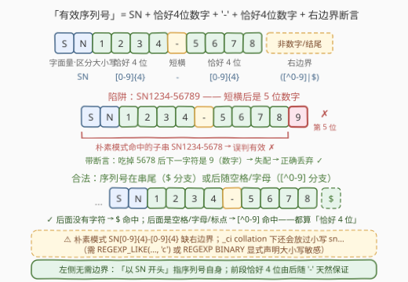
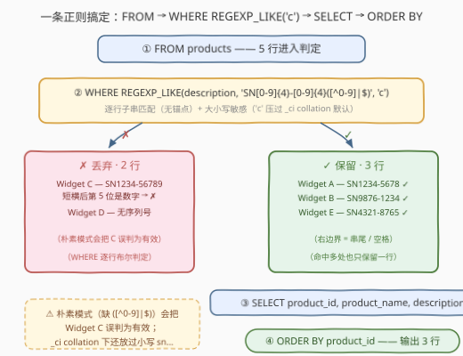

# LeetCode 查找具有有效序列号的产品 题解

## 1. 题目概述

- **标题 / 题号**：查找具有有效序列号的产品（#3465，easy）
- **链接**：https://leetcode.cn/problems/find-products-with-valid-serial-numbers/
- **难度**：简单
- **标签**：数据库、SQL、`REGEXP` 正则、字符串匹配、单表查询

**题意**：给定 `products` 表（每行一个产品的 ID、名字与描述），编写 SQL 查询，找出所有**描述中包含一个有效序列号**的产品。一个有效序列号符合下述规则：

1. 以 `SN` 两个字母开头（**区分大小写**）；
2. 后面有**恰好 4 位数字**；
3. 接着一个短横 `-`，短横后面还有**另一组恰好 4 位数字**；
4. 序列号可以出现在描述的**任意位置**（不一定在描述的开头）。

返回 `product_id`、`product_name`、`description` 三列，结果按 `product_id` **升序**排序。

**表结构**：

```text
Table: products
+--------------+------------+
| Column Name  | Type       |
+--------------+------------+
| product_id   | int        |  ← 唯一主键
| product_name | varchar    |
| description  | varchar    |
+--------------+------------+
```

**示例 1**：

```text
输入：
products 表:
+------------+--------------+------------------------------------------------------+
| product_id | product_name | description                                          |
+------------+--------------+------------------------------------------------------+
| 1          | Widget A     | This is a sample product with SN1234-5678            |
| 2          | Widget B     | A product with serial SN9876-1234 in the description |
| 3          | Widget C     | Product SN1234-56789 is available now                |
| 4          | Widget D     | No serial number here                                |
| 5          | Widget E     | Check out SN4321-8765 in this description            |
+------------+--------------+------------------------------------------------------+

输出：
+------------+--------------+------------------------------------------------------+
| product_id | product_name | description                                          |
+------------+--------------+------------------------------------------------------+
| 1          | Widget A     | This is a sample product with SN1234-5678            |
| 2          | Widget B     | A product with serial SN9876-1234 in the description |
| 5          | Widget E     | Check out SN4321-8765 in this description            |
+------------+--------------+------------------------------------------------------+
```

**解释**：

| product_id | 描述中的候选 | 判定 |
|------------|-------------|------|
| 1 | `SN1234-5678` | ✓ 有效序列号 |
| 2 | `SN9876-1234` | ✓ 有效序列号 |
| 3 | `SN1234-56789` | ✗ 无效——短横后包含 **5 位**数字 |
| 4 | 无 | ✗ 描述中没有序列号 |
| 5 | `SN4321-8765` | ✓ 有效序列号 |

> 💡 **读题关键**：产品 3 的 `SN1234-56789` 是全题的**分水岭**——它满足「`SN` 开头 + 4 位数字 + 短横 + 数字」，唯独短横后是 **5 位**数字。「**恰好** 4 位」意味着必须显式校验数字段的**右边界**，这决定了正则不能只写 `SN[0-9]{4}-[0-9]{4}`。此外题面明确「区分大小写」，这在小写 `sn…` 用例上会再淘汰一批解法。

## 2. 解题思路

### 2.1 暴力思路：朴素正则（缺右边界）

过程式的做法是把全表拉到应用层，对每个 `description` 枚举所有 `SN` 出现的位置，逐段检查「后 4 位是否都是数字、第 5 位是否是短横、再后 4 位是否都是数字、第 9 位是否还是数字」——逻辑正确，但把本可下推到数据库的过滤甩给了应用层。

纯 SQL 里最直觉的写法是一条**朴素正则**：

```sql
WHERE description REGEXP 'SN[0-9]{4}-[0-9]{4}'
```

看似无误，实则**被示例 3 的 `SN1234-56789` 骗过**：`REGEXP` 是**子串语义**（不锚定整串），而 `SN1234-56789` 中恰好含有子串 `SN1234-5678`——朴素模式照样命中，产品 3 被误判为有效。`[0-9]{4}` 只承诺「吃到 4 位数字」，**并不阻止第 5 位还是数字**，「恰好」的语义没有被表达。

### 2.2 核心观察：「恰好」= 量词末端的右边界断言



把规则逐段翻译成正则片段，再在末端补一个**边界断言**：

| 规则片段 | 模式 | 约束 |
|---------|------|------|
| 以 SN 开头 | `SN` | 字面量，**区分大小写** |
| 恰好 4 位数字 | `[0-9]{4}` | 定长量词 |
| 一个短横 | `-` | 字面量 |
| 另一组恰好 4 位数字 | `[0-9]{4}` | 定长量词 |
| **右边界** | `([^0-9]\|$)` | **下一字符非数字，或到达串尾** |

拼起来就是本题的核心模式：

```text
SN[0-9]{4}-[0-9]{4}([^0-9]|$)
```

**为什么右边界不可省**：`([^0-9]|$)` 断言「数字段到此为止」。对 `SN1234-56789`，模式吃掉 `5678` 后看下一个字符——`9` 仍是数字，说明短横后的数字段其实是 5 位，不是「恰好 4 位」→ 该起点失配；正则引擎向右寻找下一个 `SN` 起点，不存在 → 整串无匹配，产品 3 被**正确丢弃**。而朴素模式止步于「命中子串 `SN1234-5678`」，无法看到第 5 个数字。

**为什么左边界不用写**，有两层：

- 「以 SN 开头」描述的是**序列号自身**的结构，不是它在描述中的位置——`123SN1234-5678` 里的 `SN1234-5678` 依然合法，`SN` 前面是什么字符无关紧要；
- 前段的「恰好 4 位」由结构天然保证：`SN12345-6789` 中 `[0-9]{4}` 吃掉 `1234` 后要求见 `-` 却见了 `5` → 失配；`SN123-4567` 在第 4 位就断了——**字面量 `-` 本身就是前段的右边界**。

**大小写：MySQL 的 collation 陷阱**（本仓库 3436 题解已有系统结论）：题面要求「区分大小写」，但 MySQL `REGEXP` 的匹配行为跟随列的**排序规则（collation）**——`_ci` 后缀（如 `utf8mb4_0900_ai_ci`，LeetCode 默认）大小写**不敏感**，朴素写法会把 `sn1234-5678` 也判为有效。稳妥做法有二：`REGEXP_LIKE(description, …, 'c')` 显式声明大小写敏感；或 `description REGEXP BINARY …` 把模式转成二进制串按字节比较。

> ⚠️ **三个高频翻车点**：
> 1. **缺右边界**：`SN[0-9]{4}-[0-9]{4}` 会因子串语义放过 `SN1234-56789`；
> 2. **大小写**：`_ci` collation 下小写 `sn…` 也会命中，需 `'c'` 标志或 `BINARY`；
> 3. **`\d` 双转义**：MySQL 字符串字面量会吃掉未识别转义的反斜杠（`'\d'` 变 `'d'`），须写 `'\\d'`——干脆用 `[0-9]`，整条模式零反斜杠，从源头规避。

### 2.3 算法流程图



**逻辑执行步骤**：

| 步骤 | 子句 | 作用 | 本题对应 |
|------|------|------|---------|
| ① | `FROM products` | 逐行读入产品 | 5 行进入判定 |
| ② | `WHERE REGEXP_LIKE(description, 'SN…', 'c')` | 逐行做**子串匹配**（无锚点）+ 大小写敏感 | 命中 3 行，丢弃 2 行 |
| ③ | `SELECT product_id, product_name, description` | 投影输出列 | 输出 3 行结果 |
| ④ | `ORDER BY product_id` | 升序排序 | 1 → 2 → 5 |

> 💡 **SQL 逻辑执行顺序**为 `FROM → WHERE → SELECT → ORDER BY`：正则在 `WHERE` 阶段对尚未被投影掉的 `description` 求值；`ORDER BY` 最后执行，保证输出顺序稳定。注意 `ORDER BY` 不可省——「过滤后恰好有序」只是示例数据的巧合，一般数据下保留行的顺序不保证。

### 2.4 示例演算

对示例 1 的 5 行逐一做模式匹配：

| product_id | 起点 | 匹配过程 | 结论 |
|------------|------|---------|------|
| 1 | `SN` @ 29 | `SN` ✓ `1234` ✓ `-` ✓ `5678` ✓，其后是**串尾** → `$` 分支命中 | 保留 |
| 2 | `SN` @ 21 | `9876` ✓ `-` ✓ `1234` ✓，其后是**空格** → `[^0-9]` 分支命中 | 保留 |
| 3 | `SN` @ 8 | `1234` ✓ `-` ✓ `5678` ✓，其后是 **`9`（数字）** → 边界断言失败；右移找下一个 `SN` 起点，不存在 | 丢弃 |
| 4 | 无 `SN` | 无起点可试 | 丢弃 |
| 5 | `SN` @ 11 | `4321` ✓ `-` ✓ `8765` ✓，其后是**空格** → `[^0-9]` 分支命中 | 保留 |

**产品 3 的关键一步**展开对比：

```text
朴素模式  SN[0-9]{4}-[0-9]{4}     从 SN 起匹配出子串 "SN1234-5678" → 命中 → 误判有效 ✗
带断言    SN[0-9]{4}-[0-9]{4}([^0-9]|$)
                                 匹配到 "…-5678" 后看下一字符是 '9'（数字）→ 失配；
                                 引擎右移寻找下一个 SN 起点 → 不存在 → 整串无匹配 ✓
```

> 💡 一行内即使出现**多个**候选（如 `SN1234-56789SN2222-3333`），引擎会逐个起点尝试：第一个 `SN` 因右边界失败后，第二个 `SN` 的 `SN2222-3333`（其后是串尾）依然命中——「描述中**包含**一个有效序列号」的语义由子串搜索天然覆盖。

## 3. 参考代码

### SQL（解法 A：`REGEXP_LIKE` + `'c'` 标志，推荐）

```sql
SELECT product_id, product_name, description
FROM products
WHERE REGEXP_LIKE(description, 'SN[0-9]{4}-[0-9]{4}([^0-9]|$)', 'c')
ORDER BY product_id;
```

> 💡 **写法要点**：
> - **`'c'` = case-sensitive**：MySQL 8.0 函数式正则接口的第 3 参，显式压过 `_ci` collation 的默认大小写不敏感——题面「区分大小写」的保险写法；
> - **模式零反斜杠**：数字用 `[0-9]` 而非 `\d`，规避 MySQL 字符串字面量的双重转义；
> - **不加 `^`/`$` 锚定整串**：本题是「包含即命中」的子串语义，把模式锚在串首/串尾反而漏掉中间出现的序列号（模式内的 `$` 只参与「或」分支，不锚定整串）。

### SQL（解法 B：`REGEXP BINARY` 运算符式）

```sql
SELECT product_id, product_name, description
FROM products
WHERE description REGEXP BINARY 'SN[0-9]{4}-[0-9]{4}([^0-9]|$)'
ORDER BY product_id;
```

> 💡 `BINARY` 把模式转为二进制串，按字节比较即大小写敏感；`RLIKE` 是 `REGEXP` 的同义词，可写 `description RLIKE BINARY '…'`。若确认目标环境 collation 本就敏感（`_bin`/`_cs`），普通 `REGEXP` 亦可——但「依赖环境默认值」不如 `'c'` 显式声明可靠。

### SQL（解法 C：PostgreSQL）

```sql
SELECT product_id, product_name, description
FROM products
WHERE description ~ 'SN[0-9]{4}-[0-9]{4}([^0-9]|$)'
ORDER BY product_id;
```

> 💡 PostgreSQL 的 `~` 运算符**天生大小写敏感**（`~*` 才不敏感），且 POSIX 正则支持 `{4}`、`[^0-9]`、`$`，模式可原样复用。但 POSIX **不支持前瞻** `(?![0-9])`——所以 `([^0-9]|$)` 是跨方言最稳的右边界写法。

### Python（pandas）

```python
import pandas as pd

def find_valid_serial_products(products: pd.DataFrame) -> pd.DataFrame:
    mask = products['description'].str.contains(r'SN[0-9]{4}-[0-9]{4}(\D|$)', regex=True)
    return products[mask].sort_values('product_id')
```

> 💡 **pandas 写法要点**：
> - `str.contains` 默认 `regex=True` 且**大小写敏感**，天然对应 SQL 的 `'c'` 标志；
> - `\D` 即 `[^0-9]`，`(\D|$)` 是同一个右边界断言；Python 原始字符串 `r'…'` 里 `\d`/`\D` 无双重转义问题；
> - `sort_values('product_id')` 对应 `ORDER BY product_id`，为一般数据兜底（示例数据过滤后恰好有序）。

## 4. 复杂度分析

| 维度 | 复杂度 | 说明 |
|------|--------|------|
| 时间复杂度 | $O(n \cdot m)$ | $n$ 为行数、$m$ 为 `description` 平均长度：每行一次正则扫描。模式为**定长拼接**（唯一的交替 `([^0-9]\|$)` 至多两个分支），单起点匹配近似常数，无回溯爆炸 |
| 空间复杂度 | $O(k)$ | $k$ 为命中行数（结果集大小），无额外中间结构 |

> ⚠️ `REGEXP` 与前导通配符 `LIKE '%…%'` 同为**非 SARGable** 谓词，无法利用普通 B+ 树索引，必然全表扫描。产品表巨大且该查询高频时，应在写入侧预计算 `has_valid_serial` 布尔列并建索引。本题规模小，无需优化。

## 5. 扩展

### 5.1 「恰好 n 位」的边界模板

本题的 `([^0-9]|$)` 是通用模板的一个实例。凡题面出现「**恰好** / 正好 / 刚好 + 位数」字样，就要在量词两端显式补边界断言，否则「≥ n」会冒充「= n」：

- 恰好 n 位数字：`[0-9]{n}([^0-9]|$)`；若**左侧**也要求恰好（即数字段不能向左延伸），还需补 `(^|[^0-9])[0-9]{n}…`——本题左侧由 `SN`、`-` 两个字面量天然隔开，无需额外处理；
- ICU / PCRE 方言（MySQL 8、Python）可改写负向前瞻 `(?![0-9])`，更简洁，但不可移植到 POSIX（PostgreSQL、Hive `RLIKE`）。

顺带一提 `LIKE` 为什么干不了这件事：`'%SN____-____%'` 的 `_` 匹配**任意**字符（字母也放行），既表达不了「必须是数字」，更表达不了「其后不能再是数字」——没有字符类、量词与断言，这正是 `REGEXP` 的存在价值。

### 5.2 提取命中的序列号：`REGEXP_SUBSTR`

若进一步要求**输出**描述里那个序列号本身（而非布尔判定），MySQL 8.0+ 用 `REGEXP_SUBSTR`：

```sql
SELECT product_id, product_name,
       REGEXP_SUBSTR(description, 'SN[0-9]{4}-[0-9]{4}(?![0-9])') AS serial_no
FROM products
WHERE REGEXP_LIKE(description, 'SN[0-9]{4}-[0-9]{4}([^0-9]|$)', 'c');
```

两个细节：

- 返回**第一处**命中（自左向右扫描），一行内多个有效序列号只给最靠前的那个；
- 提取时**换用前瞻写法** `(?![0-9])`：`([^0-9]|$)` 捕获的边界字符（空格、标点）会一并进入匹配结果——`'Check SN4321-8765 in…'` 会提出 `'SN4321-8765 '`（带尾随空格）；前瞻不消耗字符，提取出来才是干净的 11 位序列号。判定用可移植版、提取用前瞻版，各取所长。

## 6. 面试要点

1. **朴素模式 `SN[0-9]{4}-[0-9]{4}` 错在哪？**

   > 两层：① `REGEXP` 是**子串语义**，`SN1234-56789` 里含有子串 `SN1234-5678`，朴素模式照样命中；② `[0-9]{4}` 只保证「吃到 4 位数字」，挡不住第 5 位还是数字。「恰好」必须靠右边界断言 `([^0-9]|$)`（或前瞻 `(?![0-9])`）显式表达。

2. **为什么 `SN` 左侧不需要边界？前段的「恰好 4 位」靠什么保证？**

   > 「以 SN 开头」约束的是序列号**自身**，不是它在描述中的位置——`123SN1234-5678` 中的序列号依然有效。前段的「恰好」由结构保证：`SN12345-6789` 里 `[0-9]{4}` 吃掉 `1234` 后必须见 `-` 却见了 `5`，该起点失配且串内无其他 `SN` 起点，整串不匹配——**字面量 `-` 就是前段的天然右边界**。

3. **MySQL `REGEXP` 的大小写行为如何？本题怎么保证区分大小写？**

   > 跟随 collation：`_ci`（LeetCode 默认的 `utf8mb4_0900_ai_ci`）**不区分**大小写，`sn1234-5678` 会被误判有效；`_bin`/`_cs` 才区分。稳妥写法是 `REGEXP_LIKE(col, pat, 'c')` 或 `col REGEXP BINARY pat`。PostgreSQL 的 `~` 天生敏感、pandas `str.contains` 默认敏感——**大小写默认值是各实现最不一致的点**，写模式前先确认。

4. **`([^0-9]|$)` 与 `(?![0-9])` 何时选哪个？**

   > 语义等价（都断言「下一字符不是数字」）。前瞻版不消耗字符、捕获干净，适合 `REGEXP_SUBSTR` 提取场景，但 POSIX 方言不支持；`([^0-9]|$)` 处处可用，代价是匹配结果多含一个边界字符。跨方言优先后者，纯提取场景用前者。

5. **这个谓词能走索引吗？大表高频查询怎么优化？**

   > 不能。`REGEXP` 与前导 `%` 的 `LIKE` 均非 SARGable，只能全表扫描逐行匹配。优化方向是把校验**前移**：写入时（触发器/应用层/ETL）预计算 `has_valid_serial` 布尔列并对其建索引，查询退化为等值过滤；或用生成列物化 `REGEXP_SUBSTR` 的提取结果。

> 💡 **一句话总结**：3465 = 一条带右边界断言的正则 + 一个大小写敏感声明 + 一个 `ORDER BY`。核心只有一步：把「恰好 4 位」翻译成 `[0-9]{4}([^0-9]|$)`——量词表达「至少」，断言才表达「恰好」。

## 同类练习题

| # | 题目 | 与本题的关联 |
|---|------|-------------|
| 3415 | [查找具有三个连续数字的产品](https://leetcode.cn/problems/find-products-with-three-consecutive-digits/)（[题解](3415_查找具有三个连续数字的产品.md)） | 同款 products 表 `REGEXP` 过滤，对比「字面量交替闭集」与「量词 + 边界断言」两类模式 |
| 3436 | [查找合法邮箱](https://leetcode.cn/problems/find-valid-emails/)（[题解](3436_查找合法邮箱.md)） | 锚定正则判合法 + MySQL collation 大小写敏感性的系统讨论（本文 `'c'` 标志的理论出处） |
| 3451 | [查找无效的 IP 地址](https://leetcode.cn/problems/find-invalid-ip-addresses/)（[题解](3451_查找无效的IP地址.md)） | 正则行级过滤进阶——区间拆分编码「0–255 无前导零」+ 补集思维 |
| 1517 | [查找拥有有效邮箱的用户](https://leetcode.cn/problems/find-users-with-valid-e-mails/)（[题解](../1501-1600/1517_查找拥有有效邮箱的用户.md)） | 锚定正则入门，字符类 + 量词 + 锚点的组合热身 |
| 1527 | [患某种疾病的患者](https://leetcode.cn/problems/patients-with-a-condition/)（[题解](../1501-1600/1527_患某种疾病的患者.md)） | `LIKE '%DIAB1%'` 前缀包含匹配，体会 `LIKE` 与 `REGEXP` 的能力边界 |
