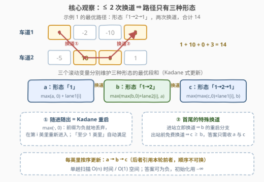
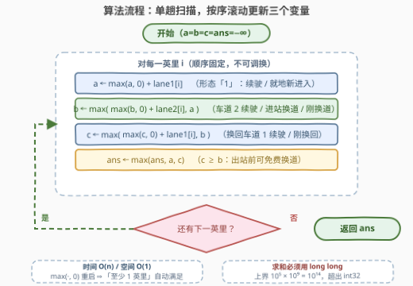

# LeetCode 最大硬币收集量 题解

## 1. 题目概述

- **标题 / 题号**：最大硬币收集量（#3466，medium）
- **链接**：https://leetcode.cn/problems/maximum-coin-collection/
- **难度**：中等
- **标签**：数组、动态规划

> ⚠️ 本题为 LeetCode 付费题（🔒），官方题面无法直接抓取；本文题意整理自社区维护的 [doocs/leetcode](https://github.com/doocs/leetcode) 镜像，已与官方示例用例逐一对齐。

**题意**：马里奥在一条**双车道高速公路**上行驶，每英里都放着硬币。给定两个长度相同的整数数组 `lane1` 和 `lane2`，下标 `i` 处的值表示马里奥行驶到该车道的第 `i` 英里时**获得或失去**的硬币数：

- 值为正：获得对应数量的硬币；
- 值为负：缴纳过路费，失去 `abs(值)` 个硬币。

行驶规则：

- 马里奥可以**在任意位置进入**高速公路，并在行驶**至少 1 英里**后**随时退出**；
- 他总是**从车道 1 进入**，但全程**最多可以换道 2 次**（换道 = 在车道 1、2 之间切换）；
- 允许**刚进站就立即换道**，也允许**临出站前再换一次道**。

返回马里奥能获得的**最多**硬币数（可以为负）。

**示例 1**：

```text
输入：lane1 = [1,-2,-10,3], lane2 = [-5,10,0,1]
输出：14
解释：车道 1 行驶第 0 英里（得 1）→ 换道 → 车道 2 行驶第 1、2 英里（得 10、0）
      → 换回车道 1 行驶第 3 英里（得 3）。合计 1 + 10 + 0 + 3 = 14。
```

**示例 2**：

```text
输入：lane1 = [1,-1,-1,-1], lane2 = [0,3,4,-5]
输出：8
解释：车道 1 行驶第 0 英里（得 1）→ 换道 → 车道 2 行驶第 1、2 英里（得 3、4），
      在第 3 英里的 -5 之前直接退出。合计 1 + 3 + 4 = 8。
```

**示例 3**：

```text
输入：lane1 = [-5,-4,-3], lane2 = [-1,2,3]
输出：5
解释：从第 1 英里进入并立即换道到车道 2（车道 1 的 -4 分文不取），全程行驶到底。
      合计 2 + 3 = 5。
```

**示例 4**：

```text
输入：lane1 = [-3,-3,-3], lane2 = [9,-2,4]
输出：11
解释：从开头进入并立即换道到车道 2，行驶到底：9 + (-2) + 4 = 11。
```

**示例 5**：

```text
输入：lane1 = [-10], lane2 = [-2]
输出：-2
解释：至少要行驶 1 英里，全是负数也只能挑损失最小的：立即换道只行驶第 0 英里，得 -2。
```

**约束**：

- `1 <= lane1.length == lane2.length <= 10^5`
- `-10^9 <= lane1[i], lane2[i] <= 10^9`

> 💡 **读题关键**：① **任意进出** ⇒ 行驶的是一个连续区间 `[进入, 退出]`，本题是「最大子数组」型而非「走完全程」型；② 换道预算 **2 次是全程共享**的，不是每英里 2 次；③ 「至少行驶 1 英里」⇒ 答案可以全负，绝不能把答案初始化成 0；④ 求和上界 $10^5 \times 10^9 = 10^{14}$，必须用 64 位整数（函数签名返回 `long` 也是提示）。

## 2. 解题思路

### 2.1 暴力思路

最直接的做法是枚举一切自由度：进入点 `i`、退出点 `j`（`i <= j`），以及至多两次换道发生的位置（进站时、或某两个相邻英里之间）。仅区间就有 $O(n^2)$ 个，每个区间内还要枚举 $O(n)$ 种换道位置组合，总体 $O(n^3)$；`n = 10^5` 时连 $O(n^2)$ 都不可接受。

另一种直觉是「贪心选每英里较大的车道」——这忽略了换道预算的约束（来回切换可能超预算），也忽略了可以**跳过整段负收益区间**（任意进出），两头都不对。必须让**换道次数进入 DP 状态**，与「选区间」联合决策。

### 2.2 核心观察：Kadane 状态机——三段形态 + 三个滚动变量



**观察 1（形态只有三种）**：马里奥从车道 1 出发、至多换 2 次道，任意一条行驶方案的**车道序列**只能是：

$$\text{「1」} \qquad \text{「1}\to\text{2」} \qquad \text{「1}\to\text{2}\to\text{1」}$$

「进站立即换道」产生的「2」「2→1」序列，分别等价于第一段为空的「1→2」「1→2→1」，已被后两种形态覆盖（注意进站换道要花掉 1 次预算）。

**观察 2（任意进出 = Kadane 重启）**：把「当前形态下、**以第 i 英里为最后一个收集英里**的最大段和」作为状态，那么「前面累计为负就丢弃、在第 i 英里重新进入」正是 Kadane 的 $\max(\cdot, 0)$ 重启。定义三个滚动变量（处理完第 $i$ 英里后）：

- $a$：形态「1」的最大段和（第 $i$ 英里在车道 1 收集）；
- $b$：形态「1→2」的最大段和（已停在车道 2，第 $i$ 英里在任一车道收集）；
- $c$：形态「1→2→1」的最大段和（已停在车道 1，第 $i$ 英里在任一车道收集）。

**观察 3（出站前免费换道）**：任何结尾停在车道 2 的方案，总和与「临出站前再补一次换道、停在车道 1」完全相同（换道本身不增减硬币）。因此 $c \ge b$ 恒成立，**答案只需收取 $a$ 与 $c$**，不必单独收 $b$。

三个变量的转移（$x_1 = lane1[i]$，$x_2 = lane2[i]$）：

$$
\begin{aligned}
a &\leftarrow \max(a,\ 0) + x_1 \\
b &\leftarrow \max\big(\max(b,\ 0) + x_2,\ \ a\big) \\
c &\leftarrow \max\big(\max(c,\ 0) + x_1,\ \ b\big) \\
\text{ans} &\leftarrow \max(\text{ans},\ a,\ c)
\end{aligned}
$$

逐项解读：

- $a$ 的 $\max(a, 0) + x_1$：同车道续驶，或在第 $i$ 英里**新进入**（车道 1 进入不花预算）；
- $b$ 的两分支：$\max(b,0)+x_2$ 是车道 2 续驶 / **新进入并立即换道**（花 1 次预算，覆盖示例 3、4、5 的开局）；取 $a$（**本轮新值**）表示「刚在车道 1 收完第 $i$ 英里，立即换道」——人已停在车道 2，下一英里才从车道 2 起步；
- $c$ 的两分支：$\max(c,0)+x_1$ 是换回来后续驶 / 新进入后原地换道两次（合法但等价于 $a$ 的重启，无害）；取 $b$ 表示「刚在车道 2 收完第 $i$ 英里，换回车道 1」。

> ⚠️ **更新顺序不可调换**：必须先算 $a$、再用**本轮**的 $a$ 更新 $b$、最后用**本轮**的 $b$ 更新 $c$。若错用上一轮的值，「收完第 $i$ 英里立即换道」这条转移就会丢失。

### 2.3 算法流程图



流程是**单趟扫描**：从第 0 英里扫到最后一英里，每轮按固定顺序更新 $a \to b \to c$，再用 $\max(a, c)$ 收敛答案。没有嵌套循环、没有回溯，一遍出结果。

### 2.4 示例演算

以示例 2（`lane1 = [1,-1,-1,-1]`，`lane2 = [0,3,4,-5]`）走一遍三个变量（`−∞` 表示该形态尚未出现）：

| 英里 $i$ | $a$（形态 1） | $b$（形态 1→2） | $c$（形态 1→2→1） | ans = max(a, c) |
|---|---|---|---|---|
| 0 | $\max(-\infty,0)+1 = 1$ | $\max(0, \text{·})$ 与 $a$ 取大 $= 1$ | $= 1$ | **1** |
| 1 | $\max(1,0)-1 = 0$ | $\max(1,0)+3 = 4$ | $\max(4, 0) = 4$ | **4** |
| 2 | $\max(0,0)-1 = -1$ | $\max(4,0)+4 = \mathbf{8}$ | $\max(3, 8) = 8$ | **8** |
| 3 | $\max(-1,0)-1 = -1$ | $\max(8,0)-5 = 3$ | $\max(7, 3) = 7$ | **8** |

第 2 英里处 $b = 8$ 对应方案「车道 1 收 1 → 换道 → 车道 2 收 3、4」，**在 -5 之前直接退出**；它通过 $c \ge b$ 进入答案。第 3 英里若不退出继续行驶，反而退化（$b=3$、$c=7$），ans 保持 8——「随时退出」被 Kadane 的 ans 收敛自然吸收。

## 3. 参考代码

### C++

```cpp
class Solution {
  public:
    long long maxCoins(vector<int>& lane1, vector<int>& lane2) {
        const long long NEG = LLONG_MIN / 4;        // 安全的 -∞ 哨兵
        long long a = NEG, b = NEG, c = NEG;        // 三种形态的当前最优段和
        long long ans = NEG;                        // 至少行驶 1 英里，不能初始化为 0
        for (int i = 0; i < (int)lane1.size(); i++) {
            a = max(a, 0LL) + lane1[i];                        // 形态「1」
            b = max(max(b, 0LL) + (long long)lane2[i], a);     // 形态「1→2」
            c = max(max(c, 0LL) + (long long)lane1[i], b);     // 形态「1→2→1」
            ans = max(ans, max(a, c));             // c ≥ b：出站前免费换道
        }
        return ans;
    }
};
```

### Python

```python
class Solution:
    def maxCoins(self, lane1: List[int], lane2: List[int]) -> int:
        neg = float('-inf')
        a = b = c = neg                 # 三种形态的当前最优段和
        ans = neg                        # 至少行驶 1 英里，不能初始化为 0
        for x1, x2 in zip(lane1, lane2):
            a = max(a, 0) + x1                   # 形态「1」
            b = max(max(b, 0) + x2, a)           # 形态「1→2」
            c = max(max(c, 0) + x1, b)           # 形态「1→2→1」
            ans = max(ans, a, c)                 # c ≥ b：出站前免费换道
        return ans
```

## 4. 复杂度分析

| 维度 | 复杂度 | 说明 |
|------|--------|------|
| 时间复杂度 | O(n) | 每英里只做常数次比较与加法，单趟扫描 |
| 空间复杂度 | O(1) | 仅 $a, b, c, \text{ans}$ 四个滚动变量 |

> 💡 状态视角看是 $O(n \times 2 \times 3)$ 的 DP（位置 × 车道 × 剩余换道次数），但「位置」维可以滚动、且三个换道余量恰好对应三个形态变量，于是坍缩成 O(1) 空间。

## 5. 扩展：对齐官方提示的 dp[i][lane][rem] 记忆化搜索

官方 hint 给出的状态是 $dp[i][lane][rem]$：位于第 $i$ 英里、车道 $lane$、还剩 $rem$ 次换道时，从今往后的最大收益。定义 $dfs(i, j, k)$（尚未收集第 $i$ 英里），设 $x$ 为当前车道第 $i$ 英里的值，共四个分支：

1. 只收这一英里就退出：$x$；
2. 收完继续同车道：$x + dfs(i+1,\ j,\ k)$；
3. 收完这一英里再换道（下一英里起步于对面车道）：$x + dfs(i+1,\ j \oplus 1,\ k-1)$；
4. **不收**、立即换道（覆盖进站换道与中途换道）：$dfs(i,\ j \oplus 1,\ k-1)$。

答案是 $\max_i\ dfs(i,\ 0,\ 2)$——任意位置进入，都从车道 1、满预算出发：

```python
class Solution:
    def maxCoins(self, lane1: List[int], lane2: List[int]) -> int:
        n = len(lane1)
        lane = (lane1, lane2)

        @cache
        def dfs(i: int, j: int, k: int) -> int:
            if i >= n:
                return 0                     # 只有收过至少 1 英里才会递归到边界
            x = lane[j][i]
            best = max(x, dfs(i + 1, j, k) + x)
            if k:
                best = max(best, dfs(i + 1, j ^ 1, k - 1) + x, dfs(i, j ^ 1, k - 1))
            return best

        return max(dfs(i, 0, 2) for i in range(n))
```

时间 $O(n)$、空间 $O(n)$。递归深度达 $10^5$，Python 需调大递归栈或改成倒序刷表——这正是 2.2 三变量写法的价值：**把「剩余换道次数」这一维折叠成有限几个形态变量**，顺着扫一遍就结束。

**变体思考**：若换道预算推广为至多 $k$ 次，则维护 $k+1$ 个滚动变量（形态「1」「1→2」「1→2→1」「1→2→1→2」…），时间 $O(kn)$、空间 $O(k)$；$k$ 很大时退化为「每英里取两车道较大值的前缀和择优」。

## 6. 面试要点

1. **为什么本题像最大子数组和而不是路径 DP？**
   - 「任意位置进入、至少 1 英里后随时退出」⇒ 选择对象是一个连续区间，需要 $\max(\cdot, 0)$ 式的「负前缀丢弃」；若是走完全程，则应是普通的双行 DP，答案也无需 ans 收敛。

2. **三个变量的更新顺序为什么不能乱？**
   - $b$ 的第二分支取的是**本轮**新算出的 $a$，语义是「在车道 1 收完第 $i$ 英里后立即换道」；$c$ 同理引用本轮 $b$。换成上一轮的值会丢转移，换成「先算 $b$ 再算 $a$」则会引入「收完车道 2 再折回车道 1 收同一英里」这类非法路径。

3. **结尾在车道 2 的方案为什么不进答案？**
   - 出站前允许免费再换一次道，且换道不改变已收集的和，故 $c \ge b$ 恒成立，$b$ 被 $c$ 支配。反过来，**进站**立即换道必须花预算，所以 $b$ 的重启分支（$\max(b,0)+x_2$）不可省略。

4. **答案初始化为什么不能用 0？**
   - 「至少行驶 1 英里」且硬币可全负（示例 5 输出 -2），0 会把负答案错误地抬高；同理 C++ 的 $-\infty$ 哨兵取 `LLONG_MIN / 4`，避免任何潜在的溢出加法。

5. **为什么必须用 64 位整数？**
   - $n \le 10^5$、$|lane[i]| \le 10^9$，段和上界 $10^{14}$，超出 `int32`；官方签名返回 `long` 也是明示。

## 同类练习题

| # | 题目 | 与本题的关联 |
|---|------|-------------|
| 53 | [最大子数组和](https://leetcode.cn/problems/maximum-subarray/)（[题解](../0001-0100/53_最大子数组和.md)） | Kadane 基本功，本题 $\max(\cdot,0)$ 重启的来源 |
| 1186 | [删除一次得到子数组最大和](https://leetcode.cn/problems/maximum-subarray-sum-with-one-deletion/)（[题解](../1101-1200/1186_删除一次得到子数组最大和.md)） | 把「一次特殊操作」折进 Kadane 的双变量版，与本题三变量结构同构 |
| 918 | [最大环形子数组的最大和](https://leetcode.cn/problems/maximum-sum-circular-subarray/)（[题解](../0901-1000/918_最大环形子数组和.md)） | Kadane 变体练手，体会「改造转移而非推翻框架」 |
| 121 | [买卖股票的最佳时机](https://leetcode.cn/problems/best-time-to-buy-and-sell-stock/)（[题解](../0101-0200/121_买卖股票的最佳时机.md)） | 状态机线性 DP 入门（持有 / 不持有两状态滚动） |
| 3418 | [机器人可以获得的最大金币数](https://leetcode.cn/problems/maximum-amount-of-money-robot-can-earn/)（[题解](../3401-3500/3418_机器人可以获得的最大金币数.md)） | 同样把「全程共享的 2 次特殊操作预算」写进 DP 状态的网格版 |
